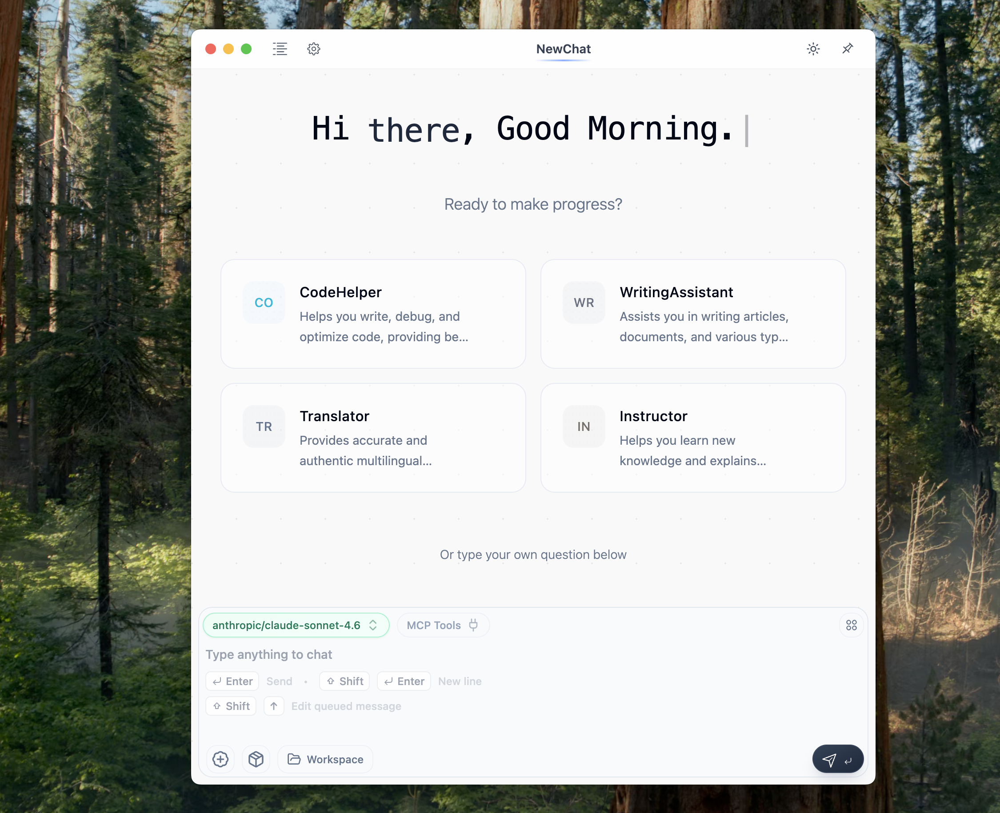
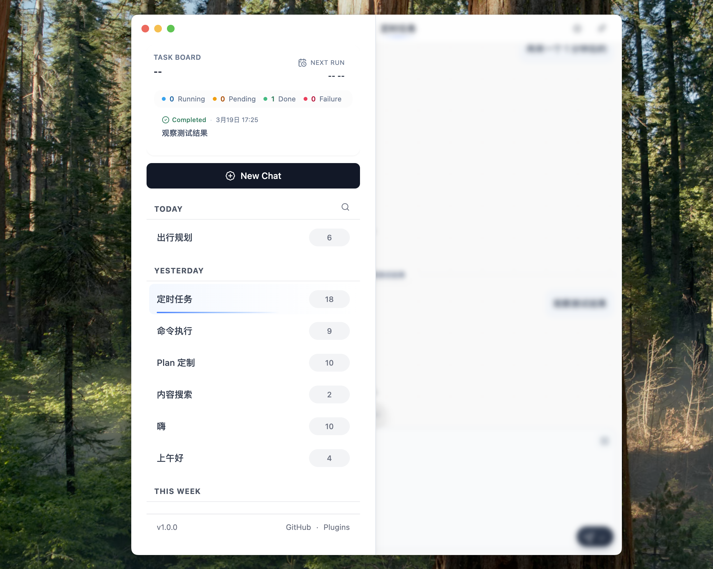
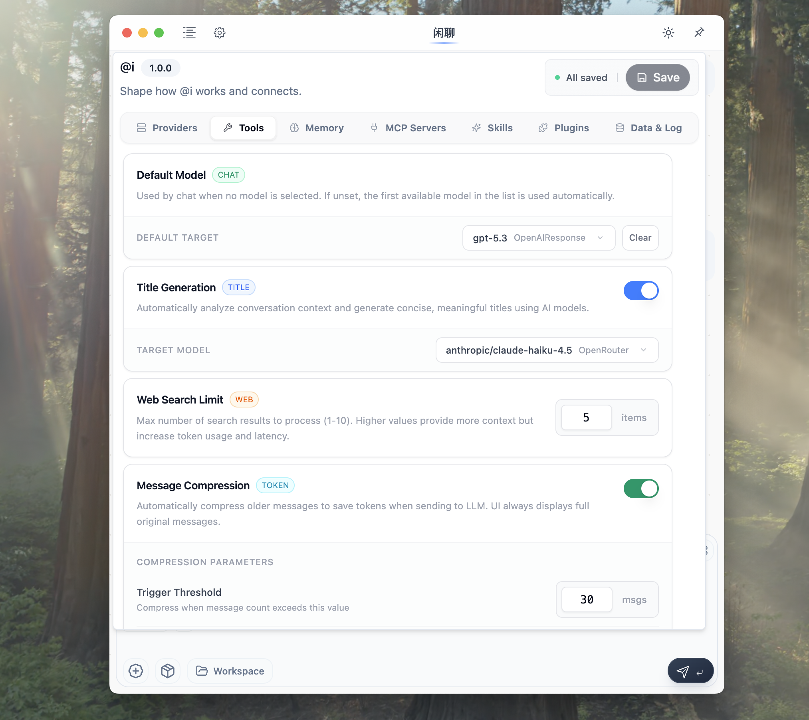
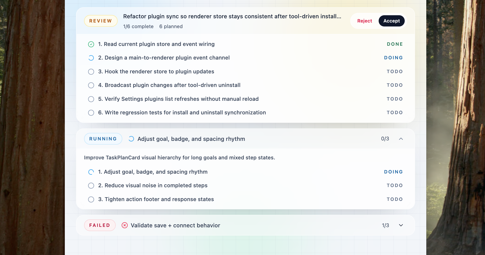

# @i

`@i` is an AI Agent application with tool calling, task execution, long-term memory, and workspace operations.

## Core Capabilities

- Unified multi-provider access: built-in adapters for OpenAI-compatible / Claude-compatible / Gemini-compatible providers.
- Agent toolchain: built-in file read/write, directory traversal, command execution, web search/fetch, plan management, skill loading, memory read/write, and scheduled tasks.
- MCP support: connect to local or remote MCP servers, and search/import configs from the MCP Registry.
- Skills system: scan local folders and import `SKILL.md`, enable skills per chat.
- Long-term memory: main process uses `better-sqlite3 + sqlite-vec` for semantic memory storage and vector retrieval.
- Tasks and scheduling: plan review, step status management, and scheduled prompt delivery to specific chats.
- Artifacts / Workspace: each session is bound to an isolated workspace for file browsing and previewing dev services.

## Project Structure

```text
src/main          Electron main process, IPC, database, tool execution, scheduler
src/preload       preload bridge
src/renderer/src  React UI, Zustand store, chat and settings screens
src/shared        shared constants, prompts, tool definitions, schema
src/data          built-in provider definitions
resources         bundled resources
docs              design and data-flow docs
```

## Local Development

```bash
pnpm install
pnpm dev
```

## Architecture

The app follows a clear split:

1. `renderer` handles UI, state, and event-driven streaming rendering.
2. `preload` exposes a controlled Electron API to the renderer.
3. `main` owns the database, model requests, tool execution, MCP connections, memory retrieval, and scheduling.

On submission, the renderer triggers `MainChatSubmitService` via IPC. The main process builds system prompts, skill prompts, message context, and tool definitions, then sends a unified model request. Streaming output is parsed into text segments, tool calls, and tool results, and pushed back to the UI.

## Screenshots

Main chat window



Chat sidebar



Setting section



Task plan bar



## FAQ

### macOS: app cannot be opened after install

```bash
sudo xattr -r -d com.apple.quarantine /Applications/at-i.app
```

### Linux: icons not refreshed

```bash
sudo gtk-update-icon-cache /usr/share/icons/hicolor
sudo update-icon-caches /usr/share/icons/hicolor
sudo update-desktop-database /usr/share/applications
```

## References

- https://github.com/openai/openai-node
- https://developers.openai.com/api/docs
- https://platform.claude.com/docs/en/home
- https://ai.google.dev/gemini-api/docs
- https://icons.lobehub.com/

## License

This project is licensed under the GNU General Public License v3.0 or later.

- SPDX identifier: `GPL-3.0-or-later`
- See [LICENSE](./LICENSE) for the full text.