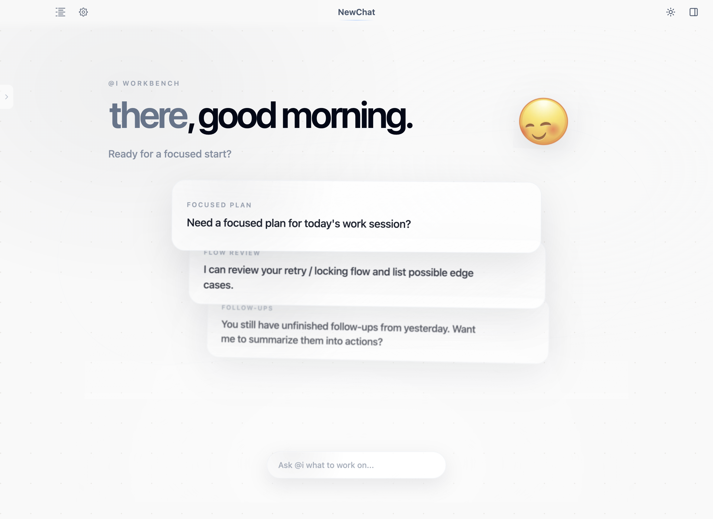
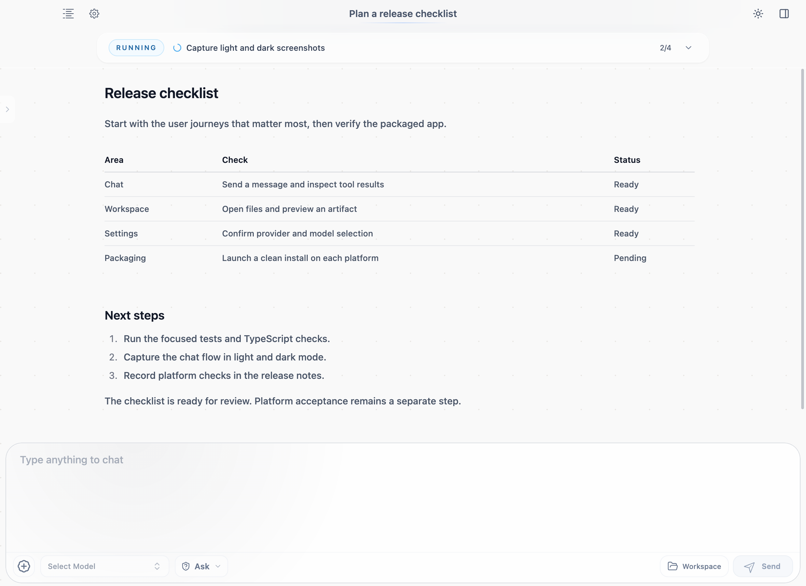
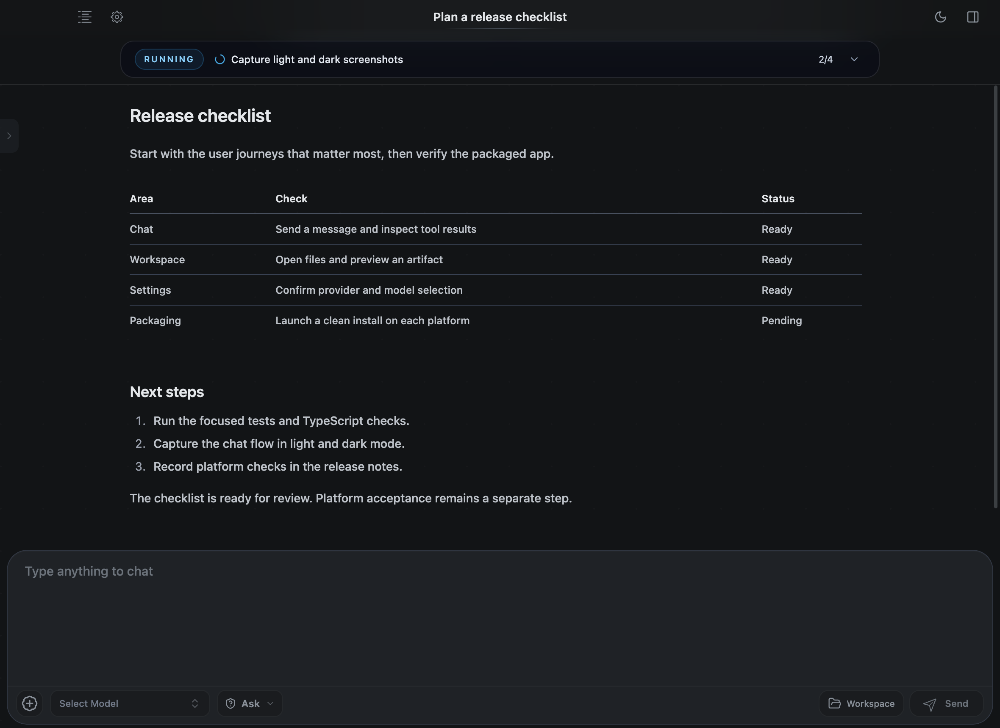
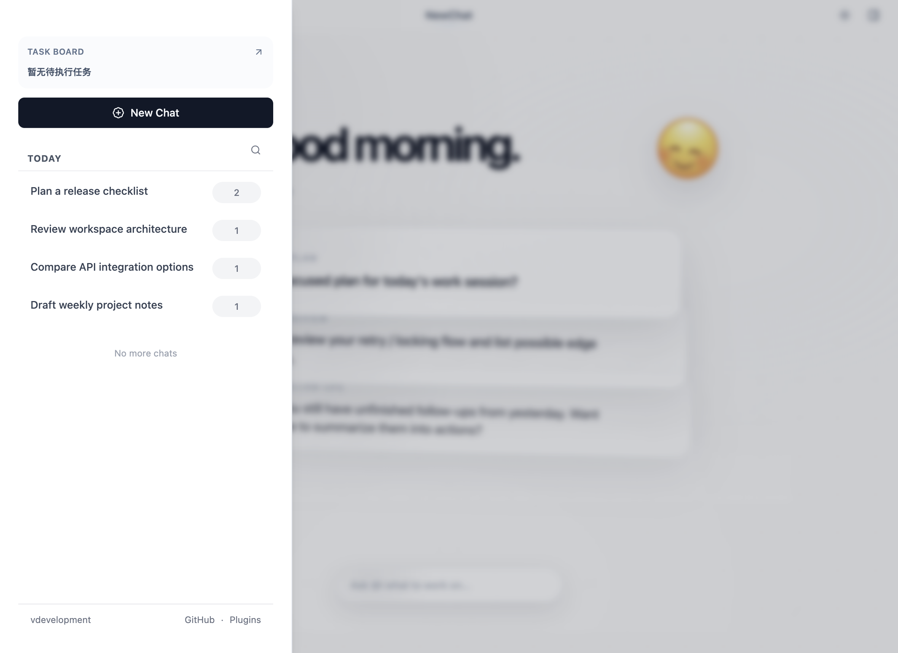
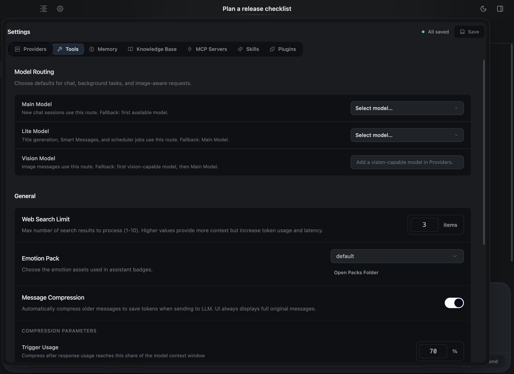

# @i

`@i` is an AI agent workspace for desktop and terminal. Chat with models from multiple providers, work with local files and tools, and track multi-step tasks in one place.

Built with Electron, React, and TypeScript.

## Core Capabilities

- Model providers: configure accounts and models through OpenAI-compatible, Claude-compatible, and Gemini-compatible adapters.
- Agent toolchain: built-in file read/write, directory traversal, command execution, web search/fetch, subagent spawn/wait, plan management, skill loading, memory read/write, and scheduled tasks.
- MCP support: connect to local or remote MCP servers, and search/import configs from the MCP Registry.
- Skills system: ship built-in `resources/skills`, scan local folders, import `SKILL.md`, and enable skills per chat.
- Long-term memory: main process uses `better-sqlite3 + sqlite-vec` for semantic memory storage and vector retrieval.
- Tasks and scheduling: plan review, step status management, and scheduled prompt delivery to specific chats.
- Subagents: spawn background researcher/coder/reviewer-style subagents with isolated execution context, live status updates, and parent-run confirmation bridging.
- Artifacts / Workspace: use a chat workspace for file browsing, artifact previews, and local development services.
- Desktop and terminal: use the graphical app, an interactive TUI, or the batch CLI with JSONL output.
- Telegram bot support: receive Telegram messages and attachments through a gateway, map them into the shared chat runtime, and reply back through the same unified agent pipeline.

## Project Structure

```text
src/main          Electron main process, IPC, database, tool execution, scheduler
src/preload       preload bridge
src/renderer/src  React UI, Zustand store, chat and settings screens
src/shared        shared constants, prompts, tool definitions, schema
resources         built-in provider definitions and other bundled resources
docs              design and data-flow docs
```

## Local Development

```bash
pnpm install
pnpm dev
```

In **Settings → Providers**, add a provider, configure its account and models, and save. Select a model in the chat composer before sending your first message. Choose a workspace when working with local files.

Build and launch the production bundles:

```bash
pnpm build
pnpm start
```

For terminal use, build the bundles first:

```bash
pnpm tui --workspace .
pnpm cli --help
```

The TUI uses configured accounts and models. The batch CLI accepts a task instruction file, workspace, and model configuration. See the [CLI guide](./docs/guides/development/cli-host-implementation.md) for configuration and run examples.

Useful checks:

```bash
pnpm run typecheck
pnpm exec vitest run <test-paths>
```

## Architecture

The app follows a clear split:

1. `renderer` handles UI, state, and event-driven streaming rendering.
2. `preload` exposes a controlled Electron API to the renderer.
3. `main` owns the database, model requests, tool execution, subagent runtime, MCP connections, memory retrieval, scheduling, and host adapters such as Telegram.

On submission, the renderer triggers `MainChatSubmitService` via IPC. The main process builds system prompts, skill prompts, message context, and tool definitions, then sends a unified model request. Streaming output is parsed into text segments, tool calls, and tool results, and pushed back to the UI. When needed, the main agent can also spawn background subagents that run with their own runtime context and report status/results back into the same chat flow.

Telegram follows the same main-process path through a host adapter and gateway layer. Incoming Telegram text, commands, and supported attachments are normalized into the shared chat/message model, executed by the same runtime, and formatted back into Telegram replies.

## Screenshots

Captured from the Electron app on macOS on September 30, 2026, using a separate temporary profile and [fictional demo data](./screenshot/current/demo-data.json). Chat responses and plan progress are seeded examples; no model requests were made for these screenshots.

### Welcome



### Chat and task progress

Light mode:



Dark mode:



### Chat list



### Tool settings



## FAQ

### macOS: app cannot be opened after install

```bash
sudo xattr -r -d com.apple.quarantine /Applications/at-i.app
```

### Linux: icons not refreshed

```bash
sudo gtk-update-icon-cache /usr/share/icons/hicolor
sudo update-icon-caches /usr/share/icons/hicolor
sudo update-desktop-database /usr/share/applications
```

## References

- [Project documentation](./docs/README.md)
- [Design language](./DESIGN.md)
- [Renderer architecture](./docs/architecture/renderer-architecture.md)
- [Main-process architecture](./docs/architecture/main-process-architecture.md)

- [OpenAI Node SDK](https://github.com/openai/openai-node)
- [OpenAI API documentation](https://developers.openai.com/api/docs)
- [Claude documentation](https://platform.claude.com/docs/en/home)
- [Gemini API documentation](https://ai.google.dev/gemini-api/docs)
- [LobeHub icons](https://icons.lobehub.com/)

## License

This project is licensed under the GNU General Public License v3.0 or later.

- SPDX identifier: `GPL-3.0-or-later`
- See [LICENSE](./LICENSE) for the full text.
