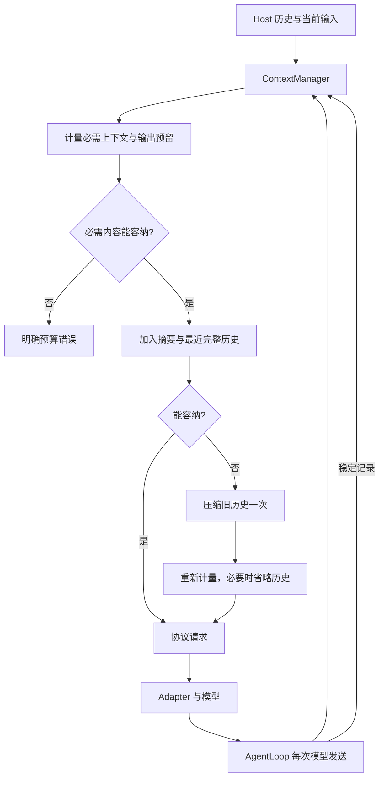

# Context management

Source: [实现目录](../../../../src/main/agent/runtime/context/) 
Decision: [ADR-0036](../../../decisions/0036-runtime-context-manager.md)

`ContextManager` 是每次 run 的唯一运行上下文所有者。Host 一次映射历史为 `ContextRecord[]`，
Loop 追加稳定 assistant、工具结果和 steering。原始事实一直完整保留；预算只改变请求视图。

## 最小接口

- `append(records, timestamp)`：记录完整运行事实。成功 assistant 步骤消费上一批工具；新的工具调用开启新的保护组。
- `prepare(signal)`：计量、选择历史、必要时生成摘要，返回 `MaterializedProtocolRequest`。取消向上传递。
- `snapshot()`：复制完整 records 数组为 `ContextSnapshot`。它用于终态产物，不是另一份 live store，也不是深冻结对象。

`ContextRecords.ts` 用普通函数创建 typed records；`ContextRequest.ts` 只读投影协议。
`ContextCompactor.ts` 共享摘要 prompt、调用与取消逻辑，服务于运行时和 Host 的持久化摘要预热。
`RequestTokenizer.ts` 统一计数与预算；实际 adapter、payload extensions、overrides 后的 body 参与计量。

## 保护与退化

必需内容包括 system/tools、当前用户目标及 steering、用户指令、各 source 最新有效上下文、
未消费 assistant 调用和全部匹配结果。预算不足时仅删除完整旧历史单位。
工具 batch 必须为每个唯一 call ID 提供一条同 step 的结果；缺失或重复结果阻止 continuation。
成功下一步骤之前，失败和取消都不能将该组标为已消费。

压缩关闭、失败、返回空摘要、不缩小或仍超窗时省略旧历史。提示缺口仅在预算允许时加入。
原始 records、数据库消息、工具 modelContent 和恢复文件保持完整。
当必需上下文本身超窗时明确报错，不截断完整工具结果。

## 计数边界

使用 gpt-tokenizer 的 o200k_base / cl100k_base；未识别模型回退 cl100k_base 并标记估算。
大于 16,384 字符的输入按最多 8,192 字符分段，避免连续 blob 的二次复杂度；
分段边界计数标记估算。序列化 body 计数包含协议开销，不能保证与 provider usage 相等。
未知窗口使用 32,768；输出按有效参数上限预留，缺失时为 min(8,192, 20%窗口)。
已知编码使用 5%余量，估算使用 15%余量。保留输入预算不足时始终失败。
图片经过现有 vision observation 策略；本模块不实现所有 provider 的图像计费公式。

运行摘要留在 manager。跨 run 摘要由 Host 保存，manager 不依赖数据库。
CLI 产物中的 `transcript` 字段保留为终态证据文件名称，不代表仍有 transcript 容器链路。
