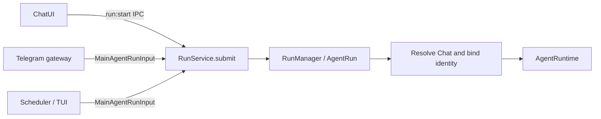
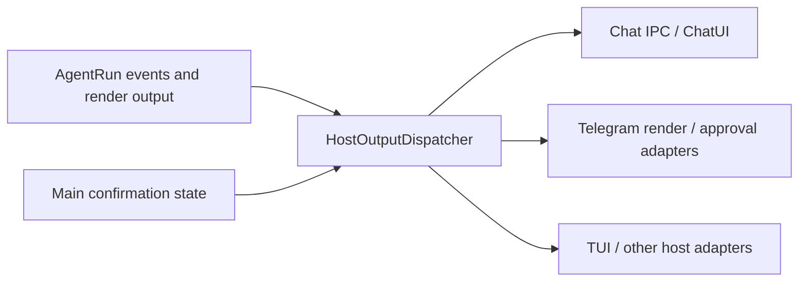

# Chat Runtime Architecture Current

## Current structure

Chat IPC requests use the shared `run:*` channels exclusively. Retired
`chat-run:*`, `chat-compression:execute` and `chat-title:generate` request
aliases are no longer registered. Renderer callers use the typed run invokers.
Manual and post-run compression call `MessageCompressionService.compress()`
directly; maintenance orchestration owns lifecycle event emission.

The chat runtime uses four cooperating boundaries:

- `src/main/agent/runtime/`: provider-independent loop, step, transcript, model,
  and tool execution.
- `src/main/hosts/chat/`: chat preparation, persistence, mapping, rendering, and
  finalization.
- `src/main/orchestration/chat/run/`: active-run lifecycle, cancellation,
  confirmation, paused user questions, and runtime assembly.
- `src/main/orchestration/chat/maintenance/` and `postRun/`: explicit maintenance
  operations and asynchronous completion jobs.

## Run flow at a glance

The first diagram shows **submission and execution**. Each entry prepares a
`MainAgentRunInput`; `RunService.submit()` is the only Main submission API.
`run:start` is the Renderer-to-Main transport boundary, not a second run
lifecycle. Telegram commands are handled by their command service outside this
ordinary run path.



`RunManager` registers and starts the run. Chat preparation attaches the
resolved `chatId` and `chatUuid` to the event emitter before `chat.ready`,
history, or user-message events. `AgentRun` then drives the runtime and
finalization; post-run title and compression jobs continue asynchronously.

Submission returns a Main-local `{ submissionId, completion }` handle.
`completion` resolves for success and rejects for failed or aborted runs; one
terminal path clears pending interactions and removes the active run.

| Caller | What it receives or waits for |
| --- | --- |
| ChatUI | IPC returns only `{ accepted: true, submissionId }`; later updates arrive through `run:event`. The Promise stays in Main. |
| Telegram, Scheduler, TUI | Main callers receive the handle and await `completion` where their host flow needs the terminal result. |

The second diagram shows **output delivery**. The dispatcher routes each
output to the adapters selected for its type and run; it does not broadcast
every output to every host.



Render output passes through `HostRenderEventMapper`; Run envelopes are
sequenced by the emitter. Main-owned confirmation decisions also use this
dispatcher but retain their separate lifecycle and frozen delivery targets.
ChatUI consumes scoped run events in one app-level ingress and merges persisted
messages by `revision`. See [ADR-0027](../decisions/0027-unified-host-output-dispatch.md)
and [ADR-0028](../decisions/0028-renderer-run-ingress-and-message-revisions.md).

## Agent runtime

`src/main/agent/runtime/` owns the execution kernel. Its contracts are exposed
from `src/main/agent/contracts/`, including run inputs/results, confirmation,
conversation persistence, message event sinks, and run-event interfaces.

The runtime consumes host-neutral request specifications and tool execution
facts. Chat entities, renderer state, and Electron event transport stay outside
the kernel.

### Empty terminal response recovery

Provider stream chunks may omit `finish_reason`, including every emitted chunk
before `[DONE]`. The OpenAI-compatible adapters preserve that absence through
the normalized stream contract, so the runtime can distinguish an explicit
terminal reason from an in-progress delta.

`AgentLoop` treats a completed provider stream as incomplete when its step has
zero tool calls and no trimmed user-visible text. It retries the same transcript
once without materializing the incomplete step or appending it to the
transcript. A second incomplete response produces the
`INCOMPLETE_MODEL_RESPONSE` failure result. The run finalizer therefore follows
the failure path and leaves earlier assistant drafts untouched. Tool-call steps,
explicit text responses, and steering behavior retain their existing loop
semantics.

The completed investigation record is
[agent-loop-empty-terminal-response-recovery-2026-08-04.md](../archive/2026/chat/agent-loop-empty-terminal-response-recovery-2026-08-04.md).

## Chat host

`src/main/hosts/chat/ChatAgentAdapter.ts` coordinates chat-specific behavior:

- `config/`: application and model context lookup;
- `preparation/`: request, prompt, skill, compression, and step bootstrap;
- `persistence/`: chat session and step stores;
- `mapping/`: chat/runtime event mapping;
- `runtime/`: renderer output and tool side effects;
- `finalize/`: terminal chat persistence.

Host modules depend on `RunEventEmitter` from
`src/main/agent/contracts/RunEvents.ts`. The concrete event implementation stays
inside orchestration infrastructure.

## Run orchestration

`src/main/orchestration/chat/run/index.ts` exposes submit, cancellation,
confirmation, user-question submission and hydration, and active-run
configuration updates.

Key implementation files:

- `runtime/RunManager.ts`: active run entry and registry coordination;
- `runtime/AgentRun.ts`: one run lifecycle;
- `runtime/RunRuntimeFactory.ts`: local composition root;
- `runtime/DefaultMainAgentRuntimeRunner.ts`: bridge into `AgentRuntime`;
- `runtime/RunFinalizer.ts`: terminal result mapping;
- `infrastructure/event-emitter.ts`: Electron transport and trace persistence;
- `infrastructure/tool-confirmation.ts`: confirmation state.
- `infrastructure/tool-question.ts`: pending structured questions, validated
  answers, cancellation, and recommended-answer timeout resolution.

Default `RunService` entry points in one Main process share the same lazily
created runtime dependencies; injected runtimes remain isolated. Tool approvals
use a Main-owned versioned lifecycle, full interaction identity, resolved events
and snapshot reconciliation across Chat, Telegram and TUI. Approval state and
execution state are separate. See
[the confirmation flow](command-confirmation-flow.md) and
[ADR-0026](../decisions/0026-main-owned-tool-confirmation-lifecycle.md).

The IPC handler validates the transport payload before admission. Known chat
identity is attached when the emitter is created; `RunEnvironmentService`
rebinds the resolved identity before the first chat event. The submission and
completion contract is recorded in
[ADR-0029](../decisions/0029-unified-run-submission.md).

The mutable runtime context currently carries `permissionApprovalMode`. Renderer
updates reach the active run through `run:permission-approval-mode:update`.
Pending confirmation is released when the updated mode permits automatic
execution, and the event stream records the mode change.

The desktop selector also persists `defaultPermissionApprovalMode` in app
configuration. Only explicit selections write this default; history navigation
restores each chat's own mode. Blank desktop chats read the loaded default at
bootstrap and reset, then send a mode snapshot on their first run. Forks and
scheduled execution chats retain source-chat inheritance. Sequential saves and
partial-failure behavior are specified in
[ADR-0025](../decisions/0025-new-chat-approval-default.md).

`ask_user_question` uses a separate `ToolQuestionManager`. The manager emits a
required event, waits on a keyed Promise, validates the renderer submission,
and returns the answer as the tool result for the next model step. A bounded
timeout selects the validated recommendations with an `auto_submitted` status.
The dispatcher treats the question as a batch interaction barrier and defers
later calls until the model has consumed that result. Pending interactions can
be listed by chat UUID so renderer remounts recover the active form.

## Maintenance and post-run work

Explicit operations live in `src/main/orchestration/chat/maintenance/`:

- `CompressionExecutionService.ts`
- `TitleGenerationService.ts`
- `MessageCompressionService.ts`

Asynchronous completion jobs live in `src/main/orchestration/chat/postRun/`:

- `PostRunJobService.ts`
- `TitleJobService.ts`
- `CompressionJobService.ts`

The main run emits `run.completed` before title and compression jobs continue.
These jobs preserve the main run completion boundary.

## Chat branch snapshots

The `chat:fork` IPC operation creates an independent Chat from a persisted
terminal assistant message. `ChatBranchRepository` owns one immediate SQLite
transaction that validates the source identity and boundary, creates the
destination Chat, and physically copies the selected message prefix with fresh
autoincrement IDs. The transaction also syncs message search, copies loaded
skills and work context, and stores `parentChatUuid`,
`forkedFromMessageId`, and `forkedAt` lineage on the destination.

The largest compressed summary fully contained in the selected prefix becomes
one fresh active summary whose membership references destination message IDs.
Prefixes without a compatible summary retain raw copied history. Ready
tool-result compactions whose raw SHA-256 hash still matches are copied to the
fresh destination tool-message IDs. Message bodies retain provider protocol
identity such as `toolCallId`.

Renderer receives the new Chat and copied messages as one snapshot. The chat
coordinator adds it to the ordinary Chat list, restores its transcript buffer,
selects its saved model, and moves the shell to the branch. Subsequent request
preparation uses the existing conversation summary and saved tool model content. See
[ADR-0016](../decisions/0016-physical-chat-branch-snapshots.md).

## Tool-result model content

Tools retain original execution facts and prepare deterministic `modelContent`
before completion events. Chat persists raw display content and the stable model
projection together. History restores that projection; legacy raw messages are
prepared once at runtime bootstrap. Small results pass through. Large results
and inline images use readable workspace artifacts with bounded previews and
explicit save-failure notices. Subsequent assistant steps do not shorten results.
Terminal snapshots perform no filesystem writes.

Request materialization bounds the whole request by omitting complete oldest
assistant/tool groups, preserving user instructions and the newest group. It
never splits call/result pairs or re-truncates prepared output. The former
background tool-compaction queue and ready-cache selection are retired; historical
database rows are retained. Conversation compression remains post-run.
See [ADR-0033](../decisions/0033-stable-tool-result-model-content.md) and
[the tool-result contract](../specs/tools/tool-result-normalization.md).

## Dependency direction

```text
orchestration/run -> hosts/chat -> agent contracts
orchestration/run -> agent/runtime -> agent contracts
hosts/chat -> db domain facades
event-emitter implementation -> run-event db facade + Electron window
```

`RunRuntimeFactory` remains a local composition root for the complex run path.
The process-wide IPC and tool registries remain explicit central registries.

Telegram approvals subscribe to the shared Main approval manager independently of the initiating host. Targets are frozen from active chat bindings and trusted run host metadata when the approval is created. Telegram delivery copies use a separate source and are excluded from model request and compression projections while remaining visible in the transcript.

### Host output dispatch

`RunRuntimeFactory` creates one `HostOutputDispatcher` for mapped render
output, Run envelopes, and canonical confirmations. It isolates transport
errors and preserves delivery order per adapter. Message persistence and Chat
side effects are required consumers; a transport failure in another host does
not block them. See the output diagram above and
[ADR-0027](../decisions/0027-unified-host-output-dispatch.md).

### Renderer run ingress and message revisions

Home owns one app-lifetime run ingress. Desktop submit registers its control context; scoped external runs are observed automatically. Schedule notifications no longer own ordinary run message consumption. Transcript snapshots merge with buffers by the Main-assigned `messages.revision`; older messages cannot replace newer committed state. See [ADR 0028](../decisions/0028-renderer-run-ingress-and-message-revisions.md).

## Per-send context budget

Every initial request and tool continuation goes through [ContextManager](agent-runtime/context/README.md).
Host loads ChatMessage[] and maps it once; the manager owns the single live record history.
Mandatory system/tools, current goals/steering, effective contexts and unconsumed tool results are counted first.
Older complete history is summarized or omitted if it exceeds remaining tokens. Compression failure falls back
when mandatory content fits; cancellation stops preparation. The 128,000-character ceiling is removed.
Background MessageCompressionService only prewarms persisted summaries and shares compactContext;
its decision uses tokenized stable modelContent instead of summing historical response usage.
See [ADR-0036](../decisions/0036-runtime-context-manager.md).
