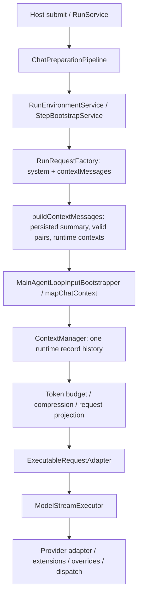

# Chat session dataflow

Updated: 2026-10-01. Decision: [ADR-0036](../decisions/0036-runtime-context-manager.md).

## Request

Host 历史投影修复持久化中断留下的不完整工具配对、排除 transport delivery 副本，
复用仍覆盖当前分支的摘要，保留最新用户消息，处理历史图片和临时上下文。
它返回原生 ChatMessage[]。一次 mapChatContext 后进入 ContextManager，后续上下文只由 manager 持有。
每次模型发送都计量实际 body，包含 tools/system、输出预留和 provider overrides。

## Response and continuation

provider response → ModelResponseStream → ModelResponseParser → AgentStepDraft。
运行进度经 AgentEventBus → HostRenderEventMapper / reducer → responder，Host 保存消息。
稳定 AgentStep 和 normalized ToolResultFact 经普通 record 函数进入 ContextManager。
完整工具 batch、技能 context 和 steering 追加后重新 prepare；未消费组整体保护。

## Persistence and maintenance

终态 snapshot 导出完整事实，不进行历史裁切。Chat Host 维持原有消息 body、modelContent、
工具文件与 UI persistence。没有新增 assistant body steps、transcript 表或兼容入口。
RunFinalizer 的 post-run title / compression 保持异步维护；持久化摘要预热共享 compactContext，
前台 manager 每次发送仍独立执行预算检查。前台摘要是 run-local，不写数据库、不覆盖后台摘要。
后台已有同 chat 锁负责持久化摘要并发。

## Verification entry points

- `src/main/agent/runtime/context/__tests__/ContextManager.test.ts`
- `src/main/agent/runtime/context/__tests__/ContextRequest.test.ts`
- `src/main/hosts/chat/preparation/request/__tests__/buildContextMessages.test.ts`
- `src/main/orchestration/chat/run/runtime/__tests__/DefaultMainAgentRuntimeRunner.integration.test.ts`

See [Context architecture](agent-runtime/context/README.md) and [implementation and acceptance record](../archive/2026/chat/2026-10-01-context-manager-implementation.md).
