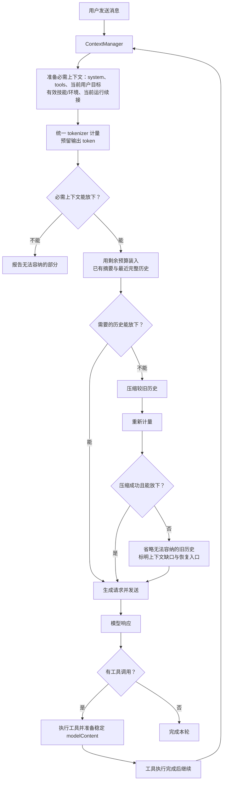
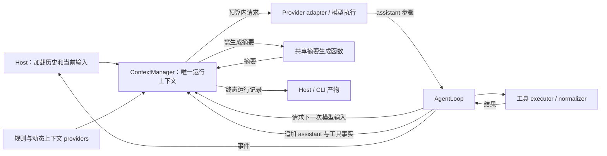
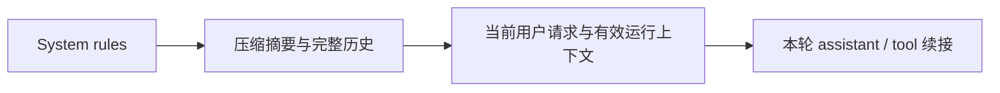

> Archived: 2026-10-01 
> Reason: Breaking change implementation and scoped runtime acceptance completed 
> Original path: docs/work/plans/chat/request-token-budget-and-compression-plan.md 
> Replaced by: [Context architecture](../../../architecture/agent-runtime/context/README.md), [ADR-0036](../../../decisions/0036-runtime-context-manager.md)

# ContextManager 重设计方案（breaking change）

Owner: Agent runtime / Chat maintainers 
Status: Done 
Started: 2026-10-01 
Target: 用 ContextManager 统一运行上下文、token 预算、历史选择与压缩 
Exit criteria: 完成下述实现细节定案、替换旧链路及回归与 Electron 验收 
Related specs: [Tool-result normalization](../../../specs/tools/tool-result-normalization.md) 
Related implementation: [AgentLoop](../../../../src/main/agent/runtime/loop/AgentLoop.ts), [RunRequestFactory](../../../../src/main/hosts/chat/preparation/RunRequestFactory.ts), [MessageCompressionService](../../../../src/main/orchestration/chat/maintenance/MessageCompressionService.ts)

## 决策与实施状态

2026-10-01：用户确认下述 ContextManager 设计方向，要求先输出文档和流程图。
2026-10-01：用户进一步授权 breaking change 实现，旧内部入口已替换；原始持久化数据保持完整。
本文替代本文件早期的“在现有 transcript 上补预算和压缩入口”建议。

现行上下文行为以 [ADR-0036](../../../decisions/0036-runtime-context-manager.md)、
[Chat runtime](../../../architecture/chat-runtime-architecture-current.md) 和
[Agent runtime](../../../architecture/agent-runtime/README.md) 为准。
实现决策见 [ADR-0036](../../../decisions/0036-runtime-context-manager.md)；验证结果在下文记录。

## 核心设计

ContextManager 按模型预算构造上下文：先保障当前请求，再用剩余容量装入摘要与历史。
每次模型请求前都执行同一检查，包含用户发送和工具执行后的 continuation。
历史省略、摘要缺失或压缩失败，在必需上下文能容纳时不阻止发送。

保证的是本地上下文准备能够完成，不承诺网络、提供商或模型一定成功响应。
若系统规则、工具定义、当前输入及必需工具续接本身超过模型窗口，明确报错。

保留原始消息、稳定工具 modelContent、工具文件及恢复路径。
不向 assistant 消息 body 新增步骤字段，不新增持久化 transcript 或数据库表。
ContextManager 接管现有上下文管理通路；Loop 不维护第二份 live transcript。

## 请求完整流程

已有历史全部能够容纳时直接发送，不为减少 token 而额外调用压缩模型。
已有摘要覆盖的历史不重复装入。原始历史保持完整，省略只影响本次请求视图。

## 所有权与链路收敛

| 模块 | 职责 |
| --- | --- |
| ContextManager | 接收运行事实；持有一份上下文；管理有效规则、动态上下文和历史；token 计量、历史选择、压缩与下一次请求构造 |
| AgentLoop | 模型与工具执行顺序、取消、失败和终态；每次发送前向 ContextManager 取得请求，不独立维护另一份上下文历史 |
| Host / orchestration | 用户输入、历史加载、消息持久化、UI 输出、持久化摘要；数据库访问留在这一层 |
| Context providers | 提供 skills、环境、用户信息等内容；不各自决定整请求预算或删除历史 |
| Tool executor / normalizer | 执行工具，生成稳定 modelContent，保存大内容并提供恢复路径 |
| Provider adapter | 协议转换与发送；向计量入口提供实际有效参数和会影响输入的转换信息 |

重构对象是 `RequestMessageBuilder → initialTranscriptSeed → runtime transcript → RequestMaterializer`
中的上下文组装、转换和预算决策。目标为一次 host 历史映射、ContextManager 内的一份运行事实、
最终请求与必要 provider 协议转换。移除 seed 中转和容器 materializer 的重复包装，
保留 typed content、调用/结果配对、运行 ID/时间及终态输出的可观察语义。
不以新 Manager 包装旧整条链路，也不令 ContextManager 直接依赖 Chat 数据库或 UI 消息状态。

## 预算分配与发送顺序

预算分配先保必需内容，再装入历史；发送顺序维持协议时序：

这张图描述常规次序；steering 到达时维持其真实插入顺序，不移动到触发它之前的工具调用前。
Skills 的稳定规则与动态加载内容保持现有语义分类，不把全部运行上下文强制移入 system。

- 统一 tokenizer 入口，按模型选择适用编码；不把一种编码宣称为所有模型的精确计量。
- 计入 system、tools、当前上下文、文本/reasoning、工具参数及 modelContent。
- 输出预留按实际有效参数解析；provider overrides 和 payload extensions 对请求的影响纳入计量。
- 取消 128,000 字符硬封顶；工具单条结果预览限额属于工具处理，不承担整请求 token 预算。
- 未支持编码或窗口未知时明确标记估算/未知；具体回退与输出预留数值在实现前定案。
- 诊断只记录计量方式、数值、压缩/省略范围，不记录正文、凭据或完整参数。

## 历史与压缩

先使用兼容的已有摘要与最近完整历史。超过剩余容量时压缩较旧的完整前缀，
摘要返回后重新计量；仍放不下时继续选择能够容纳的历史视图，并省略其余旧内容。
移除固定“保留最近 3 轮”的限制，也移除“最新历史工具组永远不可删除”的规则。

历史与摘要均可以退出请求窗口，数据库原文和 UI 历史保持完整。
压缩失败、空摘要、不缩小、没有候选历史均可退化到更少历史，并标记缺口。
用户主动取消时立即终止准备和发送，不能把取消当作压缩失败后继续请求。

摘要生成复用一处 prompt 与模型调用；使用稳定 modelContent，不重新把原始大工具输出塞进压缩请求。
压缩请求自身也计量，超窗时有界分批处理或退化省略，避免无限压缩重试。
同一 chat 的前台与后台摘要任务必须协调并验证覆盖范围，避免旧结果覆盖新结果。
跨 run 摘要由 host 持久化；本轮摘要由 ContextManager 管理，不插入 assistant 消息。

被省略内容的恢复优先使用现有 `history_search` 和工具文件读取路径。
`memory_retrieval` 用于相关记忆补充，不承诺包含全部对话；当前 history_search 有时间范围限制，
文件读取受工作区文件是否仍存在影响。请求提示明确缺口，不能保证任意历史一定可恢复。
恢复工具不可用时仍允许发送，但不能向模型承诺可调用的恢复入口。

## 工具续接保护

- 工具执行期间不重排上下文；在 batch 完成后的发送检查点选择历史视图。
- 用已有 stepId、toolCallId 保护整组，包含并行、失败与拒绝结果；不得留下孤立调用或结果。
- 保留当前用户目标、有效 steering 和影响执行的 skills/环境；不能一律压缩全部 hidden source。
- 下一模型步骤成功完成后，旧工具组才进入可压缩历史；请求失败或中断不算已消费。
- batch 中断仅有部分结果时延续终止语义，不补造结果或发起非法 continuation。
- 旧历史以整轮汇总格式加载时按完整配对处理，无需猜测不存在的步骤边界。
- 最小必需工具续接本身超窗时明确报错，不截短稳定 modelContent 来假装能发送。

## Breaking change 范围

允许替换内部上下文入口、seed 契约、transcript 容器操作及 Loop 依赖面；
Chat、CLI 和 subagent 同步适配 ContextManager，避免保留两套预算机制。
终态完整事实与 CLI 产物从同一份运行记录导出，维持原始证据完整性。
现有持久化消息、原始工具 content、toolResultModelContent 和摘要数据仍可加载。
不进行破坏性数据清理，不将 breaking change 扩大为新增持久化格式或移除用户历史能力。

实施时更新 ADR-0033、工具结果契约、Chat/Main/Agent runtime 架构及相关导出说明。
实现可以修改内部 API；数据回滚仍应保留原始消息与工具恢复文件。

## 已落实的实现细节

- gpt-tokenizer 统一入口；o200k_base / cl100k_base，未知模型估算。超过 16,384 字符按 8,192 字符分段计数并标记估算，规避连续 blob 的二次复杂度。
- 实际 adapter / extensions / overrides body 计量。默认窗口 32,768，缺省输出 min(8,192, 20%窗口)，已知编码 5%余量，估算 15%余量。
- compression.enabled 与 autoCompress 同时开启才做运行时压缩；关闭时走历史省略。
- 较旧完整组移出后一次生成摘要；compaction 输入超窗直接退化，不做无界压缩重试。
- 前台摘要 run-local；后台同 chat 锁继续维护持久化摘要，避免两个所有者覆盖同一摘要。
- ContextManager 最小接口为 append / prepare / snapshot，原始 records 一直完整。
- 移除 RequestMessageBuilder、initial seed、live transcript 容器及其 materializer/appender 依赖。Chat、CLI、subagent 同步使用 manager。
- 对恢复入口的提示以当前工具实际可用为条件，不承诺 memory 包含全部历史。
- 图片沿用 vision observation 策略；未知 tokenizer、分段计数与 provider usage 可能有差异。

## 验证记录

实现已覆盖百万 token 模型的大历史追问、有效输出 override、完整工具配对、压缩失败退化、取消与长 blob 计数。
同一大历史追问 fixture 在旧字符预算下复现原异常，在新 manager 下通过。

自动化验证：

| 检查 | 结果 |
| --- | --- |
| `pnpm --config.verify-deps-before-run=false run typecheck` | Node / Web 通过 |
| `pnpm --config.verify-deps-before-run=false test:coverage` | 341 suites / 2,375 tests 通过，6 suites / 22 tests 跳过；整体 statements 69.07% |
| `pnpm --config.verify-deps-before-run=false exec vitest run src/main/agent/runtime src/main/hosts/chat src/main/orchestration/chat src/main/orchestration/cli src/main/services/subagent src/main/request` | 75 suites / 436 tests 通过，1 test 跳过 |
| `pnpm --config.verify-deps-before-run=false run check:main-boundaries` | 通过 |
| `pnpm --config.verify-deps-before-run=false run test:main-architecture` | 8 tests 通过 |
| `pnpm --config.verify-deps-before-run=false run check:main-doc-paths` | 通过 |
| `pnpm --config.verify-deps-before-run=false exec electron-vite build` | Main / preload / renderer 生产 bundle 通过 |
| `git diff --check` | 通过 |

任务文件运行 ESLint，按仓库约定显式使用 Prettier `semi=false, singleQuote=true, trailingComma=none, printWidth=100`。
Context 模块无 lint 错误；其他报告的 any、返回类型、unused 等问题逐文件与 HEAD 对照，均为基线问题。
补齐了 RunService 测试中缺失的 compression strategy mock，使完整 coverage 通过。

Electron 验证：`pnpm --config.verify-deps-before-run=false run verify:cli` 使用临时 profile / 本地 provider 通过，
覆盖完整 transcript、工具声明和结果、vision、reasoning 两轮回放、步骤耗尽、超时、SIGINT 和错误脱敏。
另启动新生产 bundle 的独立桌面 profile，数据库、窗口和工具池初始化成功。
2026-10-01 续验：用户授权继续，由独立应用标识的临时 Electron 实例完成生产页面验证。
使用独立临时 profile 与本地模拟 provider；没有操作日常应用窗口或配置。

- 首次从 Welcome 发送消息，Chat 正常显示最终回答与 usage。
- 同一 Chat 第二次发送，实际请求包含第一轮完整 user / assistant 和当前 user。
- 完全退出应用后重新启动，从会话列表恢复已有 Chat，前两轮消息完整显示。
- 恢复后第三次发送成功；provider 收到 `system → user → assistant → user → assistant → user`，历史回答保留。
- 从恢复后的 Chat 触发只读 `session_context` 工具，界面显示 completed，随后生成最终回答。
- 检查实际 continuation payload：仅有一条 ID 为 `acceptance-context-call` 的 assistant call 和一条同 ID 的完整 tool result，末尾顺序为 assistant / tool。
- 捕获真实恢复界面及 completed 工具明细截图；测试实例已正常退出。

初始 mock 仅实现 SSE，对 non-stream 标题请求返回了不匹配格式，造成测试通知；已补齐 mock JSON 响应。
这属于测试 fixture 缺陷，没有修改产品代码。该验收使用本地模拟 provider，真实第三方模型的 token usage
仍受本文记录的估算边界约束；不增加跨平台或其他模型的验收声明。

桌面 runtime acceptance gap 已补齐，工作记录归档，持久架构与 ADR 保持当前实现说明。
