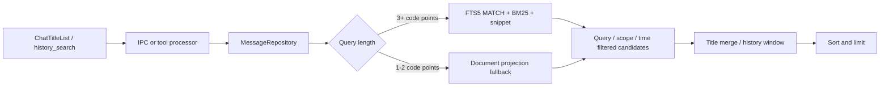

# 聊天消息 FTS5 搜索优化实施方案

Archived: 2026-07-17<br>
Reason: FTS5 搜索投影、消费者迁移和验证已完成<br>
Original path: `docs/work/plans/chat/chat-message-fts5-search-optimization-plan.md`<br>
Replaced by: [ADR 0004: Chat Message FTS5 Search](../../../decisions/0004-chat-message-fts5-search.md)<br>
Owner: Main process data maintainers and Chat UI maintainers<br>
Status: Done<br>
Started: 2026-07-17<br>
Target: Complete indexed chat-title and history-message search with measured performance<br>
Exit criteria: FTS5 projection, backfill, transactional synchronization, ranked snippets, short-query fallback, consumer integration, focused tests, architecture checks, and representative benchmarks pass<br>
Related specs: [Documentation governance](../../../specs/documentation-governance.md)<br>
Related ADRs: [ADR 0004: Chat Message FTS5 Search](../../../decisions/0004-chat-message-fts5-search.md)<br>
Related architecture: [Main process architecture](../../../architecture/main-process-architecture.md), [Renderer architecture](../../../architecture/renderer-architecture.md)<br>
Related implementation: `src/main/db`, `src/main/services/messages/MessageSegmentContent.ts`, `src/main/tools/history`, `src/renderer/src/features/chat/title/ChatTitleList.tsx`

## 1. 目标

将聊天标题搜索和历史消息搜索的消息召回层迁移到 SQLite FTS5，
通过结构化搜索投影、trigram 倒排索引、BM25 排名和带标记摘要降低主进程
查询开销，并保持现有 IPC、工具输出和聊天跳转行为。

交付范围：

1. 创建消息搜索文档表、元数据表、FTS5 虚拟表与索引。
2. 从 `messages.body` 回填可见 `user`/`assistant` 消息。
3. 在消息新增、更新、删除路径同步维护搜索投影。
4. 统一 `searchChats()` 与 `searchHistory()` 的底层候选召回。
5. 支持 trigram 子串搜索、1～2 字符 fallback、BM25、snippet 和高亮标记。
6. 保持标题命中、历史搜索 OR 语义、消息窗口和隐藏消息规则。
7. 建立功能、迁移、同步、性能和架构验证。

## 2. 当前实现证据

`MessageRepository.searchChats()` 和 `searchHistory()` 都调用
`MessageDao.getAllMessages()`。每次查询依次解析全部 `body` JSON、检查
role/source、调用 `extractSearchableMessageText()`、执行归一化子串匹配。

`messages` 的普通索引覆盖 `chat_id` 与 `chat_uuid`。`createdAt`、role、
source 和正文位于 JSON 中，数据库查询阶段读取完整消息集合，再由应用层
完成时间、可见性和正文筛选。

当前数据流：


目标数据流：



## 3. 数据模型

### 3.1 搜索文档

`message_search_documents` 保存：

| 字段 | 用途 |
| --- | --- |
| `message_id` | 对应 `messages.id`，同时作为 FTS rowid |
| `chat_id` | 兼容数值聊天主键和范围过滤 |
| `chat_uuid` | 当前聊天范围过滤和结果聚合 |
| `role` | 可见消息合同与诊断 |
| `created_at` | 历史时间范围过滤和排序 |
| `searchable_text` | 从 segments/content 提取的可搜索正文 |
| `searchable_text_folded` | JavaScript Unicode 小写折叠后的短查询正文 |

复合索引覆盖 `(chat_id, created_at DESC)` 和
`(chat_uuid, created_at DESC)`。

### 3.2 FTS 与版本

`message_search_fts` 使用 external-content FTS5：

```sql
fts5(
  searchable_text,
  content = 'message_search_documents',
  content_rowid = 'message_id',
  tokenize = 'trigram'
)
```

`message_search_metadata` 保存 `projection_version`。版本升级表达正文提取、
可见性规则和 schema 语义变化，并触发确定性的全量回填。

数据库保持 `trusted_schema = OFF`。当前 SQLite 在该安全设置下会拒绝普通表
trigger 写 FTS virtual table。`MessageSearchDao` 因此在同一事务内显式维护
documents 与 FTS，两份派生状态的写入顺序和错误处理集中在数据库边界。

### 3.3 投影资格

投影接收满足以下条件的消息：

- role 为 `user` 或 `assistant`；
- source 位于可见消息集合；
- `extractSearchableMessageText()` 产出有效文本；
- `createdAt` 可转换为稳定毫秒时间戳，缺失时沿用 `chat.updateTime`
  fallback；
- message 具备 `chat_uuid` 或 `chat_id`。

JSON 语法或消息形状校验失败时跳过该行，源消息继续保留在
`messages.body`。分类跳过计数属于后续可观测性工作。

## 4. 查询设计

### 4.1 查询归一化与转义

沿用现有 trim、连续空白折叠和小写归一化。长度使用 Unicode code point
计数。Repository 构造 FTS phrase/OR 表达式并转义双引号，用户输入始终作为
文本参与 MATCH。

### 4.2 三字符及以上

- `searchChats()` 使用单个 phrase 召回。
- `searchHistory()` 将去重后的关键词构造成 OR 表达式。
- SQL 应用 chat scope 和 `created_at` 条件，再按 BM25 与时间返回命中候选。
- BM25 数值升序代表相关性由强到弱。

Repository 完成 chat 聚合或逐消息排名后应用调用方公开 `limit`。这个顺序
完整保留同一聊天多条命中、跨聊天聚合和 history hitCount 语义。未来的硬
上限需要 SQL CTE 按 chat 预聚合，并形成独立产品决策。

### 4.3 一至两字符

短查询在 `message_search_documents.searchable_text_folded` 上执行
`instr()`，投影写入和查询参数统一采用 JavaScript `toLowerCase()` 的 Unicode
小写语义，同时应用 chat scope 和时间范围。应用层对命中候选执行与现有
实现一致的归一化精确检查、出现次数统计和摘要构造。

### 4.4 排名与聚合

聊天列表搜索：

1. 分别计算标题命中和消息候选。
2. 每个 chat 选择 BM25 最强的消息作为跳转目标。
3. 保留 `matchSource`、`matchedMessageId`、`matchedTimestamp`、
   `messageHitCount` 和 `score` 合同。
4. 标题权重、消息相关性、出现次数和聊天更新时间共同形成稳定顺序。

历史消息搜索：

1. 保留多关键词 OR 语义。
2. 消息命中按 BM25 和时间排序。
3. 标题命中继续进入 `matchedFields` 与排名。
4. 用命中 message id 查询同聊天相邻消息，构造现有窗口。
5. 空查询继续返回时间范围内的最近消息。

### 4.5 摘要与高亮

FTS 分支调用 `snippet()`，使用共享模块
`src/shared/search/chatSearchHighlights.ts` 定义的 private-use code points：

```text
U+E000 (start)
U+E001 (end)
```

作为 IPC 安全的高亮边界。短查询分支使用相同标记。Renderer 将摘要拆成
普通文本节点与高亮元素，所有消息内容按文本渲染。`history_search` 在工具
响应边界移除标记并输出纯文本摘要。

## 5. 写入同步与回填

### 5.1 增量同步

在消息持久化边界内建立统一 `projectMessageForSearch()`：

- insert：写入 source message 后 upsert eligible document；
- update：重新解析完整 body，upsert 或删除 document；
- delete：显式删除 FTS row 与 document；
- UI state patch：复用 update 路径，内容保持一致时得到同一投影。

源消息、document 和 FTS 变更共享 SQLite transaction。`MessageSearchDao`
按 external-content 协议执行 FTS insert/delete/update 命令。数据库继续采用
trusted-schema 安全默认值。

### 5.2 首次回填与版本升级

数据库初始化创建 schema 后读取 `projection_version`。首次建立和版本变化
在单个事务中执行：

1. 清空旧 projection；
2. 顺序读取 `messages`；
3. 解析、过滤、提取并批量写入 documents；
4. 执行 FTS `rebuild`；
5. 写入当前 projection version；
6. 输出投影行数和耗时日志。

事务失败回滚到完整旧版本。`messages.body` 始终承担重建来源。

## 6. 实施步骤

### 阶段一：schema 与数据库能力

- 在 `AppDatabase` 初始化中创建 documents、metadata 与 FTS5。
- 保持 `trusted_schema = OFF` 并由 `MessageSearchDao` 显式维护
  external-content FTS。
- 添加 chat/time 普通索引。
- 增加 projection version 与事务回填。
- 覆盖首次初始化、重复初始化、版本升级、格式错误 JSON 和回填失败。

完成信号：临时数据库可从现有 messages 生成一致的 FTS 行，重复初始化
保持幂等。

### 阶段二：搜索 DAO 与写路径

- 增加专用消息搜索 DAO。
- 实现 FTS phrase、OR、BM25、snippet 与 scope/time 过滤。
- 实现 1～2 code point fallback。
- 在 MessageRepository 的 save/update/delete 中同步投影。
- 将同步操作纳入源消息 transaction。

完成信号：消息的新增、正文更新、可见性变化、chat identity 变化和删除都
立即反映到查询结果。

### 阶段三：消费者迁移

- `searchChats()` 改用索引候选并与标题命中合并。
- `searchHistory()` 改用共享候选层并按命中 id 构造上下文窗口。
- 保持 `DB_CHAT_SEARCH` IPC 和 `history_search` 工具参数合同。
- 在 `ChatTitleList` 渲染 snippet 高亮标记。
- 清理 renderer 中失去调用路径的本地搜索派生值。

完成信号：聊天标题、中文正文、英文正文、代码片段、当前聊天范围和历史
时间范围均返回可跳转结果。

### 阶段四：验证与文档收敛

- 跑 focused repository、database、IPC、history tool 和 renderer tests。
- 跑 main/renderer boundary 与文档路径检查。
- 用代表性 chat.db 记录 warm/cold 查询延迟和索引大小。
- 同步活跃架构文档中的消息搜索数据流。
- 将本文 Status 更新为 `Done`，记录完成日期与实际测试命令，再迁移到
  `docs/archive/2026/`。

完成信号：Exit criteria 全部满足，ADR 保持 Accepted。

## 7. 验收标准

### 功能

- 标题命中、消息命中、标题与消息同时命中返回正确 `matchSource`。
- 中文连续三字、英文词组、代码标识符和标点文本可召回。
- 一字与两字查询可召回标题和消息。
- BM25 最强消息成为 chat 的 `matchedMessageId`。
- snippet 包含命中上下文与成对高亮标记。
- history 多关键词维持 OR 语义。
- `withinDays` 与 `current_chat` 在数据库候选阶段生效。
- 隐藏 source、system 和 tool 消息保持搜索隔离。
- 空 history query 返回范围内最新消息。

### 数据一致性

- 首次启动完成历史消息回填。
- 同版本重复启动保持行数和结果稳定。
- projection version 升级完成重建。
- insert、update、visibility/source 变化和 delete 后立即得到一致结果。
- 格式错误 JSON 保持在源表中并从搜索投影跳过。
- 回填事务失败保留完整旧 projection。

### 性能

- 三字符及以上的常规查询执行计划使用 FTS5 virtual table。
- 查询路径直接使用搜索 DAO 返回的索引命中候选。
- 基准记录 corpus 行数、正文体积、索引体积、查询类别、命中数和 warm/cold
  p50/p95 延迟。
- 代表性数据集上的连续输入保持主进程响应，目标以实测结果和旧实现对比
  作为放行依据。

## 8. 测试映射

| 能力 | 主要测试 |
| --- | --- |
| schema、trusted-schema、projection version | `src/main/db/core/__tests__/Database.test.ts` |
| documents/FTS 事务双写 | 新增 message-search DAO tests |
| FTS、BM25、snippet、短词 fallback | 新增 message-search DAO tests |
| chat 搜索聚合与排序 | `src/main/db/repositories/__tests__/MessageRepository.test.ts` |
| history OR、scope、window | `src/main/db/repositories/__tests__/MessageRepository.test.ts` 与 `src/main/tools/history/__tests__/HistoryToolsProcessor.test.ts` |
| IPC 合同 | `src/main/ipc/__tests__/chat.test.ts` |
| 高亮 marker 协议 | `src/shared/search/__tests__/chatSearchHighlights.test.ts` |
| 主进程边界 | `pnpm run check:main-boundaries`、`pnpm run test:main-architecture` |
| Renderer 边界 | `pnpm run check:renderer-boundaries`、`pnpm run test:renderer-architecture` |

最终验证命令：

```bash
pnpm exec vitest run src/main/db/core/__tests__/Database.test.ts \
  src/main/db/repositories/__tests__/ChatRepository.test.ts \
  src/main/db/repositories/__tests__/MessageRepository.test.ts \
  src/main/tools/history/__tests__/HistoryToolsProcessor.test.ts \
  src/main/ipc/__tests__/chat.test.ts \
  src/shared/search/__tests__/chatSearchHighlights.test.ts
ELECTRON_RUN_AS_NODE=1 ./node_modules/.bin/electron \
  ./node_modules/vitest/vitest.mjs run \
  src/main/db/dao/__tests__/MessageSearchDao.test.ts
pnpm run typecheck
pnpm run check:main-boundaries
pnpm run check:main-doc-paths
pnpm run test:main-architecture
pnpm run check:renderer-boundaries
pnpm run check:renderer-doc-paths
pnpm run test:renderer-architecture
```

## 9. 风险与控制

| 风险 | 控制 |
| --- | --- |
| trigram 索引体积增长 | 回填记录索引前后体积；保留可重建投影；记录长期体积趋势 |
| 首次回填增加启动时间 | 单次 projection version 迁移；批量事务；结构化耗时日志 |
| FTS query syntax 注入或解析错误 | Repository 独占表达式构造；phrase/OR 转义单测 |
| 短查询扫描成本 | 先应用 scope/time；记录短词基准；评估按 chat 预聚合 |
| source/role 变化造成投影漂移 | 每次 update 重算资格；版本化全量重建；一致性测试 |
| snippet marker 与正文文本碰撞 | parser 仅识别成对边界；覆盖原文包含 marker 的测试 |
| BM25 排序改变既有体验 | 固定标题权重与时间 tie-break；用现有 fixture 锁定产品顺序 |
| 回填中断 | 单事务回滚；旧 projection 保持完整；启动日志保留错误证据 |

## 10. 完成记录

- Completed：2026-07-17。
- Projection version：`2`。
- 回填：按 message id keyset 分页，每批 250 条；首次重建输出索引消息数与耗时日志。
- 查询：FTS 与短词路径读取实际命中集合，Repository 在 chat 聚合或 history 排序后应用公开 limit。
- 测试：普通 Vitest 25 tests passed；Electron ABI DAO 8 tests passed；node/web typecheck、main/renderer boundaries、doc paths、architecture tests 与 `git diff --check` passed。
- 代表性数据：10,484 条源消息，3,793 条进入投影，可搜索文本 1.96 MB。
- 紧凑数据库实测：首次回填 1,854.6 ms，documents 与 trigram FTS 增长 14.86 MB。
- Warm query：英文 phrase 8 条命中，平均 0.254 ms，最大 0.277 ms。
- 中文一至两字查询由 projection fallback 承担；三字符及以上进入 trigram FTS。
- 同步文档：ADR 0004 与 main-process architecture。
- 后续观测项：格式错误 JSON 的分类跳过计数、真实 UI 连续输入 p50/p95，以及长期索引增长趋势。
