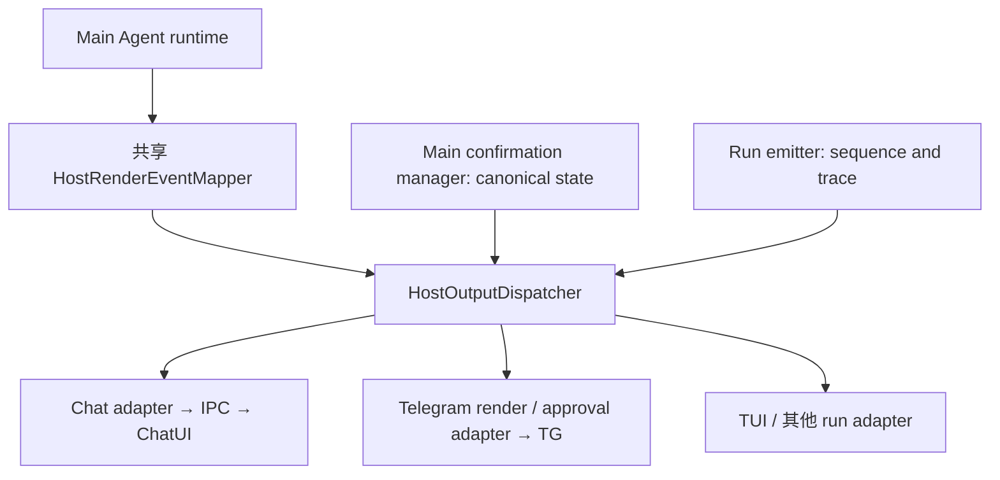

# ADR 0027: 统一 Host 输出分发

状态：已采纳

## 背景

普通回复经 `HostRenderEventForwarder` 投递，Chat IPC / TUI 经 Run emitter 投递，Telegram 审批经确认管理器订阅投递。各路径独立实现遍历和错误处理，容易出现某个端的投递失败影响其他端、异步事件乱序，以及新增 host 时重复实现策略的问题。

## 决策

Main runtime 组合根创建一个 `HostOutputDispatcher`，注入渲染 forwarder、Run event emitter factory 和确认管理器。三类输入分别是共享 mapper 生成的 render 输出、带序号的 Run 协议，以及 Main 已确定的 canonical confirmation。分发器负责选择 adapter、隔离 transport 错误、保持每个 adapter 的异步投递顺序；各 adapter 负责自己的协议、节流和恢复。

普通 render adapter 在本次 run 创建并挂载；Telegram 审批 adapter 在共享 runtime 注册，按该确认请求冻结的 peer/topic 目标投递。绑定审批目标不代表自动订阅所有普通回复。Chat IPC 与 TUI 继续使用共享 Run 协议；其 envelope 在分发前生成序号并写入 trace。

当前 Chat responder 还承担 assistant/tool 消息持久化，作为 required consumer，其失败必须传播给运行层。Chat tool side effects 同样标记为 required。外部 host renderer、IPC 和 TUI transport 投递失败只记录错误，其他 adapter 继续接收事件。渲染 forwarder 等待本次投递完成；确认发布和 Run emitter 保持同步提交、异步投递，审批执行不等待网络。

## 取舍

分发器只统一路由、顺序和错误语义。Telegram send/edit 重试仍由 Telegram adapter 持有，Chat 重载仍从 Main snapshot 恢复。它不保存投递记录、不重新折叠消息、不修改模型历史、不接管审批决策。共享 dispatcher 不保留已结束 run 的 adapter；每个 run 的 adapter 由该 run 自己持有。

保留 `subscribeToolConfirmations()` API，以 adapter 注册实现兼容现有调用；它不再拥有独立的监听遍历实现。新增 host 应挂载 adapter 并明确可见性和失败策略。

## 验证

分发器测试覆盖同步/异步 transport 失败、required persistence 失败、跨事件同端顺序、路由过滤和卸载。审批、Telegram gateway/responder、TUI session 和共享 render 测试覆盖现有行为。
