(Files content cropped to 300k characters, download full ingest to see more)
================================================
FILE: README.en.md
================================================
# Incremark

Incremental Markdown parser designed for AI streaming output.

[](https://www.npmjs.com/package/@incremark/core)
[](./LICENSE)

**[🇨🇳 中文](./README.md)** | 🇺🇸 English

📖 [Documentation](https://www.incremark.com/en/) | 🎮 [Vue Demo](https://vue.incremark.com/) | ⚛️ [React Demo](https://react.incremark.com/)

## Why Incremark?

Traditional Markdown parsers **re-parse the entire document** on every new chunk, leading to O(n²) complexity. Incremark's incremental parsing achieves O(n) — the larger the document, the more pronounced the advantage:

| File | Lines | Incremark | Streamdown | markstream | ant-design-x |
|------|-------|-----------|------------|------------|--------------|
| concepts.md | 91 | 12.0 ms | 50.5 ms (**4.2x**) | 381.9 ms (**31.9x**) | 53.6 ms (**4.5x**) |
| comparison.md | 109 | 20.5 ms | 74.0 ms (**3.6x**) | 552.2 ms (**26.9x**) | 85.2 ms (**4.1x**) |
| complex-html.md | 147 | 9.0 ms | 58.8 ms (**6.6x**) | 279.3 ms (**31.1x**) | 57.2 ms (**6.4x**) |
| OPTIMIZATION_SUMMARY.md | 391 | 19.1 ms | 208.4 ms (**10.9x**) | 980.6 ms (**51.3x**) | 217.8 ms (**11.4x**) |
| test-md-01.md | 916 | 87.7 ms | 1441.1 ms (**16.4x**) | 5754.7 ms (**65.6x**) | 1656.9 ms (**18.9x**) |
| **Total (38 files)** | **6484** | **519.4 ms** | **3190.3 ms** (**6.1x**) | **14683.9 ms** (**28.3x**) | **3728.6 ms** (**7.2x**) |

> 📊 Benchmark: 38 real Markdown files, 128.55 KB total. [View full results →](https://www.incremark.com/advanced/engines)

## Packages

| Package | Description | Version |
|---------|-------------|---------|
| [@incremark/core](./packages/core) | Core parser |  |
| [@incremark/vue](./packages/vue) | Vue 3 integration |  |
| [@incremark/react](./packages/react) | React integration |  |
| [@incremark/devtools](./packages/devtools) | Developer tools |  |

## Quick Start

### Vue

```bash
pnpm add @incremark/vue @incremark/theme
```

```vue
<script setup>
import { ref } from 'vue'
import { IncremarkContent } from '@incremark/vue'
import '@incremark/theme/styles.css'

const content = ref('')
const isFinished = ref(false)

async function handleAIStream(stream) {
  for await (const chunk of stream) {
    content.value += chunk
  }
  isFinished.value = true
}
</script>

<template>
  <IncremarkContent :content="content" :is-finished="isFinished" />
</template>
```

### React

```bash
pnpm add @incremark/react @incremark/theme
```

```tsx
import { useState } from 'react'
import { IncremarkContent } from '@incremark/react'
import '@incremark/theme/styles.css'

function App() {
  const [content, setContent] = useState('')
  const [isFinished, setIsFinished] = useState(false)

  async function handleAIStream(stream: ReadableStream) {
    const reader = stream.getReader()
    while (true) {
      const { done, value } = await reader.read()
      if (done) break
      setContent(prev => prev + new TextDecoder().decode(value))
    }
    setIsFinished(true)
  }

  return <IncremarkContent content={content} isFinished={isFinished} />
}
```

## Features

- ⚡ **Incremental Parsing** - Only parse new content
- 🔄 **Streaming Friendly** - Supports char-by-char/line-by-line input
- 🎯 **Boundary Detection** - Smart block boundary recognition
- 🔌 **Framework Agnostic** - Core library works independently
- 📊 **DevTools** - Built-in developer tools
- 🎨 **Customizable** - Support for custom render components
- 📐 **Extension Support** - GFM, Math formulas, Mermaid, etc.

## Development

```bash
# Install dependencies
pnpm install

# Start development
pnpm dev

# Run Vue example
pnpm example:vue

# Run React example
pnpm example:react

# Start documentation
pnpm docs

# Run tests
pnpm test

# Build
pnpm build
```

## Roadmap

- [ ] 🔧 DevTools Svelte Rewrite
- [ ] 🎨 Theme Package Separation
- [ ] 🟠 Svelte / ⚡ Solid Support
- [ ] 💭 AI Scenarios (thinking block, tool call, citations)

[View full roadmap →](https://www.incremark.com/roadmap.html)

## Documentation

Full documentation available at: [https://www.incremark.com/](https://www.incremark.com/)

## Live Demos

- 🎮 [Vue Demo](https://vue.incremark.com/) - Vue 3 integration example
- ⚛️ [React Demo](https://react.incremark.com/) - React integration example

## License

MIT


================================================
FILE: README.md
================================================
# Incremark

增量式 Markdown 解析器，专为 AI 流式输出设计。

[](https://www.npmjs.com/package/@incremark/core)
[](./LICENSE)

🇨🇳 中文 | **[🇺🇸 English](./README.en.md)**

📖 [文档](https://www.incremark.com/) | 🎮 [Vue Demo](https://vue.incremark.com/) | ⚛️ [React Demo](https://react.incremark.com/)

## 为什么选择 Incremark？

传统 Markdown 解析器每次收到新内容都会**重新解析整个文档**，导致 O(n²) 的复杂度。Incremark 的增量解析实现了 O(n) —— 文档越大，优势越明显：

| 文件 | 行数 | Incremark | Streamdown | markstream | ant-design-x |
|------|------|-----------|------------|------------|--------------|
| concepts.md | 91 | 12.0 ms | 50.5 ms (**4.2x**) | 381.9 ms (**31.9x**) | 53.6 ms (**4.5x**) |
| comparison.md | 109 | 20.5 ms | 74.0 ms (**3.6x**) | 552.2 ms (**26.9x**) | 85.2 ms (**4.1x**) |
| complex-html.md | 147 | 9.0 ms | 58.8 ms (**6.6x**) | 279.3 ms (**31.1x**) | 57.2 ms (**6.4x**) |
| OPTIMIZATION_SUMMARY.md | 391 | 19.1 ms | 208.4 ms (**10.9x**) | 980.6 ms (**51.3x**) | 217.8 ms (**11.4x**) |
| test-md-01.md | 916 | 87.7 ms | 1441.1 ms (**16.4x**) | 5754.7 ms (**65.6x**) | 1656.9 ms (**18.9x**) |
| **总计 (38个文件)** | **6484** | **519.4 ms** | **3190.3 ms** (**6.1x**) | **14683.9 ms** (**28.3x**) | **3728.6 ms** (**7.2x**) |

> 📊 基准测试: 38 个真实 Markdown 文件，共 128.55 KB。[查看完整结果 →](https://www.incremark.com/zh/advanced/engines)

## 包

| 包 | 说明 | 版本 |
|---|---|---|
| [@incremark/core](./packages/core) | 核心解析器 |  |
| [@incremark/vue](./packages/vue) | Vue 3 集成 |  |
| [@incremark/react](./packages/react) | React 集成 |  |
| [@incremark/devtools](./packages/devtools) | 开发者工具 |  |

## 快速开始

### Vue

```bash
pnpm add @incremark/vue @incremark/theme
```

```vue
<script setup>
import { ref } from 'vue'
import { IncremarkContent } from '@incremark/vue'
import '@incremark/theme/styles.css'

const content = ref('')
const isFinished = ref(false)

async function handleAIStream(stream) {
  for await (const chunk of stream) {
    content.value += chunk
  }
  isFinished.value = true
}
</script>

<template>
  <IncremarkContent :content="content" :is-finished="isFinished" />
</template>
```

### React

```bash
pnpm add @incremark/react @incremark/theme
```

```tsx
import { useState } from 'react'
import { IncremarkContent } from '@incremark/react'
import '@incremark/theme/styles.css'

function App() {
  const [content, setContent] = useState('')
  const [isFinished, setIsFinished] = useState(false)

  async function handleAIStream(stream: ReadableStream) {
    const reader = stream.getReader()
    while (true) {
      const { done, value } = await reader.read()
      if (done) break
      setContent(prev => prev + new TextDecoder().decode(value))
    }
    setIsFinished(true)
  }

  return <IncremarkContent content={content} isFinished={isFinished} />
}
```

## 特性

- ⚡ **增量解析** - 只解析新增内容
- 🔄 **流式友好** - 支持逐字符/逐行输入
- 🎯 **边界检测** - 智能识别块边界
- 🔌 **框架无关** - 核心库可独立使用
- 📊 **DevTools** - 内置开发者工具
- 🎨 **可定制** - 支持自定义渲染组件
- 📐 **扩展支持** - GFM、数学公式、Mermaid 等

## 开发

```bash
# 安装依赖
pnpm install

# 启动开发
pnpm dev

# 运行 Vue 示例
pnpm example:vue

# 运行 React 示例
pnpm example:react

# 启动文档
pnpm docs

# 运行测试
pnpm test

# 构建
pnpm build
```

## 路线图

- [ ] 🔧 DevTools Svelte 重构
- [ ] 🎨 主题包分离
- [ ] 🟠 Svelte / ⚡ Solid 支持
- [ ] 💭 AI 场景增强 (thinking block, tool call, 引用标注)

[查看完整路线图 →](https://www.incremark.com/zh/roadmap)

## 文档

完整文档请访问：[https://www.incremark.com/](https://www.incremark.com/)

## 在线演示

- 🎮 [Vue Demo](https://vue.incremark.com/) - Vue 3 集成示例
- ⚛️ [React Demo](https://react.incremark.com/) - React 集成示例

## License

MIT


================================================
FILE: CHANGELOG.md
================================================
# Changelog


## v0.1.0...v0.1.1

[compare changes](https://github.com/kingshuaishuai/incremark/compare/v0.1.0...v0.1.1)

### 🚀 Enhancements

- Introduce caching and performance optimizations in BlockTransformer and related components, enhance type definitions for AST nodes ([2486898](https://github.com/kingshuaishuai/incremark/commit/2486898))
- Implement caching mechanism and performance improvements in BlockTransformer, optimize AST node processing and slicing functions ([2866ec7](https://github.com/kingshuaishuai/incremark/commit/2866ec7))

### 📖 Documentation

- Update links in README and documentation to reflect new website URLs ([f9b7492](https://github.com/kingshuaishuai/incremark/commit/f9b7492))
- Add roadmap documentation ([abc270d](https://github.com/kingshuaishuai/incremark/commit/abc270d))
- Enhance documentation for streaming Markdown features, including improvements in token detection, preprocessing, and typewriter animation performance ([375ba87](https://github.com/kingshuaishuai/incremark/commit/375ba87))

### 🏡 Chore

- Update changelog ([e31b254](https://github.com/kingshuaishuai/incremark/commit/e31b254))
- Add @types/mdast as a devDependency and enhance type safety in IncremarkRenderer component ([1563e59](https://github.com/kingshuaishuai/incremark/commit/1563e59))
- Update roadmap links in English and Chinese README files to reflect new URLs ([eaaee68](https://github.com/kingshuaishuai/incremark/commit/eaaee68))
- Enhance release script ([a840076](https://github.com/kingshuaishuai/incremark/commit/a840076))
- Release v0.1.1 ([918e8c7](https://github.com/kingshuaishuai/incremark/commit/918e8c7))

### ❤️ Contributors

- Wangyishuai <13122317939@163.com>

## v0.0.5...v0.1.0

[compare changes](https://github.com/kingshuaishuai/incremark/compare/v0.0.5...v0.1.0)

## v0.0.5...main

[compare changes](https://github.com/kingshuaishuai/incremark/compare/v0.0.5...main)

### 🚀 Enhancements

- Support fade-in animation ([f3697b0](https://github.com/kingshuaishuai/incremark/commit/f3697b0))
- Add support for React in Incremark with new components and hooks, including benchmark and custom input panels ([28cae39](https://github.com/kingshuaishuai/incremark/commit/28cae39))

### 🩹 Fixes

- Remove unused charsAddedThisTick property and related logic from BlockTransformer ([fd9ff9c](https://github.com/kingshuaishuai/incremark/commit/fd9ff9c))

### 💅 Refactors

- Enhance type safety and structure in Incremark components and hooks, add typewriter options ([355e4b1](https://github.com/kingshuaishuai/incremark/commit/355e4b1))

### 📖 Documentation

- Integrate typewriter effect into useIncremark with enhanced controls and documentation updates ([05a183e](https://github.com/kingshuaishuai/incremark/commit/05a183e))

### ❤️ Contributors

- Wangyishuai <13122317939@163.com>

## v0.0.4...main

[compare changes](https://github.com/kingshuaishuai/incremark/compare/v0.0.4...main)

### 🚀 Enhancements

- Add typewriter effect and auto-scroll features with documentation updates ([860522f](https://github.com/kingshuaishuai/incremark/commit/860522f))

### 🏡 Chore

- Update changelog ([a036765](https://github.com/kingshuaishuai/incremark/commit/a036765))

### ❤️ Contributors

- Wangyishuai <13122317939@163.com>

## v0.0.4...main

[compare changes](https://github.com/kingshuaishuai/incremark/compare/v0.0.4...main)

### 🚀 Enhancements

- Add typewriter effect and auto-scroll features with documentation updates ([860522f](https://github.com/kingshuaishuai/incremark/commit/860522f))

### 🏡 Chore

- Update changelog ([a036765](https://github.com/kingshuaishuai/incremark/commit/a036765))

### ❤️ Contributors

- Wangyishuai <13122317939@163.com>

## v0.0.3...v0.0.4

[compare changes](https://github.com/kingshuaishuai/incremark/compare/v0.0.3...v0.0.4)

## v0.0.2...main

[compare changes](https://github.com/kingshuaishuai/incremark/compare/v0.0.2...main)

### 🏡 Chore

- Update pnpm-lock file ([d3a1a62](https://github.com/kingshuaishuai/incremark/commit/d3a1a62))

### ❤️ Contributors

- Wangyishuai <13122317939@163.com>


================================================
FILE: changelogen.config.ts
================================================
export default {
  // 输出文件
  output: 'CHANGELOG.md',

  // 提交类型配置 - 只定义需要显示的类型，未定义的类型会被自动排除
  types: {
    feat: { title: '🚀 Features / 新功能' },
    fix: { title: '🐛 Bug Fixes / 修复' },
    perf: { title: '⚡ Performance / 性能优化' },
    docs: { title: '📖 Documentation / 文档' },
    refactor: { title: '♻️ Refactor / 重构' },
  },

  // 仓库信息（用于生成 commit 链接）
  repo: {
    type: 'github',
    repo: 'kingshuaishuai/incremark',
  },

  // 从哪个版本开始生成
  from: '',

  // 到哪个版本（默认 HEAD）
  to: '',

  // 是否包含作者信息
  contributors: true,
}


================================================
FILE: LICENSE
================================================
MIT License

Copyright (c) 2025 wangyishuai

Permission is hereby granted, free of charge, to any person obtaining a copy
of this software and associated documentation files (the "Software"), to deal
in the Software without restriction, including without limitation the rights
to use, copy, modify, merge, publish, distribute, sublicense, and/or sell
copies of the Software, and to permit persons to whom the Software is
furnished to do so, subject to the following conditions:

The above copyright notice and this permission notice shall be included in all
copies or substantial portions of the Software.

THE SOFTWARE IS PROVIDED "AS IS", WITHOUT WARRANTY OF ANY KIND, EXPRESS OR
IMPLIED, INCLUDING BUT NOT LIMITED TO THE WARRANTIES OF MERCHANTABILITY,
FITNESS FOR A PARTICULAR PURPOSE AND NONINFRINGEMENT. IN NO EVENT SHALL THE
AUTHORS OR COPYRIGHT HOLDERS BE LIABLE FOR ANY CLAIM, DAMAGES OR OTHER
LIABILITY, WHETHER IN AN ACTION OF CONTRACT, TORT OR OTHERWISE, ARISING FROM,
OUT OF OR IN CONNECTION WITH THE SOFTWARE OR THE USE OR OTHER DEALINGS IN THE
SOFTWARE.


================================================
FILE: package.json
================================================
{
  "name": "incremark",
  "version": "0.3.10",
  "private": true,
  "license": "MIT",
  "description": "增量式 Markdown 解析器，适用于 AI 流式输出场景",
  "type": "module",
  "scripts": {
    "build": "pnpm -r build",
    "dev": "pnpm -r --parallel dev",
    "test": "vitest",
    "test:run": "vitest run",
    "lint": "eslint packages --ext .ts,.vue",
    "clean": "pnpm -r exec rm -rf dist node_modules",
    "example:vue": "pnpm --filter @incremark/example-vue dev",
    "example:react": "pnpm --filter @incremark/example-react dev",
    "example:solid": "pnpm --filter @incremark/solid-example dev",
    "example:svelte": "pnpm --filter @incremark/example-svelte dev",
    "docs:dev": "pnpm --filter @incremark/docs dev",
    "docs:build": "pnpm --filter @incremark/docs build",
    "docs:preview": "pnpm --filter @incremark/docs preview",
    "benchmark": "pnpm --filter @incremark/core benchmark",
    "changelog": "changelogen --output CHANGELOG.md",
    "bump": "bumpp package.json packages/*/package.json --commit --push --tag",
    "bump:dry": "bumpp package.json packages/*/package.json --dry",
    "release": "npx tsx scripts/release.ts",
    "release:dry": "npx tsx scripts/release.ts --dry"
  },
  "devDependencies": {
    "@types/node": "^20.10.0",
    "bumpp": "^10.3.2",
    "changelogen": "^0.6.2",
    "tsup": "^8.0.0",
    "tsup-preset-solid": "^2.2.0",
    "tsx": "^4.21.0",
    "typescript": "^5.9.3",
    "vitest": "^4.0.17"
  },
  "packageManager": "pnpm@9.0.0",
  "engines": {
    "node": ">=18.0.0",
    "pnpm": ">=9.0.0"
  }
}


================================================
FILE: pnpm-workspace.yaml
================================================
packages:
  - 'packages/*'
  - 'examples/*'
  - 'docs'


================================================
FILE: tsconfig.json
================================================
{
  "compilerOptions": {
    "target": "ES2022",
    "module": "ESNext",
    "moduleResolution": "bundler",
    "lib": ["ES2022", "DOM", "DOM.Iterable"],
    "strict": true,
    "declaration": true,
    "declarationMap": true,
    "sourceMap": true,
    "esModuleInterop": true,
    "skipLibCheck": true,
    "forceConsistentCasingInFileNames": true,
    "resolveJsonModule": true,
    "isolatedModules": true,
    "noEmit": true,
    "baseUrl": ".",
    "paths": {
      "@incremark/core": ["./packages/core/src/index.ts"],
      "@incremark/vue": ["./packages/vue/src/index.ts"],
      "@incremark/react": ["./packages/react/src/index.ts"],
      "@incremark/svelte": ["./packages/svelte/src/index.ts"],
      "@incremark/solid": ["./packages/solid/src/index.ts"],
      "@incremark/devtools": ["./packages/devtools/src/index.ts"],
      "@incremark/shared": ["./packages/shared/src/index.ts"],
      "@incremark/icons": ["./packages/icons/src/index.ts"]
    }
  },
  "include": ["packages/*/src/**/*"],
  "exclude": ["node_modules", "dist"]
}


================================================
FILE: vitest.config.ts
================================================
import { defineConfig } from 'vitest/config'
import path from 'path'

export default defineConfig({
  root: process.cwd().endsWith('packages/core') ? '../..' : './',
  test: {
    globals: true,
    environment: 'node',
    include: [
      'packages/core/src/**/*.test.ts',
      'packages/core/src/**/*.spec.ts'
    ],
    coverage: {
      provider: 'v8',
      reporter: ['text', 'json', 'html'],
      include: ['packages/*/src/**/*.ts'],
      exclude: ['**/*.test.ts', '**/*.spec.ts']
    }
  },
})


================================================
FILE: .npmrc
================================================
registry = https://registry.npmmirror.com


================================================
FILE: benchmark-compare/README.md
================================================
# Incremark Benchmark

Performance benchmark comparing [Incremark](https://github.com/kingshuaishuai/incremark) with other Markdown streaming parsers.

## Parsers Tested

| Parser | Approach | Complexity |
|--------|----------|------------|
| **Incremark** | Incremental parsing | O(n) |
| **Streamdown** | Full re-parsing | O(n²) |
| **markstream-vue** | Full re-parsing | O(n²) |
| **ant-design-x** | Full re-parsing (Marked) | O(n²) |

## Test Methodology

1. Read all `.md` files from `test-data/` directory
2. Split content into small chunks (5 chars each, simulating AI token-by-token output)
3. For each parser:
   - **Incremark**: Uses `append()` method - only parses new content
   - **Others**: Accumulates string and re-parses entire content each time
4. Measure total time, per-chunk average, and memory usage

## Quick Start

```bash
# Install dependencies
pnpm install

# Run benchmark
pnpm benchmark

# Run with garbage collection (more accurate memory stats)
pnpm benchmark:gc
```

## Results

The benchmark generates:
- Console output with summary table
- `benchmark-results.json` with detailed results

### Expected Performance

| Document Size | Incremark Advantage |
|---------------|---------------------|
| Short (~100 lines) | 4-6x faster |
| Medium (~400 lines) | 10x+ faster |
| Long (~900 lines) | 16-65x faster |

**The longer the document, the greater the advantage of incremental parsing.**

## Adding Test Files

Place any `.md` files in the `test-data/` directory. The benchmark will automatically include them.

## License

MIT


================================================
FILE: benchmark-compare/benchmark-results.json
================================================
[
  {
    "scenario": "P1.5_COLOR_SYSTEM_REPORT.md",
    "parser": "Incremark",
    "totalTime": 58.25220899999999,
    "perChunkAvg": 0.03118426605995717,
    "maxChunkTime": 3.9058749999999804,
    "minChunkTime": 0.0038329999999859865,
    "memoryUsage": {
      "heapUsed": 10.939999999999998,
      "heapTotal": 1.75,
      "external": 0,
      "rss": 22.44999999999999
    }
  },
  {
    "scenario": "P1.5_COLOR_SYSTEM_REPORT.md",
    "parser": "Streamdown",
    "totalTime": 174.075958,
    "perChunkAvg": 0.09318841434689508,
    "maxChunkTime": 0.7458330000000046,
    "minChunkTime": 0.009374999999977263,
    "memoryUsage": {
      "heapUsed": -5.649999999999999,
      "heapTotal": 0.75,
      "external": 0,
      "rss": 6.630000000000024
    }
  },
  {
    "scenario": "P1.5_COLOR_SYSTEM_REPORT.md",
    "parser": "markstream-vue",
    "totalTime": 520.854042,
    "perChunkAvg": 0.2788297869379015,
    "maxChunkTime": 4.914291999999932,
    "minChunkTime": 0.0757499999999709,
    "memoryUsage": {
      "heapUsed": -0.0799999999999983,
      "heapTotal": 3.25,
      "external": 0,
      "rss": 4.289999999999992
    }
  },
  {
    "scenario": "P1.5_COLOR_SYSTEM_REPORT.md",
    "parser": "ant-design-x",
    "totalTime": 199.38187500000004,
    "perChunkAvg": 0.1067354791220557,
    "maxChunkTime": 1.0575839999999062,
    "minChunkTime": 0.011874999999918145,
    "memoryUsage": {
      "heapUsed": 14.25,
      "heapTotal": 1.5,
      "external": 0,
      "rss": 4.569999999999993
    }
  }
]


================================================
FILE: benchmark-compare/benchmark.ts
================================================
/**
 * Incremental Markdown Parser Performance Benchmark
 *
 * Test methodology:
 * 1. Read all .md files from test-data directory
 * 2. Split content into small chunks (simulating AI token-by-token output)
 * 3. Let each parser process these chunks
 * 4. Compare performance and generate report
 */

import { performance } from 'perf_hooks'
import { readFileSync, writeFileSync, readdirSync } from 'fs'
import { join, dirname } from 'path'
import { fileURLToPath } from 'url'

// Incremark - incremental parsing
import { createIncremarkParser } from '@incremark/core'

// Streamdown - full re-parsing
import { parseMarkdownIntoBlocks } from 'streamdown'

// markstream-vue - full re-parsing
import { getMarkdown, parseMarkdownToStructure } from 'markstream-vue'

// Marked (simulating ant-design-x which uses Marked internally)
import { Marked } from 'marked'

// Simulate ant-design-x Parser (essentially a Marked wrapper)
// Reference: https://github.com/ant-design/x/blob/main/components/x-markdown/core/Parser.ts
class AntDesignXParser {
  private markdownInstance: Marked

  constructor() {
    this.markdownInstance = new Marked()
  }

  parse(content: string): string {
    return this.markdownInstance.parse(content) as string
  }
}

// ES module __dirname
const __filename = fileURLToPath(import.meta.url)
const __dirname = dirname(__filename)

// ========== Type Definitions ==========

interface BenchmarkResult {
  scenario: string
  parser: 'Incremark' | 'Streamdown' | 'markstream-vue' | 'ant-design-x'
  totalTime: number
  perChunkAvg: number
  maxChunkTime: number
  minChunkTime: number
  memoryUsage: {
    heapUsed: number
    heapTotal: number
    external: number
    rss: number
  }
}

interface ScenarioStats {
  fileName: string
  totalChars: number
  totalLines: number
  chunkSize: number
  chunkCount: number
  description?: string
}

interface TestScenario {
  name: string
  stats: ScenarioStats
  results: BenchmarkResult[]
}

// ========== Helper Functions ==========

/**
 * Get memory usage (MB)
 */
function getMemoryUsage() {
  const usage = process.memoryUsage()
  return {
    heapUsed: Math.round((usage.heapUsed / 1024 / 1024) * 100) / 100,
    heapTotal: Math.round((usage.heapTotal / 1024 / 1024) * 100) / 100,
    external: Math.round((usage.external / 1024 / 1024) * 100) / 100,
    rss: Math.round((usage.rss / 1024 / 1024) * 100) / 100
  }
}

/**
 * Extract description from filename
 */
function extractDescription(fileName: string): string {
  const name = fileName.replace('.md', '')
  return name.replace(/[-_]/g, ' ')
}

/**
 * Read all markdown files from test data directory
 */
function getTestFiles(): string[] {
  const testDir = join(__dirname, 'test-data')
  const files = readdirSync(testDir)
  return files.filter((f) => f.endsWith('.md')).sort()
}

/**
 * Test a single parser
 */
function testParser(
  parserName: 'Incremark' | 'Streamdown' | 'markstream-vue' | 'ant-design-x',
  chunks: string[]
): Omit<BenchmarkResult, 'scenario' | 'parser'> {
  const chunkTimes: number[] = []

  // Get initial memory
  ;(global as any).gc?.()
  const startMem = getMemoryUsage()

  const startTime = performance.now()

  if (parserName === 'Incremark') {
    // Incremark: O(n) incremental parsing
    // Only parses new content, completed blocks are never re-processed
    const parser = createIncremarkParser()
    parser.reset()

    for (const chunk of chunks) {
      const chunkStart = performance.now()
      parser.append(chunk)
      const chunkTime = performance.now() - chunkStart
      chunkTimes.push(chunkTime)
    }

    parser.finalize()
  } else if (parserName === 'Streamdown') {
    // Streamdown: O(n²) full re-parsing
    // Re-parses entire accumulated content on each chunk
    let accumulated = ''
    let result: any

    for (const chunk of chunks) {
      const chunkStart = performance.now()
      accumulated += chunk
      result = parseMarkdownIntoBlocks(accumulated)
      const chunkTime = performance.now() - chunkStart
      chunkTimes.push(chunkTime)
    }

    // Prevent result from being optimized away
    if (!result) console.log()
  } else if (parserName === 'markstream-vue') {
    // markstream-vue: O(n²) full re-parsing
    let accumulated = ''
    const md = getMarkdown()
    let result: any

    for (const chunk of chunks) {
      const chunkStart = performance.now()
      accumulated += chunk
      result = parseMarkdownToStructure(accumulated, md)
      const chunkTime = performance.now() - chunkStart
      chunkTimes.push(chunkTime)
    }

    if (!result) console.log()
  } else if (parserName === 'ant-design-x') {
    // ant-design-x (Marked): O(n²) full re-parsing
    let accumulated = ''
    const parser = new AntDesignXParser()
    let result: any

    for (const chunk of chunks) {
      const chunkStart = performance.now()
      accumulated += chunk
      result = parser.parse(accumulated)
      const chunkTime = performance.now() - chunkStart
      chunkTimes.push(chunkTime)
    }

    if (!result) console.log()
  }

  const totalTime = performance.now() - startTime

  // Get final memory
  ;(global as any).gc?.()
  const endMem = getMemoryUsage()

  return {
    totalTime,
    perChunkAvg: totalTime / chunks.length,
    maxChunkTime: Math.max(...chunkTimes),
    minChunkTime: Math.min(...chunkTimes),
    memoryUsage: {
      heapUsed: endMem.heapUsed - startMem.heapUsed,
      heapTotal: endMem.heapTotal - startMem.heapTotal,
      external: endMem.external - startMem.external,
      rss: endMem.rss - startMem.rss
    }
  }
}

/**
 * Save results to JSON
 */
function saveResults(scenarios: TestScenario[]): void {
  const flatResults: BenchmarkResult[] = []

  for (const scenario of scenarios) {
    for (const result of scenario.results) {
      flatResults.push(result)
    }
  }

  const outputPath = join(__dirname, 'benchmark-results.json')
  writeFileSync(outputPath, JSON.stringify(flatResults, null, 2))
  console.log(`\n💾 Results saved to: ${outputPath}`)
}

/**
 * Print summary table (sorted by lines)
 */
function printSummaryTable(scenarios: TestScenario[]): void {
  const sorted = [...scenarios].sort((a, b) => a.stats.totalLines - b.stats.totalLines)

  console.log('\n' + '='.repeat(140))
  console.log('📊 Performance Summary (sorted by lines)')
  console.log('='.repeat(140))

  // Header
  console.log(
    '\n| filename                            | lines | chars   | size(KB) | Incremark | Streamdown | markstream | ant-design-x | vs Streamdown | vs markstream | vs ant-design-x |'
  )
  console.log(
    '|-------------------------------------|-------|---------|----------|-----------|------------|------------|--------------|---------------|---------------|-----------------|'
  )

  for (const scenario of sorted) {
    const stats = scenario.stats
    const fileName =
      stats.fileName.length > 35 ? stats.fileName.substring(0, 32) + '...' : stats.fileName
    const sizeKB = (stats.totalChars / 1024).toFixed(2)

    const incremark = scenario.results.find((r) => r.parser === 'Incremark')
    const streamdown = scenario.results.find((r) => r.parser === 'Streamdown')
    const markstream = scenario.results.find((r) => r.parser === 'markstream-vue')
    const antDesignX = scenario.results.find((r) => r.parser === 'ant-design-x')

    const incremarkTime = incremark ? incremark.totalTime.toFixed(1) : '-'
    const streamdownTime = streamdown ? streamdown.totalTime.toFixed(1) : '-'
    const markstreamTime = markstream ? markstream.totalTime.toFixed(1) : '-'
    const antDesignXTime = antDesignX ? antDesignX.totalTime.toFixed(1) : '-'

    let vsStreamdown = '-'
    let vsMarkstream = '-'
    let vsAntDesignX = '-'
    if (incremark) {
      if (streamdown) vsStreamdown = (streamdown.totalTime / incremark.totalTime).toFixed(1) + 'x'
      if (markstream) vsMarkstream = (markstream.totalTime / incremark.totalTime).toFixed(1) + 'x'
      if (antDesignX) vsAntDesignX = (antDesignX.totalTime / incremark.totalTime).toFixed(1) + 'x'
    }

    console.log(
      `| ${fileName.padEnd(35)} | ` +
        `${String(stats.totalLines).padStart(5)} | ` +
        `${String(stats.totalChars).padStart(7)} | ` +
        `${sizeKB.padStart(8)} | ` +
        `${incremarkTime.padStart(9)} | ` +
        `${streamdownTime.padStart(10)} | ` +
        `${markstreamTime.padStart(10)} | ` +
        `${antDesignXTime.padStart(12)} | ` +
        `${vsStreamdown.padStart(13)} | ` +
        `${vsMarkstream.padStart(13)} | ` +
        `${vsAntDesignX.padStart(15)} |`
    )
  }

  // Summary
  console.log(
    '|-------------------------------------|-------|---------|----------|-----------|------------|------------|--------------|---------------|---------------|-----------------|'
  )

  let totalIncremarkTime = 0
  let totalStreamdownTime = 0
  let totalMarkstreamTime = 0
  let totalAntDesignXTime = 0
  let totalChars = 0
  let totalLines = 0

  for (const scenario of scenarios) {
    totalChars += scenario.stats.totalChars
    totalLines += scenario.stats.totalLines

    const incremark = scenario.results.find((r) => r.parser === 'Incremark')
    const streamdown = scenario.results.find((r) => r.parser === 'Streamdown')
    const markstream = scenario.results.find((r) => r.parser === 'markstream-vue')
    const antDesignX = scenario.results.find((r) => r.parser === 'ant-design-x')

    if (incremark) totalIncremarkTime += incremark.totalTime
    if (streamdown) totalStreamdownTime += streamdown.totalTime
    if (markstream) totalMarkstreamTime += markstream.totalTime
    if (antDesignX) totalAntDesignXTime += antDesignX.totalTime
  }

  const totalSizeKB = (totalChars / 1024).toFixed(2)
  const totalVsStreamdown = (totalStreamdownTime / totalIncremarkTime).toFixed(1) + 'x'
  const totalVsMarkstream = (totalMarkstreamTime / totalIncremarkTime).toFixed(1) + 'x'
  const totalVsAntDesignX = (totalAntDesignXTime / totalIncremarkTime).toFixed(1) + 'x'

  console.log(
    `| ${'【TOTAL】'.padEnd(35)} | ` +
      `${String(totalLines).padStart(5)} | ` +
      `${String(totalChars).padStart(7)} | ` +
      `${totalSizeKB.padStart(8)} | ` +
      `${totalIncremarkTime.toFixed(1).padStart(9)} | ` +
      `${totalStreamdownTime.toFixed(1).padStart(10)} | ` +
      `${totalMarkstreamTime.toFixed(1).padStart(10)} | ` +
      `${totalAntDesignXTime.toFixed(1).padStart(12)} | ` +
      `${totalVsStreamdown.padStart(13)} | ` +
      `${totalVsMarkstream.padStart(13)} | ` +
      `${totalVsAntDesignX.padStart(15)} |`
  )

  console.log('\n' + '='.repeat(140))
  console.log('✅ All tests completed!')
  console.log('='.repeat(140))

  // Print summary
  console.log('\n📈 Performance Summary:')
  console.log(`   - Incremark total: ${totalIncremarkTime.toFixed(2)} ms`)
  console.log(
    `   - Streamdown total: ${totalStreamdownTime.toFixed(2)} ms (${(totalStreamdownTime / totalIncremarkTime).toFixed(1)}x slower)`
  )
  console.log(
    `   - markstream-vue total: ${totalMarkstreamTime.toFixed(2)} ms (${(totalMarkstreamTime / totalIncremarkTime).toFixed(1)}x slower)`
  )
  console.log(
    `   - ant-design-x total: ${totalAntDesignXTime.toFixed(2)} ms (${(totalAntDesignXTime / totalIncremarkTime).toFixed(1)}x slower)`
  )
}

// ========== Main Test Flow ==========

const chunkSizes = [5] // Characters per chunk
const testFiles = getTestFiles()

console.log('\n' + '='.repeat(80))
console.log('🚀 Incremental Markdown Parser Performance Benchmark')
console.log('='.repeat(80))
console.log(`📁 Found ${testFiles.length} test files`)
console.log(`🔢 Config: chunk size = ${chunkSizes.join(', ')} characters`)

const allScenarios: TestScenario[] = []

for (const fileName of testFiles) {
  const filePath = join(__dirname, 'test-data', fileName)
  const content = readFileSync(filePath, 'utf-8')
  const lines = content.split('\n')

  const stats: ScenarioStats = {
    fileName,
    totalChars: content.length,
    totalLines: lines.length,
    chunkSize: chunkSizes[0],
    chunkCount: 0,
    description: extractDescription(fileName)
  }

  const scenarioResults: BenchmarkResult[] = []

  for (const chunkSize of chunkSizes) {
    stats.chunkSize = chunkSize

    // Generate chunks (simulating streaming output)
    const chunks: string[] = []
    for (let i = 0; i < content.length; i += chunkSize) {
      const end = Math.min(i + chunkSize, content.length)
      chunks.push(content.substring(i, end))
    }
    stats.chunkCount = chunks.length

    console.log('\n' + '='.repeat(80))
    console.log(`📄 Test file: ${fileName}`)
    console.log(`📊 ${stats.totalChars.toLocaleString()} chars, ${stats.totalLines} lines`)
    console.log(`🔢 ${chunks.length} chunks (${chunkSize} chars each)`)
    console.log('='.repeat(80))

    // Test Incremark
    console.log('\n🔵 Testing Incremark (incremental parsing)...')
    const incremarkResult = testParser('Incremark', chunks)
    scenarioResults.push({
      scenario: fileName,
      parser: 'Incremark',
      ...incremarkResult
    })
    console.log(`   ✅ Total: ${incremarkResult.totalTime.toFixed(2)} ms`)

    // Test Streamdown
    try {
      console.log('\n🟦 Testing Streamdown (full re-parsing)...')
      const streamdownResult = testParser('Streamdown', chunks)
      scenarioResults.push({
        scenario: fileName,
        parser: 'Streamdown',
        ...streamdownResult
      })
      console.log(`   ✅ Total: ${streamdownResult.totalTime.toFixed(2)} ms`)
    } catch (e) {
      console.log(`   ⚠️  Streamdown unavailable, skipping`)
    }

    // Test markstream-vue
    try {
      console.log('\n🟧 Testing markstream-vue (full re-parsing)...')
      const markstreamResult = testParser('markstream-vue', chunks)
      scenarioResults.push({
        scenario: fileName,
        parser: 'markstream-vue',
        ...markstreamResult
      })
      console.log(`   ✅ Total: ${markstreamResult.totalTime.toFixed(2)} ms`)
    } catch (e) {
      console.log(`   ⚠️  markstream-vue unavailable, skipping`)
    }

    // Test ant-design-x
    try {
      console.log('\n🟪 Testing ant-design-x (full re-parsing)...')
      const antDesignXResult = testParser('ant-design-x', chunks)
      scenarioResults.push({
        scenario: fileName,
        parser: 'ant-design-x',
        ...antDesignXResult
      })
      console.log(`   ✅ Total: ${antDesignXResult.totalTime.toFixed(2)} ms`)
    } catch (e) {
      console.log(`   ⚠️  ant-design-x unavailable, skipping`)
    }
  }

  allScenarios.push({
    name: fileName,
    stats,
    results: scenarioResults
  })
}

// Save JSON results
saveResults(allScenarios)

// Print summary table
printSummaryTable(allScenarios)

console.log('\n💡 Test Notes:')
console.log('   - Each chunk contains only new content, not accumulated content')
console.log('   - Incremark uses append() with internal accumulation (O(n) incremental parsing)')
console.log(
  '   - Streamdown/markstream-vue/ant-design-x accumulate strings and re-parse full content (O(n²) full re-parsing)'
)
console.log('   - ant-design-x is the markdown engine from Ant Design X, based on marked@15')
console.log('   - This simulates real AI streaming output scenarios\n')


================================================
FILE: benchmark-compare/package.json
================================================
{
  "name": "incremark-benchmark",
  "version": "1.0.0",
  "description": "Performance benchmark comparing Incremark with other Markdown streaming parsers",
  "type": "module",
  "scripts": {
    "benchmark": "npx tsx benchmark.ts",
    "benchmark:gc": "node --expose-gc --loader tsx benchmark.ts"
  },
  "dependencies": {
    "@incremark/core": "latest",
    "marked": "^15.0.0",
    "markstream-vue": "latest",
    "streamdown": "^1.6.11"
  },
  "devDependencies": {
    "@types/node": "^20.0.0",
    "tsx": "^4.0.0",
    "typescript": "^5.9.3"
  }
}


================================================
FILE: benchmark-compare/test-data/P1.5_COLOR_SYSTEM_REPORT.md
================================================
# P1.5: 颜色系统完善 - 完成报告

## ✅ 完成时间
2024-12-21

## 🎨 优化目标
根据用户建议，增加 **neutral 中性色系统**和**品牌主题色**，完善整个颜色体系，提升设计系统的完整性和灵活性。

---

## 📝 完成内容

### 1. ✅ 扩展 color.ts Token 定义

#### 新增 Neutral 中性色系统（10 级灰度）
```typescript
neutral: {
  1: string   // 最浅 - 纯白
  2: string   // 极浅灰 - 背景色
  3: string   // 浅灰 - 次级背景
  4: string   // 浅中灰 - 边框浅色
  5: string   // 中灰 - 边框默认
  6: string   // 中深灰 - 禁用文本
  7: string   // 深灰 - 次要文本
  8: string   // 深灰 - 主要文本
  9: string   // 极深灰 - 强调文本
  10: string  // 最深 - 接近黑
}
```

#### 新增品牌主题色
```typescript
brand: {
  primary: string        // 主题色
  primaryHover: string   // hover 状态
  primaryActive: string  // active 状态
  primaryLight: string   // 浅色背景
}
```

#### 新增交互元素颜色
```typescript
interactive: {
  link: string         // 链接颜色
  linkHover: string    // 链接 hover
  linkVisited: string  // 访问过的链接
  checked: string      // 选中状态（checkbox）
}
```

### 2. ✅ 更新 default.ts 主题值

#### Neutral 颜色（采用用户公司标准）
```typescript
neutral: {
  1: '#ffffff',   // --mt-neutral-1
  2: '#f7f8fb',   // --mt-neutral-2
  3: '#f0f2f7',   // --mt-neutral-3
  4: '#e1e4eb',   // --mt-neutral-4
  5: '#ccd0d9',   // --mt-neutral-5
  6: '#9ba3b0',   // --mt-neutral-6
  7: '#667183',   // --mt-neutral-7
  8: '#334259',   // --mt-neutral-8
  9: '#001330',   // --mt-neutral-9
  10: '#00112c'   // --mt-neutral-10
}
```

#### 语义化颜色基于 Neutral
```typescript
text: {
  primary: '#334259',    // neutral-8
  secondary: '#667183',  // neutral-7
  tertiary: '#9ba3b0',   // neutral-6
  inverse: '#ffffff'     // neutral-1
}

background: {
  base: '#ffffff',       // neutral-1
  elevated: '#f7f8fb',   // neutral-2
  overlay: 'rgba(0, 17, 48, 0.6)'
}

border: {
  default: '#ccd0d9',    // neutral-5
  subtle: '#e1e4eb',     // neutral-4
  strong: '#9ba3b0'      // neutral-6
}
```

#### 品牌色（清新蓝色）
```typescript
brand: {
  primary: '#3b82f6',
  primaryHover: '#2563eb',
  primaryActive: '#1d4ed8',
  primaryLight: '#dbeafe'
}
```

#### 交互元素
```typescript
interactive: {
  link: '#3b82f6',        // 使用 brand-primary
  linkHover: '#2563eb',   // brand-primaryHover
  linkVisited: '#7c3aed', // 紫色
  checked: '#22c55e'      // 绿色（与 completed 一致）
}
```

### 3. ✅ 更新 dark.ts 暗色主题

#### Neutral 颜色反转
```typescript
// 暗色模式下反转 neutral 映射
neutral: {
  1: '#00112c',   // 原 neutral-10
  2: '#001330',   // 原 neutral-9
  3: '#334259',   // 原 neutral-8
  4: '#667183',   // 原 neutral-7
  5: '#9ba3b0',   // 原 neutral-6
  6: '#ccd0d9',   // 原 neutral-5
  7: '#e1e4eb',   // 原 neutral-4
  8: '#f0f2f7',   // 原 neutral-3
  9: '#f7f8fb',   // 原 neutral-2
  10: '#ffffff'   // 原 neutral-1
}
```

#### 品牌色调亮
```typescript
brand: {
  primary: '#60a5fa',        // 更亮
  primaryHover: '#3b82f6',
  primaryActive: '#2563eb',
  primaryLight: '#1e3a8a'    // 深色背景
}
```

#### 交互元素
```typescript
interactive: {
  link: '#60a5fa',        // 更亮的蓝色
  linkHover: '#3b82f6',
  linkVisited: '#a78bfa', // 更亮的紫色
  checked: '#22c55e'
}
```

### 4. ✅ 更新 variables.less

#### 新增 CSS Variables 引用
```less
// Neutral 中性色（10 个）
@color-neutral-1: var(--incremark-color-neutral-1);
@color-neutral-2: var(--incremark-color-neutral-2);
// ... 到 neutral-10

// 品牌主题色（4 个）
@color-brand-primary: var(--incremark-color-brand-primary);
@color-brand-primary-hover: var(--incremark-color-brand-primary-hover);
@color-brand-primary-active: var(--incremark-color-brand-primary-active);
@color-brand-primary-light: var(--incremark-color-brand-primary-light);

// 交互元素颜色（4 个）
@color-interactive-link: var(--incremark-color-interactive-link);
@color-interactive-link-hover: var(--incremark-color-interactive-link-hover);
@color-interactive-link-visited: var(--incremark-color-interactive-link-visited);
@color-interactive-checked: var(--incremark-color-interactive-checked);
```

### 5. ✅ 更新组件样式

#### base.less - 添加链接样式
```less
.incremark a {
  color: @color-interactive-link;
  text-decoration: none;
  transition: color @duration-normal @easing-ease-out;

  &:hover {
    color: @color-interactive-link-hover;
    text-decoration: underline;
  }

  &:visited {
    color: @color-interactive-link-visited;
  }
}
```

#### list.less - 优化 checkbox 样式
```less
.checkbox {
  margin-top: 0.3em;
  flex-shrink: 0;
  width: 16px;
  height: 16px;
  cursor: pointer;
  accent-color: @color-interactive-checked;  // ✅ 新增

  &:checked {
    accent-color: @color-interactive-checked;
  }
}
```

---

## 📊 优化成果

### CSS Variables 增加统计

| 分类 | 新增数量 | 变量列表 |
|------|----------|----------|
| Neutral 中性色 | 10 个 | neutral-1 ~ neutral-10 |
| 品牌主题色 | 4 个 | brand-primary, hover, active, light |
| 交互元素 | 4 个 | link, linkHover, linkVisited, checked |
| **总计** | **18 个** | - |

**每个主题**: 18 个新变量  
**两个主题总计**: 36 个新 CSS Variables

### 文件大小变化

```
P1 完成: 20.51 KB
P1.5 完成: 22.72 KB
增加: +2.21 KB (+10.8%)
```

**增加原因**: 
- 新增 36 个 CSS Variables（neutral, brand, interactive）
- 新增链接样式规则
- 新增 checkbox accent-color 样式

### 颜色系统完整性

#### Before (P1)
```typescript
color: {
  text: { ... }       // 4 个
  background: { ... } // 3 个
  border: { ... }     // 3 个
  code: { ... }       // 4 个
  status: { ... }     // 2 个
}
// 总计: 16 个颜色 Token
```

#### After (P1.5)
```typescript
color: {
  neutral: { ... }     // 10 个 ✅
  brand: { ... }       // 4 个 ✅
  text: { ... }        // 4 个（基于 neutral）
  background: { ... }  // 3 个（基于 neutral）
  border: { ... }      // 3 个（基于 neutral）
  code: { ... }        // 4 个
  status: { ... }      // 2 个
  interactive: { ... } // 4 个 ✅
}
// 总计: 34 个颜色 Token (+113%)
```

---

## 🎨 设计系统改进

### 1. Neutral 色阶系统

#### 优点
- ✅ **10 级灰度** - 提供精细的明暗控制
- ✅ **语义化映射** - text/background/border 都基于 neutral
- ✅ **暗色模式友好** - 可以通过反转 neutral 实现暗色
- ✅ **统一标准** - 使用公司设计规范

#### 使用示例
```less
// 文本层级
@color-text-primary: @color-neutral-8;    // 主文本
@color-text-secondary: @color-neutral-7;  // 次要文本
@color-text-tertiary: @color-neutral-6;   // 辅助文本

// 背景层级
@color-background-base: @color-neutral-1;      // 基础背景
@color-background-elevated: @color-neutral-2;  // 卡片背景

// 边框层级
@color-border-subtle: @color-neutral-4;   // 浅边框
@color-border-default: @color-neutral-5;  // 默认边框
@color-border-strong: @color-neutral-6;   // 强边框
```

### 2. 品牌主题色系统

#### 优点
- ✅ **统一品牌色** - 所有交互元素使用一致的蓝色
- ✅ **完整状态** - 提供 hover, active, light 变体
- ✅ **易于定制** - 修改 brand-primary 即可改变整体主题
- ✅ **暗色适配** - 暗色模式自动调亮

#### 应用场景
```typescript
// 链接
link: brand.primary
linkHover: brand.primaryHover

// 按钮
buttonPrimary: brand.primary
buttonPrimaryHover: brand.primaryHover
buttonPrimaryActive: brand.primaryActive

// 徽章背景
badgeBackground: brand.primaryLight
```

### 3. 交互元素颜色

#### 优点
- ✅ **语义清晰** - link, linkHover, linkVisited, checked
- ✅ **视觉反馈** - hover 和 visited 状态有明确区分
- ✅ **现代 CSS** - 使用 `accent-color` 美化 checkbox
- ✅ **无障碍友好** - 访问过的链接有视觉区分

#### 效果展示
```css
/* 链接 */
a { color: #3b82f6; }              /* 清新蓝 */
a:hover { color: #2563eb; }        /* 深蓝 */
a:visited { color: #7c3aed; }      /* 紫色 */

/* Checkbox */
input[type="checkbox"] {
  accent-color: #22c55e;           /* 绿色勾选 */
}
```

---

## 🌓 暗色模式对比

### Neutral 映射策略

| 名称 | 亮色模式 | 暗色模式 | 说明 |
|------|----------|----------|------|
| neutral-1 | `#ffffff` | `#00112c` | 反转映射 |
| neutral-5 | `#ccd0d9` | `#9ba3b0` | 中间色 |
| neutral-10 | `#00112c` | `#ffffff` | 反转映射 |

#### 反转逻辑
```
亮色: neutral-1(白) → neutral-10(黑)
暗色: neutral-1(黑) → neutral-10(白)
```

这样可以保证：
- 语义化颜色（text.primary = neutral-8）在两个主题下都合适
- 边框和背景层级关系保持一致
- 无需修改组件代码

---

## 💡 使用建议

### 1. 自定义品牌色

```typescript
// 只需修改 brand.primary
brand: {
  primary: '#your-brand-color',
  primaryHover: darken('#your-brand-color', 10%),
  primaryActive: darken('#your-brand-color', 20%),
  primaryLight: lighten('#your-brand-color', 40%)
}
```

### 2. 扩展 Neutral 用途

```less
// 禁用状态
.disabled {
  color: @color-neutral-6;
  background: @color-neutral-3;
}

// 悬浮卡片
.card:hover {
  background: @color-neutral-2;
  border-color: @color-neutral-5;
}

// 输入框
input {
  border: 1px solid @color-neutral-5;
  &:focus {
    border-color: @color-brand-primary;
  }
}
```

### 3. 添加更多交互色

```typescript
interactive: {
  // 现有
  link: string,
  linkHover: string,
  linkVisited: string,
  checked: string,
  // 可扩展
  focus: string,      // 焦点状态
  selected: string,   // 选中背景
  disabled: string    // 禁用状态
}
```

---

## ✅ 验证结果

### CSS Variables 生成正确
```bash
✅ --incremark-color-neutral-1 到 neutral-10
✅ --incremark-color-brand-primary 及变体
✅ --incremark-color-interactive-link 及变体
```

### 样式应用正确
```bash
✅ .incremark a { color: var(--incremark-color-interactive-link); }
✅ .checkbox { accent-color: var(--incremark-color-interactive-checked); }
✅ 暗色主题 CSS Variables 正确生成
```

### 构建成功
```bash
✅ TypeScript 编译通过
✅ CSS Variables 生成完整
✅ Less 编译成功
✅ 文件大小: 22.72 KB
```

---

## 🎯 总结

### 主要成果
1. ✅ **完整的 Neutral 色阶** - 10 级灰度，精细控制
2. ✅ **统一的品牌色系统** - 易于定制和维护
3. ✅ **完善的交互色** - 链接、checkbox 等有明确定义
4. ✅ **暗色模式友好** - Neutral 反转策略优雅
5. ✅ **采用公司标准** - 使用 mt-neutral 色值

### 设计系统完整度
- **颜色 Token**: 16 个 → 34 个 ✅ (+113%)
- **CSS Variables**: 58 个 → 94 个 ✅ (+62%)
- **文件大小**: 20.51 KB → 22.72 KB (+10.8%)

### 价值评估
虽然文件增大了 2.21 KB，但我们获得了：
- **更完整的设计系统** - 涵盖所有常见场景
- **更好的可定制性** - 品牌色一键切换
- **更优的用户体验** - 链接和 checkbox 视觉改善
- **更清晰的代码** - 所有颜色都有语义化名称

**P1.5 优化完成度：100%** ✅

---

## 📚 相关文档
- **color.ts** - Token 类型定义
- **default.ts** - 默认主题（含 neutral 色值）
- **dark.ts** - 暗色主题
- **variables.less** - CSS Variables 映射
- **base.less** - 链接样式
- **list.less** - Checkbox 样式

**优化完成时间**: 2024-12-21  
**建议**: ✅ 立即合并到主分支


================================================
FILE: benchmark-compare/test-data/test-md.md
================================================
[Binary file]


================================================
FILE: docs/index.md
================================================
---
layout: home

hero:
  name: Incremark
  text: High-performance streaming markdown renderer
  tagline: Designed for streaming AI output, with extreme performance improvements.
  image:
    src: /logo.svg
    alt: Incremark
  actions:
    - theme: brand
      text: Quick Start
      link: /guide/quick-start
    - theme: alt
      text: Vue Demo
      link: https://vue.incremark.com/
    - theme: alt
      text: React Demo
      link: https://react.incremark.com/
    - theme: alt
      text: Svelte Demo
      link: https://svelte.incremark.com/
    - theme: alt
      text: Solid Demo
      link: https://solid.incremark.com/
    - theme: alt
      text: View on GitHub
      link: https://github.com/kingshuaishuai/incremark

features:
  - icon: ⚡
    title: Incremental Parsing
    details: Only parses new content. Zero overhead for long documents.
  - icon: 🔄
    title: Stream Friendly
    details: Designed for AI streaming scenarios. Supports character, line, and block updates.
  - icon: 🎯
    title: Accurate Boundaries
    details: Intelligent boundary detection for complex nested structures like code blocks and lists.
  - icon: 🔌
    title: Framework Agnostic
    details: Core logic decoupled. First-class support for Vue, React, Svelte, and Solid.
  - icon: 📊
    title: DevTools
    details: Built-in DevTools to visualize parsing state, block structure, and performance metrics.
  - icon: 🎨
    title: Highly Customizable
    details: Support for custom components and extended syntax (GFM, Math, Mermaid, etc.).
  - icon: 🌐
    title: SSR Friendly
    details: Full support for Server-Side Rendering with Nuxt, Next.js, and SvelteKit.
  - icon: ♿
    title: i18n & Accessibility
    details: Built-in multi-language support. WAI-ARIA compliant and screen reader friendly.
---

## Why Incremark?

Traditional Markdown parsers **re-parse the entire document** on every new chunk, leading to O(n²) complexity. Incremark's incremental parsing achieves O(n) — the larger the document, the more pronounced the advantage:

| File | Lines | Incremark | Streamdown | markstream | ant-design-x |
|------|-------|-----------|------------|------------|--------------|
| concepts.md | 91 | 12.0 ms | 50.5 ms (**4.2x**) | 381.9 ms (**31.9x**) | 53.6 ms (**4.5x**) |
| comparison.md | 109 | 20.5 ms | 74.0 ms (**3.6x**) | 552.2 ms (**26.9x**) | 85.2 ms (**4.1x**) |
| complex-html.md | 147 | 9.0 ms | 58.8 ms (**6.6x**) | 279.3 ms (**31.1x**) | 57.2 ms (**6.4x**) |
| OPTIMIZATION_SUMMARY.md | 391 | 19.1 ms | 208.4 ms (**10.9x**) | 980.6 ms (**51.3x**) | 217.8 ms (**11.4x**) |
| test-md-01.md | 916 | 87.7 ms | 1441.1 ms (**16.4x**) | 5754.7 ms (**65.6x**) | 1656.9 ms (**18.9x**) |
| **Total (38 files)** | **6484** | **519.4 ms** | **3190.3 ms** (**6.1x**) | **14683.9 ms** (**28.3x**) | **3728.6 ms** (**7.2x**) |

> 📊 Benchmark: 38 real Markdown files, 128.55 KB total. [View full results →](/advanced/engines#complete-benchmark-data)

## Quick Experience

::: code-group

```bash [Vue]
pnpm add @incremark/vue @incremark/theme
```

```bash [React]
pnpm add @incremark/react @incremark/theme
```

```bash [Svelte]
pnpm add @incremark/svelte @incremark/theme
```

```bash [Solid]
pnpm add @incremark/solid @incremark/theme
```

:::

::: code-group

```vue [Vue]
<script setup>
import { ref } from 'vue'
import { IncremarkContent } from '@incremark/vue'
import '@incremark/theme/styles.css'

const content = ref('')
const isFinished = ref(false)

// Handle AI streaming output
async function handleStream(stream) {
  for await (const chunk of stream) {
    content.value += chunk
  }
  isFinished.value = true
}
</script>

<template>
  <IncremarkContent :content="content" :is-finished="isFinished" />
</template>
```

```tsx [React]
import { useState } from 'react'
import { IncremarkContent } from '@incremark/react'
import '@incremark/theme/styles.css'

function App() {
  const [content, setContent] = useState('')
  const [isFinished, setIsFinished] = useState(false)

  // Handle AI streaming output
  async function handleStream(stream) {
    for await (const chunk of stream) {
      setContent(prev => prev + chunk)
    }
    setIsFinished(true)
  }

  return <IncremarkContent content={content} isFinished={isFinished} />
}
```

```svelte [Svelte]
<script>
import { IncremarkContent } from '@incremark/svelte'
import '@incremark/theme/styles.css'

let content = $state('')
let isFinished = $state(false)

// Handle AI streaming output
async function handleStream(stream) {
  for await (const chunk of stream) {
    content += chunk
  }
  isFinished = true
}
</script>

<IncremarkContent {content} {isFinished} />
```

```tsx [Solid]
import { createSignal } from 'solid-js'
import { IncremarkContent } from '@incremark/solid'
import '@incremark/theme/styles.css'

function App() {
  const [content, setContent] = createSignal('')
  const [isFinished, setIsFinished] = createSignal(false)

  // Handle AI streaming output
  async function handleStream(stream) {
    for await (const chunk of stream) {
      setContent(prev => prev + chunk)
    }
    setIsFinished(true)
  }

  return <IncremarkContent content={content()} isFinished={isFinished()} />
}
```

:::


================================================
FILE: docs/package.json
================================================
{
  "name": "@incremark/docs",
  "version": "0.1.0",
  "private": true,
  "type": "module",
  "scripts": {
    "dev": "vitepress dev --port 5230",
    "build": "vitepress build",
    "preview": "vitepress preview"
  },
  "devDependencies": {
    "markdown-it-task-lists": "^2.1.1",
    "vitepress": "^1.3.0",
    "vitepress-plugin-llms": "^1.10.0"
  },
  "dependencies": {
    "vitepress-mermaid-preview": "^0.1.1"
  }
}


================================================
FILE: docs/roadmap.md
================================================
# 🗺️ Roadmap

Our future plans focus on enhancing the library's capabilities for building modern, accessible, and high-performance AI chat interfaces.

## ✨ Accomplished

### 🏗️ Core & Engine
- [x] **BlockTransformer**: Cross-framework architecture for consistent typewriter effects.
- [x] **Syntax Refinement**: Enhanced boundary parsing, commonmark compliance, and edge-case rendering.
- [x] **Incremental Engine**: State-aware parsing for $O(N)$ performance.
- [x] **Dual-Engine Architecture**: Support for both `marked` (fast, streaming-optimized) and `micromark` (stable, CommonMark-compliant) engines with tree-shaking optimization.
- [x] **Micromark Enhancement**: Improved HTML parsing and stability.
- [x] **Marked Enhancement**: Extended `marked` with footnotes, math, custom containers, and inline HTML parsing support.

### 🎨 Design System & Theme
- [x] **@incremark/theme**: Unified styles with DesignToken support in a separate package.
- [x] **ThemeProvider**: Context-based styling for all components.
- [x] **Thematic Components**: Built-in support for specialized markdown blocks.

### 🍱 Framework Components
- [x] **@incremark/vue**: Full-featured Vue component library.
- [x] **@incremark/react**: Full-featured React component library.
- [x] **@incremark/svelte**: Full-featured Svelte component library.
- [x] **@incremark/solid**: Full-featured Solid component library.
- [x] **IncremarkContent**: Declarative, easy-to-use entry component for all frameworks.

### 🔌 Features & Extensions
- [x] **GFM Support**: Full support for GitHub Flavored Markdown.
- [x] **Mermaid Support**: Integrated support for Mermaid diagrams within Markdown.
- [x] **Math Support**: Robust support for LaTeX math formulas via KaTeX.
- [x] **Custom Rendering**: Full support for custom markdown components.
- [x] **Custom Code Blocks**: Flexible configuration for partial or full rendering takeover.
- [x] **Custom Containers**: Support for `:::` container syntax.
- [x] **Footnotes**: Full support for markdown footnotes.
- [x] **HTML Parsing**: Robust handling of embedded HTML content.

---

## 🚀 Upcoming Features

### 🛠️ Markdown & Tooling
- [x] **Code Component Refactoring**: Decouple Mermaid and Default renderers to allow for better composition and customization.
- [x] **DevTools Rewrite**: Rebuilding DevTools using Svelte for better DX with i18n support (zh-CN/en-US), multi-parser monitoring, and framework-agnostic design.
- [x] **sliceAST Optimization**: Simplified code structure, removed dead code; per-block processing ensures performance.
- [x] **Internationalization (i18n)**: Built-in multi-language support with ConfigProvider.
- [x] **Accessibility (A11y)**: Enhanced screen reader support and ARIA standards.
- [x] **SSR Support**: Optimization for Server-Side Rendering (Nuxt/Next.js).

### ⚡ Performance Optimization
- [x] **Shiki Stream Optimization**: Improve streaming code highlighting performance across all frameworks.
- [x] **Block Component Rendering**: Optimize block-level component rendering performance, reduce unnecessary re-renders.

### 🏗️ Big Vision: Incremental Chat UI Kit
A comprehensive set of pre-built UI components powered by the Incremark engine.

- [ ] **@incremark/chat-core**: Logic layer for message management, A2UI protocol, and mainstream LLM SDK adaptation.
- [ ] **@incremark/chat-vue**: High-level chat components for Vue.
  - [ ] **UI Adapters**: First-class support for `element-plus` and `shadcn-vue`.
- [ ] **@incremark/chat-react**: High-level chat components for React.
- [ ] **@incremark/chat-svelte**: High-level chat components for Svelte.

---

### 🔌 Plugin System
- [x] **Micromark Extensions**: Full support for `micromark` syntax extensions.
- [x] **mdast Extensions**: Full support for `mdast-util-from-markdown` AST extensions.
- [x] **Marked Extensions**: Custom token transformers for the `marked` engine.

---

## 🔮 Long-term Research
- [ ] **Collaborative Editing**: Researching solutions including: 1. Tiptap markdown parsing based on `micromark`, 2. Incremental appending scheme based on `incremark`.


================================================
FILE: docs/vercel.json
================================================
{
  "buildCommand": "pnpm build",
  "outputDirectory": ".vitepress/dist",
  "installCommand": "pnpm install"
}


================================================
FILE: docs/advanced/architecture.md
================================================
# Architecture

This document explains the internal architecture of Incremark, helping you understand how the library achieves high-performance streaming markdown rendering.

## Overall Architecture

```
┌─────────────────────────────────────────────────────────────────┐
│                      IncremarkContent                           │
│  (Declarative component, handles content/stream input)          │
└─────────────────────────────────────────────────────────────────┘
                              ↓
┌─────────────────────────────────────────────────────────────────┐
│                       useIncremark                              │
│  (State management, reactive wrapper, typewriter coordination)  │
└─────────────────────────────────────────────────────────────────┘
                              ↓
┌─────────────────────────────────────────────────────────────────┐
│                      IncremarkParser                            │
│  ┌─────────────────────────────────────────────────────────┐   │
│  │              Dual-Engine AST Builder                     │   │
│  │  ┌──────────────────┐    ┌──────────────────┐           │   │
│  │  │  MarkedAstBuilder│    │MicromarkAstBuilder│          │   │
│  │  │  (Default, Fast) │    │ (Stable, Strict) │           │   │
│  │  └──────────────────┘    └──────────────────┘           │   │
│  └─────────────────────────────────────────────────────────┘   │
│  ┌───────────────┐  ┌───────────────┐  ┌───────────────┐       │
│  │   Boundary    │  │  Definition   │  │   Footnote    │       │
│  │   Detector    │  │   Manager     │  │   Manager     │       │
│  └───────────────┘  └───────────────┘  └───────────────┘       │
└─────────────────────────────────────────────────────────────────┘
                              ↓
┌─────────────────────────────────────────────────────────────────┐
│                     BlockTransformer                            │
│  (Typewriter effect, character-level incremental rendering)     │
│  ┌───────────────┐  ┌───────────────┐  ┌───────────────┐       │
│  │    Plugins    │  │     Chunk     │  │   TextChunk   │       │
│  │    System     │  │   Animation   │  │    Tracking   │       │
│  └───────────────┘  └───────────────┘  └───────────────┘       │
└─────────────────────────────────────────────────────────────────┘
                              ↓
┌─────────────────────────────────────────────────────────────────┐
│                        Renderer                                 │
│  ┌──────────────┐  ┌──────────────┐  ┌──────────────┐          │
│  │     Vue      │  │    React     │  │    Svelte    │          │
│  │  Components  │  │  Components  │  │  Components  │          │
│  └──────────────┘  └──────────────┘  └──────────────┘          │
└─────────────────────────────────────────────────────────────────┘
```

## Dual-Engine Architecture

Incremark supports two parsing engines that can be switched at runtime:

### MarkedAstBuilder (Default)

The `marked` engine is optimized for streaming performance:

- **Speed**: Extremely fast tokenization, ideal for real-time AI chat
- **Extensions**: Custom extensions for footnotes, math, containers, inline HTML
- **Trade-off**: Slightly less strict CommonMark compliance

```ts
// Internal: packages/core/src/parser/ast/MarkedAstBuildter.ts
class MarkedAstBuilder implements IAstBuilder {
  // Custom marked extensions
  private extensions = [
    createFootnoteDefinitionExtension(),
    createBlockMathExtension(),
    createInlineMathExtension(),
    createContainerExtension(),
    createInlineHtmlExtension()
  ]
}
```

### MicromarkAstBuilder

The `micromark` engine prioritizes correctness and extensibility:

- **Compliance**: Strict CommonMark specification adherence
- **Ecosystem**: Full access to micromark/mdast plugin ecosystem
- **Trade-off**: Slightly higher overhead for parsing

```ts
// Internal: packages/core/src/parser/ast/MicromarkAstBuilder.ts
class MicromarkAstBuilder implements IAstBuilder {
  // Uses mdast-util-from-markdown with micromark extensions
}
```

### Engine Selection

Both engines produce identical mdast output, ensuring consistent rendering:

```ts
// Default: uses marked (fast mode)
const parser = new IncremarkParser({ gfm: true, math: true })

// To use micromark (import separately for tree-shaking)
import { MicromarkAstBuilder } from '@incremark/core/engines/micromark'
const parser = new IncremarkParser({
  astBuilder: MicromarkAstBuilder,
  gfm: true,
  math: true
})
```

## Core Components

### IncremarkParser

The central coordinator that manages the incremental parsing pipeline:

| Component | Responsibility |
|-----------|---------------|
| **BoundaryDetector** | Identifies stable boundaries (empty lines, new headings) to commit completed blocks |
| **AstBuilder** | Constructs mdast nodes from markdown text using the selected engine |
| **DefinitionManager** | Tracks link/image definitions across the document |
| **FootnoteManager** | Manages footnote definitions and references |

### BlockTransformer

Handles the typewriter animation layer:

| Component | Responsibility |
|-----------|---------------|
| **Plugins System** | Extensible plugin architecture for custom behavior |
| **Chunk Animation** | Manages the queue of text chunks to animate |
| **TextChunk Tracking** | Tracks which characters have been "played" for smooth animation |

### Renderer

Framework-specific rendering components:

- **Vue**: `@incremark/vue` - Uses Vue 3.5 Composition API
- **React**: `@incremark/react` - Uses React 18 hooks
- **Svelte**: `@incremark/svelte` - Uses Svelte 5 runes

All renderers share the same core logic and produce identical DOM output.

## Data Flow

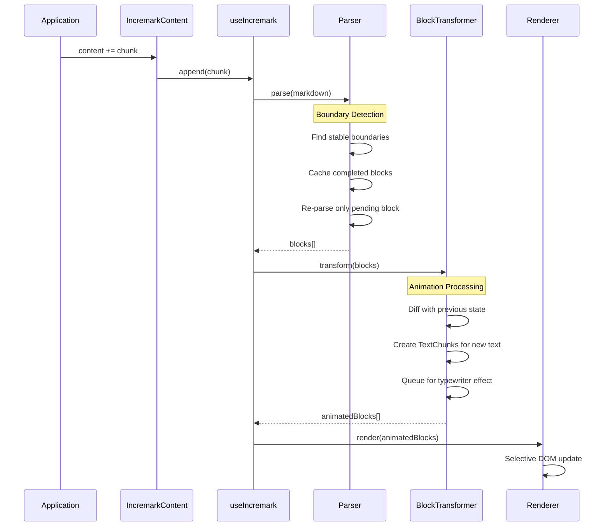

## Performance Optimizations

### 1. Incremental Line Parsing

Only new lines are parsed; completed blocks are cached:

```ts
// Simplified concept
if (line.isNewlyAdded) {
  parse(line)
} else if (block.isCompleted) {
  return cachedAST[block.id]
}
```

### 2. Stable Block IDs

Each block receives a stable ID, enabling efficient React/Vue reconciliation:

```ts
interface Block {
  id: string      // Stable across updates
  node: RootContent
  status: 'pending' | 'completed'
}
```

### 3. AST Incremental Appending

New nodes are appended to the existing tree without rebuilding:

```ts
// Instead of: root = parse(entireMarkdown)
// We do:
existingRoot.children.push(...newNodes)
```

### 4. Context Caching

Parser state is preserved between chunks for efficient resumption:

```ts
interface ParserContext {
  inFencedCode: boolean
  inContainer: boolean
  listStack: ListInfo[]
  blockquoteDepth: number
}
```

## Extension Points

Incremark provides multiple extension points:

| Level | Extension Type | Example |
|-------|---------------|---------|
| **Parser** | micromark extensions | Custom syntax |
| **Parser** | mdast extensions | Custom AST nodes |
| **Parser** | marked transformers | Custom token handling |
| **Renderer** | Custom components | Replace heading rendering |
| **Renderer** | Custom code blocks | Echarts, Mermaid |
| **Renderer** | Custom containers | Warning, Info boxes |

See [Extensions](/advanced/extensions) for detailed documentation.


================================================
FILE: docs/advanced/benchmark.md
================================================
# Benchmark

This page describes how to run performance benchmarks comparing Incremark with other Markdown streaming parsers.

## Parsers Tested

| Parser | Approach | Complexity | Description |
|--------|----------|------------|-------------|
| **Incremark** | Incremental parsing | O(n) | Only parses new content |
| **Streamdown** | Full re-parsing | O(n²) | Re-parses entire content each time |
| **markstream-vue** | Full re-parsing | O(n²) | Re-parses entire content each time |
| **ant-design-x** | Full re-parsing | O(n²) | Based on Marked |

## Test Methodology

1. Read all `.md` files from `test-data/` directory
2. Split content into small chunks (5 chars each, simulating AI token-by-token output)
3. For each parser:
   - **Incremark**: Uses `append()` method - only parses new content
   - **Others**: Accumulates string and re-parses entire content each time
4. Measure total time, per-chunk average, and memory usage

## Run Benchmark

### Clone Repository

```bash
git clone https://github.com/kingshuaishuai/incremark.git
cd incremark/benchmark-compare
```

### Install Dependencies

```bash
pnpm install
```

### Add Test Data

Place your Markdown files in the `test-data/` directory:

```bash
# Example: copy some markdown files
cp /path/to/your/*.md test-data/
```

### Run

```bash
# Standard run
pnpm benchmark

# With garbage collection (more accurate memory stats)
pnpm benchmark:gc
```

## Output

The benchmark generates:

- **Console output**: Summary table with timing comparisons
- **benchmark-results.json**: Detailed results in JSON format

### Sample Output

```
📊 Performance Summary (sorted by lines)

| filename          | lines | chars   | Incremark | Streamdown | vs Streamdown |
|-------------------|-------|---------|-----------|------------|---------------|
| short-doc.md      |    91 |   2,341 |      12.0 |       50.5 |          4.2x |
| medium-doc.md     |   147 |   4,123 |       9.0 |       58.8 |          6.6x |
| long-doc.md       |   391 |  12,456 |      19.1 |      208.4 |         10.9x |
| extra-long-doc.md |   916 |  28,912 |      87.7 |     1441.1 |         16.4x |

📈 Performance Summary:
   - Incremark total: 127.8 ms
   - Streamdown total: 1758.8 ms (13.8x slower)
```

## Expected Results

| Document Size | Lines | Incremark Advantage |
|---------------|-------|---------------------|
| Short | ~100 | 4-6x faster |
| Medium | ~400 | 10x+ faster |
| Long | ~900 | 16-65x faster |

::: tip Key Insight
**The longer the document, the greater the advantage of incremental parsing.**

This is because:
- Incremark: O(n) - only processes new content
- Others: O(n²) - re-processes entire accumulated content on each chunk
:::

## Benchmark Code

The benchmark script is located at `benchmark-compare/benchmark.ts`. Key implementation:

```typescript
// Incremark: O(n) incremental parsing
const parser = createIncremarkParser()
for (const chunk of chunks) {
  parser.append(chunk)  // Only parses new content
}
parser.finalize()

// Others: O(n²) full re-parsing
let accumulated = ''
for (const chunk of chunks) {
  accumulated += chunk
  parseMarkdown(accumulated)  // Re-parses entire content
}
```

## Contributing Test Data

We welcome contributions of real-world Markdown files for benchmarking. Please ensure:

1. Files are reasonably sized (100-1000+ lines)
2. Content is appropriate for public sharing
3. Files represent typical AI output scenarios

Submit via pull request to the `benchmark-compare/test-data/` directory.


================================================
FILE: docs/advanced/engines.md
================================================
# Dual-Engine Architecture

Incremark features a **dual-engine parsing system** — an important architectural decision we made during development. We want to give users the freedom to choose: find the perfect balance between extreme performance and perfect compatibility for your specific use case.

## Why Dual Engines?

During Incremark's development, we faced a core question: **How do we achieve the best performance in streaming AI scenarios?**

After extensive research and testing, we discovered:

- **Marked** is extremely fast, but doesn't natively support footnotes, math, and other advanced features
- **Micromark** has perfect spec compliance and a rich plugin ecosystem, but has a larger bundle size

Our decision: **Why not both?**

With the dual-engine architecture, users can choose based on their needs:
- Performance-sensitive AI chat scenarios → Use the Marked engine
- Documents requiring strict spec compliance → Use the Micromark engine

## Engine Overview

| Engine | Speed | Features | Bundle Size | Best For |
|--------|-------|----------|-------------|----------|
| **Marked** (Default) | ⚡⚡⚡⚡⚡ | Standard + Enhanced Extensions | Smaller | Real-time streaming, AI chat |
| **Micromark** | ⚡⚡⚡ | Full CommonMark + Plugins | Larger | Complex documents, strict compliance |

## Marked Engine (Default)

The **Marked engine** is our default choice, deeply optimized for **streaming AI scenarios**.

### Why Marked as the Default?

1. **Extreme parsing speed**: Marked is one of the fastest Markdown parsers in the JavaScript ecosystem
2. **Battle-tested stability**: Over 10 years of history, validated by countless projects
3. **Easy to extend**: Flexible extension mechanism allows us to add features as needed
4. **Small bundle size**: Benefits frontend tree-shaking optimization

### What We Enhanced for Marked

Native Marked is a "good enough" parser focused on standard Markdown syntax, without many advanced features. But in AI scenarios, we often need these features.

Therefore, Incremark extends Marked with custom extensions:

| Feature | Native Marked | Incremark Enhanced | Description |
|---------|---------------|-------------------|-------------|
| **Footnotes** | ❌ Not supported | ✅ Full GFM footnotes | `[^1]` references and `[^1]: content` definitions |
| **Math Blocks** | ❌ Not supported | ✅ Inline and block math | `$E=mc^2$` and `$$...$$` |
| **Custom Containers** | ❌ Not supported | ✅ Directive syntax | `:::tip`, `:::warning`, `:::danger` |
| **Inline HTML Parsing** | ⚠️ Preserved as-is | ✅ Structured parsing | Parses HTML into manipulable AST nodes |
| **Optimistic References** | ❌ Not supported | ✅ Streaming-friendly | Gracefully handles incomplete links/images during streaming |
| **Footnote Definition Blocks** | ❌ Not supported | ✅ Multi-line content | Supports complex footnotes with code blocks, lists, etc. |

> 💡 These extensions are carefully designed for AI scenarios. They provide full functionality while minimizing performance overhead.

### Usage

The Marked engine is the **default**, so you don't need any special configuration:

```vue
<script setup>
import { ref } from 'vue'
import { IncremarkContent } from '@incremark/vue'

const content = ref('')
const isFinished = ref(false)
</script>

<template>
  <!-- Marked engine is used by default -->
  <IncremarkContent 
    :content="content" 
    :is-finished="isFinished"
  />
</template>
```

### Enable/Disable Specific Features

```vue
<template>
  <IncremarkContent 
    :content="content" 
    :is-finished="isFinished"
    :incremark-options="{
      gfm: true,        // GFM extensions (tables, strikethrough, etc.)
      math: true,       // Math formulas
      containers: true, // Custom containers
      htmlTree: true    // HTML structured parsing
    }"
  />
</template>
```

## Micromark Engine

The **Micromark engine** is the choice for perfect spec compliance.

### Why Offer Micromark?

While the Marked engine satisfies most scenarios, some users may have stricter requirements:

1. **Strict CommonMark compliance**: Micromark is currently the most spec-compliant parser
2. **Rich plugin ecosystem**: GFM, Math, Directive plugins are all community-polished
3. **Precise position information**: AST nodes include accurate line/column positions for error locating
4. **Better edge case handling**: More stable in complex nested scenarios

### Usage

To use the Micromark engine, you need to import `MicromarkAstBuilder` and pass it via `astBuilder` option:

```ts
// In your composable or setup
import { createIncremarkParser } from '@incremark/core'
import { MicromarkAstBuilder } from '@incremark/core/engines/micromark'

const parser = createIncremarkParser({
  astBuilder: MicromarkAstBuilder,
  gfm: true,
  math: true
})
```

> **Note**: The `IncremarkContent` component currently uses the Marked engine by default. To use Micromark with the component, you would need to use `useIncremark` directly with a custom parser.

### When Should You Use Micromark?

- Your content includes complex nested structures
- You need to handle edge cases that Marked can't parse correctly
- Your application has strict CommonMark compliance requirements
- You need Micromark plugins beyond our built-in extensions

## Complete Benchmark Data

We benchmarked 38 real Markdown files. Here are the complete results:

### Test Environment

- **Test files**: 38 files, 6,484 lines total, 128.55 KB
- **Test method**: Simulated streaming input, character-by-character append
- **Compared solutions**: Streamdown, markstream-vue, ant-design-x

### Full Test Results

| Filename | Lines | Size(KB) | Incremark | Streamdown | markstream | ant-design-x | vs Streamdown | vs markstream | vs ant-design-x |
|----------|-------|----------|-----------|------------|------------|--------------|---------------|---------------|-----------------|
| test-footnotes-simple.md | 15 | 0.09 | 0.3 ms | 0.0 ms | 1.4 ms | 0.2 ms | 0.1x | 4.7x | 0.6x |
| simple-paragraphs.md | 16 | 0.41 | 0.9 ms | 0.9 ms | 5.9 ms | 1.0 ms | 1.1x | 6.7x | 1.2x |
| test-footnotes-multiline.md | 21 | 0.18 | 0.6 ms | 0.0 ms | 2.2 ms | 0.4 ms | 0.1x | 3.5x | 0.6x |
| test-footnotes-edge-cases.md | 27 | 0.25 | 0.8 ms | 0.0 ms | 4.2 ms | 1.2 ms | 0.0x | 5.3x | 1.5x |
| test-footnotes-complex.md | 28 | 0.24 | 2.1 ms | 0.0 ms | 4.8 ms | 1.0 ms | 0.0x | 2.3x | 0.5x |
| introduction.md | 34 | 1.57 | 5.6 ms | 12.6 ms | 75.6 ms | 12.8 ms | 2.2x | 13.4x | 2.3x |
| devtools.md | 51 | 0.92 | 1.2 ms | 0.9 ms | 6.1 ms | 1.1 ms | 0.8x | 5.0x | 0.9x |
| footnotes.md | 52 | 0.94 | 1.7 ms | 0.2 ms | 10.6 ms | 1.9 ms | 0.1x | 6.3x | 1.2x |
| html-elements.md | 55 | 1.02 | 1.6 ms | 2.2 ms | 12.6 ms | 2.8 ms | 1.4x | 7.8x | 1.7x |
| themes.md | 58 | 0.96 | 1.9 ms | 1.3 ms | 8.6 ms | 1.8 ms | 0.7x | 4.4x | 0.9x |
| test-footnotes-comprehensive.md | 63 | 0.66 | 5.6 ms | 0.1 ms | 25.8 ms | 7.7 ms | 0.0x | 4.6x | 1.4x |
| auto-scroll.md | 72 | 1.68 | 3.9 ms | 3.5 ms | 39.9 ms | 4.9 ms | 0.9x | 10.1x | 1.2x |
| custom-codeblocks.md | 72 | 1.44 | 3.4 ms | 2.0 ms | 14.9 ms | 2.5 ms | 0.6x | 4.4x | 0.7x |
| custom-components.md | 73 | 1.40 | 4.0 ms | 2.0 ms | 32.7 ms | 2.9 ms | 0.5x | 8.1x | 0.7x |
| custom-containers.md | 88 | 1.67 | 4.2 ms | 2.4 ms | 18.1 ms | 3.1 ms | 0.6x | 4.3x | 0.7x |
| typewriter.md | 88 | 1.89 | 5.6 ms | 4.1 ms | 35.0 ms | 4.9 ms | 0.7x | 6.2x | 0.9x |
| concepts.md | 91 | 4.29 | 12.0 ms | 50.5 ms | 381.9 ms | 53.6 ms | 4.2x | 31.9x | 4.5x |
| INLINE_CODE_UPDATE.md | 94 | 1.66 | 4.7 ms | 17.2 ms | 60.9 ms | 15.6 ms | 3.7x | 12.9x | 3.3x |
| comparison.md | 109 | 5.39 | 20.5 ms | 74.0 ms | 552.2 ms | 85.2 ms | 3.6x | 26.9x | 4.1x |
| basic-usage.md | 130 | 3.04 | 8.5 ms | 12.3 ms | 74.1 ms | 14.1 ms | 1.4x | 8.7x | 1.7x |
| CODE_BACKGROUND_SEPARATION.md | 131 | 2.83 | 8.7 ms | 28.8 ms | 153.6 ms | 31.3 ms | 3.3x | 17.6x | 3.6x |
| P2_SUMMARY.md | 138 | 2.61 | 8.3 ms | 38.4 ms | 157.2 ms | 41.9 ms | 4.6x | 18.9x | 5.0x |
| quick-start.md | 146 | 3.04 | 7.3 ms | 7.3 ms | 64.2 ms | 9.6 ms | 1.0x | 8.8x | 1.3x |
| complex-html-examples.md | 147 | 3.99 | 9.0 ms | 58.8 ms | 279.3 ms | 57.2 ms | 6.6x | 31.1x | 6.4x |
| CODE_COLOR_SEPARATION.md | 162 | 3.51 | 10.0 ms | 32.8 ms | 191.1 ms | 36.9 ms | 3.3x | 19.1x | 3.7x |
| P0_OPTIMIZATION_REPORT.md | 168 | 3.53 | 10.1 ms | 56.2 ms | 228.0 ms | 58.1 ms | 5.6x | 22.6x | 5.8x |
| COLOR_SYSTEM_REFACTOR.md | 169 | 3.78 | 18.5 ms | 64.0 ms | 355.5 ms | 69.1 ms | 3.5x | 19.2x | 3.7x |
| FOOTNOTE_TEST_GUIDE.md | 219 | 2.87 | 12.3 ms | 0.2 ms | 167.6 ms | 45.0 ms | 0.0x | 13.7x | 3.7x |
| P2_COLORS_PACKAGE_REPORT.md | 226 | 4.10 | 11.4 ms | 77.9 ms | 311.6 ms | 80.5 ms | 6.8x | 27.2x | 7.0x |
| FOOTNOTE_FIX_SUMMARY.md | 236 | 3.93 | 22.7 ms | 0.5 ms | 535.0 ms | 120.8 ms | 0.0x | 23.6x | 5.3x |
| BASE_COLORS_SYSTEM.md | 259 | 4.47 | 35.8 ms | 43.0 ms | 191.8 ms | 43.4 ms | 1.2x | 5.4x | 1.2x |
| OPTIMIZATION_COMPARISON.md | 270 | 5.42 | 17.8 ms | 52.3 ms | 366.1 ms | 61.9 ms | 2.9x | 20.6x | 3.5x |
| P1_OPTIMIZATION_REPORT.md | 327 | 5.63 | 20.7 ms | 106.8 ms | 433.8 ms | 114.8 ms | 5.2x | 21.0x | 5.5x |
| OPTIMIZATION_PLAN.md | 371 | 6.89 | 33.1 ms | 67.6 ms | 372.1 ms | 76.7 ms | 2.0x | 11.2x | 2.3x |
| OPTIMIZATION_SUMMARY.md | 391 | 6.24 | 19.1 ms | 208.4 ms | 980.6 ms | 217.8 ms | 10.9x | 51.3x | 11.4x |
| P1.5_COLOR_SYSTEM_REPORT.md | 482 | 9.12 | 22.0 ms | 145.5 ms | 789.8 ms | 168.2 ms | 6.6x | 35.9x | 7.7x |
| BLOCK_TRANSFORMER_ANALYSIS.md | 489 | 9.24 | 75.7 ms | 574.3 ms | 1984.1 ms | 619.9 ms | 7.6x | 26.2x | 8.2x |
| test-md-01.md | 916 | 17.67 | 87.7 ms | 1441.1 ms | 5754.7 ms | 1656.9 ms | 16.4x | 65.6x | 18.9x |
| **【Total】** | **6484** | **128.55** | **519.4 ms** | **3190.3 ms** | **14683.9 ms** | **3728.6 ms** | **6.1x** | **28.3x** | **7.2x** |

### How to Interpret This Data

#### We're Honest: Incremark is Slower in Some Scenarios

You may notice that for `test-footnotes-*.md` and `FOOTNOTE_*.md` files, Incremark is much slower than Streamdown (0.0x - 0.1x).

**The reason is simple: Streamdown doesn't support footnote syntax.**

When Streamdown encounters `[^1]` footnote references, it simply skips them. Meanwhile, Incremark:
1. Recognizes footnote references
2. Parses footnote definition blocks (which may contain multi-line content, code blocks, lists, etc.)
3. Establishes reference relationships
4. Generates correct AST structure

This isn't a performance issue — it's a **feature difference**. We believe complete footnote support is crucial for AI scenarios, so we chose to implement it.

#### Where's the Real Performance Advantage?

Excluding footnote-related files, look at standard Markdown content performance:

| File | Lines | Incremark | Streamdown | Advantage |
|------|-------|-----------|------------|-----------|
| concepts.md | 91 | 12.0 ms | 50.5 ms | **4.2x** |
| comparison.md | 109 | 20.5 ms | 74.0 ms | **3.6x** |
| complex-html-examples.md | 147 | 9.0 ms | 58.8 ms | **6.6x** |
| P0_OPTIMIZATION_REPORT.md | 168 | 10.1 ms | 56.2 ms | **5.6x** |
| OPTIMIZATION_SUMMARY.md | 391 | 19.1 ms | 208.4 ms | **10.9x** |
| test-md-01.md | 916 | 87.7 ms | 1441.1 ms | **16.4x** |

**Conclusion**: For standard Markdown content, the larger the document, the more pronounced Incremark's advantage.

#### Why Such a Gap?

This is the direct result of **O(n) vs O(n²)** algorithmic complexity.

Traditional parsers (Streamdown, ant-design-x, markstream-vue) **re-parse the entire document** on every new chunk:

```
Chunk 1: Parse 100 chars
Chunk 2: Parse 200 chars (100 old + 100 new)
Chunk 3: Parse 300 chars (200 old + 100 new)
...
Chunk 100: Parse 10,000 chars
```

Total work: `100 + 200 + 300 + ... + 10000 = 5,050,000` character operations

**Incremark's incremental parsing** only processes new content:

```
Chunk 1: Parse 100 chars → cache stable blocks
Chunk 2: Parse only ~100 new chars
Chunk 3: Parse only ~100 new chars
...
Chunk 100: Parse only ~100 new chars
```

Total work: `100 × 100 = 10,000` character operations

That's a **500x difference**. This is why an 18KB document can be 16x+ faster.

## Feature Parity

We strive to keep both engines functionally consistent:

| Feature | Marked Engine | Micromark Engine |
|---------|---------------|------------------|
| GFM (Tables, Strikethrough, Autolinks) | ✅ | ✅ |
| Math Blocks (`$...$` and `$$...$$`) | ✅ | ✅ |
| Custom Containers (`:::tip`, etc.) | ✅ | ✅ |
| HTML Element Parsing | ✅ | ✅ |
| Footnotes | ✅ | ✅ |
| Typewriter Animation | ✅ | ✅ |
| Incremental Updates | ✅ | ✅ |

## Switching Engines

Engine selection is done at **initialization time**, not runtime. This is by design for tree-shaking optimization.

### Why Not Runtime Switching?

To ensure optimal bundle size:
- Default import only includes the `marked` engine
- `micromark` engine is imported separately when needed
- This allows bundlers to tree-shake unused engines

### How to Switch Engines

```vue
<script setup>
import { ref } from 'vue'
import { IncremarkContent } from '@incremark/vue'

const content = ref('')
const isFinished = ref(false)

// Engine is selected at initialization
// For marked (default): no extra import needed
// For micromark: import MicromarkAstBuilder
</script>

<template>
  <!-- Uses marked engine by default -->
  <IncremarkContent 
    :content="content" 
    :is-finished="isFinished"
    :incremark-options="{ gfm: true, math: true }"
  />
</template>
```

### Using Micromark Engine

To use micromark, import `MicromarkAstBuilder` from the separate engine entry:

```ts
import { createIncremarkParser } from '@incremark/core'
import { MicromarkAstBuilder } from '@incremark/core/engines/micromark'

// Create parser with micromark engine
const parser = createIncremarkParser({
  astBuilder: MicromarkAstBuilder,
  gfm: true,
  math: true
})
```

> ⚠️ **Tree-shaking Note**: Importing from `@incremark/core/engines/micromark` only adds micromark to your bundle. The default import keeps only marked.

## Extending Engines

Both engines support custom extensions. See the [Extensions Guide](/advanced/extensions) for details.

```ts
// Custom marked extension example
import { createCustomExtension } from '@incremark/core'

const myExtension = createCustomExtension({
  name: 'myPlugin',
  // ... extension config
})
```

## Summary and Recommendations

| Aspect | Marked | Micromark |
|--------|--------|-----------|
| Parsing Speed | ⚡⚡⚡⚡⚡ | ⚡⚡⚡ |
| Bundle Size | 📦 Smaller | 📦 Larger |
| CommonMark Compliance | ✅ Good | ✅ Perfect |
| Built-in Extensions | ✅ Footnotes, Math, Containers | ✅ Via plugins |
| Plugin Ecosystem | 🔧 Growing | 🔧 Mature |
| Recommended For | Streaming AI, Real-time rendering | Static documents, Strict compliance |

**Our Recommendations**:

1. **Most scenarios**: Use the default Marked engine — it's already great
2. **Parsing issues**: If Marked doesn't handle certain edge cases well, try switching to Micromark
3. **Extreme performance needs**: Marked engine is your best choice
4. **Strict compliance needs**: Micromark engine is more suitable

We'll continue optimizing both engines to ensure they provide the best experience for you.


================================================
FILE: docs/advanced/extensions.md
================================================
# Extensions

Incremark's dual-engine architecture provides flexible extension mechanisms for both `micromark` and `marked` engines.

## Engine Selection

Choose the appropriate engine based on your extension needs:

| Engine | Extension Type | Best For |
|--------|---------------|----------|
| `micromark` | micromark + mdast extensions | Rich ecosystem, CommonMark compliance |
| `marked` | Custom token transformers | Maximum performance, simple extensions |

## Micromark Extensions

When using the `micromark` engine, you can leverage the rich ecosystem of existing extensions.

### Syntax Extensions

Use `micromark` extensions to support new syntax:

```vue
<script setup>
import { ref } from 'vue'
import { IncremarkContent } from '@incremark/vue'
import { gfmTable } from 'micromark-extension-gfm-table'

const content = ref('')
const isFinished = ref(false)

// Note: extensions option is for micromark engine only
// Use with MicromarkAstBuilder
import { MicromarkAstBuilder } from '@incremark/core/engines/micromark'

const parser = createIncremarkParser({
  astBuilder: MicromarkAstBuilder,
  extensions: [gfmTable()]
})
</script>

<template>
  <IncremarkContent 
    :content="content" 
    :is-finished="isFinished"
    :incremark-options="options" 
  />
</template>
```

### AST Extensions

Use `mdast-util-from-markdown` extensions to transform syntax to AST nodes:

```ts
import { gfmTableFromMarkdown } from 'mdast-util-gfm-table'

import { MicromarkAstBuilder } from '@incremark/core/engines/micromark'

const parser = createIncremarkParser({
  astBuilder: MicromarkAstBuilder,
  extensions: [gfmTable()],
  mdastExtensions: [gfmTableFromMarkdown()]
})
```

### Common Extension Packages

| Package | Description |
|---------|-------------|
| `micromark-extension-gfm` | Full GFM support |
| `micromark-extension-math` | Math formulas |
| `micromark-extension-directive` | Custom containers |
| `micromark-extension-frontmatter` | YAML frontmatter |

## Marked Extensions

The `marked` engine uses a custom extension system. Incremark has already extended `marked` with support for:

- **Footnotes**: `[^1]` references and `[^1]: content` definitions
- **Math**: `$inline$` and `$$block$$` formulas
- **Custom Containers**: `:::type` syntax
- **Inline HTML**: Structured HTML element parsing

### Custom Token Transformers

For the `marked` engine, you can provide custom token transformers:

```ts
import type { BlockTokenTransformer, InlineTokenTransformer } from '@incremark/core'

// Custom block transformer
const myBlockTransformer: BlockTokenTransformer = (token, ctx) => {
  if (token.type === 'myCustomBlock') {
    return {
      type: 'paragraph',
      children: [{ type: 'text', value: token.raw }]
    }
  }
  return null
}

// For marked engine (default), use customBlockTransformers
const parser = createIncremarkParser({
  // marked is default, no astBuilder needed
  customBlockTransformers: {
    myCustomBlock: myBlockTransformer
  }
})
```

### Built-in Transformers

You can access and extend the built-in transformers:

```ts
import { 
  getBuiltinBlockTransformers, 
  getBuiltinInlineTransformers 
} from '@incremark/core'

// Get all built-in transformers
const blockTransformers = getBuiltinBlockTransformers()
const inlineTransformers = getBuiltinInlineTransformers()

// Override specific transformer
const customTransformers = {
  ...blockTransformers,
  code: (token, ctx) => {
    // Custom code block handling
    return { type: 'code', value: token.text, lang: token.lang }
  }
}
```

## UI-Level Extensions

Beyond parser extensions, Incremark provides UI-level customization:

### Custom Components

Replace default rendering for any node type:

```vue
<IncremarkContent 
  :content="content" 
  :is-finished="isFinished"
  :components="{ heading: MyCustomHeading }"
/>
```

### Custom Code Blocks

Handle specific code languages with custom components:

```vue
<IncremarkContent 
  :content="content" 
  :is-finished="isFinished"
  :custom-code-blocks="{ echarts: MyEchartsRenderer }"
  :code-block-configs="{ echarts: { takeOver: true } }"
/>
```

### Custom Containers

Render `:::type` containers with custom components:

```vue
<IncremarkContent 
  :content="content" 
  :is-finished="isFinished"
  :custom-containers="{ 
    warning: WarningBox,
    info: InfoBox,
    tip: TipBox 
  }"
/>
```

## Extension Best Practices

1. **Choose the right engine**: Use `micromark` for complex syntax extensions, `marked` for performance-critical scenarios.

2. **Leverage existing packages**: The micromark ecosystem has many well-tested extensions.

3. **UI-level first**: For visual customization, prefer UI-level extensions (custom components) over parser extensions.

4. **Test thoroughly**: Custom extensions can affect parsing behavior across different markdown inputs.


================================================
FILE: docs/api/index.md
================================================
# API Reference

A centralized reference for all Incremark types and components.

## Components

### `<IncremarkContent />`

The main component for rendering Markdown content.

**Props (`IncremarkContentProps`)**:

| Prop | Type | Default | Description |
|------|------|---------|-------------|
| `content` | `string` | - | The Markdown string to render (content mode). |
| `stream` | `() => AsyncGenerator<string>` | - | Async generator function for streaming content (stream mode). |
| `isFinished` | `boolean` | `false` | Whether the content generation is finished (required for content mode). |
| `incremarkOptions` | `UseIncremarkOptions` | - | Configuration options for the parser and typewriter effect. |
| `components` | `ComponentMap` | `{}` | Custom components to override default element rendering. |
| `customContainers` | `Record<string, Component>` | `{}` | Custom container components for `::: name` syntax. |
| `customCodeBlocks` | `Record<string, Component>` | `{}` | Custom code block components for specific languages. |
| `codeBlockConfigs` | `Record<string, CodeBlockConfig>` | `{}` | Configuration for code blocks (e.g., `takeOver`). |
| `showBlockStatus` | `boolean` | `false` | Whether to visualize block processing status (pending/completed). |
| `pendingClass` | `string` | `'incremark-pending'` | CSS class applied to pending blocks. |
| `devtools` | `IncremarkDevTools` | - | DevTools instance to register with for debugging. |
| `devtoolsId` | `string` | *Auto-generated* | Unique identifier for this parser in DevTools. |
| `devtoolsLabel` | `string` | `devtoolsId` | Display label for this parser in DevTools. |

### `<AutoScrollContainer />`

A container that automatically scrolls to the bottom when content updates.

**Props**:

| Prop | Type | Default | Description |
|------|------|---------|-------------|
| `enabled` | `boolean` | `true` | Whether auto-scroll functionality is active. |
| `threshold` | `number` | `50` | Distance in pixels from bottom to trigger auto-scroll. |
| `behavior` | `ScrollBehavior` | `'instant'` | Scroll behavior (`'auto'`, `'smooth'`, `'instant'`). |

## Composables / Hooks

### `useIncremark`

The core hook for advanced usage and fine-grained control.

**Options (`UseIncremarkOptions`)**:

| Option | Type | Default | Description |
|--------|------|---------|-------------|
| `gfm` | `boolean` | `true` | Enable GitHub Flavored Markdown support. |
| `math` | `boolean` | `true` | Enable Math (KaTeX) support. |
| `htmlTree` | `boolean` | `true` | Enable parsing of raw HTML tags. |
| `containers` | `boolean` | `true` | Enable custom container syntax `:::`. |
| `typewriter` | `TypewriterOptions` | - | Configuration for typewriter effect. |

**Returns (`UseIncremarkReturn`)**:

| Property | Type | Description |
|----------|------|-------------|
| `blocks` | `Ref<Block[]>` | Reactive array of parsed blocks with stable IDs. |
| `append` | `(chunk: string) => void` | Append new content chunk to the parser. |
| `render` | `(content: string) => void` | Render a complete or updated content string. |
| `reset` | `() => void` | Reset parser state and clear all blocks. |
| `finalize` | `() => void` | Mark all blocks as completed. |
| `isDisplayComplete` | `Ref<boolean>` | Whether the typewriter effect has finished displaying all content. |

## Configuration Types

### `TypewriterOptions`

| Option | Type | Default | Description |
|--------|------|---------|-------------|
| `enabled` | `boolean` | `false` | Enable typewriter effect. |
| `charsPerTick` | `number \| [number, number]` | `2` | Characters to reveal per tick (or range). |
| `tickInterval` | `number` | `50` | ms between ticks. |
| `effect` | `'none' \| 'fade-in' \| 'typing'` | `'none'` | Animation style. |
| `cursor` | `string` | `'|'` | Cursor character for typing effect. |


================================================
FILE: docs/examples/anthropic.md
================================================
# Anthropic Integration

Using the `@anthropic-ai/sdk` library.

## Example

```ts
import Anthropic from '@anthropic-ai/sdk'
import { IncremarkContent } from '@incremark/react'

const anthropic = new Anthropic({
  apiKey: 'YOUR_API_KEY',
})

function App() {
  const [stream, setStream] = useState(null)

  async function startChat() {
    async function* getStream() {
      const stream = await anthropic.messages.create({
        max_tokens: 1024,
        messages: [{ role: 'user', content: 'Hello, Claude' }],
        model: 'claude-3-opus-20240229',
        stream: true,
      })

      for await (const chunk of stream) {
        if (chunk.type === 'content_block_delta') {
          yield chunk.delta.text
        }
      }
    }
    
    setStream(() => getStream)
  }

  return (
    <>
      <button onClick={startChat}>Send</button>
      <IncremarkContent stream={stream} />
    </>
  )
}
```


================================================
FILE: docs/examples/custom-stream.md
================================================
# Custom Stream Integration

Parsing a raw standard `Response` stream.

## Example

```ts
import { IncremarkContent } from '@incremark/react'

function App() {
  const [stream, setStream] = useState(null)

  function start() {
    async function* fetchStream() {
      const response = await fetch('/api/stream')
      const reader = response.body.getReader()
      const decoder = new TextDecoder()

      while (true) {
        const { done, value } = await reader.read()
        if (done) break
        yield decoder.decode(value, { stream: true })
      }
    }
    
    setStream(() => fetchStream)
  }

  return (
    <>
      <button onClick={start}>Start</button>
      <IncremarkContent stream={stream} />
    </>
  )
}
```


================================================
FILE: docs/examples/openai.md
================================================
# OpenAI Integration

Using the `openai` Node.js library.

## Example

```ts
import OpenAI from 'openai'
import { IncremarkContent } from '@incremark/react'

const openai = new OpenAI({
  apiKey: 'YOUR_API_KEY',
  dangerouslyAllowBrowser: true // For client-side demo only
})

function App() {
  const [stream, setStream] = useState(null)

  async function startChat() {
    async function* getStream() {
      const completion = await openai.chat.completions.create({
        model: "gpt-4",
        messages: [{ role: "user", content: "Explain quantum computing" }],
        stream: true,
      })

      for await (const chunk of completion) {
        yield chunk.choices[0]?.delta?.content || ''
      }
    }
    
    setStream(() => getStream)
  }

  return (
    <>
      <button onClick={startChat}>Send</button>
      <IncremarkContent stream={stream} />
    </>
  )
}
```


================================================
FILE: docs/examples/vercel-ai.md
================================================
# Vercel AI SDK Integration

Using the `ai` SDK.

## Example

```tsx
import { useChat } from 'ai/react'
import { IncremarkContent } from '@incremark/react'

export default function Chat() {
  const { messages, input, handleInputChange, handleSubmit } = useChat()

  const lastMessage = messages[messages.length - 1]
  const isAssistant = lastMessage?.role === 'assistant'

  return (
    <div>
      {messages.map(m => (
        <div key={m.id}>
          {m.role === 'user' ? (
            <p>{m.content}</p>
          ) : (
            // Pass content to Incremark
            // Vercel AI SDK updates content reactively
            <IncremarkContent 
              content={m.content} 
              isFinished={false} // You might check if status === 'ready'
            />
          )}
        </div>
      ))}

      <form onSubmit={handleSubmit}>
        <input value={input} onChange={handleInputChange} />
      </form>
    </div>
  )
}
```


================================================
FILE: docs/features/auto-scroll.md
================================================
# Auto Scroll

## Using AutoScrollContainer

::: code-group
```vue [Vue]
<script setup>
import { ref } from 'vue'
import { IncremarkContent, AutoScrollContainer } from '@incremark/vue'

const content = ref('')
const isFinished = ref(false)
const scrollRef = ref()
</script>

<template>
  <AutoScrollContainer ref="scrollRef" :enabled="true" class="h-[500px]">
    <IncremarkContent :content="content" :is-finished="isFinished" />
  </AutoScrollContainer>
</template>
```

```tsx [React]
import { useRef } from 'react'
import { IncremarkContent, AutoScrollContainer } from '@incremark/react'

function App() {
  const scrollRef = useRef(null)

  return (
    <AutoScrollContainer ref={scrollRef} enabled className="h-[500px]">
      <IncremarkContent content={content} isFinished={isFinished} />
    </AutoScrollContainer>
  )
}
```

```svelte [Svelte]
<script lang="ts">
  import { IncremarkContent, AutoScrollContainer } from '@incremark/svelte'

  let content = $state('')
  let isFinished = $state(false)
</script>

<AutoScrollContainer enabled class="h-[500px]">
  <IncremarkContent {content} {isFinished} />
</AutoScrollContainer>
```

```tsx [Solid]
import { createSignal } from 'solid-js'
import { IncremarkContent, AutoScrollContainer } from '@incremark/solid'

function App() {
  const [content, setContent] = createSignal('')
  const [isFinished, setIsFinished] = createSignal(false)

  return (
    <AutoScrollContainer enabled class="h-[500px]">
      <IncremarkContent content={content()} isFinished={isFinished()} />
    </AutoScrollContainer>
  )
}
```
:::

## Props

| Prop | Type | Default | Description |
|---|---|---|---|
| `enabled` | `boolean` | `true` | Enable auto scroll |
| `threshold` | `number` | `50` | Bottom threshold (pixels) |
| `behavior` | `ScrollBehavior` | `'instant'` | Scroll behavior |

## Exposed Methods

| Method | Description |
|---|---|
| `scrollToBottom()` | Force scroll to bottom |
| `isUserScrolledUp()` | Whether user manually scrolled up |

## Behavior

- Auto scrolls to bottom when content updates.
- Pauses auto scroll when user scrolls up.
- Resumes auto scroll when user scrolls back to bottom.


================================================
FILE: docs/features/basic-usage.md
================================================
# Basic Usage

**IncremarkContent Component Complete Guide**

## Two Input Modes

1. **content mode**: Pass accumulated string + isFinished flag
2. **stream mode**: Pass function returning AsyncGenerator

## Props Reference

```ts
interface IncremarkContentProps {
  // Input (Choose one)
  content?: string                       // Accumulated string
  stream?: () => AsyncGenerator<string>  // Async generator function

  // Status
  isFinished?: boolean                   // Stream finished flag (Required for content mode)

  // Configuration
  incremarkOptions?: UseIncremarkOptions // Parser + Typewriter config

  // Custom Rendering
  components?: ComponentMap              // Custom components
  customContainers?: Record<string, Component>
  customCodeBlocks?: Record<string, Component>
  codeBlockConfigs?: Record<string, CodeBlockConfig>

  // Styling
  showBlockStatus?: boolean              // Show block status border
  pendingClass?: string                  // CSS class for pending block
}
```

### UseIncremarkOptions

```ts
interface UseIncremarkOptions {
  // Parser Options
  gfm?: boolean              // GFM support (tables, tasklists, etc.)
  math?: boolean | MathOptions // Math formula support
  htmlTree?: boolean         // HTML fragment parsing
  containers?: boolean       // ::: container syntax

  // Typewriter Options
  typewriter?: {
    enabled?: boolean
    charsPerTick?: number | [number, number]
    tickInterval?: number
    effect?: 'none' | 'fade-in' | 'typing'
    cursor?: string
  }
}

interface MathOptions {
  // Enable TeX style \(...\) and \[...\] syntax
  tex?: boolean
}
```

### Math Configuration

By default, `math: true` only supports `$...$` and `$$...$$` syntax.

If you need to support TeX/LaTeX style `\(...\)` and `\[...\]` delimiters, enable the **tex** option:

```ts
// Enable TeX style delimiters
const options = {
  math: { tex: true }
}
```

This is useful when processing academic papers or outputs from certain AI tools.

## Advanced: Using `useIncremark`

When finer control is needed:

::: code-group
```vue [Vue]
<script setup>
import { useIncremark, Incremark } from '@incremark/vue'

const { blocks, append, finalize, reset } = useIncremark({ gfm: true })

async function handleStream(stream) {
  reset()
  for await (const chunk of stream) {
    append(chunk)
  }
  finalize()
}
</script>

<template>
  <Incremark :blocks="blocks" />
</template>
```

```tsx [React]
import { useIncremark, Incremark } from '@incremark/react'

function App() {
  const { blocks, append, finalize, reset } = useIncremark({ gfm: true })

  async function handleStream(stream) {
    reset()
    for await (const chunk of stream) {
      append(chunk)
    }
    finalize()
  }

  return <Incremark blocks={blocks} />
}
```

```svelte [Svelte]
<script lang="ts">
  import { useIncremark, Incremark } from '@incremark/svelte'

  const { blocks, append, finalize, reset } = useIncremark({ gfm: true })

  async function handleStream(stream) {
    reset()
    for await (const chunk of stream) {
      append(chunk)
    }
    finalize()
  }
</script>

<Incremark {blocks} />
```

```tsx [Solid]
import { useIncremark, Incremark } from '@incremark/solid'

function App() {
  const { blocks, append, finalize, reset } = useIncremark({ gfm: true })

  async function handleStream(stream) {
    reset()
    for await (const chunk of stream) {
      append(chunk)
    }
    finalize()
  }

  return <Incremark blocks={blocks()} />
}
```
:::

### useIncremark Return Values

| Property | Type | Description |
|---|---|---|
| `blocks` | `Block[]` | All blocks (with stable ID) |
| `markdown` | `string` | Accumulated Markdown |
| `append(chunk)` | `Function` | Append content |
| `finalize()` | `Function` | Complete parsing |
| `reset()` | `Function` | Reset state |
| `render(content)` | `Function` | Render once |
| `isDisplayComplete` | `boolean` | Is typewriter effect complete |


================================================
FILE: docs/features/custom-codeblocks.md
================================================
# Custom Code Blocks

## Overview

Incremark provides a layered architecture for code block customization:

1. **customCodeBlocks**: Language-specific custom components (highest priority)
2. **Built-in Mermaid**: Automatic Mermaid diagram support
3. **components['code']**: Custom default code rendering
4. **Default**: Built-in Shiki syntax highlighting

## Custom Code Block Rendering

Useful for specialized rendering like echarts, custom diagrams, etc.

::: code-group
```vue [Vue]
<script setup>
import { IncremarkContent } from '@incremark/vue'
import EchartsBlock from './EchartsBlock.vue'
import PlantUMLBlock from './PlantUMLBlock.vue'

const customCodeBlocks = {
  echarts: EchartsBlock,
  plantuml: PlantUMLBlock
}

// Config: whether to render while pending
const codeBlockConfigs = {
  echarts: { takeOver: true }  // Render even when pending
}
</script>

<template>
  <IncremarkContent
    :content="content"
    :custom-code-blocks="customCodeBlocks"
    :code-block-configs="codeBlockConfigs"
  />
</template>
```

```tsx [React]
import { IncremarkContent } from '@incremark/react'

function EchartsBlock({ codeStr, lang, completed, takeOver }) {
  // codeStr is code content
  // lang is language identifier
  // completed indicates if the block is complete
  return <div className="echarts">{codeStr}</div>
}

const customCodeBlocks = {
  echarts: EchartsBlock
}

<IncremarkContent
  content={content}
  customCodeBlocks={customCodeBlocks}
/>
```

```svelte [Svelte]
<script lang="ts">
  import { IncremarkContent } from '@incremark/svelte'
  import EchartsBlock from './EchartsBlock.svelte'

  const customCodeBlocks = {
    echarts: EchartsBlock
  }
</script>

<IncremarkContent {content} {customCodeBlocks} />
```

```tsx [Solid]
import { IncremarkContent } from '@incremark/solid'

function EchartsBlock(props: {
  codeStr: string
  lang: string
  completed: boolean
  takeOver: boolean
}) {
  return <div class="echarts">{props.codeStr}</div>
}

const customCodeBlocks = {
  echarts: EchartsBlock
}

<IncremarkContent content={content()} customCodeBlocks={customCodeBlocks} />
```
:::

## Custom Code Block Props

When creating a custom code block component, your component will receive these props:

| Prop | Type | Description |
|---|---|---|
| `codeStr` | `string` | The code content |
| `lang` | `string` | Language identifier |
| `completed` | `boolean` | Whether the block is complete |
| `takeOver` | `boolean` | Whether takeOver mode is enabled |

## codeBlockConfigs

| Option | Type | Default | Description |
|---|---|---|---|
| `takeOver` | `boolean` | `false` | Take over rendering while pending |

## Built-in Mermaid Support

::: tip
Mermaid diagrams are supported out of the box! No configuration needed.
:::

Incremark automatically renders Mermaid diagrams with:
- Debounced rendering for streaming input
- Preview/source toggle
- Copy functionality
- Dark theme by default

```markdown
\`\`\`mermaid
graph TD
    A[Start] --> B{Is it working?}
    B -->|Yes| C[Great!]
    B -->|No| D[Debug]
    D --> A
\`\`\`
```

If you want to override the built-in Mermaid rendering, use `customCodeBlocks`:

::: code-group
```vue [Vue]
<script setup>
import { IncremarkContent } from '@incremark/vue'
import MyMermaidBlock from './MyMermaidBlock.vue'

const customCodeBlocks = {
  mermaid: MyMermaidBlock  // Override built-in Mermaid
}
</script>

<template>
  <IncremarkContent
    :content="content"
    :custom-code-blocks="customCodeBlocks"
  />
</template>
```
:::

## Comparison with components['code']

| Feature | customCodeBlocks | components['code'] |
|---|---|---|
| Scope | Specific languages | All code blocks (fallback) |
| Priority | Highest | Lower than customCodeBlocks and Mermaid |
| Use case | Specialized rendering (echarts, diagrams) | Custom syntax highlighting theme |
| Props | `codeStr`, `lang`, `completed`, `takeOver` | `node`, `theme`, `fallbackTheme`, `disableHighlight` |

See [Custom Components](/features/custom-components) for more details on `components['code']`.


================================================
FILE: docs/features/custom-components.md
================================================
# Custom Components

## Custom Node Rendering

::: code-group
```vue [Vue]
<script setup>
import { h } from 'vue'
import { IncremarkContent } from '@incremark/vue'

const CustomHeading = {
  props: ['node'],
  setup(props) {
    const level = props.node.depth
    return () => h(`h${level}`, { class: 'my-heading' }, props.node.children)
  }
}

const components = {
  heading: CustomHeading
}
</script>

<template>
  <IncremarkContent :content="content" :components="components" />
</template>
```

```tsx [React]
import { IncremarkContent } from '@incremark/react'

function CustomHeading({ node, children }) {
  const Tag = `h${node.depth}` as keyof JSX.IntrinsicElements
  return <Tag className="my-heading">{children}</Tag>
}

const components = {
  heading: CustomHeading
}

<IncremarkContent content={content} components={components} />
```

```svelte [Svelte]
<script lang="ts">
  import { IncremarkContent } from '@incremark/svelte'
  import CustomHeading from './CustomHeading.svelte'

  const components = {
    heading: CustomHeading
  }
</script>

<IncremarkContent {content} {components} />
```

```tsx [Solid]
import { IncremarkContent } from '@incremark/solid'
import CustomHeading from './CustomHeading'

const components = {
  heading: CustomHeading
}

<IncremarkContent content={content()} components={components} />
```
:::

## Component Types

| Type | Node |
|---|---|
| `heading` | Headings h1-h6 |
| `paragraph` | Paragraph |
| `code` | Code block (default rendering only) |
| `list` | List |
| `listItem` | List item |
| `table` | Table |
| `blockquote` | Blockquote |
| `thematicBreak` | Divider |
| `image` | Image |
| `link` | Link |
| `inlineCode` | Inline code |

## Code Component Behavior

::: tip Important
When customizing the `code` component, it only replaces the **default code block rendering**. The built-in Mermaid support and `customCodeBlocks` logic are preserved.
:::

The code block rendering follows this priority:

1. **customCodeBlocks**: Language-specific custom components (e.g., `echarts`, `mermaid`)
2. **Built-in Mermaid**: Automatic Mermaid diagram rendering
3. **components['code']**: Custom default code block (if provided)
4. **Default**: Built-in syntax highlighting with Shiki

This means:
- If you set `components: { code: MyCodeBlock }`, it only affects regular code blocks
- Mermaid diagrams will still use the built-in Mermaid renderer
- `customCodeBlocks` configurations take precedence

::: code-group
```vue [Vue]
<script setup>
import { IncremarkContent } from '@incremark/vue'
import MyCodeBlock from './MyCodeBlock.vue'

// This only replaces default code rendering
// Mermaid and customCodeBlocks are not affected
const components = {
  code: MyCodeBlock
}
</script>

<template>
  <IncremarkContent :content="content" :components="components" />
</template>
```

```tsx [React]
import { IncremarkContent } from '@incremark/react'

function MyCodeBlock({ node }) {
  return (
    <pre className="my-code">
      <code>{node.value}</code>
    </pre>
  )
}

const components = {
  code: MyCodeBlock
}

<IncremarkContent content={content} components={components} />
```

```svelte [Svelte]
<script lang="ts">
  import { IncremarkContent } from '@incremark/svelte'
  import MyCodeBlock from './MyCodeBlock.svelte'

  const components = {
    code: MyCodeBlock
  }
</script>

<IncremarkContent {content} {components} />
```

```tsx [Solid]
import { IncremarkContent } from '@incremark/solid'

function MyCodeBlock(props: { node: any }) {
  return (
    <pre class="my-code">
      <code>{props.node.value}</code>
    </pre>
  )
}

const components = {
  code: MyCodeBlock
}

<IncremarkContent content={content()} components={components} />
```
:::

### Custom Code Component Props

When creating a custom code component, your component will receive these props:

| Prop | Type | Description |
|---|---|---|
| `node` | `Code` | The code node from mdast |
| `theme` | `string` | Shiki theme name |
| `fallbackTheme` | `string` | Fallback theme when loading fails |
| `disableHighlight` | `boolean` | Whether to disable syntax highlighting |

The `node` object contains:
- `node.value`: The code content as a string
- `node.lang`: The language identifier (e.g., `'typescript'`, `'python'`)
- `node.meta`: Optional metadata after the language identifier


================================================
FILE: docs/features/custom-containers.md
================================================
# Custom Containers

## Markdown Syntax

```markdown
::: warning
This is a warning
:::

::: info Title
This is an info box
:::
```

## Defining Container Components

::: code-group
```vue [Vue]
<script setup>
import { IncremarkContent } from '@incremark/vue'
import WarningContainer from './WarningContainer.vue'
import InfoContainer from './InfoContainer.vue'

const customContainers = {
  warning: WarningContainer,
  info: InfoContainer
}
</script>

<template>
  <IncremarkContent
    :content="content"
    :incremark-options="{ containers: true }"
    :custom-containers="customContainers"
  />
</template>
```

```tsx [React]
import { IncremarkContent } from '@incremark/react'

function WarningContainer({ node, children }) {
  return (
    <div className="warning-box">
      <div className="warning-title">{node.title || 'Warning'}</div>
      <div className="warning-content">{children}</div>
    </div>
  )
}

const customContainers = {
  warning: WarningContainer
}

<IncremarkContent
  content={content}
  incremarkOptions={{ containers: true }}
  customContainers={customContainers}
/>
```

```svelte [Svelte]
<script lang="ts">
  import { IncremarkContent } from '@incremark/svelte'
  import WarningContainer from './WarningContainer.svelte'

  const customContainers = {
    warning: WarningContainer
  }
</script>

<IncremarkContent
  {content}
  incremarkOptions={{ containers: true }}
  {customContainers}
/>
```

```tsx [Solid]
import { IncremarkContent } from '@incremark/solid'

function WarningContainer(props: { node: any; children: any }) {
  return (
    <div class="warning-box">
      <div class="warning-title">{props.node.title || 'Warning'}</div>
      <div class="warning-content">{props.children}</div>
    </div>
  )
}

const customContainers = {
  warning: WarningContainer
}

<IncremarkContent
  content={content()}
  incremarkOptions={{ containers: true }}
  customContainers={customContainers}
/>
```
:::

## Container Component Props

| Prop | Type | Description |
|---|---|---|
| `node` | `ContainerNode` | Container node |
| `node.name` | `string` | Container name (warning, info, etc.) |
| `node.title` | `string?` | Container title |
| `children` | - | Container content |


================================================
FILE: docs/features/devtools.md
================================================
# DevTools

Incremark DevTools provides a visual interface for debugging and inspecting incremental markdown rendering. It supports real-time monitoring of parser state, block details, AST structure, and append history.

## Installation

::: code-group
```bash [npm]
npm install @incremark/devtools
```

```bash [pnpm]
pnpm add @incremark/devtools
```

```bash [yarn]
yarn add @incremark/devtools
```
:::

## Basic Usage

### Vue

```vue
<script setup>
import { createDevTools } from '@incremark/devtools'
import { IncremarkContent } from '@incremark/vue'
import { onMounted, onUnmounted } from 'vue'

// Create devtools instance
const devtools = createDevTools({
  locale: 'en-US' // 'en-US' or 'zh-CN'
})

onMounted(() => {
  devtools.mount()
})

onUnmounted(() => {
  devtools.unmount()
})
</script>

<template>
  <IncremarkContent
    :content="markdown"
    :devtools="devtools"
    devtoolsId="main-parser"
    devtoolsLabel="Main Content"
  />
</template>
```

### React

```tsx
import { createDevTools } from '@incremark/devtools'
import { IncremarkContent } from '@incremark/react'
import { useEffect, useRef } from 'react'

function App() {
  const devtools = useRef(createDevTools({
    locale: 'en-US' // 'en-US' or 'zh-CN'
  }))

  useEffect(() => {
    devtools.current.mount()
    return () => devtools.current.unmount()
  }, [])

  return (
    <IncremarkContent
      content={markdown}
      devtools={devtools.current}
      devtoolsId="main-parser"
      devtoolsLabel="Main Content"
    />
  )
}
```

### Svelte

```svelte
<script lang="ts">
  import { createDevTools } from '@incremark/devtools'
  import { IncremarkContent } from '@incremark/svelte'
  import { onMount, onDestroy } from 'svelte'

  let devtools = createDevTools({
    locale: 'en-US' // 'en-US' or 'zh-CN'
  })

  onMount(() => {
    devtools.mount()
  })

  onDestroy(() => {
    devtools.unmount()
  })
</script>

<IncremarkContent
  {content}
  {devtools}
  devtoolsId="main-parser"
  devtoolsLabel="Main Content"
/>
```

### Solid

```tsx
import { createDevTools } from '@incremark/devtools'
import { IncremarkContent } from '@incremark/solid'
import { onMount, onCleanup } from 'solid-js'

const devtools = createDevTools({
  locale: 'en-US' // 'en-US' or 'zh-CN'
})

onMount(() => {
  devtools.mount()
})

onCleanup(() => {
  devtools.unmount()
})

return (
  <IncremarkContent
    content={markdown()}
    devtools={devtools}
    devtoolsId="main-parser"
    devtoolsLabel="Main Content"
  />
)
```

## Configuration Options

```ts
const devtools = createDevTools({
  open: false,                    // Initially open the panel
  position: 'bottom-right',       // Position: 'bottom-right' | 'bottom-left' | 'top-right' | 'top-left'
  theme: 'dark',                  // Theme: 'dark' | 'light'
  locale: 'en-US'                 // Locale: 'en-US' | 'zh-CN'
})
```

## Dynamic Locale Switching

You can dynamically change the DevTools language:

```ts
import { setLocale } from '@incremark/devtools'

// Switch to Chinese
setLocale('zh-CN')

// Switch to English
setLocale('en-US')
```

## IncremarkContent Props

When using DevTools with `IncremarkContent`, you can pass these additional props:

| Prop | Type | Default | Description |
|------|------|---------|-------------|
| `devtools` | `IncremarkDevTools` | - | The devtools instance to register with |
| `devtoolsId` | `string` | Auto-generated | Unique identifier for this parser in devtools |
| `devtoolsLabel` | `string` | `devtoolsId` | Display label for this parser in devtools |

## Features

DevTools provides four main tabs:

### Overview
- Total block count
- Completed and pending blocks
- Character count
- Node type distribution
- Current streaming status

### Blocks
- List of all parsed blocks
- Block details (ID, type, status, raw text)
- AST node inspection
- Real-time status updates

### AST
- Complete Abstract Syntax Tree view
- Interactive tree structure
- Node property inspection

### Timeline
- Append history with timestamps
- Track incremental updates
- Block count changes over time

## Multiple Parsers

DevTools supports monitoring multiple parsers simultaneously:

```vue
<template>
  <IncremarkContent
    :content="content1"
    :devtools="devtools"
    devtoolsId="parser-1"
    devtoolsLabel="Main Content"
  />
  <IncremarkContent
    :content="content2"
    :devtools="devtools"
    devtoolsId="parser-2"
    devtoolsLabel="Sidebar Content"
  />
</template>
```

Use the dropdown in DevTools to switch between different parsers.


================================================
FILE: docs/features/footnotes.md
================================================
# Footnotes

Incremark supports GFM footnotes out of the box.

## Usage

Enable the `gfm` option in your configuration.

```markdown
Here is a footnote reference[^1].

[^1]: This is the footnote definition.
```

## Configuration

::: code-group
```vue [Vue]
<script setup>
import { IncremarkContent } from '@incremark/vue'
</script>

<template>
  <IncremarkContent
    :content="content"
    :incremark-options="{ gfm: true }"
  />
</template>
```

```tsx [React]
import { IncremarkContent } from '@incremark/react'

<IncremarkContent
  content={content}
  incremarkOptions={{ gfm: true }}
/>
```

```svelte [Svelte]
<script lang="ts">
  import { IncremarkContent } from '@incremark/svelte'
</script>

<IncremarkContent {content} incremarkOptions={{ gfm: true }} />
```
:::

## Rendering

Footnotes are automatically collected and rendered at the bottom of the content. You can customize the look using CSS or by overriding the `footnoteDefinition` component.


================================================
FILE: docs/features/html-elements.md
================================================
# HTML Elements

Incremark can parse and render raw HTML fragments embedded in Markdown.

## Usage

Enable the `htmlTree` option.

```markdown
This is <b>bold</b> and this is <span style="color: red">red</span>.

<div>
  <h3>Block HTML</h3>
  <p>Content inside HTML block</p>
</div>
```

## Configuration

::: code-group
```vue [Vue]
<script setup>
import { IncremarkContent } from '@incremark/vue'
</script>

<template>
  <IncremarkContent
    :content="content"
    :incremark-options="{ htmlTree: true }"
  />
</template>
```

```tsx [React]
import { IncremarkContent } from '@incremark/react'

<IncremarkContent
  content={content}
  incremarkOptions={{ htmlTree: true }}
/>
```

```svelte [Svelte]
<script lang="ts">
  import { IncremarkContent } from '@incremark/svelte'
</script>

<IncremarkContent {content} incremarkOptions={{ htmlTree: true }} />
```
:::

## Security Warning

⚠️ **XSS Risk**: Enabling `htmlTree` allows rendering of arbitrary HTML. Ensure that the content source is trusted or sanitized before passing it to Incremark.


================================================
FILE: docs/features/i18n.md
================================================
# Internationalization & Accessibility

Incremark provides built-in internationalization (i18n) and accessibility (a11y) support, ensuring components work correctly across different languages and are screen reader friendly.

## Using ConfigProvider

`ConfigProvider` is used to provide global i18n configuration:

::: code-group
```vue [Vue]
<script setup>
import { IncremarkContent, ConfigProvider, zhCN } from '@incremark/vue'
</script>

<template>
  <ConfigProvider :locale="zhCN">
    <IncremarkContent :content="content" />
  </ConfigProvider>
</template>
```

```tsx [React]
import { IncremarkContent, ConfigProvider, zhCN } from '@incremark/react'

<ConfigProvider locale={zhCN}>
  <IncremarkContent content={content} />
</ConfigProvider>
```

```svelte [Svelte]
<script lang="ts">
  import { IncremarkContent, ConfigProvider, zhCN } from '@incremark/svelte'
</script>

<ConfigProvider locale={zhCN}>
  <IncremarkContent {content} />
</ConfigProvider>
```

```tsx [Solid]
import { IncremarkContent, ConfigProvider, zhCN } from '@incremark/solid'

<ConfigProvider locale={zhCN}>
  <IncremarkContent content={content()} />
</ConfigProvider>
```
:::

## Built-in Locales

Incremark includes the following built-in locales:

| Locale | Language |
|--------|----------|
| `en` | English (default) |
| `zhCN` | Simplified Chinese |

```ts
import { en, zhCN } from '@incremark/vue'
// or
import { en, zhCN } from '@incremark/react'
// or
import { en, zhCN } from '@incremark/svelte'
// or
import { en, zhCN } from '@incremark/solid'
```

## Custom Locales

You can create custom locales to support other languages:

```ts
import type { IncremarkLocale } from '@incremark/vue'

const jaJP: IncremarkLocale = {
  code: {
    copy: 'コードをコピー',
    copied: 'コピーしました'
  },
  mermaid: {
    copy: 'コードをコピー',
    copied: 'コピーしました',
    viewSource: 'ソースコードを表示',
    preview: 'プレビュー'
  }
}
```

## Accessibility Support

Incremark's UI components follow WAI-ARIA standards and provide comprehensive accessibility support:

### Code Blocks

- Copy buttons use `aria-label` for clear action descriptions
- Button state changes (e.g., after copying) update the `aria-label`
- Language labels are clearly readable

```html
<!-- Before copying -->
<button aria-label="Copy code">...</button>

<!-- After copying -->
<button aria-label="Code copied">...</button>
```

### Mermaid Diagrams

- Toggle buttons (source code/preview) use `aria-label`
- Chart containers provide appropriate semantic labels

## Combined Usage

`ConfigProvider` can be combined with `ThemeProvider`:

::: code-group
```vue [Vue]
<script setup>
import { 
  IncremarkContent, 
  ConfigProvider, 
  ThemeProvider, 
  zhCN 
} from '@incremark/vue'
</script>

<template>
  <ConfigProvider :locale="zhCN">
    <ThemeProvider theme="dark">
      <IncremarkContent :content="content" />
    </ThemeProvider>
  </ConfigProvider>
</template>
```

```tsx [React]
import { 
  IncremarkContent, 
  ConfigProvider, 
  ThemeProvider, 
  zhCN 
} from '@incremark/react'

<ConfigProvider locale={zhCN}>
  <ThemeProvider theme="dark">
    <IncremarkContent content={content} />
  </ThemeProvider>
</ConfigProvider>
```

```svelte [Svelte]
<script lang="ts">
  import {
    IncremarkContent,
    ConfigProvider,
    ThemeProvider,
    zhCN
  } from '@incremark/svelte'
</script>

<ConfigProvider locale={zhCN}>
  <ThemeProvider theme="dark">
    <IncremarkContent {content} />
  </ThemeProvider>
</ConfigProvider>
```

```tsx [Solid]
import {
  IncremarkContent,
  ConfigProvider,
  ThemeProvider,
  zhCN
} from '@incremark/solid'

<ConfigProvider locale={zhCN}>
  <ThemeProvider theme="dark">
    <IncremarkContent content={content()} />
  </ThemeProvider>
</ConfigProvider>
```
:::

## Dynamic Locale Switching

Locales can be switched dynamically at runtime:

::: code-group
```vue [Vue]
<script setup>
import { ref, computed } from 'vue'
import { ConfigProvider, en, zhCN } from '@incremark/vue'

const lang = ref('en')
const locale = computed(() => lang.value === 'zh' ? zhCN : en)

function toggleLocale() {
  lang.value = lang.value === 'en' ? 'zh' : 'en'
}
</script>

<template>
  <button @click="toggleLocale">Toggle Language</button>
  <ConfigProvider :locale="locale">
    <IncremarkContent :content="content" />
  </ConfigProvider>
</template>
```

```tsx [React]
import { useState, useMemo } from 'react'
import { ConfigProvider, en, zhCN } from '@incremark/react'

function App() {
  const [lang, setLang] = useState('en')
  const locale = useMemo(() => lang === 'zh' ? zhCN : en, [lang])
  
  return (
    <>
      <button onClick={() => setLang(l => l === 'en' ? 'zh' : 'en')}>
        Toggle Language
      </button>
      <ConfigProvider locale={locale}>
        <IncremarkContent content={content} />
      </ConfigProvider>
    </>
  )
}
```

```svelte [Svelte]
<script lang="ts">
  import { ConfigProvider, en, zhCN } from '@incremark/svelte'

  let lang = $state('en')
  const locale = $derived(lang === 'zh' ? zhCN : en)

  function toggleLocale() {
    lang = lang === 'en' ? 'zh' : 'en'
  }
</script>

<button onclick={toggleLocale}>Toggle Language</button>
<ConfigProvider locale={locale}>
  <IncremarkContent {content} />
</ConfigProvider>
```

```tsx [Solid]
import { createSignal, Index } from 'solid-js'
import { ConfigProvider, en, zhCN } from '@incremark/solid'

function App() {
  const [lang, setLang] = createSignal('en')
  const locale = () => lang() === 'zh' ? zhCN : en
  const [key, setKey] = createSignal(0)

  function toggleLocale() {
    setLang(l => l === 'en' ? 'zh' : 'en')
    setKey(k => k + 1)
  }

  return (
    <>
      <button onClick={toggleLocale}>Toggle Language</button>
      <Index each={[key()]}>
        {() => (
          <ConfigProvider locale={locale()}>
            <IncremarkContent content={content()} />
          </ConfigProvider>
        )}
      </Index>
    </>
  )
}
```
:::

## Locale Type Definition

```ts
interface IncremarkLocale {
  /** Code block translations */
  code: {
    /** Copy code button text */
    copy: string
    /** Text shown after copying */
    copied: string
  }
  /** Mermaid diagram translations */
  mermaid: {
    /** Copy code button text */
    copy: string
    /** Text shown after copying */
    copied: string
    /** View source code button text */
    viewSource: string
    /** Preview diagram button text */
    preview: string
  }
}
```


================================================
FILE: docs/features/themes.md
================================================
# Themes

## Using ThemeProvider

::: code-group
```vue [Vue]
<script setup>
import { IncremarkContent, ThemeProvider } from '@incremark/vue'
</script>

<template>
  <ThemeProvider theme="dark">
    <IncremarkContent :content="content" />
  </ThemeProvider>
</template>
```

```tsx [React]
import { IncremarkContent, ThemeProvider } from '@incremark/react'

<ThemeProvider theme="dark">
  <IncremarkContent content={content} />
</ThemeProvider>
```

```svelte [Svelte]
<script lang="ts">
  import { IncremarkContent, ThemeProvider } from '@incremark/svelte'
</script>

<ThemeProvider theme="dark">
  <IncremarkContent {content} />
</ThemeProvider>
```

```tsx [Solid]
import { IncremarkContent, ThemeProvider } from '@incremark/solid'

<ThemeProvider theme="dark">
  <IncremarkContent content={content()} />
</ThemeProvider>
```
:::

## Built-in Themes

- `default` - Light theme
- `dark` - Dark theme

## Custom Theme

```ts
import { type DesignTokens } from '@incremark/vue'

const customTheme: Partial<DesignTokens> = {
  color: {
    brand: {
      primary: '#8b5cf6',
      primaryHover: '#7c3aed'
    }
  }
}

<ThemeProvider :theme="customTheme">
```


================================================
FILE: docs/features/typewriter.md
================================================
# Typewriter Effect

## Enable Typewriter Effect

::: code-group
```vue [Vue]
<script setup>
import { ref, computed } from 'vue'
import { IncremarkContent, type UseIncremarkOptions } from '@incremark/vue'

const content = ref('')
const isFinished = ref(false)

const options = computed<UseIncremarkOptions>(() => ({
  typewriter: {
    enabled: true,
    charsPerTick: [1, 3],
    tickInterval: 30,
    effect: 'typing'
  }
}))
</script>

<template>
  <IncremarkContent
    :content="content"
    :is-finished="isFinished"
    :incremark-options="options"
  />
</template>
```

```tsx [React]
import { IncremarkContent, UseIncremarkOptions } from '@incremark/react'

const options: UseIncremarkOptions = {
  typewriter: {
    enabled: true,
    charsPerTick: [1, 3],
    tickInterval: 30,
    effect: 'typing'
  }
}

<IncremarkContent
  content={content}
  isFinished={isFinished}
  incremarkOptions={options}
/>
```

```svelte [Svelte]
<script lang="ts">
  import { IncremarkContent, type UseIncremarkOptions } from '@incremark/svelte'

  let content = $state('')
  let isFinished = $state(false)

  const options: UseIncremarkOptions = {
    typewriter: {
      enabled: true,
      charsPerTick: [1, 3],
      tickInterval: 30,
      effect: 'typing'
    }
  }
</script>

<IncremarkContent {content} {isFinished} incremarkOptions={options} />
```

```tsx [Solid]
import { createSignal } from 'solid-js'
import { IncremarkContent, type UseIncremarkOptions } from '@incremark/solid'

function App() {
  const [content, setContent] = createSignal('')
  const [isFinished, setIsFinished] = createSignal(false)

  const options: UseIncremarkOptions = {
    typewriter: {
      enabled: true,
      charsPerTick: [1, 3],
      tickInterval: 30,
      effect: 'typing'
    }
  }

  return (
    <IncremarkContent
      content={content()}
      isFinished={isFinished()}
      incremarkOptions={options}
    />
  )
}
```
:::

## Configuration

| Option | Type | Default | Description |
|---|---|---|---|
| `enabled` | `boolean` | `false` | Enable typewriter |
| `charsPerTick` | `number \| [min, max]` | `2` | Characters per tick |
| `tickInterval` | `number` | `50` | Update interval (ms) |
| `effect` | `'none' \| 'fade-in' \| 'typing'` | `'none'` | Animation effect |
| `cursor` | `string` | `'\|'` | Cursor character |

## Animation Effects

- **none**: No animation, display immediately.
- **fade-in**: Fade in effect, new characters opacity transition.
- **typing**: Typewriter effect with cursor.


================================================
FILE: docs/guide/comparison.md
================================================
# Comparison with Other Solutions

This guide provides a deep technical comparison between **Incremark**, **Ant Design X Markdown**, and **MarkStream Vue**, analyzing their architectural implementation of streaming Markdown rendering.

## Architecture & Flow

### 1. Incremark (Our Solution)

**Strategy: Incremental Parsing + Structural Typewriter Animation**

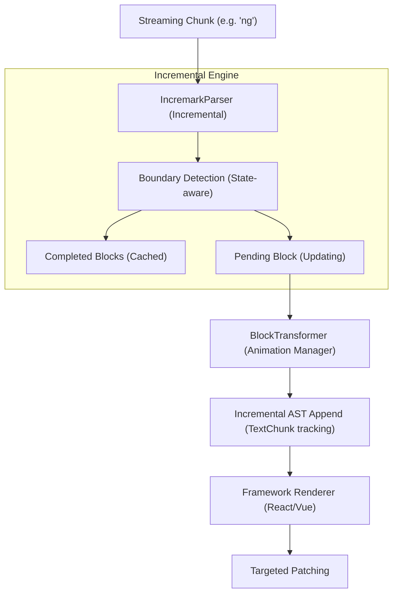

*   **Key Advantage**: Only parses what is new or unstable. Animation happens at the AST node level, avoiding re-traversal of stable nodes. Performance is **O(N)**.

---

### 2. Ant Design X (`x-markdown`)

**Strategy: Regex Repair + Full Re-parsing (Marked)**

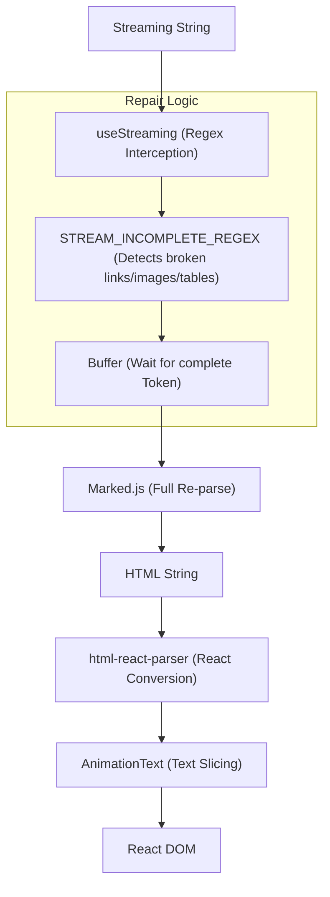

*   **Key Advantage**: Robust visual state patching via regex. However, it requires a full re-parse of the entire accumulated string on every update. Performance is **O(N²)**.

---

### 3. MarkStream Vue

**Strategy: Full Re-parsing + Virtualized/Batched Rendering (markdown-it)**

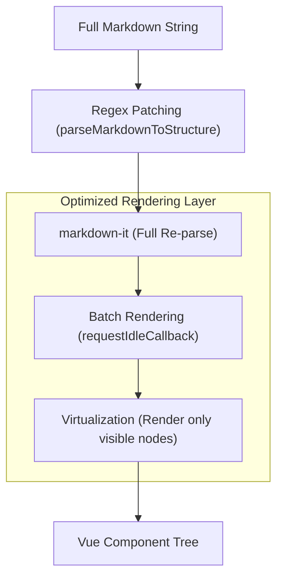

*   **Key Advantage**: Accepts the cost of re-parsing but optimizes the DOM layer via virtualization and idling batch updates. Perfect for viewing extremely large history or static documents.

---

## Technical Comparison Matrix

| Dimension | Ant Design X (epx) | MarkStream Vue (epx2) | Incremark (core) |
| :--- | :--- | :--- | :--- |
| **Parsing Engine** | `marked` | `markdown-it` | **Dual-Engine: `marked` (default) + `micromark`** |
| **Parsing Strategy** | Full Re-parse | Full Re-parse | **Incremental Parsing** |
| **Parsing Complexity** | O(N²) | O(N²) | **O(N)** |
| **Boundary Handling** | **Regex Interception** | **Regex Patching** | **State-based Boundary Detection** |
| **Typewriter Effect** | Text Layer (String slicing) | Component Layer (`<transition>`) | **AST Node Layer** (Incremental Append) |
| **Animation Perf** | Degrades with content length | O(1) per mounting | **Constant CPU usage per tick** |
| **Big Doc Optimization** | None | **Virtualization + Batching** | **Stable IDs + Selective Rendering** |
| **Plugin Ecosystem** | Limited | markdown-it plugins | **micromark + mdast + marked extensions** |
| **Framework Support** | React | Vue | **Vue + React + Svelte (Shared Core)** |

---

## Deep Dive

### 1. Incremental vs Full Parsing
For a 10,000-character document with 10 new characters added:
- **Full Parsing**: The parser must scan all 10,010 characters. Processing time grows exponentially with conversation length.
- **Incremental Parsing**: `IncremarkParser` identifies the first 10,000 characters as belonging to "stable blocks" and only performs limited contextual analysis on the new 10 characters.

### 2. Animation Precision
- **Text Layer (Ant Design X)**: The animator doesn't know if a character belongs to a heading or a code block; it just slices a string. This can cause structural "jumping" during high-frequency updates.
- **Component Layer (MarkStream Vue)**: Animation is often restricted to paragraph or block-level fade-ins, making it hard to achieve a smooth, character-by-character "typewriter" feel.
- **AST Layer (Incremark)**: `BlockTransformer` is aware of the AST structure. It knows exactly where the new text nodes are. By maintaining a `TextChunk` queue within nodes, it enables smooth character-level animation while maintaining structural integrity (e.g., ensuring a `**bold**` block never crashes the renderer mid-animation).

---

## Conclusion & Best Use Cases

### **Ant Design X** (The Design System Choice)
*   **Best For**: Rapidly building AI chat interfaces for web applications already using Ant Design. Its regex repair strategy is very reliable for common Markdown edge cases in shorter chats.

### **MarkStream Vue** (The Document Viewer)
*   **Best For**: Vue applications that need to display extremely large AI responses or long-form documents where virtualization (scrolling performance) is the priority.

### **Incremark** (The High-Performance Standard)
*   **Best For**: Corporate-grade AI applications with long context windows (100k+ tokens), multi-framework teams, or any scenario where the smoothest possible "human-like" typing animation is required without sacrificing battery life or performance.

---

## Benchmark Results

We conducted extensive benchmarks across 38 real-world markdown documents (6,484 lines, 128.55 KB total).

> 📊 See the [complete benchmark data](/advanced/engines#complete-benchmark-data) for detailed results of all 38 test files.

### Overall Performance (Averages)

| Comparison | Average Advantage |
|------------|-------------------|
| vs Streamdown | ~**6.1x faster** |
| vs ant-design-x | ~**7.2x faster** |
| vs markstream-vue | ~**28.3x faster** |

> ⚠️ These are averages across all test scenarios. Individual performance varies by content type.

### Scaling with Document Size

The larger the document, the greater Incremark's advantage — O(n) vs O(n²):

| File | Lines | Size | Incremark | ant-design-x | Advantage |
|------|-------|------|-----------|--------------|-----------|
| introduction.md | 34 | 1.57 KB | 5.6 ms | 12.8 ms | **2.3x** |
| comparison.md | 109 | 5.39 KB | 20.5 ms | 85.2 ms | **4.1x** |
| BLOCK_TRANSFORMER.md | 489 | 9.24 KB | 75.7 ms | 619.9 ms | **8.2x** |
| test-md-01.md | 916 | 17.67 KB | 87.7 ms | 1656.9 ms | **18.9x** 🚀 |

### Understanding Performance Differences

#### Why Incremark is Sometimes "Slower" vs Streamdown

In some benchmarks, Incremark appears slower than Streamdown:

| File | Incremark | Streamdown | Reason |
|------|-----------|------------|--------|
| footnotes.md | 1.7 ms | 0.2 ms | Streamdown **doesn't support footnotes** |
| FOOTNOTE_FIX_SUMMARY.md | 22.7 ms | 0.5 ms | Same — skips footnote parsing |

**This is a feature difference, not a performance issue:**
- Streamdown skips unsupported syntax → appears faster
- Incremark fully parses footnotes, math, containers → does more work

#### Incremark's Enhanced Features

Incremark extends Marked with custom extensions that Streamdown doesn't support:

| Feature | Incremark | Streamdown |
|---------|-----------|------------|
| **Footnotes** | ✅ Full GFM footnotes | ❌ Not supported |
| **Math Blocks** | ✅ `$...$` and `$$...$$` | ⚠️ Partial |
| **Custom Containers** | ✅ `:::tip`, `:::warning` | ❌ Not supported |
| **Inline HTML Parsing** | ✅ Full HTML tree | ⚠️ Basic |

#### Where Incremark Truly Shines

For standard markdown (no footnotes), Incremark consistently outperforms:

| File | Lines | Incremark | Streamdown | vs Streamdown |
|------|-------|-----------|------------|---------------|
| concepts.md | 91 | 12.0 ms | 50.5 ms | **4.2x** |
| complex-html-examples.md | 147 | 9.0 ms | 58.8 ms | **6.6x** |
| OPTIMIZATION_SUMMARY.md | 391 | 19.1 ms | 208.4 ms | **10.9x** |
| test-md-01.md | 916 | 87.7 ms | 1441.1 ms | **16.4x** |

### Why Incremark Excels

1. **Incremental Parsing O(n)**: Each append only processes new content
2. **Linear Scaling**: Advantage grows with document size
3. **Streaming-Optimized**: Microsecond-level chunk processing
4. **Feature-Rich**: Supports footnotes, math, containers without sacrificing speed

### Ideal Use Cases

✅ **Incremark shines in:**
- AI chat with streaming output (Claude, ChatGPT, etc.)
- Real-time markdown editors
- Large document incremental rendering
- Long-running conversations with 100k+ tokens
- Content requiring footnotes, math, or custom containers

⚠️ **Consider alternatives for:**
- One-time static markdown rendering
- Very small files (<500 characters)


================================================
FILE: docs/guide/concepts.md
================================================
# Core Concepts

Understanding how Incremark works will help you build high-performance, flicker-free AI chat applications.

## Dual-Engine Architecture

Incremark supports two parsing engines, allowing you to choose based on your needs:

| Engine | Characteristics | Best For |
|--------|----------------|----------|
| **marked** (default) | Extremely fast, streaming-optimized | Real-time AI chat, performance-critical scenarios |
| **micromark** | CommonMark compliant, rich plugin ecosystem | Complex extensions, strict spec compliance |

Both engines share the same incremental parsing layer and produce identical mdast output, ensuring consistent behavior regardless of which engine you choose.

## Incremental Parsing Flow

Traditional Markdown parsers (like `marked` or `markdown-it`) are designed for static documents. In a streaming context, they must re-parse the entire document from scratch every time a new character is received.

**Incremark** employs a completely different "Incremental Parsing" strategy:

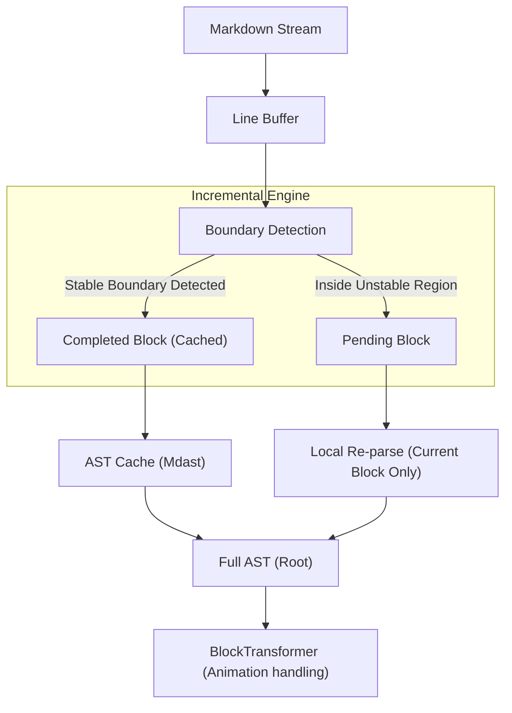

## Block Lifecycle

In Incremark, every top-level element (heading, paragraph, code block, etc.) is treated as an independent **Block**. They go through a lifecycle from "uncertain" to "stable":

| State | Description | Handling Strategy |
| :--- | :--- | :--- |
| **Pending** | Currently streaming; content and type may change at any time. | Every time new content arrives, a micro-parse is performed only on the text segment for this block. |
| **Completed** | Confirmed as finished; subsequent input will not affect this block. | **Persistent Cache**. Unless the stream is reset, it is no longer involved in parsing or re-rendering. |

> [!TIP]
> **Why do we need a Pending state?**
> In Markdown, the prefix determines the type. For example, when `#` is input, it could be a heading or just text. The type is only truly determined when a space or newline is received.

## Boundary Detection Rules

Incremark uses heuristic rules to determine when a block can transition from `Pending` to `Completed`:

### 1. Simple Block Boundaries
*   **Empty Line**: The natural end of a paragraph.
*   **New Heading / Thematic Break**: The appearance of a new block implies the end of the previous non-container block.

### 2. Fenced Block Boundaries
*   **Code Block (```)**: Must detect a matching closing fence. Until the closing fence appears, the entire code block remains `Pending`.
*   **Custom Container (:::)**: Same as above; supports nested detection.

### 3. Nested Block Boundaries
*   **Lists and Blockquotes**: The parser continuously tracks the current indentation level and blockquote depth. When a new line's indentation retreats or the quote marker disappears, the previous block is determined to be finished.

## Context Tracking

To accurately identify boundaries during the streaming process, the parser maintains a lightweight state machine:

```ts
interface BlockContext {
  inFencedCode: boolean;     // Processing a code block
  inContainer: boolean;      // Processing a custom container
  listStack: ListInfo[];     // Tracking nested list state
  blockquoteDepth: number;   // Tracking blockquote depth
}
```

## Performance Analysis

Thanks to the incremental mechanism, Incremark's performance is almost independent of the total document length and only linearly related to the current chunk size.

| Dimension | Traditional Full Parsing | Incremark Incremental Parsing |
| :--- | :--- | :--- |
| **Incremental Complexity** | O(N) | **O(K)** |
| **Total Parsing Complexity** | O(N²) | **O(N)** |
| **Memory Overhead** | High (Repeated object creation) | **Low (Incremental AST reuse)** |
| **UI Responsiveness** | Performance degrades as N grows | **Maintains 60fps smooth performance** |

*Note: N is total document length, K is current chunk size.*

## Typewriter Effect (BlockTransformer)

After the AST is parsed, the `BlockTransformer` acts as a filtering layer before rendering. It converts the "instant results" of parsing into a "progressive process":

1.  **Node Tracking**: Keeps track of which characters have already been "played."
2.  **TextChunk Wrapping**: Wraps newly added text nodes into `TextChunk`, allowing the rendering layer to implement fade-in animations.
3.  **Smart Skipping**: It can strategically skip animations if the user requests immediate display or for non-text nodes (like images).


================================================
FILE: docs/guide/introduction.md
================================================
# Introduction

**Incremark** is a markdown renderer designed for the AI era. It prioritizes **streaming performance**, **incremental updates**, and **smooth visual effects**.

## Why Incremark?

With the rise of LLMs (Large Language Models), applications are increasingly displaying streaming text. Traditional markdown parsers were built for static documents, not for text that updates 50 times a second.

This mismatch leads to:
- High CPU usage on long responses.
- Janky scrolling and rendering.
- Difficulty implementing "Typewriter" effects without breaking markdown syntax.

**Incremark** rethinks markdown rendering as a stream processing problem.

## Key Features

- ⚡️ **Extreme Performance**: Average ~6x faster than Streamdown, ~7x faster than ant-design-x, ~28x faster than markstream-vue.
- 🔄 **Dual-Engine Architecture**: Marked with enhanced extensions for speed, or Micromark for strict CommonMark compliance.
- 🚀 **O(n) Incremental Parsing**: Only parse what's new — 18KB document is 19x faster than traditional parsers.
- ⌨️ **Built-in Typewriter**: Smooth character-by-character reveals that respect markdown structure.
- 🧩 **Framework Agnostic**: Core logic is shared; connectors for Vue, React, and Svelte.
- 🎨 **Themable**: Tailored for modern, dark-mode-first interfaces.
- 🛠 **DevTools**: Inspect the parsing process in real-time.

## Ready to Start?

Check out the [Quick Start](/guide/quick-start) to integrate it into your app in minutes.

## AI Friendliness

Incremark is designed for AI, and our documentation is too. We provide structured versions of our docs for better ingestion by LLMs:
- [llms.txt](/llms.txt): A concise index of our documentation.
- [llms-full.txt](/llms-full.txt): The entire documentation in a single file, perfect for providing context to Claude, Cursor, or ChatGPT.


================================================
FILE: docs/guide/quick-start.md
================================================
# Quick Start

Get up and running with specific framework integration in 5 minutes.

## Installation

::: code-group
```bash [pnpm]
pnpm add @incremark/vue @incremark/theme
# OR
pnpm add @incremark/react @incremark/theme
# OR
pnpm add @incremark/svelte @incremark/theme
# OR
pnpm add @incremark/solid @incremark/theme
```

```bash [npm]
npm install @incremark/vue @incremark/theme
# OR
npm install @incremark/react @incremark/theme
# OR
npm install @incremark/svelte @incremark/theme
# OR
npm install @incremark/solid @incremark/theme
```

```bash [yarn]
yarn add @incremark/vue @incremark/theme
# OR
yarn add @incremark/react @incremark/theme
# OR
yarn add @incremark/svelte @incremark/theme
# OR
yarn add @incremark/solid @incremark/theme
```
:::

## Basic Usage

::: code-group
```vue [Vue]
<script setup>
import { ref } from 'vue'
import { IncremarkContent } from '@incremark/vue'
import '@incremark/theme/styles.css' // [!code hl]

const content = ref('')
const isFinished = ref(false)

async function simulateStream() {
  content.value = ''
  isFinished.value = false

  const text = '# Hello\n\nThis is **Incremark**!'
  for (const chunk of text.match(/[\s\S]{1,5}/g) || []) {
    content.value += chunk
    await new Promise(r => setTimeout(r, 50))
  }
  isFinished.value = true
}
</script>

<template>
  <button @click="simulateStream">Start</button>
  <IncremarkContent :content="content" :is-finished="isFinished" />
</template>
```

```tsx [React]
import { useState } from 'react'
import { IncremarkContent } from '@incremark/react'
import '@incremark/theme/styles.css' // [!code hl]

function App() {
  const [content, setContent] = useState('')
  const [isFinished, setIsFinished] = useState(false)

  async function simulateStream() {
    setContent('')
    setIsFinished(false)

    const text = '# Hello\n\nThis is **Incremark**!'
    const chunks = text.match(/[\s\S]{1,5}/g) || []
    for (const chunk of chunks) {
      setContent(prev => prev + chunk)
      await new Promise(r => setTimeout(r, 50))
    }
    setIsFinished(true)
  }

  return (
    <>
      <button onClick={simulateStream}>Start</button>
      <IncremarkContent content={content} isFinished={isFinished} />
    </>
  )
}
```

```svelte [Svelte]
<script lang="ts">
  import { IncremarkContent } from '@incremark/svelte'
  import '@incremark/theme/styles.css' // [!code hl]

  let content = $state('')
  let isFinished = $state(false)

  async function simulateStream() {
    content = ''
    isFinished = false

    const text = '# Hello\n\nThis is **Incremark**!'
    for (const chunk of text.match(/[\s\S]{1,5}/g) || []) {
      content += chunk
      await new Promise(r => setTimeout(r, 50))
    }
    isFinished = true
  }
</script>

<button onclick={simulateStream}>Start</button>
<IncremarkContent {content} {isFinished} />
```

```tsx [Solid]
import { createSignal } from 'solid-js'
import { IncremarkContent } from '@incremark/solid'
import '@incremark/theme/styles.css' // [!code hl]

function App() {
  const [content, setContent] = createSignal('')
  const [isFinished, setIsFinished] = createSignal(false)

  async function simulateStream() {
    setContent('')
    setIsFinished(false)

    const text = '# Hello\n\nThis is **Incremark**!'
    const chunks = text.match(/[\s\S]{1,5}/g) || []
    for (const chunk of chunks) {
      setContent(prev => prev + chunk)
      await new Promise(r => setTimeout(r, 50))
    }
    setIsFinished(true)
  }

  return (
    <>
      <button onClick={simulateStream}>Start</button>
      <IncremarkContent content={content()} isFinished={isFinished()} />
    </>
  )
}
```
:::

## Using Stream Mode

```vue
<script setup>
import { IncremarkContent } from '@incremark/vue'

async function* fetchAIStream() {
  const res = await fetch('/api/chat', { method: 'POST' })
  const reader = res.body!.getReader()
  const decoder = new TextDecoder()

  while (true) {
    const { done, value } = await reader.read()
    if (done) break
    yield decoder.decode(value)
  }
}
</script>

<template>
  <IncremarkContent :stream="fetchAIStream" />
</template>
```

## Math Formulas (Optional)

If you need to support math formulas (KaTeX), make sure to also import the KaTeX CSS:

```ts
import 'katex/dist/katex.min.css'
```


================================================
FILE: docs/guide/why-incremark.md
================================================
# Why Incremark?

In the age of Large Language Models, displaying AI-generated content has become one of the most common requirements in web development. You might wonder: there are already so many Markdown rendering libraries out there — why do we need another one?

This article will answer that question honestly.

## The Problem We're Solving

### AI Output is Getting Longer

If you've been following AI trends, you'll notice a clear pattern:

- **2022**: GPT-3.5 responses were typically a few hundred words
- **2023**: GPT-4 responses could reach 2,000-4,000 words
- **2024-2025**: Reasoning models like OpenAI o1 and DeepSeek R1 output "thinking processes" that can exceed 10,000+ words

Single conversation token counts are moving from 4K toward 32K, even 128K.

**The challenge**: For frontend developers, rendering 500 words versus 50,000 words of Markdown are completely different problems.

### Traditional Parsers Can't Keep Up

Here's what happens when you use traditional Markdown parsers with streaming AI output:

```
Chunk 1: Parse 100 characters ✓
Chunk 2: Parse 200 characters (100 old + 100 new)
Chunk 3: Parse 300 characters (200 old + 100 new)
...
Chunk 100: Parse 10,000 characters 😰
```

Every time a new chunk arrives, the entire document gets re-parsed. This is **O(n²) complexity**.

For a 20KB document, this means:
- **ant-design-x**: 1,657 ms total parsing time
- **markstream-vue**: 5,755 ms (almost 6 seconds!)
- **Incremark**: 88 ms ✨

**The difference is not 2x or 3x — it's 19x to 65x.**

## Why Incremark is Different

### 1. True Incremental Parsing

Incremark doesn't just "optimize" the traditional approach — it fundamentally rethinks how streaming Markdown should work.

```
Chunk 1: Parse 100 chars → cache stable blocks
Chunk 2: Parse only ~100 new chars (previous cached)
Chunk 3: Parse only ~100 new chars (previous cached)
...
Chunk 100: Parse only ~100 new chars
```

This is **O(n) complexity**. The larger your document, the greater our advantage.

### 2. Dual-Engine Architecture

We understand that different scenarios have different needs:

| Engine | Speed | Best For |
|--------|-------|----------|
| **Marked** (Default) | ⚡⚡⚡⚡⚡ | Real-time streaming, AI chat |
| **Micromark** | ⚡⚡⚡ | Complex documents, strict CommonMark compliance |

You can switch engines with a single configuration option.

### 3. Enhanced Features Out of the Box

Native Marked doesn't support footnotes, math, or custom containers. We've added these through carefully designed extensions:

- ✅ **Footnotes**: Full GFM footnote support (`[^1]`)
- ✅ **Math Blocks**: Inline (`$...$`) and block (`$$...$$`) formulas
- ✅ **Custom Containers**: `:::tip`, `:::warning`, `:::danger`
- ✅ **HTML Parsing**: Structured HTML tree parsing
- ✅ **Optimistic References**: Graceful handling of incomplete links during streaming

### 4. Framework Agnostic

We provide first-class support for all major frameworks:

```bash
# Vue
pnpm add @incremark/core @incremark/vue

# React
pnpm add @incremark/core @incremark/react

# Svelte
pnpm add @incremark/core @incremark/svelte
```

One core library, consistent APIs, identical features across frameworks.

## Honest Performance Comparison

We believe in transparency. Here are our actual benchmark results across 38 test files:

### Overall Averages

| vs Competitor | Average Advantage |
|---------------|-------------------|
| vs Streamdown | ~**6.1x faster** |
| vs ant-design-x | ~**7.2x faster** |
| vs markstream-vue | ~**28.3x faster** |

### Where We're Not Faster

We won't hide this: in some benchmarks, Incremark appears slower than Streamdown:

| File | Incremark | Streamdown | Why |
|------|-----------|------------|-----|
| footnotes.md | 1.7 ms | 0.2 ms | Streamdown doesn't support footnotes |
| FOOTNOTE_FIX_SUMMARY.md | 22.7 ms | 0.5 ms | Same — skips footnote parsing |

**This isn't a performance issue — it's a feature difference.** We chose to fully implement footnotes because they matter for AI content.

### Where We Truly Excel

For standard Markdown content, our advantage is clear:

| File | Lines | Incremark | ant-design-x | Advantage |
|------|-------|-----------|--------------|-----------|
| concepts.md | 91 | 12.0 ms | 53.6 ms | **4.5x** |
| OPTIMIZATION_SUMMARY.md | 391 | 19.1 ms | 217.8 ms | **11.4x** |
| test-md-01.md | 916 | 87.7 ms | 1656.9 ms | **18.9x** |

**The larger the document, the greater our advantage.**

## Who Should Use Incremark?

### ✅ Perfect For

- **AI Chat Applications**: Claude, ChatGPT, custom LLM interfaces
- **Long-Form AI Content**: Reasoning models, code generation, document analysis
- **Real-Time Editors**: Collaborative Markdown editing
- **Enterprise RAG Systems**: Knowledge bases with large document rendering
- **Multi-Framework Teams**: Consistent behavior across Vue, React, and Svelte

### ⚠️ Consider Alternatives For

- **Static Site Generation**: If you're pre-rendering Markdown at build time, simpler libraries work fine
- **Very Short Content**: For content under 500 characters, the performance difference is negligible

## The Bigger Picture

We're not just building a library — we're preparing for the future of AI interfaces.

### The Trend is Clear

- AI output is getting longer (reasoning models, chain-of-thought)
- Streaming is becoming the default (better UX, lower latency)
- Users expect instant feedback (no loading spinners, no jank)

Traditional O(n²) parsers simply can't scale to this future. Incremark's O(n) architecture is built for it.

### Our Commitment

We're committed to:
- **Performance**: Continuously optimizing both engines
- **Features**: Adding new syntax support as needed
- **Stability**: Thorough testing and careful versioning
- **Documentation**: AI-friendly docs (see our `llms.txt`)

## Getting Started

Ready to try it? It takes less than 5 minutes:

```bash
pnpm add @incremark/core @incremark/vue
```

```vue
<script setup>
import { ref } from 'vue'
import { IncremarkContent } from '@incremark/vue'

const content = ref('')
const isFinished = ref(false)

// Handle AI streaming output
async function handleStream(stream) {
  content.value = ''
  isFinished.value = false
  
  for await (const chunk of stream) {
    content.value += chunk
  }
  
  isFinished.value = true
}
</script>

<template>
  <IncremarkContent 
    :content="content" 
    :is-finished="isFinished"
    :incremark-options="{ gfm: true, math: true }"
  />
</template>
```

That's it. Your AI chat just got 19x faster.

---

## FAQ

### Q: Is Incremark production-ready?

Yes. The core parsing engine has been extensively tested with real-world AI content, including edge cases like incomplete code blocks, nested lists, and complex footnotes.

### Q: Will WebAssembly-based parsers make Incremark obsolete?

This is a valid concern. Rust-based Wasm parsers (like `pulldown-cmark`) could theoretically be faster. However:

1. Wasm-JS interop has overhead (especially for string passing)
2. Incremental parsing is hard to implement in Wasm
3. 88ms for a 20KB document is already imperceptible to humans

As long as we maintain our current performance level, Wasm isn't a threat.

### Q: How does Incremark compare to `react-markdown`?

`react-markdown` is designed for static documents, not streaming. It re-renders the entire component tree on every update, causing severe performance issues with AI streaming. Incremark only updates what changed.

### Q: Can I customize the rendering?

Absolutely. All three framework packages support custom components:

```vue
<IncremarkContent 
  :content="content" 
  :is-finished="isFinished"
  :custom-code-blocks="{ echarts: MyEchartsCodeBlock }"
  :custom-containers="{ warning: MyWarningContainer }"
  :components="{ heading: MyCustomHeading }"
/>
```

---

We built Incremark because we needed it ourselves. We hope it helps you build better AI experiences.

Questions? Issues? [Open a GitHub issue](https://github.com/kingshuaishuai/incremark/issues) or check our [documentation](/).


================================================
FILE: docs/zh/index.md
================================================
[Binary file]


================================================
FILE: docs/zh/roadmap.md
================================================
# 🗺️ 路线图

我们未来的计划专注于增强库的能力，以构建现代、无障碍且高性能的 AI 聊天界面。

## ✨ 已完成

### 🏗️ 核心引擎
- [x] **BlockTransformer**: 跨框架打字机效果实现，确保渲染一致性。
- [x] **语法完善**: 修复边界情况解析与渲染，增加更完善的 commonmark 测试用例。
- [x] **增量解析**: 实现 O(N) 性能的状态感知解析引擎。
- [x] **双引擎架构**: 支持 `marked`（极速流式优化）和 `micromark`（稳定 CommonMark 兼容）双引擎，支持 tree-shaking 优化。
- [x] **Micromark 增强**: 提升 HTML 解析能力与稳定性。
- [x] **Marked 增强**: 为 `marked` 扩展脚注、数学公式、自定义容器、内联 HTML 解析等功能。

### 🎨 设计系统与主题
- [x] **@incremark/theme**: 统一各组件库样式，支持 DesignToken，并拆分为独立子包。
- [x] **ThemeProvider**: 统一的样式上下文管理组件。
- [x] **主题组件支持**: 内置多种 Markdown 块级主题组件。

###  Bento 组件库
- [x] **@incremark/vue**: 完整的 Vue 组件集成。
- [x] **@incremark/react**: 完整的 React 组件集成。
- [x] **@incremark/svelte**: 完整的 Svelte 组件集成。
- [x] **@incremark/solid**: 完整的 Solid 组件集成。
- [x] **IncremarkContent**: 简单易用的声明式入口组件。

### 🔌 功能与扩展
- [x] **GFM 支持**: 支持 GFM 语法。
- [x] **Mermaid 支持**: 支持在 Markdown 中嵌入 Mermaid 图表。
- [x] **Math 支持**: 支持在 Markdown 中嵌入 Math 公式。
- [x] **自定义组件**: 支持自定义 Markdown 渲染组件。
- [x] **自定义代码块**: 支持全接管或完成时渲染接管。
- [x] **自定义容器**: 支持 `:::` 容器块语法。
- [x] **脚注支持**: 完整的 Markdown 脚注功能。
- [x] **HTML 解析**: 支持在 Markdown 中嵌入 HTML 标签。

---

## 🚀 即将进行

### 🛠️ Markdown 与工具
- [x] **Code 组件重构**: 解耦 Mermaid 与默认渲染器，提升定制化能力。
- [x] **devtools 重构**: 使用 Svelte 重构开发工具，支持国际化（中英文）、多解析器监控、框架无关设计，提升开发体验。
- [x] **sliceAST 优化**: 简化代码结构，移除死代码；按 block 处理确保性能。
- [x] **i18n 国际化**: 内置多语言支持，提供 ConfigProvider 全局配置。
- [x] **a11y 无障碍**: 完善屏幕阅读器支持与 ARIA 规范。
- [x] **SSR 支持**: 针对 Nuxt/Next.js 的服务端渲染优化。

### ⚡ 性能优化
- [x] **Shiki Stream 优化**: 优化各框架流式代码高亮性能。
- [x] **Block 组件渲染优化**: 优化块级组件渲染性能，减少不必要的重新渲染。

### 🏗️ 大计划: 基于增量渲染的 chat-ui 组件库
利用 Incremark 引擎打造的一套开箱即用的 AI 聊天 UI 组件。

- [ ] **@incremark/chat-core**: 消息管理逻辑层，支持 A2UI 协议及主流 SDK 适配。
- [ ] **@incremark/chat-vue**: 基于 Vue 的高阶聊天组件。
  - [ ] **UI 适配器**: 优先适配 `element-plus` 和 `shadcn-vue`。
- [ ] **@incremark/chat-react**: 基于 React 的高阶聊天组件。
- [ ] **@incremark/chat-svelte**: 基于 Svelte 的高阶聊天组件。

---

### 🔌 插件系统
- [x] **Micromark 扩展**: 完整支持 `micromark` 语法扩展。
- [x] **mdast 扩展**: 完整支持 `mdast-util-from-markdown` AST 扩展。
- [x] **Marked 扩展**: 为 `marked` 引擎提供自定义 Token 转换器。

---

## 🔮 长期研究
- [ ] **协作编辑**: 1. 基于 micromark 的 tiptap markdown 解析方案， 2. 基于 incremark 的增量追加方案。


================================================
FILE: docs/zh/advanced/architecture.md
================================================
# 架构原理

本文档解释 Incremark 的内部架构，帮助你理解库是如何实现高性能流式 Markdown 渲染的。

## 整体架构

```
┌─────────────────────────────────────────────────────────────────┐
│                      IncremarkContent                           │
│  (声明式组件，处理 content/stream 输入)                          │
└─────────────────────────────────────────────────────────────────┘
                              ↓
┌─────────────────────────────────────────────────────────────────┐
│                       useIncremark                              │
│  (状态管理，响应式封装，打字机协调)                               │
└─────────────────────────────────────────────────────────────────┘
                              ↓
┌─────────────────────────────────────────────────────────────────┐
│                      IncremarkParser                            │
│  ┌─────────────────────────────────────────────────────────┐   │
│  │              双引擎 AST 构建器                            │   │
│  │  ┌──────────────────┐    ┌──────────────────┐           │   │
│  │  │  MarkedAstBuilder│    │MicromarkAstBuilder│          │   │
│  │  │  (默认，极速)     │    │ (稳定，严格)      │           │   │
│  │  └──────────────────┘    └──────────────────┘           │   │
│  └─────────────────────────────────────────────────────────┘   │
│  ┌───────────────┐  ┌───────────────┐  ┌───────────────┐       │
│  │    边界       │  │    定义       │  │    脚注       │       │
│  │   检测器      │  │   管理器      │  │   管理器      │       │
│  └───────────────┘  └───────────────┘  └───────────────┘       │
└─────────────────────────────────────────────────────────────────┘
                              ↓
┌─────────────────────────────────────────────────────────────────┐
│                     BlockTransformer                            │
│  (打字机效果，字符级增量渲染)                                     │
│  ┌───────────────┐  ┌───────────────┐  ┌───────────────┐       │
│  │    插件       │  │    Chunk      │  │   TextChunk   │       │
│  │    系统       │  │    动画       │  │    追踪       │       │
│  └───────────────┘  └───────────────┘  └───────────────┘       │
└─────────────────────────────────────────────────────────────────┘
                              ↓
┌─────────────────────────────────────────────────────────────────┐
│                        渲染器                                    │
│  ┌──────────────┐  ┌──────────────┐  ┌──────────────┐          │
│  │     Vue      │  │    React     │  │    Svelte    │          │
│  │    组件库     │  │    组件库     │  │    组件库    │          │
│  └──────────────┘  └──────────────┘  └──────────────┘          │
└─────────────────────────────────────────────────────────────────┘
```

## 双引擎架构

Incremark 支持两种解析引擎，通过注入不同的 AstBuilder 实现切换（支持 tree-shaking）：

### MarkedAstBuilder（默认）

`marked` 引擎针对流式性能进行了优化：

- **速度**：极速的词法分析，非常适合实时 AI 聊天
- **扩展**：自定义扩展支持脚注、数学公式、容器、内联 HTML
- **权衡**：CommonMark 兼容性略低

```ts
// 内部实现: packages/core/src/parser/ast/MarkedAstBuildter.ts
class MarkedAstBuilder implements IAstBuilder {
  // 自定义 marked 扩展
  private extensions = [
    createFootnoteDefinitionExtension(),
    createBlockMathExtension(),
    createInlineMathExtension(),
    createContainerExtension(),
    createInlineHtmlExtension()
  ]
}
```

### MicromarkAstBuilder

`micromark` 引擎优先考虑正确性和可扩展性：

- **兼容性**：严格遵循 CommonMark 规范
- **生态**：完整的 micromark/mdast 插件生态
- **权衡**：解析开销略高

```ts
// 内部实现: packages/core/src/parser/ast/MicromarkAstBuilder.ts
class MicromarkAstBuilder implements IAstBuilder {
  // 使用 mdast-util-from-markdown 配合 micromark 扩展
}
```

### 引擎选择

两个引擎产生相同的 mdast 输出，确保渲染一致性：

```ts
// 默认使用 marked（极速模式）
const parser = new IncremarkParser({ gfm: true, math: true })

// 使用 micromark（需要单独导入）
import { MicromarkAstBuilder } from '@incremark/core/engines/micromark'
const parser = new IncremarkParser({
  astBuilder: MicromarkAstBuilder,
  gfm: true,
  math: true
})
```

## 核心组件

### IncremarkParser

管理增量解析流程的核心协调器：

| 组件 | 职责 |
|------|------|
| **BoundaryDetector** | 识别稳定边界（空行、新标题）以提交已完成的块 |
| **AstBuilder** | 使用选定引擎从 markdown 文本构建 mdast 节点 |
| **DefinitionManager** | 跟踪文档中的链接/图片定义 |
| **FootnoteManager** | 管理脚注定义和引用 |

### BlockTransformer

处理打字机动画层：

| 组件 | 职责 |
|------|------|
| **Plugins System** | 可扩展的插件架构，支持自定义行为 |
| **Chunk Animation** | 管理待动画的文本块队列 |
| **TextChunk Tracking** | 追踪哪些字符已经"播放"，实现平滑动画 |

### 渲染器

框架特定的渲染组件：

- **Vue**: `@incremark/vue` - 使用 Vue 3.5 Composition API
- **React**: `@incremark/react` - 使用 React 18 hooks
- **Svelte**: `@incremark/svelte` - 使用 Svelte 5 runes

所有渲染器共享相同的核心逻辑，产生相同的 DOM 输出。

## 数据流

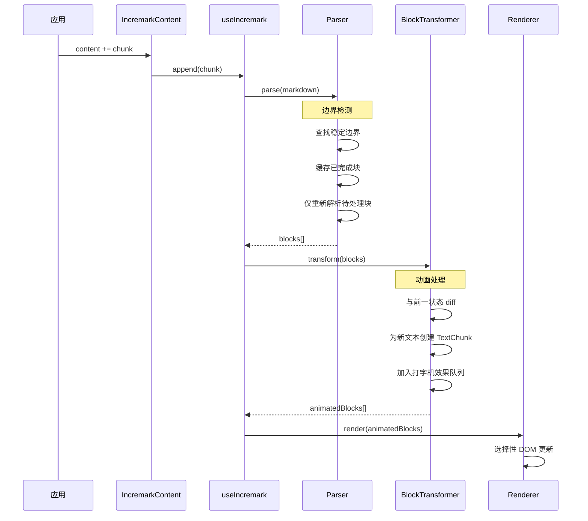

## 性能优化

### 1. 增量行解析

仅解析新行；已完成的块被缓存：

```ts
// 简化概念
if (line.isNewlyAdded) {
  parse(line)
} else if (block.isCompleted) {
  return cachedAST[block.id]
}
```

### 2. 稳定块 ID

每个块获得一个稳定的 ID，实现高效的 React/Vue 协调：

```ts
interface Block {
  id: string      // 跨更新保持稳定
  node: RootContent
  status: 'pending' | 'completed'
}
```

### 3. AST 增量追加

新节点被追加到现有树中，无需重建：

```ts
// 不是: root = parse(entireMarkdown)
// 而是:
existingRoot.children.push(...newNodes)
```

### 4. 上下文缓存

解析器状态在 chunk 之间保留，实现高效恢复：

```ts
interface ParserContext {
  inFencedCode: boolean
  inContainer: boolean
  listStack: ListInfo[]
  blockquoteDepth: number
}
```

## 扩展点

Incremark 提供多个扩展点：

| 层级 | 扩展类型 | 示例 |
|------|---------|------|
| **解析器** | micromark 扩展 | 自定义语法 |
| **解析器** | mdast 扩展 | 自定义 AST 节点 |
| **解析器** | marked 转换器 | 自定义 token 处理 |
| **渲染器** | 自定义组件 | 替换标题渲染 |
| **渲染器** | 自定义代码块 | Echarts, Mermaid |
| **渲染器** | 自定义容器 | Warning, Info 框 |

详细文档请参阅[扩展功能](/zh/advanced/extensions)。


================================================
FILE: docs/zh/advanced/benchmark.md
================================================
[Binary file]


================================================
FILE: docs/zh/advanced/engines.md
================================================
[Binary file]


================================================
FILE: docs/zh/advanced/extensions.md
================================================
# 扩展功能

Incremark 的双引擎架构为 `micromark` 和 `marked` 引擎提供了灵活的扩展机制。

## 引擎选择

根据你的扩展需求选择合适的引擎：

| 引擎 | 扩展类型 | 适用场景 |
|------|---------|---------|
| `micromark` | micromark + mdast 扩展 | 丰富的生态，CommonMark 兼容 |
| `marked` | 自定义 Token 转换器 | 极致性能，简单扩展 |

## Micromark 扩展

使用 `micromark` 引擎时，可以利用丰富的现有扩展生态。

### 语法扩展

使用 `micromark` 扩展支持新语法：

```vue
<script setup>
import { ref } from 'vue'
import { IncremarkContent } from '@incremark/vue'
import { gfmTable } from 'micromark-extension-gfm-table'

const content = ref('')
const isFinished = ref(false)

// 注意：extensions 选项仅用于 micromark 引擎
// 需要配合 MicromarkAstBuilder 使用
import { MicromarkAstBuilder } from '@incremark/core/engines/micromark'

const parser = createIncremarkParser({
  astBuilder: MicromarkAstBuilder,
  extensions: [gfmTable()]
})
</script>

<template>
  <IncremarkContent 
    :content="content" 
    :is-finished="isFinished"
    :incremark-options="options" 
  />
</template>
```

### AST 扩展

使用 `mdast-util-from-markdown` 扩展将语法转换为 AST 节点：

```ts
import { gfmTableFromMarkdown } from 'mdast-util-gfm-table'

import { MicromarkAstBuilder } from '@incremark/core/engines/micromark'

const parser = createIncremarkParser({
  astBuilder: MicromarkAstBuilder,
  extensions: [gfmTable()],
  mdastExtensions: [gfmTableFromMarkdown()]
})
```

### 常用扩展包

| 包名 | 描述 |
|-----|------|
| `micromark-extension-gfm` | 完整 GFM 支持 |
| `micromark-extension-math` | 数学公式 |
| `micromark-extension-directive` | 自定义容器 |
| `micromark-extension-frontmatter` | YAML frontmatter |

## Marked 扩展

`marked` 引擎使用自定义扩展系统。Incremark 已经为 `marked` 扩展了以下功能：

- **脚注**: `[^1]` 引用和 `[^1]: content` 定义
- **数学公式**: `$inline$` 和 `$$block$$` 公式
- **自定义容器**: `:::type` 语法
- **内联 HTML**: 结构化 HTML 元素解析

### 自定义 Token 转换器

对于 `marked` 引擎，你可以提供自定义的 Token 转换器：

```ts
import type { BlockTokenTransformer, InlineTokenTransformer } from '@incremark/core'

// 自定义块级转换器
const myBlockTransformer: BlockTokenTransformer = (token, ctx) => {
  if (token.type === 'myCustomBlock') {
    return {
      type: 'paragraph',
      children: [{ type: 'text', value: token.raw }]
    }
  }
  return null
}

// 对于 marked 引擎（默认），使用 customBlockTransformers
const parser = createIncremarkParser({
  // marked 是默认引擎，无需指定 astBuilder
  customBlockTransformers: {
    myCustomBlock: myBlockTransformer
  }
})
```

### 内置转换器

你可以访问和扩展内置转换器：

```ts
import { 
  getBuiltinBlockTransformers, 
  getBuiltinInlineTransformers 
} from '@incremark/core'

// 获取所有内置转换器
const blockTransformers = getBuiltinBlockTransformers()
const inlineTransformers = getBuiltinInlineTransformers()

// 覆盖特定转换器
const customTransformers = {
  ...blockTransformers,
  code: (token, ctx) => {
    // 自定义代码块处理
    return { type: 'code', value: token.text, lang: token.lang }
  }
}
```

## UI 层扩展

除了解析器扩展，Incremark 还提供 UI 层的自定义能力：

### 自定义组件

替换任意节点类型的默认渲染：

```vue
<IncremarkContent 
  :content="content" 
  :is-finished="isFinished"
  :components="{ heading: MyCustomHeading }"
/>
```

### 自定义代码块

为特定语言的代码块使用自定义组件：

```vue
<IncremarkContent 
  :content="content" 
  :is-finished="isFinished"
  :custom-code-blocks="{ echarts: MyEchartsRenderer }"
  :code-block-configs="{ echarts: { takeOver: true } }"
/>
```

### 自定义容器

使用自定义组件渲染 `:::type` 容器：

```vue
<IncremarkContent 
  :content="content" 
  :is-finished="isFinished"
  :custom-containers="{ 
    warning: WarningBox,
    info: InfoBox,
    tip: TipBox 
  }"
/>
```

## 扩展最佳实践

1. **选择合适的引擎**: 复杂语法扩展使用 `micromark`，性能敏感场景使用 `marked`。

2. **利用现有包**: micromark 生态有很多经过充分测试的扩展。

3. **优先 UI 层扩展**: 对于视觉定制，优先使用 UI 层扩展（自定义组件）而非解析器扩展。

4. **充分测试**: 自定义扩展可能影响不同 Markdown 输入的解析行为。


================================================
FILE: docs/zh/api/index.md
================================================
# API 参考文档

Incremark 所有类型和组件的集中参考。

## 组件 (Components)

### `<IncremarkContent />`

渲染 Markdown 内容的主要组件。

**Props (`IncremarkContentProps`)**:

| 属性 | 类型 | 默认值 | 说明 |
|------|------|--------|------|
| `content` | `string` | - | 要渲染的 Markdown 字符串（content 模式）。 |
| `stream` | `() => AsyncGenerator<string>` | - | 用于流式内容的异步生成器函数（stream 模式）。 |
| `isFinished` | `boolean` | `false` | 内容生成是否完成（content 模式必需）。 |
| `incremarkOptions` | `UseIncremarkOptions` | - | 解析器和打字机效果的配置选项。 |
| `components` | `ComponentMap` | `{}` | 自定义组件，用于覆盖默认元素的渲染。 |
| `customContainers` | `Record<string, Component>` | `{}` | 用于 `::: name` 语法的自定义容器组件。 |
| `customCodeBlocks` | `Record<string, Component>` | `{}` | 特定语言的自定义代码块组件。 |
| `codeBlockConfigs` | `Record<string, CodeBlockConfig>` | `{}` | 代码块配置（例如 `takeOver`）。 |
| `showBlockStatus` | `boolean` | `false` | 是否可视化块的处理状态（pending/completed）。 |
| `pendingClass` | `string` | `'incremark-pending'` | 应用于 pending 状态块的 CSS 类。 |
| `devtools` | `IncremarkDevTools` | - | 要注册的 DevTools 实例，用于调试。 |
| `devtoolsId` | `string` | *自动生成* | 在 DevTools 中此解析器的唯一标识符。 |
| `devtoolsLabel` | `string` | `devtoolsId` | 在 DevTools 中此解析器的显示标签。 |

### `<AutoScrollContainer />`

当内容更新时自动滚动到底部的容器组件。

**Props**:

| 属性 | 类型 | 默认值 | 说明 |
|------|------|--------|------|
| `enabled` | `boolean` | `true` | 是否启用自动滚动功能。 |
| `threshold` | `number` | `50` | 触发自动滚动的底部距离阈值（像素）。 |
| `behavior` | `ScrollBehavior` | `'instant'` | 滚动行为 (`'auto'`, `'smooth'`, `'instant'`)。 |

## 组合式函数 / Hooks

### `useIncremark`

用于高级用法和细粒度控制的核心 Hook。

**选项 (`UseIncremarkOptions`)**:

| 选项 | 类型 | 默认值 | 说明 |
|------|------|--------|------|
| `gfm` | `boolean` | `true` | 启用 GitHub Flavored Markdown 支持。 |
| `math` | `boolean` | `true` | 启用数学公式 (KaTeX) 支持。 |
| `htmlTree` | `boolean` | `true` | 启用原始 HTML 标签解析。 |
| `containers` | `boolean` | `true` | 启用自定义容器语法 `:::`。 |
| `typewriter` | `TypewriterOptions` | - | 打字机效果配置。 |

**返回值 (`UseIncremarkReturn`)**:

| 属性 | 类型 | 说明 |
|------|------|------|
| `blocks` | `Ref<Block[]>` | 具有稳定 ID 的解析块响应式数组。 |
| `append` | `(chunk: string) => void` | 向解析器追加新的内容块。 |
| `render` | `(content: string) => void` | 渲染完整或更新的内容字符串。 |
| `reset` | `() => void` | 重置解析器状态并清空所有块。 |
| `finalize` | `() => void` | 将所有块标记为已完成。 |
| `isDisplayComplete` | `Ref<boolean>` | 打字机效果是否已显示完所有内容。 |

## 配置类型

### `TypewriterOptions`

| 选项 | 类型 | 默认值 | 说明 |
|------|------|--------|------|
| `enabled` | `boolean` | `false` | 启用打字机效果。 |
| `charsPerTick` | `number \| [number, number]` | `2` | 每次显示的字符数（或范围）。 |
| `tickInterval` | `number` | `50` | 更新间隔（毫秒）。 |
| `effect` | `'none' \| 'fade-in' \| 'typing'` | `'none'` | 动画风格。 |
| `cursor` | `string` | `'|'` | 打字效果的光标字符。 |


================================================
FILE: docs/zh/examples/anthropic.md
================================================
# Anthropic 集成

使用 `@anthropic-ai/sdk` 库。

## 示例

```ts
import Anthropic from '@anthropic-ai/sdk'
import { IncremarkContent } from '@incremark/react'

const anthropic = new Anthropic({
  apiKey: 'YOUR_API_KEY',
})

function App() {
  const [stream, setStream] = useState(null)

  async function startChat() {
    async function* getStream() {
      const stream = await anthropic.messages.create({
        max_tokens: 1024,
        messages: [{ role: 'user', content: 'Hello, Claude' }],
        model: 'claude-3-opus-20240229',
        stream: true,
      })

      for await (const chunk of stream) {
        if (chunk.type === 'content_block_delta') {
          yield chunk.delta.text
        }
      }
    }
    
    setStream(() => getStream)
  }

  return (
    <>
      <button onClick={startChat}>Send</button>
      <IncremarkContent stream={stream} />
    </>
  )
}
```


================================================
FILE: docs/zh/examples/custom-stream.md
================================================
# 自定义流集成

解析原始的标准 `Response` 流。

## 示例

```ts
import { IncremarkContent } from '@incremark/react'

function App() {
  const [stream, setStream] = useState(null)

  function start() {
    async function* fetchStream() {
      const response = await fetch('/api/stream')
      const reader = response.body.getReader()
      const decoder = new TextDecoder()

      while (true) {
        const { done, value } = await reader.read()
        if (done) break
        yield decoder.decode(value, { stream: true })
      }
    }
    
    setStream(() => fetchStream)
  }

  return (
    <>
      <button onClick={start}>开始</button>
      <IncremarkContent stream={stream} />
    </>
  )
}
```


================================================
FILE: docs/zh/examples/openai.md
================================================
# OpenAI 集成

使用 `openai` Node.js 库。

## 示例

```ts
import OpenAI from 'openai'
import { IncremarkContent } from '@incremark/react'

const openai = new OpenAI({
  apiKey: 'YOUR_API_KEY',
  dangerouslyAllowBrowser: true // 仅用于客户端演示
})

function App() {
  const [stream, setStream] = useState(null)

  async function startChat() {
    async function* getStream() {
      const completion = await openai.chat.completions.create({
        model: "gpt-4",
        messages: [{ role: "user", content: "Explain quantum computing" }],
        stream: true,
      })

      for await (const chunk of completion) {
        yield chunk.choices[0]?.delta?.content || ''
      }
    }
    
    setStream(() => getStream)
  }

  return (
    <>
      <button onClick={startChat}>Send</button>
      <IncremarkContent stream={stream} />
    </>
  )
}
```


================================================
FILE: docs/zh/examples/vercel-ai.md
================================================
# Vercel AI SDK 集成

使用 `ai` SDK。

## 示例

```tsx
import { useChat } from 'ai/react'
import { IncremarkContent } from '@incremark/react'

export default function Chat() {
  const { messages, input, handleInputChange, handleSubmit } = useChat()

  const lastMessage = messages[messages.length - 1]
  const isAssistant = lastMessage?.role === 'assistant'

  return (
    <div>
      {messages.map(m => (
        <div key={m.id}>
          {m.role === 'user' ? (
            <p>{m.content}</p>
          ) : (
            // 将内容传递给 Incremark
            // Vercel AI SDK 响应式更新内容
            <IncremarkContent 
              content={m.content} 
              isFinished={false} // 你可以检查 status === 'ready'
            />
          )}
        </div>
      ))}

      <form onSubmit={handleSubmit}>
        <input value={input} onChange={handleInputChange} />
      </form>
    </div>
  )
}
```


================================================
FILE: docs/zh/features/auto-scroll.md
================================================
# 自动滚动

## 使用 AutoScrollContainer

::: code-group
```vue [Vue]
<script setup>
import { ref } from 'vue'
import { IncremarkContent, AutoScrollContainer } from '@incremark/vue'

const content = ref('')
const isFinished = ref(false)
const scrollRef = ref()
</script>

<template>
  <AutoScrollContainer ref="scrollRef" :enabled="true" class="h-[500px]">
    <IncremarkContent :content="content" :is-finished="isFinished" />
  </AutoScrollContainer>
</template>
```

```tsx [React]
import { useRef } from 'react'
import { IncremarkContent, AutoScrollContainer } from '@incremark/react'

function App() {
  const scrollRef = useRef(null)

  return (
    <AutoScrollContainer ref={scrollRef} enabled className="h-[500px]">
      <IncremarkContent content={content} isFinished={isFinished} />
    </AutoScrollContainer>
  )
}
```

```svelte [Svelte]
<script lang="ts">
  import { IncremarkContent, AutoScrollContainer } from '@incremark/svelte'

  let content = $state('')
  let isFinished = $state(false)
</script>

<AutoScrollContainer enabled class="h-[500px]">
  <IncremarkContent {content} {isFinished} />
</AutoScrollContainer>
```

```tsx [Solid]
import { createSignal } from 'solid-js'
import { IncremarkContent, AutoScrollContainer } from '@incremark/solid'

function App() {
  const [content, setContent] = createSignal('')
  const [isFinished, setIsFinished] = createSignal(false)

  return (
    <AutoScrollContainer enabled class="h-[500px]">
      <IncremarkContent content={content()} isFinished={isFinished()} />
    </AutoScrollContainer>
  )
}
```
:::

## Props

| 属性 | 类型 | 默认值 | 说明 |
|---|---|---|---|
| `enabled` | `boolean` | `true` |启用自动滚动 |
| `threshold` | `number` | `50` | 底部阈值（像素） |
| `behavior` | `ScrollBehavior` | `'instant'` | 滚动行为 |

## 暴露的方法

| 方法 | 说明 |
|---|---|
| `scrollToBottom()` | 强制滚动到底部 |
| `isUserScrolledUp()` | 用户是否手动向上滚动 |

## 行为说明

- 内容更新时自动滚动到底部。
- 用户向上滚动时暂停自动滚动。
- 用户滚动回底部时恢复自动滚动。


================================================
FILE: docs/zh/features/basic-usage.md
================================================
# 基础用法

**IncremarkContent 组件完整指南**

## 两种输入模式

1. **content 模式**：传入累积的字符串 + isFinished 标志
2. **stream 模式**：传入返回 AsyncGenerator 的函数

## Props 参考

```ts
interface IncremarkContentProps {
  // 输入（二选一）
  content?: string                       // 累积字符串
  stream?: () => AsyncGenerator<string>  // 异步生成器函数

  // 状态
  isFinished?: boolean                   // 流结束标志（content 模式必需）

  // 配置
  incremarkOptions?: UseIncremarkOptions // 解析器 + 打字机配置

  // 自定义渲染
  components?: ComponentMap              // 自定义组件
  customContainers?: Record<string, Component>
  customCodeBlocks?: Record<string, Component>
  codeBlockConfigs?: Record<string, CodeBlockConfig>

  // 样式
  showBlockStatus?: boolean              // 显示 block 状态边框
  pendingClass?: string                  // pending block 的 CSS 类
}
```

### UseIncremarkOptions

```ts
interface UseIncremarkOptions {
  // 解析器选项
  gfm?: boolean              // GFM 支持（表格、任务列表等）
  math?: boolean | MathOptions // 数学公式支持
  htmlTree?: boolean         // HTML 片段解析
  containers?: boolean       // ::: 容器语法

  // 打字机选项
  typewriter?: {
    enabled?: boolean
    charsPerTick?: number | [number, number]
    tickInterval?: number
    effect?: 'none' | 'fade-in' | 'typing'
    cursor?: string
  }
}

interface MathOptions {
  // 启用 TeX 风格的 \(...\) 和 \[...\] 语法
  tex?: boolean
}
```

### 数学公式配置

默认情况下，`math: true` 只支持 `$...$` 和 `$$...$$` 语法。

如果需要支持 TeX/LaTeX 风格的 `\(...\)` 和 `\[...\]` 分隔符，可以开启 **tex** 选项：

```ts
// 启用 TeX 风格分隔符
const options = {
  math: { tex: true }
}
```

这在处理学术论文或某些 AI 工具输出时非常有用。

## 进阶：使用 `useIncremark`

当需要更细粒度控制时：

::: code-group
```vue [Vue]
<script setup>
import { useIncremark, Incremark } from '@incremark/vue'

const { blocks, append, finalize, reset } = useIncremark({ gfm: true })

async function handleStream(stream) {
  reset()
  for await (const chunk of stream) {
    append(chunk)
  }
  finalize()
}
</script>

<template>
  <Incremark :blocks="blocks" />
</template>
```

```tsx [React]
import { useIncremark, Incremark } from '@incremark/react'

function App() {
  const { blocks, append, finalize, reset } = useIncremark({ gfm: true })

  async function handleStream(stream) {
    reset()
    for await (const chunk of stream) {
      append(chunk)
    }
    finalize()
  }

  return <Incremark blocks={blocks} />
}
```

```svelte [Svelte]
<script lang="ts">
  import { useIncremark, Incremark } from '@incremark/svelte'

  const { blocks, append, finalize, reset } = useIncremark({ gfm: true })

  async function handleStream(stream) {
    reset()
    for await (const chunk of stream) {
      append(chunk)
    }
    finalize()
  }
</script>

<Incremark {blocks} />
```

```tsx [Solid]
import { useIncremark, Incremark } from '@incremark/solid'

function App() {
  const { blocks, append, finalize, reset } = useIncremark({ gfm: true })

  async function handleStream(stream) {
    reset()
    for await (const chunk of stream) {
      append(chunk)
    }
    finalize()
  }

  return <Incremark blocks={blocks()} />
}
```
:::

### useIncremark 返回值

| 属性 | 类型 | 说明 |
|---|---|---|
| `blocks` | `Block[]` | 所有块（含稳定 ID） |
| `markdown` | `string` | 已收集的完整 Markdown |
| `append(chunk)` | `Function` | 追加内容 |
| `finalize()` | `Function` | 完成解析 |
| `reset()` | `Function` | 重置状态 |
| `render(content)` | `Function` | 一次性渲染 |
| `isDisplayComplete` | `boolean` | 打字机效果是否完成 |


================================================
FILE: docs/zh/features/custom-codeblocks.md
================================================
# 自定义代码块

## 概述

Incremark 为代码块自定义提供了分层架构：

1. **customCodeBlocks**: 语言特定的自定义组件（最高优先级）
2. **内置 Mermaid**: 自动的 Mermaid 图表支持
3. **components['code']**: 自定义默认代码渲染
4. **默认**: 使用 Shiki 的内置语法高亮

## 自定义代码块渲染

适用于需要特殊渲染的场景，如 echarts、自定义图表等。

::: code-group
```vue [Vue]
<script setup>
import { IncremarkContent } from '@incremark/vue'
import EchartsBlock from './EchartsBlock.vue'
import PlantUMLBlock from './PlantUMLBlock.vue'

const customCodeBlocks = {
  echarts: EchartsBlock,
  plantuml: PlantUMLBlock
}

// 配置：是否在 pending 状态就开始渲染
const codeBlockConfigs = {
  echarts: { takeOver: true }  // 即使在 pending 状态也渲染
}
</script>

<template>
  <IncremarkContent
    :content="content"
    :custom-code-blocks="customCodeBlocks"
    :code-block-configs="codeBlockConfigs"
  />
</template>
```

```tsx [React]
import { IncremarkContent } from '@incremark/react'

function EchartsBlock({ codeStr, lang, completed, takeOver }) {
  // codeStr 是代码内容
  // lang 是语言标识符
  // completed 表示代码块是否完成
  return <div className="echarts">{codeStr}</div>
}

const customCodeBlocks = {
  echarts: EchartsBlock
}

<IncremarkContent
  content={content}
  customCodeBlocks={customCodeBlocks}
/>
```

```svelte [Svelte]
<script lang="ts">
  import { IncremarkContent } from '@incremark/svelte'
  import EchartsBlock from './EchartsBlock.svelte'

  const customCodeBlocks = {
    echarts: EchartsBlock
  }
</script>

<IncremarkContent {content} {customCodeBlocks} />
```

```tsx [Solid]
import { IncremarkContent } from '@incremark/solid'

function EchartsBlock(props: {
  codeStr: string
  lang: string
  completed: boolean
  takeOver: boolean
}) {
  return <div class="echarts">{props.codeStr}</div>
}

const customCodeBlocks = {
  echarts: EchartsBlock
}

<IncremarkContent content={content()} customCodeBlocks={customCodeBlocks} />
```
:::

## 自定义代码块 Props

创建自定义代码块组件时，你的组件将接收以下 props：

| Prop | 类型 | 说明 |
|---|---|---|
| `codeStr` | `string` | 代码内容 |
| `lang` | `string` | 语言标识符 |
| `completed` | `boolean` | 代码块是否完成 |
| `takeOver` | `boolean` | 是否启用 takeOver 模式 |

## codeBlockConfigs

| 选项 | 类型 | 默认值 | 说明 |
|---|---|---|---|
| `takeOver` | `boolean` | `false` | 是否在 pending 状态接管渲染 |

## 内置 Mermaid 支持

::: tip
Mermaid 图表开箱即用！无需任何配置。
:::

Incremark 自动渲染 Mermaid 图表，具备以下特性：
- 流式输入时的防抖渲染
- 预览/源码切换
- 复制功能
- 默认深色主题

```markdown
\`\`\`mermaid
graph TD
    A[开始] --> B{能用吗?}
    B -->|是| C[太棒了!]
    B -->|否| D[调试]
    D --> A
\`\`\`
```

如果你想覆盖内置的 Mermaid 渲染，使用 `customCodeBlocks`：

::: code-group
```vue [Vue]
<script setup>
import { IncremarkContent } from '@incremark/vue'
import MyMermaidBlock from './MyMermaidBlock.vue'

const customCodeBlocks = {
  mermaid: MyMermaidBlock  // 覆盖内置 Mermaid
}
</script>

<template>
  <IncremarkContent
    :content="content"
    :custom-code-blocks="customCodeBlocks"
  />
</template>
```
:::

## 与 components['code'] 的对比

| 特性 | customCodeBlocks | components['code'] |
|---|---|---|
| 作用范围 | 特定语言 | 所有代码块（作为回退） |
| 优先级 | 最高 | 低于 customCodeBlocks 和 Mermaid |
| 使用场景 | 特殊渲染（echarts、图表） | 自定义语法高亮主题 |
| Props | `codeStr`, `lang`, `completed`, `takeOver` | `node`, `theme`, `fallbackTheme`, `disableHighlight` |

更多关于 `components['code']` 的详情请参见[自定义组件](/zh/features/custom-components)。


================================================
FILE: docs/zh/features/custom-components.md
================================================
# 自定义组件

## 自定义节点渲染

::: code-group
```vue [Vue]
<script setup>
import { h } from 'vue'
import { IncremarkContent } from '@incremark/vue'

const CustomHeading = {
  props: ['node'],
  setup(props) {
    const level = props.node.depth
    return () => h(`h${level}`, { class: 'my-heading' }, props.node.children)
  }
}

const components = {
  heading: CustomHeading
}
</script>

<template>
  <IncremarkContent :content="content" :components="components" />
</template>
```

```tsx [React]
import { IncremarkContent } from '@incremark/react'

function CustomHeading({ node, children }) {
  const Tag = `h${node.depth}` as keyof JSX.IntrinsicElements
  return <Tag className="my-heading">{children}</Tag>
}

const components = {
  heading: CustomHeading
}

<IncremarkContent content={content} components={components} />
```

```svelte [Svelte]
<script lang="ts">
  import { IncremarkContent } from '@incremark/svelte'
  import CustomHeading from './CustomHeading.svelte'

  const components = {
    heading: CustomHeading
  }
</script>

<IncremarkContent {content} {components} />
```

```tsx [Solid]
import { IncremarkContent } from '@incremark/solid'
import CustomHeading from './CustomHeading'

const components = {
  heading: CustomHeading
}

<IncremarkContent content={content()} components={components} />
```
:::

## 组件类型

| 类型 | 节点 |
|---|---|
| `heading` | 标题 h1-h6 |
| `paragraph` | 段落 |
| `code` | 代码块（仅默认渲染） |
| `list` | 列表 |
| `listItem` | 列表项 |
| `table` | 表格 |
| `blockquote` | 引用 |
| `thematicBreak` | 分隔线 |
| `image` | 图片 |
| `link` | 链接 |
| `inlineCode` | 行内代码 |

## 代码组件行为

::: tip 重要提示
当自定义 `code` 组件时，它只会替换**默认的代码块渲染**。内置的 Mermaid 支持和 `customCodeBlocks` 逻辑会被保留。
:::

代码块渲染遵循以下优先级：

1. **customCodeBlocks**: 语言特定的自定义组件（如 `echarts`、`mermaid`）
2. **内置 Mermaid**: 自动的 Mermaid 图表渲染
3. **components['code']**: 自定义的默认代码块（如果提供）
4. **默认**: 使用 Shiki 的内置语法高亮

这意味着：
- 如果你设置 `components: { code: MyCodeBlock }`，它只影响普通代码块
- Mermaid 图表仍然会使用内置的 Mermaid 渲染器
- `customCodeBlocks` 配置具有更高的优先级

::: code-group
```vue [Vue]
<script setup>
import { IncremarkContent } from '@incremark/vue'
import MyCodeBlock from './MyCodeBlock.vue'

// 这只会替换默认的代码渲染
// Mermaid 和 customCodeBlocks 不受影响
const components = {
  code: MyCodeBlock
}
</script>

<template>
  <IncremarkContent :content="content" :components="components" />
</template>
```

```tsx [React]
import { IncremarkContent } from '@incremark/react'

function MyCodeBlock({ node }) {
  return (
    <pre className="my-code">
      <code>{node.value}</code>
    </pre>
  )
}

const components = {
  code: MyCodeBlock
}

<IncremarkContent content={content} components={components} />
```

```svelte [Svelte]
<script lang="ts">
  import { IncremarkContent } from '@incremark/svelte'
  import MyCodeBlock from './MyCodeBlock.svelte'

  const components = {
    code: MyCodeBlock
  }
</script>

<IncremarkContent {content} {components} />
```
:::

### 自定义代码组件 Props

创建自定义代码组件时，你的组件将接收以下 props：

| Prop | 类型 | 说明 |
|---|---|---|
| `node` | `Code` | 来自 mdast 的代码节点 |
| `theme` | `string` | Shiki 主题名称 |
| `fallbackTheme` | `string` | 加载失败时的回退主题 |
| `disableHighlight` | `boolean` | 是否禁用语法高亮 |

`node` 对象包含：
- `node.value`: 代码内容字符串
- `node.lang`: 语言标识符（如 `'typescript'`、`'python'`）
- `node.meta`: 语言标识符后的可选元数据


================================================
FILE: docs/zh/features/custom-containers.md
================================================
# 自定义容器

## Markdown 语法

```markdown
::: warning
这是一个警告
:::

::: info 标题
这是一个信息框
:::
```

## 定义容器组件

::: code-group
```vue [Vue]
<script setup>
import { IncremarkContent } from '@incremark/vue'
import WarningContainer from './WarningContainer.vue'
import InfoContainer from './InfoContainer.vue'
-
const customContainers = {
  warning: WarningContainer,
  info: InfoContainer
}
</script>

<template>
  <IncremarkContent
    :content="content"
    :incremark-options="{ containers: true }"
    :custom-containers="customContainers"
  />
</template>
```

```tsx [React]
import { IncremarkContent } from '@incremark/react'

function WarningContainer({ node, children }) {
  return (
    <div className="warning-box">
      <div className="warning-title">{node.title || 'Warning'}</div>
      <div className="warning-content">{children}</div>
    </div>
  )
}

const customContainers = {
  warning: WarningContainer
}

<IncremarkContent
  content={content}
  incremarkOptions={{ containers: true }}
  customContainers={customContainers}
/>
```

```svelte [Svelte]
<script lang="ts">
  import { IncremarkContent } from '@incremark/svelte'
  import WarningContainer from './WarningContainer.svelte'

  const customContainers = {
    warning: WarningContainer
  }
</script>

<IncremarkContent
  {content}
  incremarkOptions={{ containers: true }}
  {customContainers}
/>
```

```tsx [Solid]
import { IncremarkContent } from '@incremark/solid'

function WarningContainer(props: { node: any; children: any }) {
  return (
    <div class="warning-box">
      <div class="warning-title">{props.node.title || 'Warning'}</div>
      <div class="warning-content">{props.children}</div>
    </div>
  )
}

const customContainers = {
  warning: WarningContainer
}

<IncremarkContent
  content={content()}
  incremarkOptions={{ containers: true }}
  customContainers={customContainers}
/>
```
:::

## 容器组件 Props

| 属性 | 类型 | 说明 |
|---|---|---|
| `node` | `ContainerNode` | 容器节点 |
| `node.name` | `string` | 容器名称 (warning, info 等) |
| `node.title` | `string?` | 容器标题 |
| `children` | - | 容器内容 |


================================================
FILE: docs/zh/features/devtools.md
================================================
# DevTools 开发工具

Incremark DevTools 提供了一个可视化界面，用于调试和检查增量 Markdown 渲染。它支持实时监控解析器状态、块详情、AST 结构和追加历史。

## 安装

::: code-group
```bash [npm]
npm install @incremark/devtools
```

```bash [pnpm]
pnpm add @incremark/devtools
```

```bash [yarn]
yarn add @incremark/devtools
```
:::

## 基本用法

### Vue

```vue
<script setup>
import { createDevTools } from '@incremark/devtools'
import { IncremarkContent } from '@incremark/vue'
import { onMounted, onUnmounted } from 'vue'

// 创建 devtools 实例
const devtools = createDevTools({
  locale: 'zh-CN' // 'en-US' 或 'zh-CN'
})

onMounted(() => {
  devtools.mount()
})

onUnmounted(() => {
  devtools.unmount()
})
</script>

<template>
  <IncremarkContent
    :content="markdown"
    :devtools="devtools"
    devtoolsId="main-parser"
    devtoolsLabel="主内容"
  />
</template>
```

### React

```tsx
import { createDevTools } from '@incremark/devtools'
import { IncremarkContent } from '@incremark/react'
import { useEffect, useRef } from 'react'

function App() {
  const devtools = useRef(createDevTools({
    locale: 'zh-CN' // 'en-US' 或 'zh-CN'
  }))

  useEffect(() => {
    devtools.current.mount()
    return () => devtools.current.unmount()
  }, [])

  return (
    <IncremarkContent
      content={markdown}
      devtools={devtools.current}
      devtoolsId="main-parser"
      devtoolsLabel="主内容"
    />
  )
}
```

### Svelte

```svelte
<script lang="ts">
  import { createDevTools } from '@incremark/devtools'
  import { IncremarkContent } from '@incremark/svelte'
  import { onMount, onDestroy } from 'svelte'

  let devtools = createDevTools({
    locale: 'zh-CN' // 'en-US' 或 'zh-CN'
  })

  onMount(() => {
    devtools.mount()
  })

  onDestroy(() => {
    devtools.unmount()
  })
</script>

<IncremarkContent
  {content}
  {devtools}
  devtoolsId="main-parser"
  devtoolsLabel="主内容"
/>
```

### Solid

```tsx
import { createDevTools } from '@incremark/devtools'
import { IncremarkContent } from '@incremark/solid'
import { onMount, onCleanup } from 'solid-js'

const devtools = createDevTools({
  locale: 'zh-CN' // 'en-US' 或 'zh-CN'
})

onMount(() => {
  devtools.mount()
})

onCleanup(() => {
  devtools.unmount()
})

return (
  <IncremarkContent
    content={markdown()}
    devtools={devtools}
    devtoolsId="main-parser"
    devtoolsLabel="主内容"
  />
)
```

## 配置选项

```ts
const devtools = createDevTools({
  open: false,                    // 初始是否打开面板
  position: 'bottom-right',       // 位置: 'bottom-right' | 'bottom-left' | 'top-right' | 'top-left'
  theme: 'dark',                  // 主题: 'dark' | 'light'
  locale: 'zh-CN'                 // 语言: 'en-US' | 'zh-CN'
})
```

## 动态语言切换

您可以动态更改 DevTools 的语言：

```ts
import { setLocale } from '@incremark/devtools'

// 切换到中文
setLocale('zh-CN')

// 切换到英文
setLocale('en-US')
```

## IncremarkContent 属性

将 DevTools 与 `IncremarkContent` 一起使用时，您可以传递以下额外属性：

| 属性 | 类型 | 默认值 | 描述 |
|------|------|---------|-------------|
| `devtools` | `IncremarkDevTools` | - | 要注册的 devtools 实例 |
| `devtoolsId` | `string` | 自动生成 | 在 devtools 中此解析器的唯一标识符 |
| `devtoolsLabel` | `string` | `devtoolsId` | 在 devtools 中此解析器的显示标签 |

## 功能特性

DevTools 提供四个主要选项卡：

### 概览
- 总块数
- 已完成和待处理的块
- 字符数
- 节点类型分布
- 当前流式处理状态

### 块
- 所有已解析块的列表
- 块详情（ID、类型、状态、原始文本）
- AST 节点检查
- 实时状态更新

### AST
- 完整的抽象语法树视图
- 交互式树结构
- 节点属性检查

### 时间线
- 带时间戳的追加历史
- 跟踪增量更新
- 块数随时间的变化

## 多解析器支持

DevTools 支持同时监控多个解析器：

```vue
<template>
  <IncremarkContent
    :content="content1"
    :devtools="devtools"
    devtoolsId="parser-1"
    devtoolsLabel="主内容"
  />
  <IncremarkContent
    :content="content2"
    :devtools="devtools"
    devtoolsId="parser-2"
    devtoolsLabel="侧边栏内容"
  />
</template>
```

使用 DevTools 中的下拉菜单在不同解析器之间切换。


================================================
FILE: docs/zh/features/footnotes.md
================================================
# 脚注

Incremark 开箱即支持 GFM 脚注。

## 用法

在配置中启用 `gfm` 选项。

```markdown
这是一个脚注引用[^1]。

[^1]: 这是脚注定义。
```

## 配置

::: code-group
```vue [Vue]
<script setup>
import { IncremarkContent } from '@incremark/vue'
</script>

<template>
  <IncremarkContent
    :content="content"
    :incremark-options="{ gfm: true }"
  />
</template>
```

```tsx [React]
import { IncremarkContent } from '@incremark/react'

<IncremarkContent
  content={content}
  incremarkOptions={{ gfm: true }}
/>
```

```svelte [Svelte]
<script lang="ts">
  import { IncremarkContent } from '@incremark/svelte'
</script>

<IncremarkContent {content} incremarkOptions={{ gfm: true }} />
```
:::

## 渲染

脚注会自动收集并渲染在内容底部。您可以使用 CSS 自定义外观，或通过覆盖 `footnoteDefinition` 组件来自定义。


================================================
FILE: docs/zh/features/html-elements.md
================================================
# HTML 元素

Incremark 可以解析和渲染嵌入在 Markdown 中的原始 HTML 片段。

## 用法

启用 `htmlTree` 选项。

```markdown
这是 <b>粗体</b> ，这是 <span style="color: red">红色文本</span>。

<div>
  <h3>块级 HTML</h3>
  <p>HTML 块内的内容</p>
</div>
```

## 配置

::: code-group
```vue [Vue]
<script setup>
import { IncremarkContent } from '@incremark/vue'
</script>

<template>
  <IncremarkContent
    :content="content"
    :incremark-options="{ htmlTree: true }"
  />
</template>
```

```tsx [React]
import { IncremarkContent } from '@incremark/react'

<IncremarkContent
  content={content}
  incremarkOptions={{ htmlTree: true }}
/>
```

```svelte [Svelte]
<script lang="ts">
  import { IncremarkContent } from '@incremark/svelte'
</script>

<IncremarkContent {content} incremarkOptions={{ htmlTree: true }} />
```
:::

## 安全警告

⚠️ **XSS 风险**：启用 `htmlTree` 允许渲染任意 HTML。在将内容传递给 Incremark 之前，请确保内容来源可信或已净化。


================================================
FILE: docs/zh/features/i18n.md
================================================
# 国际化与无障碍

Incremark 提供了内置的国际化 (i18n) 和无障碍 (a11y) 支持，确保组件在不同语言环境下都能正常工作，并且对屏幕阅读器友好。

## 使用 ConfigProvider

`ConfigProvider` 用于提供全局的国际化配置：

::: code-group
```vue [Vue]
<script setup>
import { IncremarkContent, ConfigProvider, zhCN } from '@incremark/vue'
</script>

<template>
  <ConfigProvider :locale="zhCN">
    <IncremarkContent :content="content" />
  </ConfigProvider>
</template>
```

```tsx [React]
import { IncremarkContent, ConfigProvider, zhCN } from '@incremark/react'

<ConfigProvider locale={zhCN}>
  <IncremarkContent content={content} />
</ConfigProvider>
```

```svelte [Svelte]
<script lang="ts">
  import { IncremarkContent, ConfigProvider, zhCN } from '@incremark/svelte'
</script>

<ConfigProvider locale={zhCN}>
  <IncremarkContent {content} />
</ConfigProvider>
```

```tsx [Solid]
import { IncremarkContent, ConfigProvider, zhCN } from '@incremark/solid'

<ConfigProvider locale={zhCN}>
  <IncremarkContent content={content()} />
</ConfigProvider>
```
:::

## 内置语言包

Incremark 内置了以下语言包：

| 语言包 | 语言 |
|--------|------|
| `en` | 英文（默认） |
| `zhCN` | 简体中文 |

```ts
import { en, zhCN } from '@incremark/vue'
// 或
import { en, zhCN } from '@incremark/react'
// 或
import { en, zhCN } from '@incremark/svelte'
// 或
import { en, zhCN } from '@incremark/solid'
```

## 自定义语言包

你可以创建自定义语言包来支持其他语言：

```ts
import type { IncremarkLocale } from '@incremark/vue'

const jaJP: IncremarkLocale = {
  code: {
    copy: 'コードをコピー',
    copied: 'コピーしました'
  },
  mermaid: {
    copy: 'コードをコピー',
    copied: 'コピーしました',
    viewSource: 'ソースコードを表示',
    preview: 'プレビュー'
  }
}
```

## 无障碍支持

Incremark 的 UI 组件遵循 WAI-ARIA 规范，提供了完整的无障碍支持：

### 代码块

- 复制按钮使用 `aria-label` 提供清晰的操作描述
- 按钮状态变化（如复制成功）会更新 `aria-label`
- 语言标签清晰可读

```html
<!-- 复制前 -->
<button aria-label="复制代码">...</button>

<!-- 复制后 -->
<button aria-label="代码已复制">...</button>
```

### Mermaid 图表

- 切换按钮（源代码/预览）使用 `aria-label`
- 图表容器提供适当的语义标签

## 组合使用

`ConfigProvider` 可以与 `ThemeProvider` 组合使用：

::: code-group
```vue [Vue]
<script setup>
import { 
  IncremarkContent, 
  ConfigProvider, 
  ThemeProvider, 
  zhCN 
} from '@incremark/vue'
</script>

<template>
  <ConfigProvider :locale="zhCN">
    <ThemeProvider theme="dark">
      <IncremarkContent :content="content" />
    </ThemeProvider>
  </ConfigProvider>
</template>
```

```tsx [React]
import { 
  IncremarkContent, 
  ConfigProvider, 
  ThemeProvider, 
  zhCN 
} from '@incremark/react'

<ConfigProvider locale={zhCN}>
  <ThemeProvider theme="dark">
    <IncremarkContent content={content} />
  </ThemeProvider>
</ConfigProvider>
```

```svelte [Svelte]
<script lang="ts">
  import {
    IncremarkContent,
    ConfigProvider,
    ThemeProvider,
    zhCN
  } from '@incremark/svelte'
</script>

<ConfigProvider locale={zhCN}>
  <ThemeProvider theme="dark">
    <IncremarkContent {content} />
  </ThemeProvider>
</ConfigProvider>
```

```tsx [Solid]
import {
  IncremarkContent,
  ConfigProvider,
  ThemeProvider,
  zhCN
} from '@incremark/solid'

<ConfigProvider locale={zhCN}>
  <ThemeProvider theme="dark">
    <IncremarkContent content={content()} />
  </ThemeProvider>
</ConfigProvider>
```
:::

## 动态切换语言

语言可以在运行时动态切换：

::: code-group
```vue [Vue]
<script setup>
import { ref, computed } from 'vue'
import { ConfigProvider, en, zhCN } from '@incremark/vue'

const lang = ref('en')
const locale = computed(() => lang.value === 'zh' ? zhCN : en)

function toggleLocale() {
  lang.value = lang.value === 'en' ? 'zh' : 'en'
}
</script>

<template>
  <button @click="toggleLocale">切换语言</button>
  <ConfigProvider :locale="locale">
    <IncremarkContent :content="content" />
  </ConfigProvider>
</template>
```

```tsx [React]
import { useState, useMemo } from 'react'
import { ConfigProvider, en, zhCN } from '@incremark/react'

function App() {
  const [lang, setLang] = useState('en')
  const locale = useMemo(() => lang === 'zh' ? zhCN : en, [lang])
  
  return (
    <>
      <button onClick={() => setLang(l => l === 'en' ? 'zh' : 'en')}>
        切换语言
      </button>
      <ConfigProvider locale={locale}>
        <IncremarkContent content={content} />
      </ConfigProvider>
    </>
  )
}
```

```svelte [Svelte]
<script lang="ts">
  import { ConfigProvider, en, zhCN } from '@incremark/svelte'

  let lang = $state('en')
  const locale = $derived(lang === 'zh' ? zhCN : en)

  function toggleLocale() {
    lang = lang === 'en' ? 'zh' : 'en'
  }
</script>

<button onclick={toggleLocale}>切换语言</button>
<ConfigProvider locale={locale}>
  <IncremarkContent {content} />
</ConfigProvider>
```

```tsx [Solid]
import { createSignal, Index } from 'solid-js'
import { ConfigProvider, en, zhCN } from '@incremark/solid'

function App() {
  const [lang, setLang] = createSignal('en')
  const locale = () => lang() === 'zh' ? zhCN : en
  const [key, setKey] = createSignal(0)

  function toggleLocale() {
    setLang(l => l === 'en' ? 'zh' : 'en')
    setKey(k => k + 1)
  }

  return (
    <>
      <button onClick={toggleLocale}>切换语言</button>
      <Index each={[key()]}>
        {() => (
          <ConfigProvider locale={locale()}>
            <IncremarkContent content={content()} />
          </ConfigProvider>
        )}
      </Index>
    </>
  )
}
```
:::

## Locale 类型定义

```ts
interface IncremarkLocale {
  /** 代码块相关翻译 */
  code: {
    /** 复制代码按钮文本 */
    copy: string
    /** 复制成功后的提示文本 */
    copied: string
  }
  /** Mermaid 图表相关翻译 */
  mermaid: {
    /** 复制代码按钮文本 */
    copy: string
    /** 复制成功后的提示文本 */
    copied: string
    /** 查看源代码按钮文本 */
    viewSource: string
    /** 预览图表按钮文本 */
    preview: string
  }
}
```


================================================
FILE: docs/zh/features/themes.md
================================================
# 主题

## 使用 ThemeProvider

::: code-group
```vue [Vue]
<script setup>
import { IncremarkContent, ThemeProvider } from '@incremark/vue'
</script>

<template>
  <ThemeProvider theme="dark">
    <IncremarkContent :content="content" />
  </ThemeProvider>
</template>
```

```tsx [React]
import { IncremarkContent, ThemeProvider } from '@incremark/react'

<ThemeProvider theme="dark">
  <IncremarkContent content={content} />
</ThemeProvider>
```

```svelte [Svelte]
<script lang="ts">
  import { IncremarkContent, ThemeProvider } from '@incremark/svelte'
</script>

<ThemeProvider theme="dark">
  <IncremarkContent {content} />
</ThemeProvider>
```

```tsx [Solid]
import { IncremarkContent, ThemeProvider } from '@incremark/solid'

<ThemeProvider theme="dark">
  <IncremarkContent content={content()} />
</ThemeProvider>
```
:::

## 内置主题

- `default` - 浅色主题
- `dark` - 深色主题

## 自定义主题

```ts
import { type DesignTokens } from '@incremark/vue'

const customTheme: Partial<DesignTokens> = {
  color: {
    brand: {
      primary: '#8b5cf6',
      primaryHover: '#7c3aed'
    }
  }
}

<ThemeProvider :theme="customTheme">
```


================================================
FILE: docs/zh/features/typewriter.md
================================================
# 打字机效果

## 启用打字机效果

::: code-group
```vue [Vue]
<script setup>
import { ref, computed } from 'vue'
import { IncremarkContent, type UseIncremarkOptions } from '@incremark/vue'

const content = ref('')
const isFinished = ref(false)

const options = computed<UseIncremarkOptions>(() => ({
  typewriter: {
    enabled: true,
    charsPerTick: [1, 3],
    tickInterval: 30,
    effect: 'typing'
  }
}))
</script>

<template>
  <IncremarkContent
    :content="content"
    :is-finished="isFinished"
    :incremark-options="options"
  />
</template>
```

```tsx [React]
import { IncremarkContent, UseIncremarkOptions } from '@incremark/react'

const options: UseIncremarkOptions = {
  typewriter: {
    enabled: true,
    charsPerTick: [1, 3],
    tickInterval: 30,
    effect: 'typing'
  }
}

<IncremarkContent
  content={content}
  isFinished={isFinished}
  incremarkOptions={options}
/>
```

```svelte [Svelte]
<script lang="ts">
  import { IncremarkContent, type UseIncremarkOptions } from '@incremark/svelte'

  let content = $state('')
  let isFinished = $state(false)

  const options: UseIncremarkOptions = {
    typewriter: {
      enabled: true,
      charsPerTick: [1, 3],
      tickInterval: 30,
      effect: 'typing'
    }
  }
</script>

<IncremarkContent {content} {isFinished} incremarkOptions={options} />
```

```tsx [Solid]
import { createSignal } from 'solid-js'
import { IncremarkContent, type UseIncremarkOptions } from '@incremark/solid'

function App() {
  const [content, setContent] = createSignal('')
  const [isFinished, setIsFinished] = createSignal(false)

  const options: UseIncremarkOptions = {
    typewriter: {
      enabled: true,
      charsPerTick: [1, 3],
      tickInterval: 30,
      effect: 'typing'
    }
  }

  return (
    <IncremarkContent
      content={content()}
      isFinished={isFinished()}
      incremarkOptions={options}
    />
  )
}
```
:::

## 配置

| 选项 | 类型 | 默认值 | 说明 |
|---|---|---|---|
| `enabled` | `boolean` | `false` | 启用打字机 |
| `charsPerTick` | `number \| [min, max]` | `2` | 每次显示的字符数 |
| `tickInterval` | `number` | `50` | 更新间隔 (ms) |
| `effect` | `'none' \| 'fade-in' \| 'typing'` | `'none'` | 动画效果 |
| `cursor` | `string` | `'\|'` | 光标字符 |

## 动画效果说明

- **none**：无动画，直接显示。
- **fade-in**：淡入效果，新字符透明度过渡。
- **typing**：打字机效果，带有光标。


================================================
FILE: docs/zh/guide/comparison.md
================================================
[Binary file]


================================================
FILE: docs/zh/guide/concepts.md
================================================
# 核心概念

理解 Incremark 的工作原理，有助于更好地构建高性能、无闪烁的 AI 对话应用。

## 增量解析流程

传统的 Markdown 解析器（如 `marked` 或 `markdown-it`）是为静态文档设计的。在流式场景下，它们每接收到一个新的字符，都必须从头重新解析整个文档。

**Incremark** 采用了完全不同的“增量解析”策略：

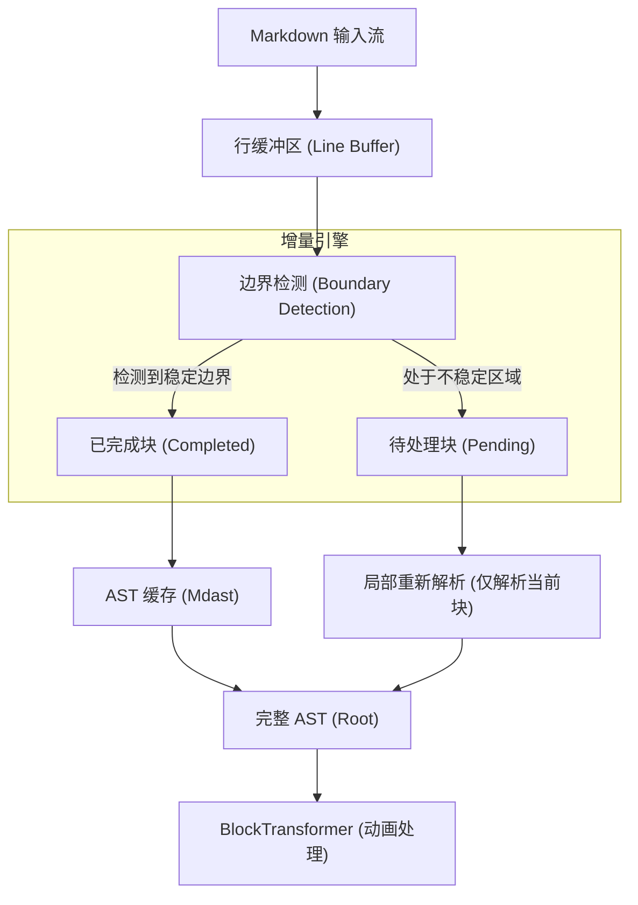

## Block 生命周期

在 Incremark 中，每一个顶级元素（标题、段落、代码块等）都是一个独立的 **Block**。它们经历了从“不确定”到“稳定”的生命周期：

| 状态 | 说明 | 处理策略 |
| :--- | :--- | :--- |
| **Pending** | 正在接收中，内容和类型随时可能改变 | 每次有新内容输入时，仅针对该 Block 所在的文本片段进行微型解析。 |
| **Completed** | 已确认完成，后续输入不会再影响该块 | **持久化缓存**。除非流被重置，否则不再参与解析、不再重新渲染。 |

> [!TIP]
> **为什么需要 Pending 状态？**
> 在 Markdown 中，前缀决定了类型。例如输入 `#` 时，它可能是个标题，也可能只是文本。只有当接收到空格或换行时，其类型才真正确定。

## 边界检测规则

Incremark 使用启发式规则来判断一个 Block 何时可以从 `Pending` 转换为 `Completed`：

### 1. 简单块边界
*   **空行**：段落的自然结束。
*   **新标题/分隔线**：新块的出现意味着前一个非容器块已结束。

### 2. 围栏块边界 (Fenced Blocks)
*   **代码块 (```)**：必须检测到匹配的结束围栏。在结束围栏出现前，整个代码块都处于 `Pending` 状态。
*   **自定义容器 (:::)**：同上，支持嵌套检测。

### 3. 嵌套块边界 (Nested Blocks)
*   **列表与引用**：解析器会持续跟踪当前的缩进级别和引用深度。当新的一行缩进回退或引用标记消失时，判定前块结束。

## 上下文跟踪 (Context)

为了在流式过程中准确识别边界，解析器维护了一个轻量级的状态机：

```ts
interface BlockContext {
  inFencedCode: boolean;     // 正在处理代码块
  inContainer: boolean;      // 正在处理自定义容器
  listStack: ListInfo[];     // 追踪嵌套列表状态
  blockquoteDepth: number;   // 追踪引用嵌套深度
}
```

## 性能分析

得益于增量机制，Incremark 的性能表现与文档总长度几乎无关，而仅与当前更新的 Chunk 大小线性相关。

| 维度 | 传统全量解析 | Incremark 增量解析 |
| :--- | :--- | :--- |
| **单次处理复杂度** | O(N) | **O(K)** |
| **总解析复杂度** | O(N²) | **O(N)** |
| **内存开销** | 高 (反复创建全量对象) | **低 (增量复用 AST 节点)** |
| **UI 响应性** | 随字数增加产生肉眼可见的卡顿 | **始终保持 60fps 丝滑效果** |

*注：N 为文档总长度，K 为单次 Chunk 长度。*

## 打字机效果 (BlockTransformer)

在解析出 AST 之后，`BlockTransformer` 充当了渲染之前的过滤层。它负责将解析出的“瞬间结果”转化为“渐进过程”：

1.  **节点追踪**：它记录了哪些字符已经“播放”过。
2.  **TextChunk 包装**：将新增的文本节点包装为 `TextChunk`，由渲染层实现淡入动画。
3.  **智能跳过**：如果用户要求立即显示，或者是非文本节点（如图片），它可以策略性地跳过动画。


================================================
FILE: docs/zh/guide/introduction.md
================================================
[Binary file]


================================================
FILE: docs/zh/guide/quick-start.md
================================================
# 快速开始

在 5 分钟内完成特定框架的集成并运行。

## 安装

::: code-group
```bash [pnpm]
pnpm add @incremark/vue @incremark/theme
# 或
pnpm add @incremark/react @incremark/theme
# 或
pnpm add @incremark/svelte @incremark/theme
# 或
pnpm add @incremark/solid @incremark/theme
```

```bash [npm]
npm install @incremark/vue @incremark/theme
# 或
npm install @incremark/react @incremark/theme
# 或
npm install @incremark/svelte @incremark/theme
# 或
npm install @incremark/solid @incremark/theme
```

```bash [yarn]
yarn add @incremark/vue @incremark/theme
# 或
yarn add @incremark/react @incremark/theme
# 或
yarn add @incremark/svelte @incremark/theme
# 或
yarn add @incremark/solid @incremark/theme
```
:::

## 基础用法

::: code-group
```vue [Vue]
<script setup>
import { ref } from 'vue'
import { IncremarkContent } from '@incremark/vue'
import '@incremark/theme/styles.css' // [!code hl]

const content = ref('')
const isFinished = ref(false)

async function simulateStream() {
  content.value = ''
  isFinished.value = false

  const text = '# Hello\n\nThis is **Incremark**!'
  for (const chunk of text.match(/[\s\S]{1,5}/g) || []) {
    content.value += chunk
    await new Promise(r => setTimeout(r, 50))
  }
  isFinished.value = true
}
</script>

<template>
  <button @click="simulateStream">Start</button>
  <IncremarkContent :content="content" :is-finished="isFinished" />
</template>
```

```tsx [React]
import { useState } from 'react'
import { IncremarkContent } from '@incremark/react'
import '@incremark/theme/styles.css' // [!code hl]

function App() {
  const [content, setContent] = useState('')
  const [isFinished, setIsFinished] = useState(false)

  async function simulateStream() {
    setContent('')
    setIsFinished(false)

    const text = '# Hello\n\nThis is **Incremark**!'
    const chunks = text.match(/[\s\S]{1,5}/g) || []
    for (const chunk of chunks) {
      setContent(prev => prev + chunk)
      await new Promise(r => setTimeout(r, 50))
    }
    setIsFinished(true)
  }

  return (
    <>
      <button onClick={simulateStream}>Start</button>
      <IncremarkContent content={content} isFinished={isFinished} />
    </>
  )
}
```

```svelte [Svelte]
<script lang="ts">
  import { IncremarkContent } from '@incremark/svelte'
  import '@incremark/theme/styles.css' // [!code hl]

  let content = $state('')
  let isFinished = $state(false)

  async function simulateStream() {
    content = ''
    isFinished = false

    const text = '# Hello\n\nThis is **Incremark**!'
    for (const chunk of text.match(/[\s\S]{1,5}/g) || []) {
      content += chunk
      await new Promise(r => setTimeout(r, 50))
    }
    isFinished = true
  }
</script>

<button onclick={simulateStream}>Start</button>
<IncremarkContent {content} {isFinished} />
```

```tsx [Solid]
import { createSignal } from 'solid-js'
import { IncremarkContent } from '@incremark/solid'
import '@incremark/theme/styles.css' // [!code hl]

function App() {
  const [content, setContent] = createSignal('')
  const [isFinished, setIsFinished] = createSignal(false)

  async function simulateStream() {
    setContent('')
    setIsFinished(false)

    const text = '# Hello\n\nThis is **Incremark**!'
    const chunks = text.match(/[\s\S]{1,5}/g) || []
    for (const chunk of chunks) {
      setContent(prev => prev + chunk)
      await new Promise(r => setTimeout(r, 50))
    }
    setIsFinished(true)
  }

  return (
    <>
      <button onClick={simulateStream}>Start</button>
      <IncremarkContent content={content()} isFinished={isFinished()} />
    </>
  )
}
```
:::

## 使用流模式

```vue
<script setup>
import { IncremarkContent } from '@incremark/vue'

async function* fetchAIStream() {
  const res = await fetch('/api/chat', { method: 'POST' })
  const reader = res.body!.getReader()
  const decoder = new TextDecoder()

  while (true) {
    const { done, value } = await reader.read()
    if (done) break
    yield decoder.decode(value)
  }
}
</script>

<template>
  <IncremarkContent :stream="fetchAIStream" />
</template>
```

## 数学公式 (可选)

如果你需要支持数学公式 (Katex)，请确保也导入了 Katex 的 CSS：

```ts
import 'katex/dist/katex.min.css'
```


================================================
FILE: docs/zh/guide/why-incremark.md
================================================
# 为什么选择 Incremark？

在大语言模型时代，展示 AI 生成的内容已经成为 Web 开发中最常见的需求之一。你可能会问：市面上已经有那么多 Markdown 渲染库了，为什么还需要一个新的？

这篇文章会诚实地回答这个问题。

## 我们要解决的问题

### AI 输出正在变得越来越长

如果你关注 AI 领域的趋势，会发现一个明显的规律：

- **2022 年**：GPT-3.5 的回复通常只有几百字
- **2023 年**：GPT-4 的回复可以达到 2,000-4,000 字
- **2024-2025 年**：OpenAI o1、DeepSeek R1 等推理模型会输出"思考过程"，可能超过 10,000+ 字

单次会话的 Token 量级正在从 4K 向 32K，甚至 128K 迈进。

**挑战**：对于前端开发者来说，渲染 500 字和渲染 50,000 字的 Markdown，完全是两个不同的问题。

### 传统解析器跟不上了

当你用传统的 Markdown 解析器处理 AI 流式输出时，会发生这样的事情：

```
Chunk 1: 解析 100 字符 ✓
Chunk 2: 解析 200 字符 (100 旧 + 100 新)
Chunk 3: 解析 300 字符 (200 旧 + 100 新)
...
Chunk 100: 解析 10,000 字符 😰
```

每当新的 chunk 到达，整个文档都要重新解析一遍。这是 **O(n²) 复杂度**。

对于一个 20KB 的文档，这意味着：
- **ant-design-x**：1,657 ms 总解析时间
- **markstream-vue**：5,755 ms（将近 6 秒！）
- **Incremark**：88 ms ✨

**差距不是 2 倍或 3 倍 —— 是 19 倍到 65 倍。**

## 为什么 Incremark 不一样

### 1. 真正的增量解析

Incremark 不只是"优化"传统方案 —— 它从根本上重新思考了流式 Markdown 应该如何工作。

```
Chunk 1: 解析 100 字符 → 缓存稳定块
Chunk 2: 仅解析 ~100 新字符（之前的已缓存）
Chunk 3: 仅解析 ~100 新字符（之前的已缓存）
...
Chunk 100: 仅解析 ~100 新字符
```

这是 **O(n) 复杂度**。文档越大，我们的优势越明显。

### 2. 双引擎架构

我们理解不同场景有不同的需求：

| 引擎 | 速度 | 最佳场景 |
|------|------|----------|
| **Marked**（默认） | ⚡⚡⚡⚡⚡ | 实时流式、AI 对话 |
| **Micromark** | ⚡⚡⚡ | 复杂文档、严格 CommonMark 兼容 |

你可以通过一个配置选项切换引擎。

### 3. 开箱即用的增强功能

原生 Marked 不支持脚注、数学公式或自定义容器。我们通过精心设计的扩展添加了这些功能：

- ✅ **脚注**：完整的 GFM 脚注支持（`[^1]`）
- ✅ **数学公式**：行内（`$...$`）和块级（`$$...$$`）公式
- ✅ **自定义容器**：`:::tip`、`:::warning`、`:::danger`
- ✅ **HTML 解析**：结构化的 HTML 树解析
- ✅ **乐观引用处理**：在流式输入时优雅处理未完成的链接

### 4. 框架无关

我们为所有主流框架提供一等支持：

```bash
# Vue
pnpm add @incremark/core @incremark/vue

# React
pnpm add @incremark/core @incremark/react

# Svelte
pnpm add @incremark/core @incremark/svelte
```

一个核心库，一致的 API，跨框架相同的特性。

## 诚实的性能对比

我们相信透明度。以下是我们在 38 个测试文件上的实际基准测试结果：

### 总体平均值

| 对比方案 | 平均优势 |
|----------|----------|
| vs Streamdown | 约**快 6.1 倍** |
| vs ant-design-x | 约**快 7.2 倍** |
| vs markstream-vue | 约**快 28.3 倍** |

### 我们没有更快的地方

我们不会隐瞒这一点：在某些基准测试中，Incremark 看起来比 Streamdown 慢：

| 文件 | Incremark | Streamdown | 原因 |
|------|-----------|------------|------|
| footnotes.md | 1.7 ms | 0.2 ms | Streamdown 不支持脚注 |
| FOOTNOTE_FIX_SUMMARY.md | 22.7 ms | 0.5 ms | 同上 — 跳过脚注解析 |

**这不是性能问题 —— 这是功能差异。** 我们选择完整实现脚注，因为它们对 AI 内容很重要。

### 我们真正的优势场景

对于标准 Markdown 内容，我们的优势很明显：

| 文件 | 行数 | Incremark | ant-design-x | 优势倍数 |
|------|------|-----------|--------------|----------|
| concepts.md | 91 | 12.0 ms | 53.6 ms | **4.5x** |
| OPTIMIZATION_SUMMARY.md | 391 | 19.1 ms | 217.8 ms | **11.4x** |
| test-md-01.md | 916 | 87.7 ms | 1656.9 ms | **18.9x** |

**文档越大，我们的优势越明显。**

## 谁应该使用 Incremark？

### ✅ 非常适合

- **AI 聊天应用**：Claude、ChatGPT、自定义 LLM 界面
- **长篇 AI 内容**：推理模型、代码生成、文档分析
- **实时编辑器**：协作式 Markdown 编辑
- **企业级 RAG 系统**：需要渲染大型文档的知识库
- **多框架团队**：在 Vue、React 和 Svelte 之间保持一致的行为

### ⚠️ 考虑其他方案

- **静态站点生成**：如果你在构建时预渲染 Markdown，更简单的库就够了
- **非常短的内容**：对于 500 字符以下的内容，性能差异可以忽略

## 更大的图景

我们不只是在构建一个库 —— 我们在为 AI 界面的未来做准备。

### 趋势很明确

- AI 输出正在变长（推理模型、思维链）
- 流式正在成为默认方式（更好的用户体验，更低的延迟）
- 用户期望即时反馈（没有加载动画，没有卡顿）

传统的 O(n²) 解析器根本无法扩展到这个未来。Incremark 的 O(n) 架构正是为此而生。

### 我们的承诺

我们承诺：
- **性能**：持续优化两个引擎
- **功能**：根据需要添加新的语法支持
- **稳定性**：彻底的测试和谨慎的版本控制
- **文档**：AI 友好的文档（查看我们的 `llms.txt`）

## 开始使用

准备好尝试了吗？只需要不到 5 分钟：

```bash
pnpm add @incremark/core @incremark/vue
```

```vue
<script setup>
import { ref } from 'vue'
import { IncremarkContent } from '@incremark/vue'

const content = ref('')
const isFinished = ref(false)

// 处理 AI 流式输出
async function handleStream(stream) {
  content.value = ''
  isFinished.value = false
  
  for await (const chunk of stream) {
    content.value += chunk
  }
  
  isFinished.value = true
}
</script>

<template>
  <IncremarkContent 
    :content="content" 
    :is-finished="isFinished"
    :incremark-options="{ gfm: true, math: true }"
  />
</template>
```

就这样。你的 AI 聊天刚刚快了 19 倍。

---

## 常见问题

### Q: Incremark 可以用于生产环境吗？

可以。核心解析引擎已经用真实的 AI 内容进行了广泛测试，包括未完成的代码块、嵌套列表和复杂脚注等边界情况。

### Q: 基于 WebAssembly 的解析器会让 Incremark 过时吗？

这是一个合理的担忧。基于 Rust 的 Wasm 解析器（如 `pulldown-cmark`）理论上可能更快。但是：

1. Wasm-JS 交互有开销（尤其是字符串传递）
2. 增量解析在 Wasm 中很难实现
3. 20KB 文档 88ms 的解析时间对人类来说已经是瞬间完成

只要我们保持目前的性能水平，Wasm 就不是威胁。

### Q: Incremark 和 `react-markdown` 相比如何？

`react-markdown` 是为静态文档设计的，不是为流式设计的。它在每次更新时都会重新渲染整个组件树，在 AI 流式输出时会造成严重的性能问题。Incremark 只更新发生变化的部分。

### Q: 我可以自定义渲染吗？

当然可以。三个框架包都支持自定义组件：

```vue
<IncremarkContent 
  :content="content" 
  :is-finished="isFinished"
  :custom-code-blocks="{ echarts: MyEchartsCodeBlock }"
  :custom-containers="{ warning: MyWarningContainer }"
  :components="{ heading: MyCustomHeading }"
/>
```

---

我们构建 Incremark 是因为我们自己需要它。希望它能帮助你构建更好的 AI 体验。

有问题？发现问题？[提交 GitHub Issue](https://github.com/kingshuaishuai/incremark/issues) 或查看我们的[文档](/)。


================================================
FILE: docs/.vitepress/config.ts
================================================
import { defineConfig, type HeadConfig } from 'vitepress'
import taskLists from 'markdown-it-task-lists';
import { vitepressMermaidPreview } from 'vitepress-mermaid-preview';
import llms from 'vitepress-plugin-llms'


const shared = {
  title: "Incremark",
  head: [
    ['link', { rel: 'icon', type: 'image/svg+xml', href: '/logo.svg' }],
    ['meta', { name: 'keywords', content: 'markdown, streaming, incremental, parser, ai, chatgpt, llm, typewriter, performance, vue, react, svelte' }],
    ['meta', { name: 'author', content: 'Incremark' }],
    ['meta', { property: 'og:type', content: 'website' }],
    ['meta', { property: 'og:title', content: 'Incremark - High-performance streaming markdown renderer' }],
    ['meta', { property: 'og:description', content: 'A context-aware incremental markdown parser specifically designed for AI streaming output scenarios.' }],
    ['meta', { property: 'og:image', content: 'https://www.incremark.com/og-image.png' }],
    ['meta', { name: 'twitter:card', content: 'summary_large_image' }],
    ['meta', { name: 'twitter:title', content: 'Incremark' }],
    ['meta', { name: 'twitter:description', content: 'High-performance streaming markdown renderer for AI apps.' }],
  ] as HeadConfig[],
  themeConfig: {
    logo: '/logo.svg',
    socialLinks: [
      { icon: 'github', link: 'https://github.com/kingshuaishuai/incremark' }
    ],
    search: {
      provider: 'local'
    }
  }
}

const en = {
  label: 'English',
  lang: 'en',
  link: '/',
  description: "High-performance streaming markdown renderer",
  themeConfig: {
    nav: [
      { text: 'Guide', link: '/guide/quick-start' },
      { text: 'Features', link: '/features/basic-usage' },
      { text: 'Advanced', link: '/advanced/architecture' },
      { text: 'API', link: '/api/' },
      { text: 'Examples', link: '/examples/openai' },
      { text: 'Roadmap', link: '/roadmap' },
      { text: 'GitHub', link: 'https://github.com/kingshuaishuai/incremark' }
    ],
    sidebar: {
      '/guide/': [
        {
          text: 'Getting Started',
          items: [
            { text: 'Introduction', link: '/guide/introduction' },
            { text: 'Why Incremark', link: '/guide/why-incremark' },
            { text: 'Quick Start', link: '/guide/quick-start' },
            { text: 'Core Concepts', link: '/guide/concepts' },
            { text: 'Comparison', link: '/guide/comparison' }
          ]
        }
      ],
      '/features/': [
        {
          text: 'Features',
          items: [
            { text: 'Basic Usage', link: '/features/basic-usage' },
            { text: 'Typewriter Effect', link: '/features/typewriter' },
            { text: 'HTML Elements', link: '/features/html-elements' },
            { text: 'Footnotes', link: '/features/footnotes' },
            { text: 'Custom Containers', link: '/features/custom-containers' },
            { text: 'Custom Components', link: '/features/custom-components' },
            { text: 'Custom Code Blocks', link: '/features/custom-codeblocks' },
            { text: 'Themes', link: '/features/themes' },
            { text: 'i18n & Accessibility', link: '/features/i18n' },
            { text: 'Auto Scroll', link: '/features/auto-scroll' },
            { text: 'DevTools', link: '/features/devtools' }
          ]
        }
      ],
      '/advanced/': [
        {
          text: 'Advanced',
          items: [
            { text: 'Architecture', link: '/advanced/architecture' },
            { text: 'Engines', link: '/advanced/engines' },
            { text: 'Extensions', link: '/advanced/extensions' },
            { text: 'Benchmark', link: '/advanced/benchmark' }
          ]
        }
      ],
      '/examples/': [
        {
          text: 'Examples',
          items: [
            { text: 'OpenAI', link: '/examples/openai' },
            { text: 'Anthropic', link: '/examples/anthropic' },
            { text: 'Vercel AI SDK', link: '/examples/vercel-ai' },
            { text: 'Custom Stream', link: '/examples/custom-stream' }
          ]
        }
      ],
    },
    search: {
      provider: 'local',
      options: {
        locales: {
          root: {
            placeholder: 'Search documentation...',
            translations: {
              button: {
                buttonText: 'Search',
                buttonAriaLabel: 'Search documentation'
              },
              modal: {
                searchBox: {
                  resetButtonTitle: 'Clear query',
                  resetButtonAriaLabel: 'Clear query',
                  cancelButtonText: 'Cancel',
                  cancelButtonAriaLabel: 'Cancel'
                },
                startScreen: {
                  recentSearchesTitle: 'Recent searches',
                  noRecentSearchesText: 'No recent searches',
                  saveRecentSearchButtonTitle: 'Save recent search',
                  removeRecentSearchButtonTitle: 'Remove from recent searches',
                  favoriteSearchesTitle: 'Favorite searches',
                  removeFavoriteSearchButtonTitle: 'Remove from favorite searches'
                },
                errorScreen: {
                  titleText: 'Unable to get results',
                  helpText: 'Check your network connection'
                },
                footer: {
                  selectText: 'to select',
                  navigateText: 'to navigate',
                  closeText: 'to close',
                  searchByText: 'Search by'
                },
                noResultsScreen: {
                  noResultsText: 'No results for',
                  suggestedQueryText: 'Try searching for',
                  reportMissingResultsText: 'Do you believe this query should yield results?',
                  reportMissingResultsLinkText: 'Tell us'
                }
              }
            }
          }
        }
      }
    }
  }
}

const zh = {
  label: '简体中文',
  lang: 'zh',
  link: '/zh/',
  description: "高性能流式 Markdown 渲染器",
  themeConfig: {
    nav: [
      { text: '指南', link: '/zh/guide/quick-start' },
      { text: '功能', link: '/zh/features/basic-usage' },
      { text: '进阶', link: '/zh/advanced/architecture' },
      { text: 'API', link: '/zh/api/' },
      { text: '示例', link: '/zh/examples/openai' },
      { text: '路线图', link: '/zh/roadmap' },
      { text: 'GitHub', link: 'https://github.com/kingshuaishuai/incremark' }
    ],
    sidebar: {
      '/zh/guide/': [
        {
          text: '快速开始',
          items: [
            { text: '介绍', link: '/zh/guide/introduction' },
            { text: '为什么选择 Incremark', link: '/zh/guide/why-incremark' },
            { text: '快速上手', link: '/zh/guide/quick-start' },
            { text: '核心概念', link: '/zh/guide/concepts' },
            { text: '方案对比', link: '/zh/guide/comparison' }
          ]
        }
      ],
      '/zh/features/': [
        {
          text: '功能特性',
          items: [
            { text: '基础用法', link: '/zh/features/basic-usage' },
            { text: '打字机效果', link: '/zh/features/typewriter' },
            { text: 'HTML 元素', link: '/zh/features/html-elements' },
            { text: '脚注', link: '/zh/features/footnotes' },
            { text: '自定义容器', link: '/zh/features/custom-containers' },
            { text: '自定义组件', link: '/zh/features/custom-components' },
            { text: '自定义代码块', link: '/zh/features/custom-codeblocks' },
            { text: '主题', link: '/zh/features/themes' },
            { text: '国际化与无障碍', link: '/zh/features/i18n' },
            { text: '自动滚动', link: '/zh/features/auto-scroll' },
            { text: '开发者工具', link: '/zh/features/devtools' }
          ]
        }
      ],
      '/zh/advanced/': [
        {
          text: '进阶',
          items: [
            { text: '架构原理', link: '/zh/advanced/architecture' },
            { text: '双引擎', link: '/zh/advanced/engines' },
            { text: '扩展功能', link: '/zh/advanced/extensions' },
            { text: '性能测试', link: '/zh/advanced/benchmark' }
          ]
        }
      ],
      '/zh/examples/': [
        {
          text: '示例',
          items: [
            { text: 'OpenAI', link: '/zh/examples/openai' },
            { text: 'Anthropic', link: '/zh/examples/anthropic' },
            { text: 'Vercel AI SDK', link: '/zh/examples/vercel-ai' },
            { text: '自定义流', link: '/zh/examples/custom-stream' }
          ]
        }
      ],
    },
    outlineTitle: '页面导航',
    docFooter: {
      prev: '上一页',
      next: '下一页'
    },
    search: {
      provider: 'local',
      options: {
        locales: {
          zh: {
            placeholder: '搜索文档...',
            translations: {
              button: {
                buttonText: '搜索文档',
                buttonAriaLabel: '搜索文档'
              },
              modal: {
                searchBox: {
                  resetButtonTitle: '清除查询条件',
                  resetButtonAriaLabel: '清除查询条件',
                  cancelButtonText: '取消',
                  cancelButtonAriaLabel: '取消'
                },
                startScreen: {
                  recentSearchesTitle: '搜索历史',
                  noRecentSearchesText: '没有搜索历史',
                  saveRecentSearchButtonTitle: '保存至搜索历史',
                  removeRecentSearchButtonTitle: '从搜索历史中移除',
                  favoriteSearchesTitle: '收藏',
                  removeFavoriteSearchButtonTitle: '从收藏中移除'
                },
                errorScreen: {
                  titleText: '无法获取结果',
                  helpText: '请检查网络连接'
                },
                footer: {
                  selectText: '选择',
                  navigateText: '切换',
                  closeText: '关闭',
                  searchByText: '搜索提供者'
                },
                noResultsScreen: {
                  noResultsText: '无法找到相关结果',
                  suggestedQueryText: '你可以尝试查询',
                  reportMissingResultsText: '你认为该查询应该有结果？',
                  reportMissingResultsLinkText: '点击反馈'
                }
              }
            }
          }
        }
      }
    }
  }
}

export default defineConfig({
  ...shared,
  markdown: {
    config: (md) => {
      md.use(taskLists);
      vitepressMermaidPreview(md);
    }
  },
  locales: {
    root: en,
    zh: zh
  },
  sitemap: {
    hostname: 'https://www.incremark.com'
  },
  vite: {
    plugins: [
      llms()
    ]
  }
})


================================================
FILE: docs/.vitepress/theme/index.ts
================================================
import type { Theme } from 'vitepress';
import DefaultTheme from 'vitepress/theme';
import { initComponent } from 'vitepress-mermaid-preview/component';
import 'vitepress-mermaid-preview/dist/index.css';

export default {
  extends: DefaultTheme,
  enhanceApp({ app }) {
    initComponent(app);
  },
} satisfies Theme;


================================================
FILE: examples/react/index.html
================================================
<!DOCTYPE html>
<html lang="zh-CN">
  <head>
    <meta charset="UTF-8" />
    <link rel="icon" type="image/svg+xml" href="/vite.svg" />
    <meta name="viewport" content="width=device-width, initial-scale=1.0" />
    <title>Incremark React Example</title>
  </head>
  <body>
    <div id="root"></div>
    <script type="module" src="/src/main.tsx"></script>
  </body>
</html>


================================================
FILE: examples/react/package.json
================================================
{
  "name": "@incremark/example-react",
  "version": "0.1.0",
  "private": true,
  "type": "module",
  "scripts": {
    "dev": "vite",
    "build": "vite build",
    "preview": "vite preview"
  },
  "dependencies": {
    "@incremark/core": "workspace:*",
    "@incremark/devtools": "workspace:*",
    "@incremark/react": "workspace:*",
    "@incremark/theme": "workspace:*",
    "echarts": "^6.0.0",
    "katex": "^0.16.0",
    "react": "^19.2.3",
    "react-dom": "^19.2.3"
  },
  "devDependencies": {
    "@types/react": "^19.2.8",
    "@types/react-dom": "^19.2.3",
    "@vitejs/plugin-react": "^5.1.2",
    "typescript": "^5.9.3",
    "vite": "^7.3.1"
  }
}


================================================
FILE: examples/react/tsconfig.json
================================================
{
  "compilerOptions": {
    "target": "ES2020",
    "useDefineForClassFields": true,
    "lib": ["ES2020", "DOM", "DOM.Iterable"],
    "module": "ESNext",
    "skipLibCheck": true,
    "moduleResolution": "bundler",
    "allowImportingTsExtensions": true,
    "resolveJsonModule": true,
    "isolatedModules": true,
    "noEmit": true,
    "jsx": "react-jsx",
    "strict": true,
    "noUnusedLocals": true,
    "noUnusedParameters": true,
    "noFallthroughCasesInSwitch": true,
    "paths": {
      "@incremark/core": ["../../packages/core/src"],
      "@incremark/react": ["../../packages/react/src"],
      "@incremark/devtools": ["../../packages/devtools/src"],
      "@incremark/shared": ["../../packages/shared/src"]
    }
  },
  "include": ["src"],
  "references": [{ "path": "./tsconfig.node.json" }]
}


================================================
FILE: examples/react/tsconfig.node.json
================================================
{
  "compilerOptions": {
    "composite": true,
    "skipLibCheck": true,
    "module": "ESNext",
    "moduleResolution": "bundler",
    "allowSyntheticDefaultImports": true,
    "strict": true
  },
  "include": ["vite.config.ts"]
}


================================================
FILE: examples/react/vercel.json
================================================
{
  "buildCommand": "cd ../.. && pnpm build && cd examples/react && pnpm build",
  "outputDirectory": "dist",
  "installCommand": "cd ../.. && pnpm install"
}


================================================
FILE: examples/react/vite.config.ts
================================================
import { defineConfig } from 'vite'
import react from '@vitejs/plugin-react'
import path from 'path'

export default defineConfig({
  plugins: [react()],
  resolve: {
    alias: {
      '@incremark/core/engines/micromark': path.resolve(__dirname, '../../packages/core/src/engines/micromark/index.ts'),
      '@incremark/core': path.resolve(__dirname, '../../packages/core/src'),
      '@incremark/react': path.resolve(__dirname, '../../packages/react/src'),
      '@incremark/shared': path.resolve(__dirname, '../../packages/shared/src'),
      // '@incremark/theme': path.resolve(__dirname, '../../packages/theme/src')
    }
  },
  css: {
    preprocessorOptions: {
      less: {
        javascriptEnabled: true,
        // 自动导入 variables.less，这样所有 Less 文件都可以直接使用变量
        additionalData: `@import "${path.resolve(__dirname, '../../packages/theme/src/styles/variables.less')}";`
      }
    }
  }
})


================================================
FILE: examples/react/src/App.tsx
================================================
import { useState, useMemo, useEffect, useRef } from 'react'
import 'katex/dist/katex.min.css'

import { useLocale } from './hooks'
import { IncremarkDemo } from './components'
import { zhCN, type IncremarkLocale } from '@incremark/react'
import { createDevTools, setLocale as setDevToolsLocale } from '@incremark/devtools'

// 在模块级别创建 devtools 实例，确保它在组件渲染前就存在
const devtools = createDevTools({
  locale: 'zh-CN'
})

function App() {
  // ============ DevTools ============
  useEffect(() => {
    devtools.mount()

    return () => {
      devtools.unmount()
    }
  }, [])

  // ============ 国际化 ============
  const { locale, t, sampleMarkdown, toggleLocale } = useLocale()

  // 同步 DevTools 语言
  useEffect(() => {
    setDevToolsLocale(locale === 'zh' ? 'zh-CN' : 'en-US')
  }, [locale])

  // ============ Incremark Locale ============
  const incremarkLocale = useMemo<IncremarkLocale | undefined>(
    () => (locale === 'zh' ? zhCN : undefined),
    [locale]
  )

  // ============ HTML 模式 ============
  const [htmlEnabled, setHtmlEnabled] = useState(true)

  // 用于强制重新创建 incremark 实例
  const incremarkKey = useMemo(() => `${htmlEnabled}-${locale}`, [htmlEnabled, locale])

  return (
    <div className="app">
      <header className="header">
        <div className="header-top">
          <h1>{t.title}</h1>
          <button className="lang-toggle" onClick={toggleLocale}>
            {locale === 'zh' ? '🇺🇸 English' : '🇨🇳 中文'}
          </button>
        </div>
        <div className="header-controls">
          <label className="checkbox html-toggle">
            <input
              type="checkbox"
              checked={htmlEnabled}
              onChange={(e) => setHtmlEnabled(e.target.checked)}
            />
            {t.htmlMode}
          </label>
        </div>
      </header>

      <IncremarkDemo
        key={incremarkKey}
        htmlEnabled={htmlEnabled}
        sampleMarkdown={sampleMarkdown}
        t={t}
        locale={incremarkLocale}
        devtools={devtools}
      />
    </div>
  )
}

export default App


================================================
FILE: examples/react/src/main.tsx
================================================
import React from 'react'
import ReactDOM from 'react-dom/client'
import App from './App'
import '../../shared/styles.css'
import '@incremark/theme/styles.css'

ReactDOM.createRoot(document.getElementById('root')!).render(
  <React.StrictMode>
    <App />
  </React.StrictMode>
)


================================================
FILE: examples/react/src/components/BenchmarkPanel.tsx
================================================
import React from 'react'
import type { BenchmarkStats } from '../hooks'
import type { Messages } from '../locales'

interface BenchmarkPanelProps {
  stats: BenchmarkStats
  running: boolean
  progress: number
  t: Pick<Messages, 'benchmark' | 'runBenchmark' | 'running' | 'traditional' | 'incremark' | 'totalTime' | 'totalChars' | 'speedup' | 'benchmarkNote'>
  onRun: () => void
}

export const BenchmarkPanel: React.FC<BenchmarkPanelProps> = ({ 
  stats, 
  running, 
  progress, 
  t, 
  onRun 
}) => {
  return (
    <div className="benchmark-panel">
      <div className="benchmark-header">
        <h2>⚡ {t.benchmark}</h2>
        <button 
          className="benchmark-btn"
          onClick={onRun} 
          disabled={running}
        >
          {running ? t.running : t.runBenchmark}
        </button>
      </div>
      
      {running && (
        <div className="benchmark-progress">
          <div className="progress-bar" style={{ width: `${progress}%` }}></div>
        </div>
      )}
      
      {stats.traditional.time > 0 && (
        <div className="benchmark-results">
          <div className="benchmark-card traditional">
            <h3>🐢 {t.traditional}</h3>
            <div className="stat">
              <span className="label">{t.totalTime}</span>
              <span className="value">{stats.traditional.time.toFixed(2)} ms</span>
            </div>
            <div className="stat">
              <span className="label">{t.totalChars}</span>
              <span className="value">{(stats.traditional.totalChars / 1000).toFixed(1)}K</span>
            </div>
          </div>
          
          <div className="benchmark-card incremark">
            <h3>🚀 {t.incremark}</h3>
            <div className="stat">
              <span className="label">{t.totalTime}</span>
              <span className="value">{stats.incremark.time.toFixed(2)} ms</span>
            </div>
            <div className="stat">
              <span className="label">{t.totalChars}</span>
              <span className="value">{(stats.incremark.totalChars / 1000).toFixed(1)}K</span>
            </div>
          </div>
          
          <div className="benchmark-card speedup">
            <h3>📈 {t.speedup}</h3>
            <div className="speedup-value">
              {(stats.traditional.time / stats.incremark.time).toFixed(1)}x
            </div>
          </div>
        </div>
      )}
      
      <p className="benchmark-note">💡 {t.benchmarkNote}</p>
    </div>
  )
}


================================================
FILE: examples/react/src/components/CustomEchartCodeBlock.tsx
================================================
import React, { useEffect, useRef, useState } from 'react'
import * as echarts from 'echarts'

export interface CustomEchartCodeBlockProps {
  codeStr: string
  lang?: string
  completed?: boolean
  takeOver?: boolean
}

export const CustomEchartCodeBlock: React.FC<CustomEchartCodeBlockProps> = ({ codeStr, completed, takeOver }) => {
  const chartRef = useRef<HTMLDivElement>(null)
  const [error, setError] = useState('')

  // 是否应该显示图表
  const shouldShowChart = takeOver === true || completed

  function renderChart() {
    if (!codeStr || !chartRef.current) return

    setError('')

    try {
      const option = JSON.parse(codeStr)
      console.log(option)

      const chart = echarts.getInstanceByDom(chartRef.current)
      if (chart) {
        chart.setOption(option)
      } else {
        echarts.init(chartRef.current).setOption(option)
      }
    } catch (e: any) {
      setError(e.message || '渲染失败')
    }
  }

  // 监听 completed 变化
  useEffect(() => {
    console.log('completed 变化:', completed, 'takeOver:', takeOver)
    if (shouldShowChart) {
      setTimeout(() => renderChart(), 0)
    }
  }, [completed])

  return (
    <div className="custom-echart-code-block">
      <div className="echart-header">
        <span className="language">ECHART</span>
      </div>
      <div className="echart-content">
        {!shouldShowChart ? (
          <div className="echart-loading">解析中...</div>
        ) : error ? (
          <div className="echart-error">{error}</div>
        ) : (
          <div 
            ref={chartRef} 
            className="echart-chart" 
            style={{ 
              width: '100%', 
              height: '400px',
              display: shouldShowChart ? 'block' : 'none'
            }}
          />
        )}
      </div>
    </div>
  )
}


================================================
FILE: examples/react/src/components/CustomHeading.tsx
================================================
import React from 'react'
import type { Heading, PhrasingContent } from 'mdast'
import { IncremarkInline } from '@incremark/react'

export interface CustomHeadingProps {
  node: Heading
}

export const CustomHeading: React.FC<CustomHeadingProps> = ({ node }) => {
  const Tag = `h${node.depth}` as keyof JSX.IntrinsicElements
  return (
    <Tag className="custom-heading">
      ✨ <IncremarkInline nodes={node.children as PhrasingContent[]} />
    </Tag>
  )
}


================================================
FILE: examples/react/src/components/CustomInfoContainer.tsx
================================================
import React from 'react'

export interface CustomInfoContainerProps {
  name: string
  options?: Record<string, any>
  children?: React.ReactNode
}

export const CustomInfoContainer: React.FC<CustomInfoContainerProps> = ({ options, children }) => {
  return (
    <div className="custom-info-container">
      <div className="custom-info-header">
        <span className="custom-info-icon">ℹ️</span>
        <span className="custom-info-title">
          {options?.title || '信息'}
        </span>
      </div>
      <div className="custom-info-content">
        {children}
      </div>
    </div>
  )
}


================================================
FILE: examples/react/src/components/CustomInputPanel.tsx
================================================
import React from 'react'
import type { Messages } from '../locales'

interface CustomInputPanelProps {
  value: string
  onChange: (value: string) => void
  onUseExample: () => void
  t: Pick<Messages, 'customInput' | 'inputPlaceholder' | 'useExample'>
}

export const CustomInputPanel: React.FC<CustomInputPanelProps> = ({ 
  value, 
  onChange, 
  onUseExample, 
  t 
}) => {
  return (
    <div className="input-panel">
      <div className="input-header">
        <span>✏️ {t.customInput}</span>
        <button className="use-example-btn" onClick={onUseExample}>
          {t.useExample}
        </button>
      </div>
      <textarea 
        value={value}
        onChange={(e) => onChange(e.target.value)}
        placeholder={t.inputPlaceholder}
        className="markdown-input"
        rows={8}
      />
    </div>
  )
}


================================================
FILE: examples/react/src/components/CustomTipContainer.tsx
================================================
import React from 'react'

export interface CustomTipContainerProps {
  name: string
  options?: Record<string, any>
  children?: React.ReactNode
}

export const CustomTipContainer: React.FC<CustomTipContainerProps> = ({ options, children }) => {
  return (
    <div className="custom-tip-container">
      <div className="custom-tip-header">
        <span className="custom-tip-icon">💡</span>
        <span className="custom-tip-title">
          {options?.title || '提示'}
        </span>
      </div>
      <div className="custom-tip-content">
        {children}
      </div>
    </div>
  )
}


================================================
FILE: examples/react/src/components/CustomWarningContainer.tsx
================================================
import React from 'react'

export interface CustomWarningContainerProps {
  name: string
  options?: Record<string, any>
  children?: React.ReactNode
}

export const CustomWarningContainer: React.FC<CustomWarningContainerProps> = ({ options, children }) => {
  return (
    <div className="custom-warning-container">
      <div className="custom-warning-header">
        <span className="custom-warning-icon">⚠️</span>
        <span className="custom-warning-title">
          {options?.title || '警告'}
        </span>
      </div>
      <div className="custom-warning-content">
        {children}
      </div>
    </div>
  )
}


================================================
FILE: examples/react/src/components/IncremarkDemo.tsx
================================================
import { useState, useCallback, useMemo, useRef, useEffect } from 'react'
import {
  IncremarkContent,
  AutoScrollContainer,
  ThemeProvider,
  ConfigProvider,
  type DesignTokens,
  type UseIncremarkOptions,
  type IncremarkLocale
} from '@incremark/react'
import { MicromarkAstBuilder } from '@incremark/core/engines/micromark'

import {
  BenchmarkPanel,
  CustomInputPanel,
  CustomHeading,
  CustomWarningContainer,
  CustomInfoContainer,
  CustomTipContainer,
  CustomEchartCodeBlock
} from './index'
import type { Messages } from '../locales'
import type { IncremarkDevTools } from '@incremark/devtools'

interface BenchmarkStats {
  traditional: { time: number; parseCount: number; totalChars: number }
  incremark: { time: number; parseCount: number; totalChars: number }
}

interface IncremarkDemoProps {
  htmlEnabled: boolean
  sampleMarkdown: string
  t: Messages
  locale?: IncremarkLocale
  devtools?: IncremarkDevTools | null
}

export function IncremarkDemo({ htmlEnabled, sampleMarkdown, t, locale, devtools }: IncremarkDemoProps) {
  // ============ 打字机配置 ============
  const [typewriterEnabled, setTypewriterEnabled] = useState(false)
  const [typewriterSpeed, setTypewriterSpeed] = useState(2)
  const [typewriterInterval, setTypewriterInterval] = useState(30)
  const [typewriterRandomStep, setTypewriterRandomStep] = useState(true)
  const [typewriterEffect, setTypewriterEffect] = useState<'none' | 'fade-in' | 'typing'>('typing')

  // ============ 数学公式配置 ============
  const [mathTexEnabled, setMathTexEnabled] = useState(false)

  // ============ 引擎配置 ============
  const [engineType, setEngineType] = useState<'marked' | 'micromark'>('marked')

  // ============ 内容状态 ============
  const [mdContent, setMdContent] = useState('')
  const [isFinished, setIsFinished] = useState(false)

  // ============ Incremark 配置（响应式） ============
  const incremarkOptions = useMemo<UseIncremarkOptions>(() => ({
    gfm: true,
    math: mathTexEnabled ? { tex: true } : true,
    htmlTree: htmlEnabled,
    containers: true,
    astBuilder: engineType === 'micromark' ? MicromarkAstBuilder : undefined,
    typewriter: {
      enabled: typewriterEnabled,
      charsPerTick: typewriterRandomStep
        ? [1, Math.max(2, typewriterSpeed)] as [number, number]
        : typewriterSpeed,
      tickInterval: typewriterInterval,
      effect: typewriterEffect,
      cursor: '|'
    }
  }), [htmlEnabled, typewriterEnabled, typewriterSpeed, typewriterInterval, typewriterRandomStep, typewriterEffect, mathTexEnabled, engineType])

  // ============ 引擎切换时重置内容并重建组件 ============
  // 注意：只有 engineType 变化需要重建组件，math 等配置可以通过 updateOptions 动态更新
  const isFirstRenderRef = useRef(true)
  useEffect(() => {
    if (isFirstRenderRef.current) {
      isFirstRenderRef.current = false
      return
    }
    // 引擎切换时重置内容
    setMdContent('')
    setIsFinished(false)
  }, [engineType])

  // ============ 状态 ============
  const [isStreaming, setIsStreaming] = useState(false)
  const [autoScrollEnabled, setAutoScrollEnabled] = useState(true)
  const [customInputMode, setCustomInputMode] = useState(false)
  const [customMarkdown, setCustomMarkdown] = useState('')

  // ============ 自定义组件 ============
  const [useCustomComponents, setUseCustomComponents] = useState(false)
  const customComponents = useMemo(() => ({ heading: CustomHeading }), [])

  const currentMarkdown = useMemo(() =>
    customInputMode && customMarkdown.trim() ? customMarkdown : sampleMarkdown,
    [customInputMode, customMarkdown, sampleMarkdown]
  )

  // ============ 主题系统 ============
  const [themeMode, setThemeMode] = useState<'default' | 'dark' | 'custom'>('default')

  const customThemeOverride: Partial<DesignTokens> = useMemo(() => ({
    color: {
      brand: {
        primary: '#8b5cf6',
        primaryHover: '#7c3aed',
        primaryActive: '#6d28d9',
        primaryLight: '#a78bfa'
      }
    } as any
  }), [])

  const currentTheme = useMemo<'default' | 'dark' | DesignTokens | Partial<DesignTokens>>(() => {
    switch (themeMode) {
      case 'dark':
        return 'dark'
      case 'custom':
        return customThemeOverride
      default:
        return 'default'
    }
  }, [themeMode, customThemeOverride])

  // ============ Benchmark ============
  const [benchmarkMode, setBenchmarkMode] = useState(false)
  const [benchmarkRunning, setBenchmarkRunning] = useState(false)
  const [benchmarkProgress, setBenchmarkProgress] = useState(0)
  const [benchmarkStats, setBenchmarkStats] = useState<BenchmarkStats>({
    traditional: { time: 0, parseCount: 0, totalChars: 0 },
    incremark: { time: 0, parseCount: 0, totalChars: 0 }
  })

  const sleep = (ms: number = 0) => new Promise(resolve => setTimeout(resolve, ms));

  const nextTick = () => sleep(0);

  const handleRunBenchmark = useCallback(async () => {
    const content = currentMarkdown

    setBenchmarkRunning(true)
    setBenchmarkProgress(0)

    const chunks = content.match(/[\s\S]{1,20}/g) || []

    // 1. 测试传统方式：模拟每次重新渲染
    let traditionalTime = 0
    let traditionalParseCount = 0
    let traditionalTotalChars = 0
    let accumulated = ''

    for (let i = 0; i < chunks.length; i++) {
      accumulated += chunks[i]
      const start = performance.now()
      // 模拟传统方式：每次都重新设置完整内容
      setMdContent(accumulated)
      traditionalTime += performance.now() - start
      traditionalParseCount++
      traditionalTotalChars += accumulated.length
      setBenchmarkProgress(((i + 1) / chunks.length) * 50)
      await new Promise(r => setTimeout(r, 5))
    }

    // 2. 测试增量方式
    setMdContent('')
    setIsFinished(false)
    let incremarkTime = 0
    let incremarkParseCount = 0
    let incremarkTotalChars = 0

    for (let i = 0; i < chunks.length; i++) {
      const start = performance.now()
      setMdContent(prev => prev + chunks[i])
      incremarkTime += performance.now() - start
      incremarkParseCount++
      incremarkTotalChars += chunks[i].length
      setBenchmarkProgress(50 + ((i + 1) / chunks.length) * 50)
      await new Promise(r => setTimeout(r, 5))
    }

    setIsFinished(true)

    setBenchmarkStats({
      traditional: { time: traditionalTime, parseCount: traditionalParseCount, totalChars: traditionalTotalChars },
      incremark: { time: incremarkTime, parseCount: incremarkParseCount, totalChars: incremarkTotalChars }
    })

    setBenchmarkRunning(false)
  }, [currentMarkdown])

  // ============ 流式输出 ============
  const simulateStream = useCallback(async () => {
    setMdContent('')
    setIsFinished(false)
    setIsStreaming(true)

    await nextTick();

    const chunks = currentMarkdown.match(/[\s\S]{1,20}/g) || []

    // 性能监测
    const updateTimes: number[] = []
    console.log(`[Perf] Starting stream with ${chunks.length} chunks`)

    for (const chunk of chunks) {
      const start = performance.now()
      setMdContent(prev => prev + chunk)
      await nextTick() // 等待 DOM 更新完成
      const elapsed = performance.now() - start
      updateTimes.push(elapsed)
      await new Promise((r) => setTimeout(r, 30))
    }

    // 输出性能统计
    const avg = updateTimes.reduce((a, b) => a + b, 0) / updateTimes.length
    const max = Math.max(...updateTimes)
    const min = Math.min(...updateTimes)
    console.log(`[Perf] Stream completed:`)
    console.log(`  - Chunks: ${chunks.length}`)
    console.log(`  - Avg update: ${avg.toFixed(2)}ms`)
    console.log(`  - Min update: ${min.toFixed(2)}ms`)
    console.log(`  - Max update: ${max.toFixed(2)}ms`)
    console.log(`  - Updates > 16ms (frame drop): ${updateTimes.filter(t => t > 16).length}`)

    setIsFinished(true)
    setIsStreaming(false)
  }, [currentMarkdown])

  const renderOnce = useCallback(() => {
    setMdContent(currentMarkdown)
    setIsFinished(true)
  }, [currentMarkdown])

  const reset = useCallback(() => {
    setMdContent('')
    setIsFinished(false)
  }, [])

  // ============ 自定义容器 ============
  const customContainers = useMemo(() => ({
    warning: CustomWarningContainer,
    info: CustomInfoContainer,
    tip: CustomTipContainer,
  }), [])

  // ============ 自定义代码块 ============
  const customCodeBlocks = useMemo(() => ({
    echarts: CustomEchartCodeBlock,
  }), [])

  // ============ 代码块配置 ============
  const codeBlockConfigs = useMemo(() => ({
    echarts: {
      takeOver: true,
    }
  }), [])

  return (
    <div className="demo-content">
      <div className="controls">
        <button onClick={simulateStream} disabled={isStreaming || benchmarkRunning}>
          {isStreaming ? t.streaming : t.simulateAI}
        </button>
        <button onClick={renderOnce} disabled={isStreaming || benchmarkRunning}>{t.renderOnce}</button>
        <button onClick={reset} disabled={isStreaming || benchmarkRunning}>{t.reset}</button>

        <label className="checkbox">
          <input type="checkbox" checked={useCustomComponents} onChange={(e) => setUseCustomComponents(e.target.checked)} />
          {t.customComponents}
        </label>
        <label className="checkbox benchmark-toggle">
          <input type="checkbox" checked={benchmarkMode} onChange={(e) => setBenchmarkMode(e.target.checked)} />
          {t.benchmarkMode}
        </label>
        <label className="checkbox">
          <input type="checkbox" checked={customInputMode} onChange={(e) => setCustomInputMode(e.target.checked)} />
          {t.customInput}
        </label>
        <label className="checkbox typewriter-toggle">
          <input type="checkbox" checked={typewriterEnabled} onChange={(e) => setTypewriterEnabled(e.target.checked)} />
          {t.typewriterMode}
        </label>
        <label className="checkbox auto-scroll-toggle">
          <input type="checkbox" checked={autoScrollEnabled} onChange={(e) => setAutoScrollEnabled(e.target.checked)} />
          {t.autoScroll}
        </label>
        <label className="checkbox math-tex-toggle" title={t.texTooltip}>
          <input type="checkbox" checked={mathTexEnabled} onChange={(e) => setMathTexEnabled(e.target.checked)} />
          {t.mathTex}
        </label>

        <select value={engineType} onChange={(e) => setEngineType(e.target.value as 'marked' | 'micromark')} className="engine-select" title={t.engineTooltip}>
          <option value="marked">{t.engineMarked}</option>
          <option value="micromark">{t.engineMicromark}</option>
        </select>

        <select value={themeMode} onChange={(e) => setThemeMode(e.target.value as 'default' | 'dark' | 'custom')} className="theme-select">
          <option value="default">Light Theme</option>
          <option value="dark">Dark Theme</option>
          <option value="custom">Custom Theme</option>
        </select>

        {typewriterEnabled && (
          <>
            <label className="speed-control">
              <input type="range" value={typewriterSpeed} onChange={(e) => setTypewriterSpeed(Number(e.target.value))} min="1" max="10" step="1" />
              <span className="speed-value">{typewriterSpeed} {t.charsPerTick}</span>
            </label>
            <label className="speed-control">
              <input type="range" value={typewriterInterval} onChange={(e) => setTypewriterInterval(Number(e.target.value))} min="10" max="200" step="10" />
              <span className="speed-value">{typewriterInterval} {t.intervalMs}</span>
            </label>
            <label className="checkbox random-step-toggle">
              <input type="checkbox" checked={typewriterRandomStep} onChange={(e) => setTypewriterRandomStep(e.target.checked)} />
              {t.randomStep}
            </label>
            <select value={typewriterEffect} onChange={(e) => setTypewriterEffect(e.target.value as 'none' | 'fade-in' | 'typing')} className="effect-select">
              <option value="none">{t.effectNone}</option>
              <option value="fade-in">{t.effectFadeIn}</option>
              <option value="typing">{t.effectTyping}</option>
            </select>
          </>
        )}

        <span className="stats">
          {mdContent.length} {t.chars}
        </span>
      </div>

      {benchmarkMode && (
        <BenchmarkPanel
          stats={benchmarkStats}
          running={benchmarkRunning}
          progress={benchmarkProgress}
          t={t}
          onRun={handleRunBenchmark}
        />
      )}

      {customInputMode && (
        <CustomInputPanel
          value={customMarkdown}
          onChange={setCustomMarkdown}
          onUseExample={() => setCustomMarkdown(sampleMarkdown)}
          t={t}
        />
      )}

      <main className={typewriterEnabled ? `content effect-${typewriterEffect}` : 'content'}>
        <ConfigProvider locale={locale}>
          <ThemeProvider theme={currentTheme}>
            <AutoScrollContainer enabled={autoScrollEnabled} className="scroll-container">
              <IncremarkContent
                content={mdContent}
                isFinished={isFinished}
                incremarkOptions={incremarkOptions}
                components={useCustomComponents ? customComponents : {}}
                customContainers={customContainers}
                customCodeBlocks={customCodeBlocks}
                codeBlockConfigs={codeBlockConfigs}
                showBlockStatus={true}
                devtools={devtools ?? undefined}
              />
            </AutoScrollContainer>
          </ThemeProvider>
        </ConfigProvider>
      </main>
    </div>
  )
}


================================================
FILE: examples/react/src/components/index.ts
================================================
export { BenchmarkPanel } from './BenchmarkPanel'
export { CustomInputPanel } from './CustomInputPanel'
export { IncremarkDemo } from './IncremarkDemo'
export { CustomHeading } from './CustomHeading'
export { CustomWarningContainer } from './CustomWarningContainer'
export { CustomInfoContainer } from './CustomInfoContainer'
export { CustomTipContainer } from './CustomTipContainer'
export { CustomEchartCodeBlock } from './CustomEchartCodeBlock'


================================================
FILE: examples/react/src/hooks/index.ts
================================================
export { useLocale } from './useLocale'
export { useBenchmark } from './useBenchmark'
export type { BenchmarkStats } from './useBenchmark'


================================================
FILE: examples/react/src/hooks/useBenchmark.ts
================================================
import { useState, useCallback } from 'react'
import { createIncremarkParser } from '@incremark/core'

export interface BenchmarkStats {
  traditional: { time: number; parseCount: number; totalChars: number }
  incremark: { time: number; parseCount: number; totalChars: number }
}

export function useBenchmark(
  append: (chunk: string) => void,
  finalize: () => void,
  reset: () => void
) {
  const [benchmarkMode, setBenchmarkMode] = useState(false)
  const [benchmarkRunning, setBenchmarkRunning] = useState(false)
  const [benchmarkProgress, setBenchmarkProgress] = useState(0)
  const [benchmarkStats, setBenchmarkStats] = useState<BenchmarkStats>({
    traditional: { time: 0, parseCount: 0, totalChars: 0 },
    incremark: { time: 0, parseCount: 0, totalChars: 0 }
  })

  const runBenchmark = useCallback(async (content: string) => {
    reset()
    setBenchmarkRunning(true)
    setBenchmarkProgress(0)

    const chunks = content.match(/[\s\S]{1,20}/g) || []

    // 1. 测试传统方式
    let traditionalTime = 0
    let traditionalParseCount = 0
    let traditionalTotalChars = 0
    let accumulated = ''

    for (let i = 0; i < chunks.length; i++) {
      accumulated += chunks[i]
      const start = performance.now()
      const traditionalParser = createIncremarkParser({ gfm: true })
      traditionalParser.append(accumulated)
      traditionalParser.finalize()
      traditionalParser.getCompletedBlocks()
      traditionalTime += performance.now() - start
      traditionalParseCount++
      traditionalTotalChars += accumulated.length
      setBenchmarkProgress(((i + 1) / chunks.length) * 50)
      await new Promise(r => setTimeout(r, 5))
    }

    // 2. 测试 Incremark 增量方式
    reset()
    let incremarkTime = 0
    let incremarkParseCount = 0
    let incremarkTotalChars = 0

    for (let i = 0; i < chunks.length; i++) {
      const start = performance.now()
      append(chunks[i])
      incremarkTime += performance.now() - start
      incremarkParseCount++
      incremarkTotalChars += chunks[i].length
      setBenchmarkProgress(50 + ((i + 1) / chunks.length) * 50)
      await new Promise(r => setTimeout(r, 5))
    }
    finalize()

    setBenchmarkStats({
      traditional: { time: traditionalTime, parseCount: traditionalParseCount, totalChars: traditionalTotalChars },
      incremark: { time: incremarkTime, parseCount: incremarkParseCount, totalChars: incremarkTotalChars }
    })

    setBenchmarkRunning(false)
    setBenchmarkProgress(100)
  }, [append, finalize, reset])

  return {
    benchmarkMode,
    setBenchmarkMode,
    benchmarkRunning,
    benchmarkProgress,
    benchmarkStats,
    runBenchmark
  }
}


================================================
FILE: examples/react/src/hooks/useLocale.ts
================================================
import { useState, useMemo, useCallback } from 'react'
import { messages, sampleMarkdowns, type Locale, type Messages } from '../locales'

export function useLocale() {
  const [locale, setLocaleState] = useState<Locale>(() => {
    return (localStorage.getItem('locale') as Locale) || 'zh'
  })

  const t = useMemo<Messages>(() => messages[locale], [locale])
  const sampleMarkdown = useMemo(() => sampleMarkdowns[locale], [locale])

  const toggleLocale = useCallback(() => {
    const newLocale = locale === 'zh' ? 'en' : 'zh'
    setLocaleState(newLocale)
    localStorage.setItem('locale', newLocale)
  }, [locale])

  const setLocale = useCallback((newLocale: Locale) => {
    setLocaleState(newLocale)
    localStorage.setItem('locale', newLocale)
  }, [])

  return {
    locale,
    t,
    sampleMarkdown,
    toggleLocale,
    setLocale
  }
}


================================================
FILE: examples/react/src/locales/en.json
================================================
{
  "title": "🚀 Incremark React Example",
  "simulateAI": "Simulate AI Output",
  "streaming": "Streaming...",
  "renderOnce": "Render Once",
  "reset": "Reset",
  "customComponents": "Use Custom Components",
  "chars": "chars",
  "blocks": "blocks",
  "pending": "pending",
  "benchmark": "Benchmark",
  "benchmarkMode": "Comparison Mode",
  "runBenchmark": "Run Benchmark",
  "running": "Running...",
  "traditional": "Traditional",
  "incremark": "Incremark",
  "totalTime": "Total Time",
  "totalChars": "Total Parsed",
  "speedup": "Speedup",
  "benchmarkNote": "Traditional parsers re-parse all content on each new chunk. Incremark only parses new content.",
  "customInput": "Custom Input",
  "inputPlaceholder": "Enter your Markdown content here...",
  "useExample": "Use Example",
  "typewriterMode": "⌨️ Typewriter",
  "skip": "Skip",
  "pause": "Pause",
  "resume": "Resume",
  "typing": "Typing...",
  "paused": "Paused",
  "charsPerTick": "chars/tick",
  "intervalMs": "ms/tick",
  "randomStep": "Random Step",
  "effectNone": "None",
  "effectFadeIn": "Fade In",
  "effectTyping": "Cursor",
  "autoScroll": "📜 Auto Scroll",
  "scrollPaused": "Paused",
  "htmlMode": "🌐 HTML Render",
  "mathTex": "🔢 TeX",
  "texTooltip": "Enable TeX style delimiters \\(...\\) and \\[...\\]",
  "engineMarked": "⚡ Marked",
  "engineMicromark": "🔧 Micromark",
  "engineTooltip": "Switch parser engine (content will be reset)"
}


================================================
FILE: examples/react/src/locales/index.ts
================================================
import zhMessages from './zh.json'
import enMessages from './en.json'
import sampleZh from './sample-zh.md?raw'
import sampleEn from './sample-en.md?raw'

export type Locale = 'zh' | 'en'

export interface Messages {
  title: string
  simulateAI: string
  streaming: string
  renderOnce: string
  reset: string
  customComponents: string
  chars: string
  blocks: string
  pending: string
  benchmark: string
  benchmarkMode: string
  runBenchmark: string
  running: string
  traditional: string
  incremark: string
  totalTime: string
  totalChars: string
  speedup: string
  benchmarkNote: string
  customInput: string
  inputPlaceholder: string
  useExample: string
  typewriterMode: string
  skip: string
  pause: string
  resume: string
  typing: string
  paused: string
  charsPerTick: string
  intervalMs: string
  randomStep: string
  effectNone: string
  effectFadeIn: string
  effectTyping: string
  autoScroll: string
  scrollPaused: string
  htmlMode: string
  mathTex: string
  texTooltip: string
  engineMarked: string
  engineMicromark: string
  engineTooltip: string
}

export const messages: Record<Locale, Messages> = {
  zh: zhMessages,
  en: enMessages
}

export const sampleMarkdowns: Record<Locale, string> = {
  zh: sampleZh,
  en: sampleEn
}


================================================
FILE: examples/react/src/locales/sample-en.md
================================================
# 🚀 Incremark React Example

Welcome to **Incremark**! An incremental Markdown parser designed for AI streaming output.

## 📋 Features

Incremark provides rich features to support AI streaming output scenarios:

- ⚡ **Incremental Parsing** - Only parse new content, saving 90%+ CPU overhead
- 🔄 **Streaming Friendly** - Support char-by-char/line-by-line input with real-time rendering
- 🎯 **Boundary Detection** - Smart block boundary recognition for accurate parsing
- 🔌 **Framework Support** - Vue 3, React, and Svelte 5 integrations available
- 📊 **DevTools** - Built-in developer tools for debugging
- 🎨 **Customizable** - Support for custom render components, containers, and code blocks
- 📐 **Extension Support** - GFM, math formulas, Mermaid charts, and more
- ⌨️ **Typewriter Effect** - Character-by-character display animation
- 🎭 **Theme System** - Support for default, dark, and custom themes
- 📜 **Footnote Support** - Complete footnote reference and definition functionality
- 🔗 **HTML Support** - Optional HTML element parsing
- 📦 **Custom Containers** - Support for warning, tip, info, and other custom containers
- 💻 **Custom Code Blocks** - Support for ECharts, Mermaid, and other custom code block rendering

## 📐 Math Formulas

Incremark supports LaTeX math formulas, including inline and block formulas.

Inline formula: The mass-energy equation $E = mc^2$ is one of the most famous formulas in physics.

Block formula - Euler's formula:

$$
e^{i\pi} + 1 = 0
$$

Quadratic formula:

$$
x = \frac{-b \pm \sqrt{b^2 - 4ac}}{2a}
$$

## 📊 Mermaid Charts

Incremark has built-in support for Mermaid chart rendering, supporting flowcharts, sequence diagrams, and more.

### Flowchart

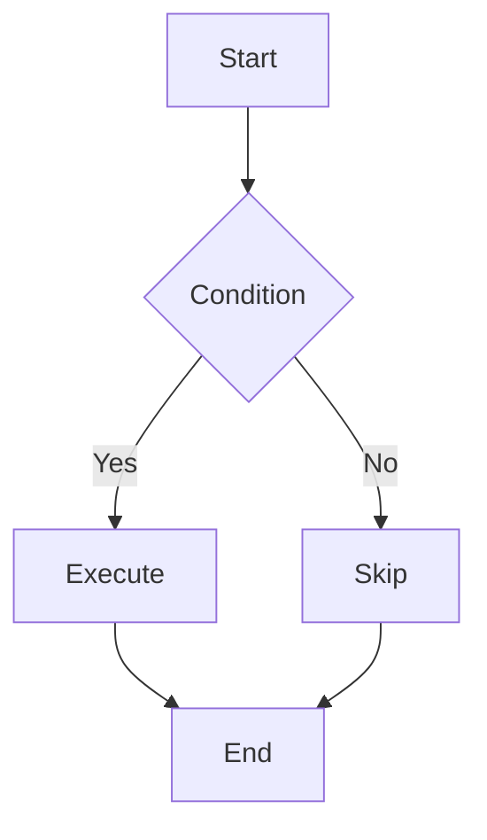

### Sequence Diagram

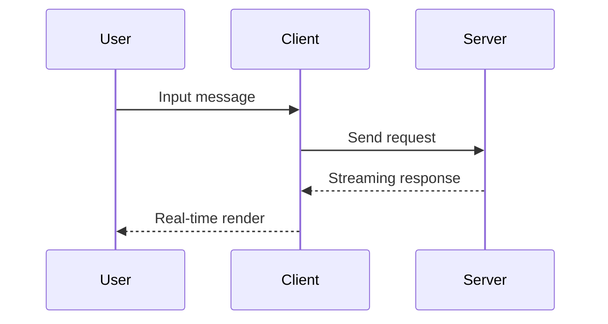

## 📝 GFM Features

Incremark supports all GitHub Flavored Markdown (GFM) features.

### Tables

| Feature | Status | Description |
|---------|--------|-------------|
| Incremental Parsing | ✅ | Core feature |
| Mermaid Charts | ✅ | Built-in support |
| Math Formulas | ✅ | LaTeX support |
| Custom Containers | ✅ | Fully supported |
| Custom Code Blocks | ✅ | Fully supported |

### Task Lists

- [x] Core parser
- [x] Vue 3 integration
- [x] React integration
- [x] Svelte 5 integration
- [x] Mermaid charts
- [x] LaTeX formulas
- [x] Custom containers
- [x] Custom code blocks
- [x] Typewriter effect
- [x] Theme system

### Strikethrough

This is ~~deleted text~~, and this is normal text.

## 🎨 Custom Containers

Incremark supports custom containers using the `::: container` syntax. Here are some examples:

:::warning
This is a **warning** container. Use it to highlight important warnings or cautions to users.
:::

:::info{title="Information"}
This is an **info** container with a custom title. Perfect for providing additional context or explanations.
:::

:::tip
This is a **tip** container. Great for sharing useful tips and best practices!
:::

Containers can also include multiple paragraphs and other Markdown elements:

:::info{title="Multi-paragraph Example"}
This is the first paragraph in the container.

This is the second paragraph. You can include:

- Lists
- **Bold text**
- *Italic text*
- Even `inline code`

All of these can be in the same container!
:::

### How to Create Custom Container Components

In React, you can create custom container components and pass them to `Incremark`:

```tsx
import { useIncremark, Incremark } from '@incremark/react'
import { CustomWarningContainer } from './CustomWarningContainer'
import { CustomInfoContainer } from './CustomInfoContainer'
import { CustomTipContainer } from './CustomTipContainer'

function App() {
  const incremark = useIncremark({ 
    gfm: true,
    containers: true  // Enable container support
  })

  // Define custom container mapping
  const customContainers = {
    warning: CustomWarningContainer,
    info: CustomInfoContainer,
    tip: CustomTipContainer,
  }

  return (
    <Incremark 
      incremark={incremark}
      customContainers={customContainers}
    />
  )
}
```

Custom container components receive `name` and `options` props, and use `children` to render content:

```tsx
// CustomWarningContainer.tsx
import React from 'react'

export interface CustomWarningContainerProps {
  name: string
  options?: Record<string, any>
  children?: React.ReactNode
}

export const CustomWarningContainer: React.FC<CustomWarningContainerProps> = ({ 
  options, 
  children 
}) => {
  return (
    <div className="custom-warning-container">
      <div className="custom-warning-header">
        <span className="custom-warning-icon">⚠️</span>
        <span className="custom-warning-title">
          {options?.title || 'Warning'}
        </span>
      </div>
      <div className="custom-warning-content">
        {children}
      </div>
    </div>
  )
}
```

## 📊 Custom Code Blocks

Incremark supports custom code block rendering components. For example, you can configure custom rendering for the `echarts` language:

```echarts
{
  "title": {
    "text": "Example Chart"
  },
  "xAxis": {
    "type": "category",
    "data": ["Mon", "Tue", "Wed", "Thu", "Fri", "Sat", "Sun"]
  },
  "yAxis": {
    "type": "value"
  },
  "series": [{
    "data": [120, 200, 150, 80, 70, 110, 130],
    "type": "bar"
  }]
}
```

### How to Create Custom Code Block Components

In React, you can create custom code block components and pass them to `Incremark`:

```tsx
import { useIncremark, Incremark } from '@incremark/react'
import { CustomEchartCodeBlock } from './CustomEchartCodeBlock'

function App() {
  const incremark = useIncremark({ gfm: true })

  // Define custom code block mapping
  const customCodeBlocks = {
    echarts: CustomEchartCodeBlock,
  }

  return (
    <Incremark 
      incremark={incremark}
      customCodeBlocks={customCodeBlocks}
    />
  )
}
```

Custom code block components receive `codeStr` and `lang` props:

```tsx
// CustomEchartCodeBlock.tsx
import React, { useEffect, useRef, useState } from 'react'
import * as echarts from 'echarts'

export interface CustomEchartCodeBlockProps {
  codeStr: string
  lang?: string
}

export const CustomEchartCodeBlock: React.FC<CustomEchartCodeBlockProps> = ({ 
  codeStr 
}) => {
  const chartRef = useRef<HTMLDivElement>(null)
  const [error, setError] = useState('')
  const [loading, setLoading] = useState(false)

  useEffect(() => {
    if (!codeStr) return

    setError('')
    setLoading(true)

    try {
      const option = JSON.parse(codeStr)
      if (!chartRef.current) {
        setLoading(false)
        return
      }

      const chart = echarts.getInstanceByDom(chartRef.current)
      if (chart) {
        chart.setOption(option)
      } else {
        const newChart = echarts.init(chartRef.current)
        newChart.setOption(option)
      }
    } catch (e: any) {
      setError(e.message || 'Render failed')
    } finally {
      setLoading(false)
    }
  }, [codeStr])

  return (
    <div className="custom-echart-code-block">
      <div className="echart-header">
        <span className="language">ECHART</span>
      </div>
      <div className="echart-content">
        {loading ? (
          <div className="echart-loading">Loading...</div>
        ) : error ? (
          <div className="echart-error">{error}</div>
        ) : (
          <div ref={chartRef} className="echart-chart" style={{ width: '100%', height: '400px' }}></div>
        )}
      </div>
    </div>
  )
}
```

## 🔗 HTML Support

When the `htmlTree` option is enabled, Incremark can parse and render HTML elements. Here are some HTML fragment examples:

<div style="background: #f0f9ff; padding: 1rem; border-radius: 6px; border-left: 4px solid #3b82f6; margin: 1em 0;">
  <p style="margin: 0; color: #1e40af;"><strong>HTML Element Example</strong></p>
  <p style="margin: 0.5em 0 0 0; color: #1e40af;">This is a paragraph with custom HTML styling.</p>
</div>

<details style="margin: 1em 0;">
  <summary style="cursor: pointer; font-weight: 600; padding: 0.5rem; background: #f3f4f6; border-radius: 4px;">Click to expand details</summary>
  <div style="padding: 1rem; background: #f9fafb; border-radius: 4px; margin-top: 0.5rem;">
    <p style="margin: 0;">This is the detail content. HTML support allows you to create richer interactive content.</p>
  </div>
</details>

## 💻 Code Highlighting

Incremark uses Shiki for code highlighting, supporting multiple programming languages:

```typescript
import { useIncremark, Incremark } from '@incremark/react'

function App() {
  const incremark = useIncremark({
    gfm: true,
    containers: true,
    htmlTree: true,  // Enable HTML support
  })

  const customContainers = {
    warning: CustomWarningContainer,
    info: CustomInfoContainer,
    tip: CustomTipContainer,
  }

  const customCodeBlocks = {
    echarts: CustomEchartCodeBlock,
  }

  return (
    <Incremark 
      incremark={incremark}
      customContainers={customContainers}
      customCodeBlocks={customCodeBlocks}
    />
  )
}
```

## ⌨️ Typewriter Effect

Incremark has built-in typewriter effect support for character-by-character display:

- **Character-by-character display**: Control the number of characters displayed each time
- **Adjustable speed**: Adjust tick interval for different speeds
- **Skip functionality**: Skip animation at any time to show all content
- **Plugin system**: Code blocks, images, etc. can be displayed as a whole

## 📊 Performance Comparison

Incremark's incremental parsing strategy brings significant performance improvements:

| Metric | Traditional | Incremark | Improvement |
|--------|-------------|-----------|-------------|
| Parse Volume | ~500K chars | ~50K chars | 90% ↓ |
| CPU Usage | High | Low | 80% ↓ |
| Frame Rate | Laggy | Smooth | ✅ |

## 📝 Blockquote Example

> 💡 **Tip**: Incremark's core advantage is **parsing-level incrementalization**, not just render-level optimization.
> 
> This means parsing performance remains stable even with very long content.

## 🔗 Links and Images

This is a [link example](https://www.incremark.com/) pointing to the Incremark website.

## 📜 Footnote Support

Incremark supports complete footnote functionality[^1], including footnote references and definitions.

[^1]: This is the footnote content. Footnotes can contain any Markdown content, including **bold**, *italic*, and `code`.

## 💡 More Features

- **Auto Scroll**: Automatically scroll to bottom when content updates
- **Block Status Display**: Visualize pending and completed blocks
- **Streaming Input**: Support char-by-char or block-by-block input
- **Type Safety**: Complete TypeScript type definitions

**Thanks for using Incremark!** 🙏


================================================
FILE: examples/react/src/locales/sample-zh.md
================================================
# 🚀 Incremark React 示例

欢迎使用 **Incremark**！这是一个专为 AI 流式输出设计的增量 Markdown 解析器。

## 📋 功能特点

Incremark 提供了丰富的功能来支持 AI 流式输出场景：

- ⚡ **增量解析** - 只解析新增内容，节省 90% 以上的 CPU 开销
- 🔄 **流式友好** - 支持逐字符/逐行输入，实时渲染
- 🎯 **边界检测** - 智能识别块边界，确保解析准确性
- 🔌 **框架支持** - 提供 Vue 3、React、Svelte 5 集成
- 📊 **DevTools** - 内置开发者工具，方便调试
- 🎨 **可定制** - 支持自定义渲染组件、容器和代码块
- 📐 **扩展支持** - GFM、数学公式、Mermaid 图表等
- ⌨️ **打字机效果** - 支持逐字符显示动画
- 🎭 **主题系统** - 支持默认、暗色和自定义主题
- 📜 **脚注支持** - 完整的脚注引用和定义功能
- 🔗 **HTML 支持** - 可选的 HTML 元素解析
- 📦 **自定义容器** - 支持警告、提示、信息等自定义容器
- 💻 **自定义代码块** - 支持 ECharts、Mermaid 等自定义代码块渲染

## 📐 数学公式

Incremark 支持 LaTeX 数学公式，包括行内公式和块级公式。

行内公式：质能方程 $E = mc^2$ 是物理学中最著名的公式之一。

块级公式 - 欧拉公式：

$$
e^{i\pi} + 1 = 0
$$

二次方程的求根公式：

$$
x = \frac{-b \pm \sqrt{b^2 - 4ac}}{2a}
$$

## 📊 Mermaid 图表

Incremark 内置支持 Mermaid 图表渲染，支持流程图、时序图等多种图表类型。

### 流程图

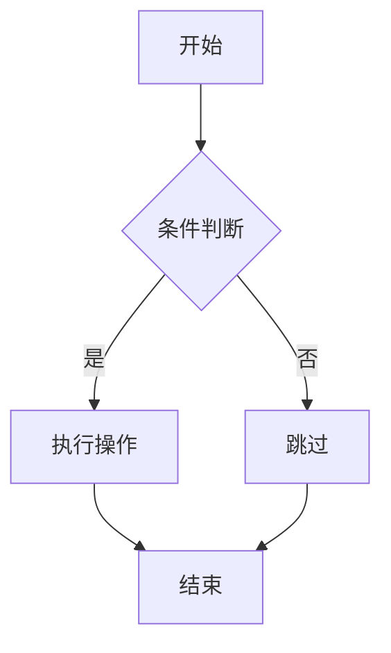

### 时序图

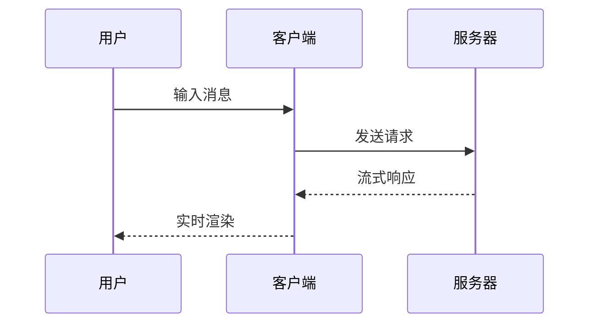

## 📝 GFM 功能

Incremark 支持 GitHub Flavored Markdown (GFM) 的所有功能。

### 表格

| 功能 | 状态 | 说明 |
|------|------|------|
| 增量解析 | ✅ | 核心功能 |
| Mermaid 图表 | ✅ | 内置支持 |
| 数学公式 | ✅ | LaTeX 支持 |
| 自定义容器 | ✅ | 完全支持 |
| 自定义代码块 | ✅ | 完全支持 |

### 任务列表

- [x] 核心解析器
- [x] Vue 3 集成
- [x] React 集成
- [x] Svelte 5 集成
- [x] Mermaid 图表
- [x] LaTeX 公式
- [x] 自定义容器
- [x] 自定义代码块
- [x] 打字机效果
- [x] 主题系统

### 删除线

这是~~被删除的文本~~，这是正常文本。

## 🎨 自定义容器

Incremark 支持使用 `::: container` 语法创建自定义容器。以下是一些示例：

:::warning
这是一个**警告**容器。用于向用户突出显示重要的警告或注意事项。
:::

:::info{title="信息提示"}
这是一个带自定义标题的**信息**容器。非常适合提供额外的上下文或解释说明。
:::

:::tip
这是一个**提示**容器。非常适合分享有用的提示和最佳实践！
:::

容器还可以包含多个段落和其他 Markdown 元素：

:::info{title="多段落示例"}
这是容器中的第一段。

这是第二段。你可以包含：

- 列表
- **粗体文本**
- *斜体文本*
- 甚至 `行内代码`

所有这些都可以在同一个容器中！
:::

### 如何自定义容器组件

在 React 中，你可以创建自定义容器组件并传递给 `Incremark`：

```tsx
import { useIncremark, Incremark } from '@incremark/react'
import { CustomWarningContainer } from './CustomWarningContainer'
import { CustomInfoContainer } from './CustomInfoContainer'
import { CustomTipContainer } from './CustomTipContainer'

function App() {
  const incremark = useIncremark({ 
    gfm: true,
    containers: true  // 启用容器支持
  })

  // 定义自定义容器映射
  const customContainers = {
    warning: CustomWarningContainer,
    info: CustomInfoContainer,
    tip: CustomTipContainer,
  }

  return (
    <Incremark 
      incremark={incremark}
      customContainers={customContainers}
    />
  )
}
```

自定义容器组件接收 `name` 和 `options` props，并使用 `children` 渲染内容：

```tsx
// CustomWarningContainer.tsx
import React from 'react'

export interface CustomWarningContainerProps {
  name: string
  options?: Record<string, any>
  children?: React.ReactNode
}

export const CustomWarningContainer: React.FC<CustomWarningContainerProps> = ({ 
  options, 
  children 
}) => {
  return (
    <div className="custom-warning-container">
      <div className="custom-warning-header">
        <span className="custom-warning-icon">⚠️</span>
        <span className="custom-warning-title">
          {options?.title || '警告'}
        </span>
      </div>
      <div className="custom-warning-content">
        {children}
      </div>
    </div>
  )
}
```

## 📊 自定义代码块

Incremark 支持自定义代码块渲染组件。例如，可以为 `echarts` 语言配置自定义渲染：

```echarts
{
  "title": {
    "text": "示例图表"
  },
  "xAxis": {
    "type": "category",
    "data": ["Mon", "Tue", "Wed", "Thu", "Fri", "Sat", "Sun"]
  },
  "yAxis": {
    "type": "value"
  },
  "series": [{
    "data": [120, 200, 150, 80, 70, 110, 130],
    "type": "bar"
  }]
}
```

### 如何自定义代码块组件

在 React 中，你可以创建自定义代码块组件并传递给 `Incremark`：

```tsx
import { useIncremark, Incremark } from '@incremark/react'
import { CustomEchartCodeBlock } from './CustomEchartCodeBlock'

function App() {
  const incremark = useIncremark({ gfm: true })

  // 定义自定义代码块映射
  const customCodeBlocks = {
    echarts: CustomEchartCodeBlock,
  }

  return (
    <Incremark 
      incremark={incremark}
      customCodeBlocks={customCodeBlocks}
    />
  )
}
```

自定义代码块组件接收 `codeStr` 和 `lang` props：

```tsx
// CustomEchartCodeBlock.tsx
import React, { useEffect, useRef, useState } from 'react'
import * as echarts from 'echarts'

export interface CustomEchartCodeBlockProps {
  codeStr: string
  lang?: string
}

export const CustomEchartCodeBlock: React.FC<CustomEchartCodeBlockProps> = ({ 
  codeStr 
}) => {
  const chartRef = useRef<HTMLDivElement>(null)
  const [error, setError] = useState('')
  const [loading, setLoading] = useState(false)

  useEffect(() => {
    if (!codeStr) return

    setError('')
    setLoading(true)

    try {
      const option = JSON.parse(codeStr)
      if (!chartRef.current) {
        setLoading(false)
        return
      }

      const chart = echarts.getInstanceByDom(chartRef.current)
      if (chart) {
        chart.setOption(option)
      } else {
        const newChart = echarts.init(chartRef.current)
        newChart.setOption(option)
      }
    } catch (e: any) {
      setError(e.message || '渲染失败')
    } finally {
      setLoading(false)
    }
  }, [codeStr])

  return (
    <div className="custom-echart-code-block">
      <div className="echart-header">
        <span className="language">ECHART</span>
      </div>
      <div className="echart-content">
        {loading ? (
          <div className="echart-loading">加载中...</div>
        ) : error ? (
          <div className="echart-error">{error}</div>
        ) : (
          <div ref={chartRef} className="echart-chart" style={{ width: '100%', height: '400px' }}></div>
        )}
      </div>
    </div>
  )
}
```

## 🔗 HTML 支持

当启用 `htmlTree` 选项时，Incremark 可以解析和渲染 HTML 元素。以下是一些 HTML 片段示例：

<div style="background: #f0f9ff; padding: 1rem; border-radius: 6px; border-left: 4px solid #3b82f6; margin: 1em 0;">
  <p style="margin: 0; color: #1e40af;"><strong>HTML 元素示例</strong></p>
  <p style="margin: 0.5em 0 0 0; color: #1e40af;">这是一个使用 HTML 样式自定义的段落。</p>
</div>

<details style="margin: 1em 0;">
  <summary style="cursor: pointer; font-weight: 600; padding: 0.5rem; background: #f3f4f6; border-radius: 4px;">点击展开详情</summary>
  <div style="padding: 1rem; background: #f9fafb; border-radius: 4px; margin-top: 0.5rem;">
    <p style="margin: 0;">这是详情内容。HTML 支持让你可以创建更丰富的交互式内容。</p>
  </div>
</details>

## 💻 代码高亮

Incremark 使用 Shiki 进行代码高亮，支持多种编程语言：

```typescript
import { useIncremark, Incremark } from '@incremark/react'

function App() {
  const incremark = useIncremark({
    gfm: true,
    containers: true,
    htmlTree: true,  // 启用 HTML 支持
  })

  const customContainers = {
    warning: CustomWarningContainer,
    info: CustomInfoContainer,
    tip: CustomTipContainer,
  }

  const customCodeBlocks = {
    echarts: CustomEchartCodeBlock,
  }

  return (
    <Incremark 
      incremark={incremark}
      customContainers={customContainers}
      customCodeBlocks={customCodeBlocks}
    />
  )
}
```

## ⌨️ 打字机效果

Incremark 内置打字机效果支持，可以逐字符显示内容：

- **逐字符显示**：控制每次显示的字符数
- **速度可调**：调节 tick 间隔实现不同速度
- **跳过功能**：随时跳过动画显示全部内容
- **插件系统**：代码块、图片等可整体显示

## 📊 性能对比

Incremark 的增量解析策略带来了显著的性能提升：

| 指标 | 传统方式 | Incremark | 提升 |
|------|----------|-----------|------|
| 解析量 | ~50万字符 | ~5万字符 | 90% ↓ |
| CPU 占用 | 高 | 低 | 80% ↓ |
| 渲染帧率 | 卡顿 | 流畅 | ✅ |

## 📝 引用示例

> 💡 **提示**：Incremark 的核心优势是**解析层增量化**，而非仅仅是渲染层优化。
> 
> 这意味着即使内容很长，解析性能也能保持稳定。

## 🔗 链接和图片

这是一个[链接示例](https://www.incremark.com/)，指向 Incremark 官网。

## 📜 脚注支持

Incremark 支持完整的脚注功能[^1]，包括脚注引用和定义。

[^1]: 这是脚注的内容。脚注可以包含任何 Markdown 内容，包括**粗体**、*斜体*和`代码`。

## 💡 更多功能

- **自动滚动**：内容更新时自动滚动到底部
- **块状态显示**：可视化显示待处理和已完成的块
- **流式输入**：支持逐字符或逐块输入
- **类型安全**：完整的 TypeScript 类型定义

**感谢使用 Incremark！** 🙏


================================================
FILE: examples/react/src/locales/zh.json
================================================
{
  "title": "🚀 Incremark React 示例",
  "simulateAI": "模拟 AI 输出",
  "streaming": "正在输出...",
  "renderOnce": "一次性渲染",
  "reset": "重置",
  "customComponents": "使用自定义组件",
  "chars": "字符",
  "blocks": "块",
  "pending": "待定",
  "benchmark": "性能对比",
  "benchmarkMode": "对比模式",
  "runBenchmark": "运行对比测试",
  "running": "测试中...",
  "traditional": "传统方式",
  "incremark": "Incremark",
  "totalTime": "总耗时",
  "totalChars": "总解析量",
  "speedup": "加速比",
  "benchmarkNote": "传统方式每次收到新内容都重新解析全部文本，Incremark 只解析新增部分。",
  "customInput": "自定义输入",
  "inputPlaceholder": "在这里输入你的 Markdown 内容...",
  "useExample": "使用示例",
  "typewriterMode": "⌨️ 打字机",
  "skip": "跳过",
  "pause": "暂停",
  "resume": "继续",
  "typing": "输入中...",
  "paused": "已暂停",
  "charsPerTick": "字符/tick",
  "intervalMs": "ms/tick",
  "randomStep": "随机步长",
  "effectNone": "无动画",
  "effectFadeIn": "渐入",
  "effectTyping": "光标",
  "autoScroll": "📜 自动滚动",
  "scrollPaused": "已暂停",
  "htmlMode": "🌐 HTML 渲染",
  "mathTex": "🔢 TeX",
  "texTooltip": "启用 TeX 风格分隔符 \\(...\\) 和 \\[...\\]",
  "engineMarked": "⚡ Marked",
  "engineMicromark": "🔧 Micromark",
  "engineTooltip": "切换解析引擎（切换后将重置内容）"
}


================================================
FILE: examples/shared/styles.css
================================================
/**
 * Incremark Demo 共享样式
 * 同时用于 Vue 和 React 示例
 */

/* ============ 重置 ============ */
* {
  margin: 0;
  padding: 0;
  box-sizing: border-box;
}

/* ============ 基础 ============ */
body {
  font-family: -apple-system, BlinkMacSystemFont, 'Segoe UI', Roboto, 'Helvetica Neue', sans-serif;
  background: #f5f5f5;
  min-height: 100vh;
  color: #333;
}

.app {
  max-width: 900px;
  margin: 0 auto;
  padding: 2rem;
}

/* ============ Header ============ */
header {
  margin-bottom: 1.5rem;
}

.header-top {
  display: flex;
  justify-content: space-between;
  align-items: center;
  margin-bottom: 1rem;
}

.header-controls {
  display: flex;
  align-items: center;
  gap: 16px;
  margin-bottom: 0.5rem;
}

.html-toggle {
  font-weight: 500;
}

header h1 {
  font-size: 1.75rem;
  color: #1a1a1a;
}

/* ============ 按钮 ============ */
button {
  padding: 0.5rem 1rem;
  border: none;
  border-radius: 6px;
  font-weight: 500;
  font-size: 0.875rem;
  cursor: pointer;
  transition: background 0.15s, opacity 0.15s;
}

button:disabled {
  opacity: 0.5;
  cursor: not-allowed;
}

/* 主要按钮 - 蓝色 */
button.primary,
.controls > button:first-child {
  background: #3b82f6;
  color: white;
}

button.primary:hover:not(:disabled),
.controls > button:first-child:hover:not(:disabled) {
  background: #2563eb;
}

/* 次要按钮 - 灰色 */
button.secondary,
.controls > button:not(:first-child):not(.skip-btn):not(.pause-btn):not(.resume-btn) {
  background: #e5e7eb;
  color: #374151;
}

button.secondary:hover:not(:disabled),
.controls > button:not(:first-child):not(.skip-btn):not(.pause-btn):not(.resume-btn):hover:not(:disabled) {
  background: #d1d5db;
}

/* 语言切换按钮 */
.lang-toggle {
  background: #fff;
  color: #374151;
  border: 1px solid #d1d5db;
  padding: 0.5rem 1rem;
  font-size: 0.875rem;
}

.lang-toggle:hover {
  background: #f9fafb;
  border-color: #9ca3af;
}

/* ============ 控制栏 ============ */
.controls {
  display: flex;
  gap: 0.75rem;
  align-items: center;
  flex-wrap: wrap;
  padding: 1rem;
  background: #fff;
  border-radius: 8px;
  box-shadow: 0 1px 3px rgba(0, 0, 0, 0.1);
  margin-bottom: 12px;
}

/* ============ 复选框 - 统一蓝色 ============ */
.checkbox {
  display: flex;
  align-items: center;
  gap: 0.4rem;
  cursor: pointer;
  font-size: 0.875rem;
  color: #4b5563;
  user-select: none;
}

.checkbox input[type="checkbox"] {
  width: 16px;
  height: 16px;
  cursor: pointer;
  accent-color: #3b82f6;
}

/* ============ 速度控制 ============ */
.speed-control {
  display: flex;
  align-items: center;
  gap: 0.5rem;
}

.speed-control input[type="range"] {
  width: 80px;
  accent-color: #3b82f6;
  cursor: pointer;
}

.speed-value {
  font-size: 0.75rem;
  color: #6b7280;
  min-width: 70px;
}

/* ============ 效果选择器 ============ */
.effect-select {
  padding: 0.4rem 0.6rem;
  border-radius: 6px;
  border: 1px solid #d1d5db;
  background: white;
  font-size: 0.85rem;
  cursor: pointer;
  color: #374151;
}

.effect-select:hover {
  border-color: #9ca3af;
}

.effect-select:focus {
  outline: none;
  border-color: #3b82f6;
  box-shadow: 0 0 0 2px rgba(59, 130, 246, 0.2);
}

/* ============ 主题选择器 ============ */
.theme-select {
  padding: 0.4rem 0.6rem;
  border-radius: 6px;
  border: 1px solid #d1d5db;
  background: white;
  font-size: 0.85rem;
  cursor: pointer;
  color: #374151;
  min-width: 140px;
}

.theme-select:hover {
  border-color: #9ca3af;
}

.theme-select:focus {
  outline: none;
  border-color: #3b82f6;
  box-shadow: 0 0 0 2px rgba(59, 130, 246, 0.2);
}

/* ============ 打字机控制按钮 ============ */
.skip-btn,
.pause-btn,
.resume-btn {
  padding: 0.4rem 0.8rem;
  font-size: 0.85rem;
  border-radius: 6px;
}

.skip-btn {
  background: #6b7280;
  color: white;
}

.skip-btn:hover:not(:disabled) {
  background: #4b5563;
}

.pause-btn {
  background: #f59e0b;
  color: white;
}

.pause-btn:hover:not(:disabled) {
  background: #d97706;
}

.resume-btn {
  background: #10b981;
  color: white;
}

.resume-btn:hover:not(:disabled) {
  background: #059669;
}

.random-step-toggle {
  font-size: 0.85rem;
}

/* ============ 统计信息 ============ */
.stats {
  font-size: 0.875rem;
  color: #6b7280;
  margin-left: auto;
  padding: 0.5rem 0;
}

/* ============ 滚动提示 ============ */
.scroll-paused-hint {
  color: #f59e0b;
  font-size: 0.75rem;
  margin-left: 0.25rem;
}

/* ============ 内容区域 ============ */
.content {
  background: white;
  border-radius: 8px;
  box-shadow: 0 1px 3px rgba(0, 0, 0, 0.1);
  height: 500px;
  overflow: hidden;
}

.scroll-container {
  height: 100%;
  max-height: 70vh;
}
.incremark {
  padding: 2rem;
}

/* ============ 自定义输入面板 ============ */
.input-panel {
  background: white;
  border-radius: 8px;
  padding: 1rem;
  margin-bottom: 1.5rem;
  box-shadow: 0 1px 3px rgba(0, 0, 0, 0.1);
}

.input-header {
  display: flex;
  justify-content: space-between;
  align-items: center;
  margin-bottom: 0.75rem;
  font-weight: 500;
  color: #1f2937;
}

.use-example-btn {
  background: #e5e7eb;
  color: #374151;
  padding: 0.4rem 1rem;
  font-size: 0.85rem;
  border: none;
  border-radius: 6px;
  cursor: pointer;
  transition: background 0.15s;
}

.use-example-btn:hover {
  background: #d1d5db;
}

.markdown-input {
  width: 100%;
  padding: 0.75rem;
  border: 1px solid #d1d5db;
  border-radius: 6px;
  font-family: 'SF Mono', 'Monaco', 'Consolas', monospace;
  font-size: 0.875rem;
  resize: vertical;
  line-height: 1.6;
  color: #1f2937;
  background: #fafafa;
}

.markdown-input:focus {
  outline: none;
  border-color: #3b82f6;
  box-shadow: 0 0 0 2px rgba(59, 130, 246, 0.2);
  background: white;
}

.markdown-input::placeholder {
  color: #9ca3af;
}

/* ============ Benchmark 面板 ============ */
.benchmark-panel {
  background: #1f2937;
  border-radius: 8px;
  padding: 1.5rem;
  margin-bottom: 1.5rem;
  color: #f3f4f6;
}

.benchmark-header {
  display: flex;
  justify-content: space-between;
  align-items: center;
  margin-bottom: 1rem;
}

.benchmark-header h2 {
  font-size: 1.25rem;
  margin: 0;
}

.benchmark-btn {
  background: #10b981;
  color: white;
  border: none;
  padding: 0.5rem 1.5rem;
  border-radius: 6px;
  cursor: pointer;
  font-size: 0.9rem;
  transition: background 0.15s;
}

.benchmark-btn:hover:not(:disabled) {
  background: #059669;
}

.benchmark-btn:disabled {
  opacity: 0.5;
  cursor: not-allowed;
}

.benchmark-progress {
  height: 4px;
  background: #374151;
  border-radius: 2px;
  margin-bottom: 1rem;
  overflow: hidden;
}

.progress-bar {
  height: 100%;
  background: #3b82f6;
  transition: width 0.3s ease;
}

.benchmark-results {
  display: grid;
  grid-template-columns: repeat(3, 1fr);
  gap: 1rem;
  margin-bottom: 1rem;
}

.benchmark-card {
  background: rgba(255, 255, 255, 0.1);
  border-radius: 6px;
  padding: 1rem;
  text-align: center;
}

.benchmark-card h3 {
  font-size: 0.9rem;
  font-weight: 600;
  margin-bottom: 0.75rem;
  color: #f9fafb;
}

.benchmark-card.traditional {
  border-left: 3px solid #ef4444;
}

.benchmark-card.traditional h3 {
  color: #fca5a5;
}

.benchmark-card.incremark {
  border-left: 3px solid #10b981;
}

.benchmark-card.incremark h3 {
  color: #6ee7b7;
}

.benchmark-card.speedup {
  border-left: 3px solid #3b82f6;
}

.benchmark-card.speedup h3 {
  color: #93c5fd;
}

.benchmark-card .stat {
  display: flex;
  justify-content: space-between;
  font-size: 0.85rem;
  margin: 0.35rem 0;
  color: #e5e7eb;
}

.benchmark-card .label {
  color: #9ca3af;
}

.benchmark-card .value {
  font-weight: 600;
  color: #f9fafb;
}

.speedup-value {
  font-size: 2.5rem;
  font-weight: 700;
  color: #60a5fa;
}

.benchmark-note {
  font-size: 0.85rem;
  opacity: 0.7;
  margin: 0;
}

/* ============ 打字机动画效果 ============ */
.incremark-fade-in {
  animation: incremark-fade-in 0.4s ease-out both;
}

@keyframes incremark-fade-in {
  from { opacity: 0; }
  to { opacity: 1; }
}

/* ============ 自定义容器样式 ============ */
.custom-warning-container {
  margin: 1em 0;
  padding: 1em;
  border-radius: 6px;
  border-left: 4px solid #f59e0b;
  background-color: #fef3c7;
  color: #92400e;
}

.custom-warning-header {
  display: flex;
  align-items: center;
  gap: 0.5em;
  margin-bottom: 0.75em;
  font-weight: 600;
  font-size: 0.95em;
}

.custom-warning-icon {
  font-size: 1.2em;
  line-height: 1;
}

.custom-warning-title {
  color: inherit;
}

.custom-warning-content {
  color: inherit;
}

.custom-info-container {
  margin: 1em 0;
  padding: 1em;
  border-radius: 6px;
  border-left: 4px solid #3b82f6;
  background-color: #dbeafe;
  color: #1e40af;
}

.custom-info-header {
  display: flex;
  align-items: center;
  gap: 0.5em;
  margin-bottom: 0.75em;
  font-weight: 600;
  font-size: 0.95em;
}

.custom-info-icon {
  font-size: 1.2em;
  line-height: 1;
}

.custom-info-title {
  color: inherit;
}

.custom-info-content {
  color: inherit;
}

.custom-tip-container {
  margin: 1em 0;
  padding: 1em;
  border-radius: 6px;
  border-left: 4px solid #10b981;
  background-color: #d1fae5;
  color: #065f46;
}

.custom-tip-header {
  display: flex;
  align-items: center;
  gap: 0.5em;
  margin-bottom: 0.75em;
  font-weight: 600;
  font-size: 0.95em;
}

.custom-tip-icon {
  font-size: 1.2em;
  line-height: 1;
}

.custom-tip-title {
  color: inherit;
}

.custom-tip-content {
  color: inherit;
}

/* ============ 自定义代码块样式 ============ */
.custom-echart-code-block {
  margin: 1em 0;
  border: 1px solid #e5e7eb;
  border-radius: 6px;
  overflow: hidden;
}

.echart-header {
  display: flex;
  align-items: center;
  justify-content: space-between;
  padding: 0.5rem 1rem;
  background-color: #f9fafb;
  border-bottom: 1px solid #e5e7eb;
}

.echart-header .language {
  font-size: 0.875rem;
  font-weight: 600;
  color: #6b7280;
  text-transform: uppercase;
}

.echart-content {
  padding: 1rem;
  background-color: #fff;
}

.echart-loading,
.echart-error {
  padding: 2rem;
  text-align: center;
  color: #6b7280;
}

.echart-error {
  color: #ef4444;
}

.echart-chart {
  min-height: 400px;
}

/* ============ 自定义标题样式 ============ */
.custom-heading {
  color: #7c3aed;
  border-bottom: 2px solid #7c3aed;
  padding-bottom: 0.5rem;
  margin: 0.5em 0;
  font-weight: 600;
  line-height: 1.3;
}

/* ============ 响应式 ============ */
@media (max-width: 600px) {
  .app {
    padding: 1rem;
  }

  .controls {
    padding: 0.75rem;
    gap: 0.5rem;
  }

  .benchmark-results {
    grid-template-columns: 1fr;
  }

  header h1 {
    font-size: 1.5rem;
  }

  .stats {
    width: 100%;
    text-align: center;
    margin-top: 0.5rem;
  }
}


================================================
FILE: examples/solid/index.html
================================================
<!DOCTYPE html>
<html lang="en">
<head>
  <meta charset="UTF-8" />
  <meta name="viewport" content="width=device-width, initial-scale=1.0" />
  <title>Incremark - SolidJS Example</title>
</head>
<body>
  <div id="root"></div>
  <script src="/src/main.tsx" type="module"></scr