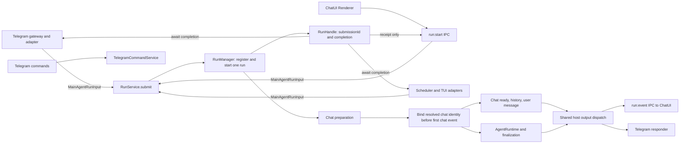

# Unified chat run submission proposal

Owner: Chat runtime maintainers 
Status: Implemented; live Telegram-to-ChatUI acceptance pending 
Started: 2026-09-30 
Target: One Main submission contract and early chat identity binding 
Exit criteria: Confirm ownership and failure semantics, record the accepted decision, implement it, and verify all host entries 
Related specs: [Documentation governance](../../specs/documentation-governance.md) 
Related implementation: [RunService](../../../src/main/orchestration/chat/run/index.ts), [RunManager](../../../src/main/orchestration/chat/run/runtime/RunManager.ts), [Chat IPC](../../../src/main/ipc/chat.ts), [Telegram gateway](../../../src/main/services/telegram/TelegramGatewayService.ts), [Scheduler](../../../src/main/services/scheduler/SchedulerService.ts), [TUI session](../../../src/main/orchestration/tui/TuiSession.ts) 
Related decisions: [Host output dispatch](../../decisions/0027-unified-host-output-dispatch.md), [Renderer run ingress](../../decisions/0028-renderer-run-ingress-and-message-revisions.md), [Unified run submission](../../decisions/0029-unified-run-submission.md)

## Problem and current behavior

ChatUI constructs `MainAgentRunInput` in the Renderer and crosses the process boundary through `run:start` IPC. The Main handler currently logs the submission and calls `RunService.start()`. Telegram, Scheduler, and TUI already run in Main and call `RunService.execute()` directly. `MainAgentRunInput` is a shared data type, not a third submission method.

Both methods create an `AgentRun`, register it, emit acceptance, and run the same pipeline. `start()` returns the receipt immediately and handles the completion in the background. `execute()` waits for the terminal result, translates failed and aborted results to errors, and cleans up in `finally`. This duplicates lifecycle ownership even though only the caller's waiting behavior differs.

The early Telegram user-message defect exposes a second boundary problem. `RunManager.createRun()` creates an emitter with only `submissionId`; `AgentRun.run()` attaches `chatId` and `chatUuid` after `ChatAgentAdapter.prepareRun()` returns. Preparation already emits `chat.ready`, history, and the persisted user message. A Telegram run has no desktop registration, so Renderer ingress cannot associate those early events with a chat. Later assistant events have the chat identity and do render.

## Proposed flow

Host adapters keep their own ingress work. Telegram keeps command routing, peer-to-chat binding, attachments, model selection, and responder construction. ChatUI keeps its optimistic pending state. Scheduler keeps task occurrence and execution-chat ownership; TUI keeps its queue and interactive state. Each ordinary run submits the same `MainAgentRunInput` to Main. Telegram commands remain outside the ordinary run path.

`run:start` remains the Renderer-to-Main transport boundary. It does not represent a second run lifecycle or a request to wait for model completion. Only the Main submission API is unified; the IPC response contains serializable acceptance data and never carries a Promise. The reverse `run:event` channel continues to deliver run updates.

## Submission and result contract

| Boundary | Proposed contract |
| --- | --- |
| `RunService.submit(input, options)` | One Main entry that starts one run and returns a Main-local handle containing `submissionId` and `completion: Promise<RunResult>`. |
| Acceptance | Creating and registering the run succeeds before returning the handle. Duplicate IDs and invalid submission invariants fail at this boundary. Acceptance does not claim the model or a later Chat preparation succeeded. |
| Completion | Resolves with the successful terminal `RunResult`; rejects for failed or aborted runs, preserving the current `execute()` caller behavior. It does not wait for asynchronous post-run jobs. |
| ChatUI IPC | Calls `submit()`, returns `{ accepted: true, submissionId }`, and relies on `run:event` for subsequent state. The Main-owned completion has an explicit rejection observer so this fire-and-forget caller cannot cause an unhandled rejection. |
| Telegram, Scheduler, TUI | Call `submit()` and await `handle.completion` where they currently await `execute()`. Their existing success, failure, and cleanup reactions remain host-owned. |
| Cancellation and cleanup | One terminal path releases pending interactions and deletes the run from `RunRegistry` exactly once, regardless of which caller awaits completion. Main remains the authority for active-run identity. |

The IPC handler is a trust boundary and should validate the transport payload before passing it to `RunService`; it currently only types the argument as `MainAgentRunInput`, logs, and delegates. `RunService` should enforce shared submission invariants. Neither should repeat Telegram attachment or ChatUI presentation logic.

For an existing chat, bind input `chatId` and `chatUuid` to the emitter when the run is created. For a new chat, bind the identity returned by `RunEnvironmentService.prepare()` immediately after resolution and before `chat.ready`, history, or user-message events. The later `AgentRun` assignment may maintain its own active-run identity, but it must not be the first event-scope assignment.

## Implementation sequence

1. Bind known chat identity when creating the emitter, and bind newly resolved identity before the first preparation event. This is independently usable with the current `start()` and `execute()` APIs and fixes the Telegram user-message gap. Cover both existing and new chats before changing submission semantics.
2. Replace the two Main entry methods with one `submit()` and migrate the Chat IPC, Telegram, Scheduler, and TUI callers together. One completion path then owns error translation and cleanup. Preserve each caller's current receipt or terminal-result behavior.

## Scope and verification

The change is one lifecycle/API refactor plus the early-event identity correction. It does not change model execution, host output routing, persistence schema, Telegram commands, or the Renderer transcript version merge. Remove the old `start()` and `execute()` entry methods and update their callers and test doubles together; no legacy compatibility entry is required for this proposal.

Before delivery, cover duplicate submissions and admission errors; successful, failed, and aborted completion; one-time registry and interaction cleanup; ChatUI receipt without waiting or unhandled rejection; Telegram, Scheduler, and TUI waiting behavior; existing-chat and new-chat `chat.ready`/history/user-message events with a `chatUuid`; and Telegram user-message visibility before assistant output. Run focused tests, changed-file lint, Node and Web typechecks, Main and Renderer architecture/path checks where affected, full coverage for the shared lifecycle refactor, and Electron runtime acceptance. Keep existing unrelated worktree edits intact.

## Architecture discussion to close

1. Keep the Main-local handle as the only result of `submit()`; let each transport decide whether to await completion. This avoids a mode flag and a second lifecycle branch.
2. Keep source-specific chat binding in host adapters where it already has host identity. Resolve new ChatUI chats during common Chat preparation, then bind the emitter before the first chat-scoped event.
3. Put shared admission invariants in `RunService` and transport-shape validation at the IPC boundary. Avoid another coordinator class unless a second actual admission consumer needs one.

The accepted contract is recorded in ADR-0029 and the current architecture document. The earlier sections preserve the motivating before-state and implementation plan.
