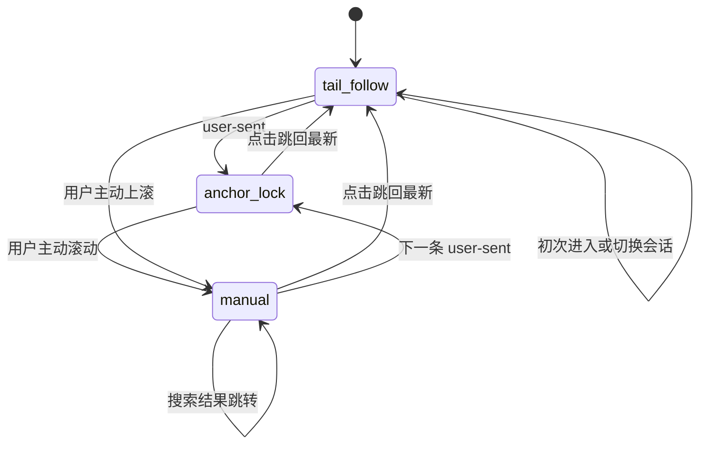

# ChatWindow 滚动与虚拟列表优化方案

Owner: Chat UI maintainers<br>
Status: Active<br>
Started: 2026-07-11<br>
Target: Complete real-stream validation for the remaining phase<br>
Exit criteria: Phase-three stream scenarios pass and current architecture is synchronized<br>
Related specs: [Documentation governance](../../../specs/documentation-governance.md)<br>
Related implementation: `src/renderer/src`

## 文档状态

- 状态：阶段一、阶段二、阶段四已实施；阶段三等待真实流式验收
- 目标组件：`ChatWindow`
- 主要文件：
  - `src/renderer/src/features/chat/shell/ChatWindow.tsx`
  - `src/renderer/src/features/chat/useScrollManagerTop.ts`
- 依赖基础：`@tanstack/react-virtual@3.14.3` 与 `@tanstack/virtual-core@3.17.1`

## 1. 结论

采用增量优化，保留 TanStack Virtual 与定制 `virtual-core` 承担的动态测量、尾部锚定、追加跟随和 resize 补偿能力。

本轮围绕五个目标展开：

1. 用户发送消息后，把该条 user 消息第一行对齐到聊天视口顶部。
2. assistant 流式输出期间保持当前视口位置，内容向下生长。
3. 用户主动上滚后锁定手动浏览状态，并显示“跳回最新消息”按钮。
4. 用户点击按钮后贴到列表底部，随后持续跟随新内容，直到下一次主动上滚。
5. 清理死 API、重复 scroll hint 执行骨架，并通过 overscan 调参降低长会话渲染成本。

状态机主体继续使用现有 refs。新增一个 `anchor-lock` 模式和一个 user 锚点标识即可表达新行为，其他意图识别与程序滚动抑制机制保持现有边界。

## 2. 产品行为合同

| 场景 | 目标行为 | 滚动模式 | “跳回最新”按钮 |
| --- | --- | --- | --- |
| 初次进入已有会话 | 保持现有逻辑，定位最后一条消息底部 | `tail-follow` | 隐藏 |
| 切换会话 | 保持现有 `conversation-switch` 目标与对齐方式 | `tail-follow` | 隐藏 |
| 搜索结果跳转 | 保持现有目标消息顶部对齐 | `manual` | 显示 |
| 用户发送消息 | 精确定位该 user 消息，并把第一行对齐视口顶部 | `anchor-lock` | 隐藏 |
| assistant 流式输出 | `scrollTop` 保持稳定，文本向下生长 | `anchor-lock` | 隐藏 |
| 用户主动上滚 | 保留当前浏览位置，后续流式内容不改变视口 | `manual` | 显示 |
| 用户手动滚回底部 | 保持手动浏览语义，由按钮完成显式恢复 | `manual` | 保持显示 |
| 点击“跳回最新消息” | 平滑滚到最新消息底部 | `tail-follow` | 点击后淡出并隐藏 |
| 点击后继续流式输出 | 由尾部锚定与 resize 补偿持续贴底 | `tail-follow` | 隐藏 |

按钮语义由“用户正在浏览历史”驱动。用户意图事件与显式按钮操作完整管理模式转换。

## 3. 当前实现证据

### 3.1 user-sent 目标计算与执行目标分离

`ChatWindow.tsx:453-486` 已计算 `anchorIndex` 和 `resolvedTargetIndex`，实际调用仍为：

```ts
scrollToMessageIndex(latestVirtualIndex, false, 'end')
```

这使 `messageId` 只参与 early return，滚动结果始终指向虚拟列表末项。

### 3.2 顶部对齐还需要尾部滚动空间

当前 virtualizer 使用固定 `paddingEnd: 12`，见 `ChatWindow.tsx:390-405`。定制 core 的 `getOffsetForAlignment()` 会把目标 offset 限制在浏览器实际 `maxOffset` 内。

当新 user 消息与 pending assistant 的合计高度小于视口可用高度时，列表尾部缺少足够滚动空间。此时仅把调用改为：

```ts
scrollToMessageIndex(resolvedTargetIndex, false, 'start')
```

仍会被最大滚动距离截断，user 消息无法稳定置顶。方案需要恢复动态尾部填充，并让填充只承担“为当前 user 锚点提供顶部对齐空间”的职责。

### 3.3 流式期存在主动追尾路径

`ChatWindow.tsx:653-661` 的 `handleLatestAssistantTyping()` 在 `tail-follow` 模式下每次触发一个 RAF，并调用 `scrollToEnd()`。

用户发送后切入 `anchor-lock`，该路径自然停止；点击“跳回最新”后切回 `tail-follow`，该路径继续作为现阶段保险带。后续实验再决定定制 core 的 resize 补偿能否独立覆盖追尾行为。

### 3.4 按钮当前由 latest visibility 隐式驱动

`useScrollManagerTop.ts:96-131` 根据末项是否可见自动显示或隐藏按钮。`ChatWindow.tsx:305-316` 还会在 streaming 期间根据末项重新可见，把 `manual` 自动切回 `tail-follow`。

目标交互要求显式恢复，因此按钮显示源改为以下两类事件：

- 用户主动上滚；
- 搜索结果跳转进入手动浏览。

按钮隐藏源改为以下事件：

- 点击“跳回最新消息”；
- 切换会话；
- 消息列表清空；
- 新 user 消息建立新的顶部锚点。

### 3.5 overscan 与条目成本

`CHAT_VIRTUAL_OVERSCAN` 当前为 `8`，见 `ChatWindow.tsx:33`。assistant 估算高度上限为 `560px`，真实内容还可能包含 Markdown、代码高亮、表格、KaTeX 与工具结果。

当前 core 的 `overscan` 接口为单个数值。非对称 overscan 需要自定义 `rangeExtractor`，会扩大实现与验证范围。本轮先把固定值调到 `4`，再用真实长会话确定最终阈值。

### 3.6 hook 暴露了未使用 API

`useScrollManagerTop.ts:91-94` 定义 `scrollToLatest()`，返回接口位于 `useScrollManagerTop.ts:18-29` 和 `238-245`。仓库内调用均使用 `scrollToMessageIndex()`。

## 4. 推荐设计

### 4.1 三态滚动模型



状态职责：

- `tail-follow`：末项贴底；追加消息与末项 resize 继续跟随。
- `anchor-lock`：锁定本轮 user 消息顶部；assistant 在其下方增长；尾部填充随内容增长收缩。
- `manual`：用户控制视口；流式内容保持静默更新；按钮提供显式恢复入口。

`ScrollMode` 扩展为：

```ts
type ScrollMode = 'tail-follow' | 'anchor-lock' | 'manual'
```

同时增加 `lockedAnchorMessageIdRef`，用于列表追加、pending assistant 替换和重新测量后继续解析同一条 user 消息。该 ref 在切会话、点击跳回最新和进入 `manual` 时清空。

### 4.2 user-sent 目标解析

解析优先级固定为：

1. `scrollHint.messageId` 对应的可见 user message；
2. 当 hint 未携带 id 时，当前会话最后一条可见 user message。

带 id 的目标尚未进入 `virtualListItems` 时保留 hint，等待下一次列表更新。成功解析后执行：

1. 记录 `lockedAnchorMessageIdRef`；
2. 设置 `scrollModeRef.current = 'anchor-lock'`；
3. 清除手动浏览标记与跳回按钮；
4. 预填充尾部空间；
5. 清除 scroll hint；
6. 下一帧抑制程序滚动意图，并调用 `scrollToMessageIndex(targetIndex, false, 'start')`；
7. 测量完成后收敛尾部填充。

### 4.3 动态尾部填充

增加 `bottomSpacerHeight` 状态，并传给 virtualizer 的 `paddingEnd`：

```ts
paddingEnd: Math.max(CHAT_BASE_PADDING_END_PX, bottomSpacerHeight)
```

在 `anchor-lock` 下，根据 virtualizer 的实测几何计算：

```text
tailHeight = latestItem.end - anchorItem.start
availableViewportHeight = viewportHeight - topOcclusionPx
bottomSpacerHeight = max(
  CHAT_BASE_PADDING_END_PX,
  ceil(availableViewportHeight - tailHeight)
)
```

执行采用两阶段：

1. user-sent 首帧使用一个足够覆盖视口的临时填充值，确保 `align: 'start'` 有可用滚动空间；
2. virtual items 完成测量后，用公式收敛到真实值。

assistant 内容增长时，`tailHeight` 增大，spacer 等量收缩到基础值。顶部计划栏高度改变、容器 resize 和 virtual item size change 都触发同一轮重新计算。初次真实测量完成后允许一次像素校正，随后 layout 路径只更新 spacer。

### 4.4 resize 补偿规则

现有 `shouldAdjustScrollPositionOnItemSizeChange()` 保留主体逻辑，并明确三种模式：

- `tail-follow` 且处于末尾阈值内：返回 `true`，保持底部锚定；
- `anchor-lock`：只补偿完全位于当前视口顶部之前的条目；当前 user 锚点和其后的 assistant 增长不推进 `scrollTop`；
- `manual`：继续补偿视口上方条目，保持用户正在阅读的内容位置。

virtualizer 的 `anchorTo` 与模式保持一致：`tail-follow` 使用 `end`，`anchor-lock` 与 `manual` 使用 `start`。user-sent 初次程序滚动后武装 one-shot correction gate；spacer 实测值变化时等待下一轮 layout；首次校正或进入 `1px` 容差后消费 gate。后续 resize 只执行 spacer 计算。

### 4.5 “跳回最新消息”按钮语义

`useScrollManagerTop` 内部按钮状态改为事件锁存：

- `showJumpToLatestButton()`：用户主动上滚、搜索结果跳转时调用；
- `hideJumpToLatestButton()`：点击按钮、切换会话、列表清空、user-sent 时调用。

按钮显隐与滚动模式直接由用户意图事件管理。这样即使用户手动滚到底部，模式仍保持 `manual`；点击按钮明确切回 `tail-follow`。

点击按钮的执行顺序：

1. 保留现有 typewriter 完成处理；
2. 清空 `lockedAnchorMessageIdRef`；
3. 把动态尾部填充恢复到基础值；
4. 清除手动浏览标记；
5. 设置 `tail-follow`；
6. 隐藏按钮；
7. 调用 `scrollToMessageIndex(latestVirtualIndex, true, 'end')`。

### 4.6 scroll hint 执行器收敛

保留四个 effect 各自的触发条件，各 effect 只负责解析目标和选择模式。新增组件内 callback：

```ts
runScrollHint({
  targetIndex,
  align,
  mode,
  showJumpButton,
  anchorMessageId
})
```

公共执行器统一完成：

- 设置 `initialScrollChatKeyRef`；
- 更新滚动模式与浏览标记；
- 更新锚点与按钮；
- 清除 hint；
- RAF 内执行意图抑制与滚动。

各 hint 的参数固定为：

| Hint | target | align | mode | button |
| --- | --- | --- | --- | --- |
| initial mount | 最后一项 | `end` | `tail-follow` | 隐藏 |
| conversation-switch | hint index | hint align | `tail-follow` | 隐藏 |
| user-sent | 精确 user message | `start` | `anchor-lock` | 隐藏 |
| search-result | 精确 message | `start` | `manual` | 显示 |

`runScrollHint` 只收敛执行骨架，目标解析仍留在各 effect 内，便于依赖数组审查和场景定位。

## 5. 分阶段实施

每个阶段均可独立合并，完成后应用保持可用。

### 阶段一：行为正确性与死 API 清理

改动：

- `user-sent` 使用精确 user target 与 `align: 'start'`；
- 增加 `anchor-lock` 与 `lockedAnchorMessageIdRef`；
- 增加动态 `bottomSpacerHeight`；
- 按钮改为用户意图锁存；
- 点击按钮显式恢复 `tail-follow`；
- 删除 `scrollToLatest` 的类型、实现与返回值。

收益：完整交付目标交互，同时减少一个 hook API。

主要风险：首帧估算与实测尺寸切换可能造成锚点轻微闪动。两阶段 spacer 与同帧补偿负责控制该风险。

### 阶段二：overscan 调优

改动：

- `CHAT_VIRTUAL_OVERSCAN: 8 → 4`；
- 使用 50 条以上、包含代码块/表格/KaTeX/工具结果的会话实测；
- 记录 DOM 节点数、长任务、快速拖动时的空白帧。

验收策略：取“快速滚动无可见空白”的最小固定值。实测出现空白时回调到 `5` 或 `6`。

主要风险：低性能机器快速拖动滚动条时出现短暂未渲染区域。常量回调即可恢复。

### 阶段三：流式追尾实验

实验范围只覆盖 `tail-follow`，`anchor-lock` 已通过模式隔离保持静止。

步骤：

1. 临时短路 `handleLatestAssistantTyping()` 内的 `scrollToEnd()`；
2. 在点击“跳回最新”后持续接收真实流式响应；
3. 覆盖纯文本、代码块、tool call、reasoning 折叠区和 segment 首帧插入；
4. 记录底部距离与可见跳动。

判定：

- 定制 core 能稳定维持底部阈值：删除 typing RAF 链路与相关 props；
- segment 首帧或复杂块插入存在掉底：保留链路，并在函数上补充触发原因与 core 补偿边界注释。

主要风险：复杂内容首帧测量晚于 append，造成短暂掉底。真实流式数据是本阶段的放行条件。

### 阶段四：scroll hint effect 重构

改动：

- 提取 `runScrollHint()`；
- 四个 effect 保留独立目标解析；
- 逐项重列依赖数组；
- 清理由行为调整产生的 dead refs 与 dead callbacks。

收益：公共执行流程集中，后续新增 hint 类型只需定义解析与策略参数。

主要风险：callback 闭包遗漏最新 hint 或 virtual items。focused tests 与四场景手测共同放行。

## 6. 代码改动边界

实现涉及 5 个文件：

1. `src/renderer/src/features/chat/shell/ChatWindow.tsx`
2. `src/renderer/src/features/chat/useScrollManagerTop.ts`
3. `src/renderer/src/features/chat/scroll-anchor.ts`
4. `src/renderer/src/features/chat/__tests__/chatScrollPolicy.test.ts`
5. `src/renderer/src/features/chat/__tests__/useScrollManagerTop.test.tsx`

实现完成后同步以下现状文档，使描述与三态模型一致：

- `docs/chat/chat-top-anchor-lock-current.md`
- `docs/chat/chat-top-mode-scroll-summary.md`
- [Chat top mode scroll fix summary](../../../archive/2026/chat/chat-top-mode-scroll-fix-summary.md)

本轮边界：

- 保留虚拟列表库与定制 core；
- 保留 wheel/pointer 用户意图识别；
- 保留程序滚动抑制窗口；
- 保留 conversation switch 与 search result 的现有目标语义；
- 保留 typewriter 完成逻辑；
- 状态机改动集中在新增 `anchor-lock` 与按钮显式恢复规则。

## 7. 自动化验证

### 7.1 单元测试

`chatScrollPolicy.test.ts` 覆盖：

- user-sent 优先解析 message id；
- hint 缺少 id 时解析最后一条可见 user message；
- pending assistant 存在时锚点仍指向 user message；
- spacer 在短尾部内容下补足视口；
- assistant 增长时 spacer 单调收缩；
- tail height 超过视口后 spacer 收敛到基础值；
- top overlay 与 viewport resize 后重新计算。

`useScrollManagerTop.test.tsx` 覆盖：

- wheel 向上显示按钮；
- pointer 拖动向上显示按钮；
- pointer 向列表底部拖动时保持按钮锁存；
- 显式 show/hide、切会话和空列表清除按钮；
- suppression 只屏蔽缺少用户来源的程序化 scroll；wheel 与 pointer-active scroll 始终派发用户意图。
- `anchor-lock` 收到向下 wheel 或 pointer drag 后进入 `manual`。

建议命令：

```bash
pnpm_config_verify_deps_before_run=false pnpm exec vitest run \
  src/renderer/src/features/chat/__tests__/chatScrollPolicy.test.ts \
  src/renderer/src/features/chat/__tests__/useScrollManagerTop.test.tsx

pnpm_config_verify_deps_before_run=false pnpm run typecheck:web
git diff --check
```

### 7.2 手动验收

#### A. user-sent 顶部锚定

1. 打开有 20 条以上历史消息的会话；
2. 发送一条短消息；
3. 确认 user 消息第一行位于计划栏遮挡区下方的视口起点，误差控制在 2px 内；
4. 确认 pending assistant 出现时位置保持稳定。

#### B. 流式静止生长

1. 使用可持续输出 20 秒以上的回答；
2. 覆盖普通文本、代码块与工具结果；
3. 确认 user 顶部位置与 `scrollTop` 保持稳定；
4. 确认内容向下增长，按钮保持隐藏。

#### C. 主动浏览历史

1. 流式期间向上滚动；
2. 确认按钮立即出现；
3. 确认后续 chunk、segment 与 resize 保持当前阅读位置；
4. 手动滚到底部，确认按钮仍保留显式恢复入口。

#### D. 跳回最新

1. 点击按钮；
2. 确认平滑滚到最新消息底部；
3. 确认按钮淡出；
4. 继续接收流式内容，确认视口持续贴底；
5. 再次主动上滚，确认重新进入 `manual`。

#### E. 既有场景回归

- 切换空会话、短会话与长会话；
- 从 ChatSheet 搜索结果跳转；
- 打开或收起顶部 TaskPlanBar；
- 调整主面板高度；
- 展开/收起 reasoning、tool result 与长 user message；
- 快速拖动长会话滚动条，观察空白帧。

## 8. 成功标准

- user-sent 精确命中该 user 消息，首行稳定顶部对齐；
- `anchor-lock` 流式期间 `scrollTop` 可见误差不超过 1px；
- 手动浏览期间没有自动回到底部；
- 按钮点击后在 `CHAT_SCROLL_END_THRESHOLD_PX` 内贴底，并持续跟随；
- conversation switch 与 search result 行为保持当前结果；
- overscan 调整后快速滚动无可见空白；
- focused tests、`typecheck:web` 与 `git diff --check` 通过。

## 9. 回滚策略

各阶段均只涉及前端滚动状态与虚拟列表参数，没有数据迁移、IPC 合约或持久化结构变化。

- 阶段一可按单个提交回滚，恢复现有 `tail-follow/manual` 行为；
- 阶段二可把 overscan 常量恢复为 `8`；
- 阶段三以实验结果决定代码保留状态；
- 阶段四为执行骨架重构，可独立回滚。

## 10. 关键假设

本方案依赖定制 `virtual-core` 的动态 `anchorTo`、`followOnAppend`、`isAtEnd()` 和 item resize 补偿语义。依赖升级前需要用本方案的 focused tests 与真实流式清单重新验收。

动态 `paddingEnd` 更新完成后，通过 `lockedAnchorMessageId` 测量锚点 DOM 相对容器顶部的差值。one-shot gate 允许一次 `scrollTop` 校正，并阻止稳态 layout 形成自反馈写循环。

## 11. 备选方案评估

整体重写滚动状态机的收益主要集中在减少 refs，回归面覆盖用户意图识别、程序滚动抑制、动态测量、会话切换、搜索跳转、typewriter 和按钮状态。当前目标采用三态最小扩展，能够直接复用已有机制，并把回滚范围控制在 renderer 内部。

非对称 overscan 需要接管 `rangeExtractor`。固定 overscan `4` 提供更小的实现面与清晰的实测回调路径，因此作为本轮推荐值。

## 12. 延后验证项

`handleLatestAssistantTyping()` 的最终保留状态延后到阶段三，由实施者在真实流式环境中完成验证。原因是 segment 首帧、复杂 Markdown 和 tool result 的测量时序无法通过静态代码完整证明。阶段三已经给出保留与删除两条封闭判定路径，不影响前三态交互的实施决策。

## 13. 实施记录

2026-07-11 已完成：

- `user-sent` 精确解析 user message，并以 `align: 'start'` 进入 `anchor-lock`；
- `paddingEnd` 改为动态尾部填充，首帧先按可用视口预填充，测量后按 anchor-to-tail 高度收敛；
- `followOnAppend` 只在 `tail-follow` 启用，避免锚定和手动浏览期间追加内容触发尾随；
- virtualizer 的 `anchorTo` 按有效模式切换：`tail-follow='end'`，`anchor-lock/manual='start'`；
- 锚点像素校正使用 one-shot gate，spacer 稳定后最多写入一次 `scrollTop`；
- wheel 与 pointer-active scroll 在 suppression 期间仍派发真实用户意图，支持从 `anchor-lock` 立即进入 `manual`；
- render 阶段结合当前会话 scroll hint 同步推导有效模式，确保 `user-sent` 首次 virtualizer `setOptions()` 已关闭追加尾随；
- 按钮改为显式事件锁存，搜索跳转与用户上滚负责显示，点击、切会话、空列表和新 user 消息负责隐藏；
- `tail-follow` 位于末尾时保留向下用户意图下的追尾状态；
- 手动滚到底部继续保留 `manual`，点击按钮后显式恢复 `tail-follow`；
- 四类 scroll hint 通过 `runScrollHint()` 共用执行骨架；
- 删除未使用的 `scrollToLatest`；
- overscan 从 `8` 调整为 `4`；
- 新增滚动策略与 hook focused tests。

阶段三保留 `tail-follow` 下的 typing RAF 保险链，并补充了保留原因注释。真实流式验收覆盖 segment 首帧、代码块、tool result 与复杂 Markdown 后，再按第 5 节判定删除或继续保留。
